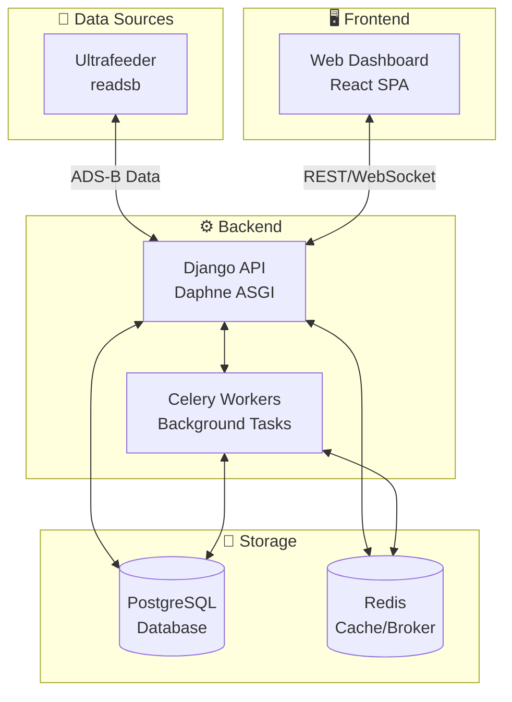
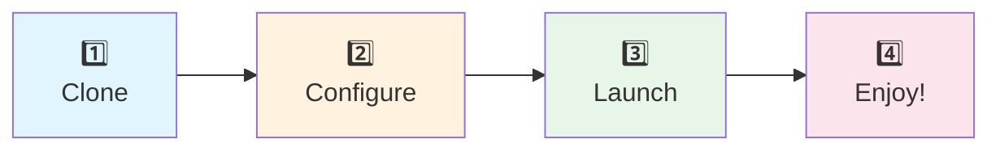

# 🚀 Quick Start Guide

  

**Get SkysPy up and running in under 5 minutes with Docker.**

---

## ✈️ Introduction

SkysPy is a real-time aircraft tracking and monitoring platform that processes ADS-B data from your local receiver.

<div align="center">

| 🎯 **Feature** | **Description** |
|:---:|:---|
| 📍 | **Real-time aircraft tracking** with live map visualization |
| 🛡️ | **Safety monitoring** for proximity alerts and unusual flight patterns |
| 🔔 | **Custom alerts** with flexible rule-based notifications |
| 📡 | **ACARS/VDL2 message decoding** for datalink messages |
| 🎙️ | **Radio audio capture** with optional AI transcription |
| 📊 | **Historical data** with session replay and analytics |
| 🔌 | **REST API and WebSocket** interfaces for integration |

</div>

---

### 🏗️ Architecture Overview



---

## 📋 Prerequisites

> 📘 **Before you begin**
>
> Ensure you have the following installed on your system before proceeding with the installation.

| Requirement | Minimum Version | Status | Notes |
|:------------|:---------------:|:------:|:------|
| Docker | 20.10+ | ✅ Required | [Install Docker](https://docs.docker.com/get-docker/) |
| Docker Compose | 2.0+ | ✅ Required | Included with Docker Desktop |
| Git | 2.0+ | ✅ Required | For cloning the repository |

---

### 📡 ADS-B Data Source

SkysPy requires an ADS-B data source. Choose one of the supported options:

| Option | Description |
|:------:|:------------|
| **🌟 Ultrafeeder** (Recommended) | Includes readsb + tar1090 |
| **📻 readsb** | Standalone ADS-B decoder |
| **✈️ dump1090-fa** | FlightAware's decoder |
| **🇺🇸 dump978** | UAT (978 MHz) for US |

> ⚠️ **No ADS-B Receiver?**
>
> Don't worry! You can use **development mode** with mock data to explore all of SkysPy's features before investing in hardware.

---

## ⚡ Quick Start (5-Minute Setup)

Follow these four simple steps to get SkysPy running:



---

### 1️⃣ Clone the Repository

```bash
git clone https://github.com/your-org/skyspy.git
cd skyspy
```

---

### 2️⃣ Configure Environment

Copy the example environment file and configure your settings:

```bash
cp .env.example .env
```

Edit `.env` with your preferred text editor:

```bash
# 📍 Required: Set your antenna location (latitude/longitude)
FEEDER_LAT=47.9377
FEEDER_LON=-121.9687

# 📡 Required: Your ADS-B data source
ULTRAFEEDER_HOST=ultrafeeder
ULTRAFEEDER_PORT=80

# 🔐 Optional: Set a secure secret key for production
DJANGO_SECRET_KEY=your-secure-random-key-here

# 👤 Optional: Configure admin credentials
DJANGO_SUPERUSER_USERNAME=admin
DJANGO_SUPERUSER_EMAIL=admin@example.com
DJANGO_SUPERUSER_PASSWORD=changeme
```

> ✅ **Minimal Configuration**
>
> At minimum, you only need these three settings to get started:

| Variable | Description | Example | Required |
|:---------|:------------|:--------|:--------:|
| `FEEDER_LAT` | Your antenna latitude | `47.9377` | ✅ |
| `FEEDER_LON` | Your antenna longitude | `-121.9687` | ✅ |
| `ULTRAFEEDER_HOST` | Hostname of your ADS-B source | `ultrafeeder` or `192.168.1.100` | ✅ |

---

### 3️⃣ Start with Docker

Launch all services with a single command:

```bash
docker compose up -d
```

> 📘 **What gets started?**
>
> This command launches the complete SkysPy stack:

| Service | Purpose | Icon |
|:--------|:--------|:----:|
| PostgreSQL | Database for aircraft and session data | 🐘 |
| Redis | Cache, message broker, and WebSocket channel layer | 🔴 |
| API | Django REST API with WebSocket support | 🌐 |
| Celery Worker | Background task processing | ⚙️ |
| Celery Beat | Scheduled task runner | ⏰ |

**Monitor the startup progress:**

```bash
docker compose logs -f api
```

> ✅ **Success Indicator**
>
> Wait until you see this message:
> ```
> Starting Daphne ASGI server...
> ```

---

### 4️⃣ Access the Dashboard

🎉 **You're ready!** Open your browser and navigate to:

<div align="center">

### 🌐 [http://localhost:8000](http://localhost:8000)

</div>

You should see the SkysPy dashboard with a live map showing aircraft in your area.

#### 🔑 Default Access Points

| Interface | URL | Credentials | Icon |
|:----------|:----|:------------|:----:|
| Dashboard | http://localhost:8000 | No login required (public mode) | 🗺️ |
| Admin Panel | http://localhost:8000/admin/ | `admin` / `changeme` | ⚙️ |
| API Documentation | http://localhost:8000/api/docs/ | No login required | 📚 |

---

## 🎯 First Steps

> ✅ **SkysPy is Running!**
>
> Now let's explore what you can do with it.

---

### 🗺️ View Aircraft

The main dashboard displays all aircraft currently being tracked:

| Feature | Description |
|:-------:|:------------|
| **🗺️ Map View** | Interactive map with aircraft icons and trails |
| **📋 Aircraft List** | Sortable table with flight details |
| **✈️ Aircraft Detail** | Click any aircraft for detailed info |

**Aircraft Detail includes:**
- 📍 Live position and telemetry
- 🛤️ Flight path history
- 📸 Aircraft photos (when available)
- 📡 ACARS messages (if receiving)

#### 🔍 Filtering Aircraft

Use the filter bar to narrow down aircraft:

| Filter | Icon | Description |
|:-------|:----:|:------------|
| By Distance | 📏 | Show only aircraft within a radius |
| By Altitude | 📐 | Filter by altitude band |
| By Type | 🎖️ | Military, commercial, general aviation |
| By Status | 🚨 | Squawking emergency, TCAS alerts |

---

### 🔔 Create an Alert

Set up custom alerts to notify you when specific conditions are met:

**1️⃣** Navigate to **Alerts** in the sidebar

**2️⃣** Click **Create Rule**

**3️⃣** Configure your alert:

```yaml
# Example: Alert when any military aircraft is detected
Name: Military Aircraft Alert
Conditions:
  - Field: military
    Operator: equals
    Value: true
Notifications:
  - Type: Browser notification
```

#### 📋 Common Alert Examples

| Alert Type | Conditions | Icon |
|:-----------|:-----------|:----:|
| Proximity Alert | `distance < 5nm` | 📍 |
| Emergency Squawk | `squawk in [7500, 7600, 7700]` | 🚨 |
| Low Altitude | `altitude < 1000ft AND distance < 10nm` | ⬇️ |
| Specific Aircraft | `icao_hex = "A12345"` | 🎯 |
| Military Traffic | `military = true` | 🎖️ |

#### 📬 Notification Channels

> 📘 **Apprise Integration**
>
> SkysPy supports 80+ notification services via [Apprise](https://github.com/caronc/apprise).

```bash
# Example notification URLs (add to .env)
APPRISE_URLS=telegram://bot_token/chat_id,discord://webhook_id/webhook_token
```

| 💬 Telegram | 🎮 Discord | 💼 Slack | 📱 Pushover | 📧 Email | 🔗 Webhooks |
|:-----------:|:----------:|:--------:|:-----------:|:--------:|:-----------:|

---

### 🔌 Access the API

SkysPy provides a comprehensive REST API for integration.

#### 📡 REST Endpoints

| Endpoint | Description | Method |
|:---------|:------------|:------:|
| `/api/v1/aircraft/` | List all currently tracked aircraft | `GET` |
| `/api/v1/aircraft/{icao}/` | Get details for specific aircraft | `GET` |
| `/api/v1/sessions/` | List tracking sessions | `GET` |
| `/api/v1/alerts/rules/` | Manage alert rules | `GET` `POST` |
| `/api/v1/safety/events/` | View safety events | `GET` |
| `/api/v1/acars/` | ACARS message history | `GET` |
| `/api/v1/system/status/` | System health and statistics | `GET` |

#### 💻 Example API Requests

**Get all aircraft:**

```bash
curl http://localhost:8000/api/v1/aircraft/
```

**Get specific aircraft by ICAO hex:**

```bash
curl http://localhost:8000/api/v1/aircraft/A12345/
```

**Get system status:**

```bash
curl http://localhost:8000/api/v1/system/status/
```

---

#### ⚡ WebSocket Connections

For real-time updates, connect via WebSocket:

| WebSocket | Description | Icon |
|:----------|:------------|:----:|
| `ws://localhost:8000/ws/aircraft/` | Live aircraft positions | ✈️ |
| `ws://localhost:8000/ws/safety/` | Safety event alerts | 🛡️ |
| `ws://localhost:8000/ws/acars/` | ACARS messages | 📡 |
| `ws://localhost:8000/ws/alerts/` | Custom alert triggers | 🔔 |
| `ws://localhost:8000/ws/all/` | Combined feed (all topics) | 📺 |

**Example WebSocket connection (JavaScript):**

```javascript
const ws = new WebSocket('ws://localhost:8000/ws/aircraft/');

ws.onmessage = (event) => {
  const data = JSON.parse(event.data);
  console.log('Aircraft update:', data);
};
```

#### 📚 Interactive API Documentation

| Documentation | URL | Icon |
|:--------------|:----|:----:|
| Swagger UI | http://localhost:8000/api/docs/ | 🟢 |
| ReDoc | http://localhost:8000/api/redoc/ | 📕 |
| OpenAPI Schema | http://localhost:8000/api/schema/ | 📄 |

---

## 🧪 Development Mode

> 📘 **For Development & Testing**
>
> Use the dev profile to run SkysPy without a real ADS-B receiver.

```bash
# Start with mock ADS-B data
make dev
```

This starts additional services:

| Service | Purpose | Icon |
|:--------|:--------|:----:|
| Mock Ultrafeeder | Simulated aircraft data | ✈️ |
| Mock Dump978 | UAT traffic simulation | 🇺🇸 |
| Mock ACARS Hub | Datalink messages | 📡 |
| Vite Dev Server | Hot reload for frontend | ⚡ |

#### 🌐 Development URLs

| Service | URL |
|:--------|:----|
| 🖥️ Dashboard (Vite) | http://localhost:3000 |
| 🔌 API | http://localhost:8000 |
| 📡 Mock Ultrafeeder | http://localhost:18080 |
| 🇺🇸 Mock Dump978 | http://localhost:18081 |

**Stop development services:**
```bash
make dev-down
```

---

## 🛠️ Common Commands

### 🐳 Docker Compose

```bash
# ▶️ Start all services
docker compose up -d

# 📋 View logs
docker compose logs -f api
docker compose logs -f celery-worker

# ⏹️ Stop all services
docker compose down

# 🔄 Rebuild after code changes
docker compose up -d --build

# 📡 Include ACARS listener
docker compose --profile acars up -d
```

---

### ⌨️ Makefile Shortcuts

```bash
# 🧪 Run tests
make test

# 🚀 Start development environment
make dev

# ⏹️ Stop development environment
make dev-down

# 📋 View development logs
make dev-logs

# 🧹 Clean up containers and volumes
make clean
```

---

### 🗄️ Database Operations

```bash
# 🐍 Access Django shell
docker compose exec api python manage.py shell

# 📦 Run migrations
docker compose exec api python manage.py migrate

# 👤 Create superuser
docker compose exec api python manage.py createsuperuser

# ✈️ Populate aviation data
docker compose exec api python manage.py populate_data
```

---

## 🔧 Troubleshooting

### ❌ Common Issues

---

#### 🛫 No Aircraft Showing

> ⚠️ **Aircraft not appearing on the map?**
>
> Follow these diagnostic steps:

**1️⃣ Check your ADS-B source is reachable:**
```bash
curl http://your-ultrafeeder-host/tar1090/data/aircraft.json
```

**2️⃣ Verify environment variables:**
```bash
docker compose exec api env | grep ULTRAFEEDER
```

**3️⃣ Check Celery worker is processing:**
```bash
docker compose logs celery-worker | tail -50
```

---

#### 🐘 Database Connection Errors

> ❌ **Can't connect to PostgreSQL?**

```bash
# Check PostgreSQL is healthy
docker compose ps postgres

# View PostgreSQL logs
docker compose logs postgres
```

---

#### 🔌 WebSocket Connection Failed

> ⚠️ **WebSocket not connecting?**
>
> Ensure you're using `ws://` (not `wss://`) for local connections:

```javascript
// ✅ Correct for local development
const ws = new WebSocket('ws://localhost:8000/ws/aircraft/');

// ❌ Wrong - HTTPS not configured locally
const ws = new WebSocket('wss://localhost:8000/ws/aircraft/');
```

---

### 💚 Health Check

Verify all services are healthy:

```bash
# Check service health
docker compose ps

# API health endpoint
curl http://localhost:8000/health/

# System status
curl http://localhost:8000/api/v1/system/status/
```

---

## 📚 Next Steps

> ✅ **Congratulations!**
>
> You have SkysPy up and running. Explore these guides to unlock its full potential:

| Guide | Description | Icon |
|:------|:------------|:----:|
| [📖 Configuration Guide](./01-configuration.md) | Complete environment variable reference | ⚙️ |
| [🔐 Authentication](./02-authentication.md) | Set up user authentication and OIDC/SSO | 🔑 |
| [🔔 Alerts & Notifications](./03-alerts.md) | Advanced alert rules and notification setup | 📬 |
| [📡 API Reference](./04-api-reference.md) | Complete REST API documentation | 🔌 |
| [⚡ WebSocket Guide](./05-websockets.md) | Real-time data streaming | 🌐 |
| [📻 ACARS Integration](./06-acars.md) | Set up ACARS/VDL2 message decoding | 📡 |
| [🎙️ Audio & Transcription](./07-audio.md) | Radio capture and AI transcription | 🔊 |
| [🚀 Deployment](./08-deployment.md) | Production deployment best practices | ☁️ |
| [🍓 Raspberry Pi](./09-raspberry-pi.md) | Optimized settings for Pi deployment | 💻 |

---

## ⚙️ Environment Variables Reference

### ✅ Essential Settings

| Variable | Default | Description | Required |
|:---------|:--------|:------------|:--------:|
| `FEEDER_LAT` | `47.9377` | Antenna latitude | ✅ |
| `FEEDER_LON` | `-121.9687` | Antenna longitude | ✅ |
| `ULTRAFEEDER_HOST` | `ultrafeeder` | ADS-B data source hostname | ✅ |
| `ULTRAFEEDER_PORT` | `80` | ADS-B data source port | ⬜ |
| `API_PORT` | `8000` | API server port | ⬜ |
| `DJANGO_SECRET_KEY` | *(generated)* | Django secret key | ⬜ |
| `DEBUG` | `False` | Enable debug mode | ⬜ |

---

### 🔐 Authentication

| Variable | Default | Description | Options |
|:---------|:--------|:------------|:--------|
| `AUTH_MODE` | `public` | Authentication mode | `public` `private` `hybrid` |
| `LOCAL_AUTH_ENABLED` | `True` | Enable username/password login | `True` `False` |
| `OIDC_ENABLED` | `False` | Enable SSO via OIDC | `True` `False` |

---

### 🎛️ Features

| Variable | Default | Description | Status |
|:---------|:--------|:------------|:------:|
| `SAFETY_MONITORING_ENABLED` | `True` | Enable safety event detection | ✅ |
| `ACARS_ENABLED` | `True` | Enable ACARS message processing | ✅ |
| `PHOTO_CACHE_ENABLED` | `True` | Cache aircraft photos locally | ✅ |
| `RADIO_ENABLED` | `True` | Enable radio audio uploads | ✅ |
| `TRANSCRIPTION_ENABLED` | `False` | Enable audio transcription | ⬜ |

---

### 📬 Notifications

| Variable | Default | Description |
|:---------|:--------|:------------|
| `APPRISE_URLS` | *(empty)* | Comma-separated notification URLs |
| `NOTIFICATION_COOLDOWN` | `300` | Seconds between duplicate alerts |

> 📘 **Complete Reference**
>
> For the complete environment variable reference, see the [Configuration Guide](./01-configuration.md).

---

## 💬 Support

| 🐛 Issues | 💭 Discussions | 📚 Documentation |
|:---------:|:--------------:|:----------------:|
| [GitHub Issues](https://github.com/your-org/skyspy/issues) | [GitHub Discussions](https://github.com/your-org/skyspy/discussions) | [Full Documentation](./README.md) |
| Report bugs and request features | Ask questions and share ideas | Complete guides and references |

---

<div align="center">

**Made with ❤️ for the aviation community**

🛫 Happy Tracking! 🛬

</div>
