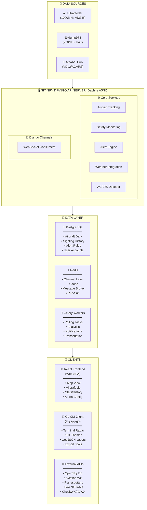
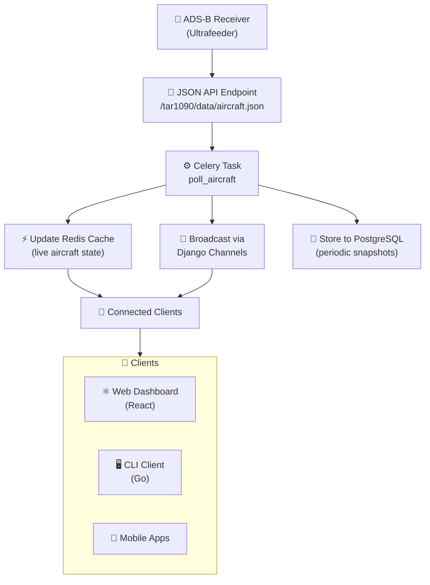
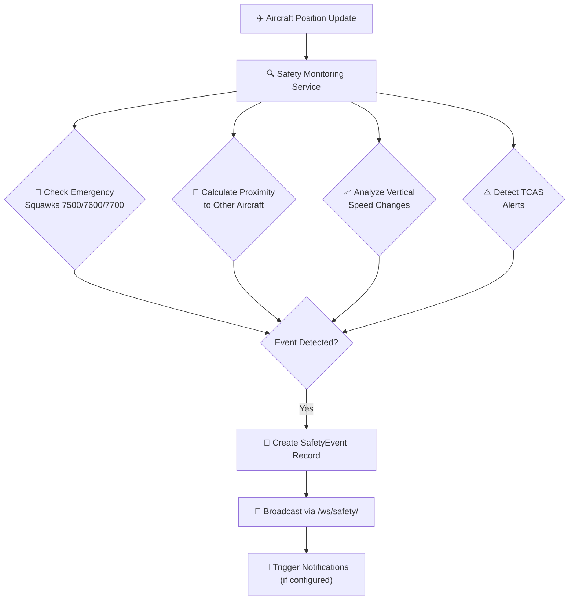
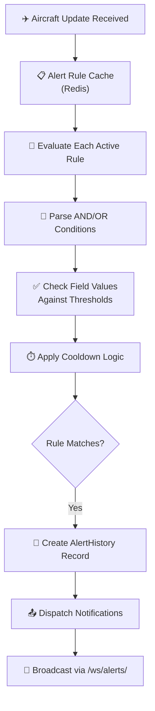

# 🛩️ Project Overview and Architecture

<br/>

> 📡 **SkySpy** is an enterprise-grade, real-time ADS-B aircraft tracking and monitoring platform built for enthusiasts, researchers, and aviation professionals.

<br/>

---

## 🎯 What is SkySpy?

SkySpy captures position data from **1090MHz Mode S** and **978MHz UAT** receivers, displays aircraft on an interactive map, monitors safety conditions, and provides advanced features like custom alerts, weather integration, ACARS message decoding, and push notifications.

> 📘 **Deployment Flexibility**
>
> SkySpy is designed to run on hardware ranging from **Raspberry Pi edge devices** to **enterprise server infrastructure**, with configuration profiles optimized for each deployment scenario.

<br/>

---

## ✨ Key Capabilities

| Capability | Description | Status |
|:-----------|:------------|:------:|
| 📍 **Real-Time Tracking** | Sub-second aircraft position updates with distance, altitude, speed, and climb rate calculations | ✅ |
| 🖥️ **Interactive Dashboard** | Canvas-based radar display with multiple visualization modes including CRT phosphor effects | ✅ |
| 🚨 **Safety Monitoring** | TCAS RA/TA detection, proximity alerts, extreme vertical speed warnings, emergency squawk detection | ✅ |
| 🔔 **Custom Alert Rules** | Flexible AND/OR logic conditions with **80+** notification channel integrations | ✅ |
| 📊 **Historical Analytics** | PostgreSQL-backed sighting history with session tracking, gamification, and trend analysis | ✅ |
| 🌤️ **Aviation Weather** | METARs, TAFs, PIREPs, SIGMETs, G-AIRMETs, and NOTAMs integration | ✅ |
| 📻 **ACARS/VDL2 Decoding** | Aircraft communication message reception, parsing, and display with libacars integration | ✅ |
| 💻 **Multi-Platform CLI** | Native Go terminal radar client with themes, overlays, and export capabilities | ✅ |

<br/>

---

## 🏗️ High-Level Architecture



<br/>

---

## 🔧 Technology Stack

### 🐍 Backend (Django API Server)

| Component | Technology | Purpose |
|:----------|:-----------|:--------|
|  | Django 5.x | Web framework with ORM |
|  | Daphne | WebSocket-capable async server |
|  | Django REST Framework | RESTful API with OpenAPI schema |
|  | Django Channels | WebSocket consumers and channel layers |
|  | Celery + gevent | Background task processing with green threads |
|  | PostgreSQL 16 | Primary data store |
|  | Redis 7 | Caching, message broker, channel layer |
|  | SimpleJWT + OIDC | JWT tokens with SSO support |
|  | libacars 2.2 | Native ACARS message decoding |
|  | Apprise | 80+ notification services |

<br/>

### ⚛️ Frontend (React SPA)

| Component | Technology | Purpose |
|:----------|:-----------|:--------|
|  | React 18 | Component-based UI |
|  | Vite 5 | Fast development and bundling |
|  | Leaflet | Interactive mapping |
|  | Lucide React | Iconography |
|  | CSS Modules | Scoped component styles |
|  | Playwright | End-to-end testing |

<br/>

### 🖥️ CLI Client (Go)

| Component | Technology | Purpose |
|:----------|:-----------|:--------|
|  | Bubble Tea | Terminal user interface |
|  | Lip Gloss | Terminal styling |
|  | Gorilla WebSocket | Real-time data streaming |
|  | Cobra | Command-line parsing |
|  | OIDC + API Keys | Authentication support |

<br/>

---

## ⚙️ Core Components

<br/>

### 1️⃣ Aircraft Tracking Service

> 💡 **Core Engine**
>
> The aircraft tracking service is the heart of SkySpy, processing thousands of position updates per minute.

**Responsibilities:**

- 📡 Polling ADS-B receivers (Ultrafeeder/readsb/dump1090) at configurable intervals
- 🔄 Processing and normalizing aircraft position data
- 📐 Calculating distance and bearing from receiver location
- ⏱️ Managing aircraft sessions (first seen, last seen, tracking quality)
- 📢 Broadcasting updates via WebSocket to connected clients

```python
# Polling configuration (celery.py)
'poll-aircraft-every-2s': {
    'task': 'skyspy.tasks.aircraft.poll_aircraft',
    'schedule': 2.0,
    'options': {'expires': 2.0},
}
```

<br/>

### 2️⃣ Safety Monitoring Engine

> ⚠️ **Critical Monitoring**
>
> Continuous real-time monitoring for safety-critical events that require immediate attention.

| Event Type | Trigger Condition | Priority |
|:-----------|:------------------|:--------:|
| 🚨 Emergency Squawk | 7500, 7600, 7700 | 🔴 Critical |
| ⚠️ TCAS RA | Resolution Advisory detected | 🔴 Critical |
| ⚡ TCAS TA | Traffic Advisory detected | 🟠 High |
| 📍 Proximity Alert | Aircraft within threshold distance | 🟠 High |
| 📈 Extreme VS | Vertical speed > 6000 ft/min | 🟡 Medium |
| 📉 VS Change | Sudden VS change > 2000 ft/min | 🟡 Medium |

<br/>

### 3️⃣ Alert Rule Engine

> 📘 **Flexible Alerting**
>
> Create sophisticated alert rules using AND/OR condition logic with support for 80+ notification channels.

```json
{
  "name": "Military Aircraft Alert",
  "conditions": {
    "operator": "AND",
    "conditions": [
      { "field": "military", "operator": "eq", "value": true },
      { "field": "distance", "operator": "lt", "value": 50 }
    ]
  },
  "actions": ["notify", "log"]
}
```

<br/>

### 4️⃣ WebSocket Consumers

Django Channels provides real-time data streaming via WebSocket:

| Endpoint | Purpose | Description |
|:---------|:--------|:------------|
| 🛩️ `/ws/aircraft/` | Aircraft Updates | Real-time position streaming |
| 🚨 `/ws/safety/` | Safety Events | Emergency and TCAS notifications |
| 🔔 `/ws/alerts/` | Alert Triggers | Custom rule match notifications |
| 📻 `/ws/acars/` | ACARS Stream | Decoded message feed |
| 📊 `/ws/stats/` | Statistics | Live metrics updates |
| 📱 `/ws/cannonball/` | Mobile Mode | GPS-based threat detection |

<br/>

### 5️⃣ Celery Task System

Background task processing with priority queues:

| Queue | Tasks | Priority |
|:------|:------|:--------:|
| `polling` | Aircraft polling, stats updates | 🔴 High (time-sensitive) |
| `default` | General background tasks | 🟡 Normal |
| `database` | DB operations, cleanup | 🟡 Normal |
| `notifications` | Push notification delivery | 🟡 Normal |
| `transcription` | Audio transcription | 🔵 Low |
| `low_priority` | Analytics, aggregation | 🔵 Low |

<br/>

---

## 🔄 Data Flow

### 📡 ADS-B Data Ingestion



<br/>

### 🚨 Safety Event Detection



<br/>

### 🔔 Alert Rule Processing



<br/>

---

## 🌟 Key Features Summary

<br/>

### ✈️ Aircraft Tracking

- 📍 Real-time position updates from 1090MHz and 978MHz receivers
- 🔌 Support for multiple receiver sources (Ultrafeeder, dump978)
- 📐 Distance and bearing calculation from receiver location
- ⏱️ Session management with first/last seen timestamps
- 🏷️ Aircraft type classification (commercial, military, private, etc.)

<br/>

### 🖥️ Interactive Dashboard

- 🗺️ Canvas-based map with multiple rendering modes
- 📟 CRT radar mode with sweep animation
- 📋 Aircraft detail panels with registration, operator, and photo
- 📊 Real-time statistics (count, altitude distribution, closest/highest/fastest)
- 🔍 Filter and search capabilities

<br/>

### 📚 Historical Data

- 🕒 Sighting history with advanced filtering
- 📈 Session analytics and tracking quality metrics
- ✈️ Flight pattern analysis
- 📊 Time comparison statistics (hourly, daily, weekly trends)
- 📻 ACARS message history

<br/>

### 🌤️ Aviation Weather

- 📍 **METAR** - Current weather observations
- 📅 **TAF** - Terminal area forecasts
- 👨‍✈️ **PIREPs** - Pilot reports
- ⚠️ **SIGMETs/AIRMETs** - Hazardous weather
- 📋 **NOTAMs** - Notices to airmen

<br/>

### 🔔 Notification System

> 📘 **80+ Channels Supported**
>
> Pushover, Telegram, Slack, Discord, email, and many more via Apprise integration.

- 📝 Rich message formatting with aircraft details
- ⏱️ Cooldown management to prevent spam
- ⚙️ Per-rule notification configuration

<br/>

### 🔐 Authentication & Authorization

| Mode | Description | Icon |
|:-----|:------------|:----:|
| `public` | No authentication required | 🌐 |
| `private` | Authentication required for all endpoints | 🔒 |
| `hybrid` | Per-feature access control **(default)** | 🔓 |

**Supported Auth Methods:**

- 🔑 Local username/password authentication
- 🔗 API key authentication for integrations
- 🌐 OIDC/SSO support (Keycloak, Authentik, Azure AD, Okta)
- 👥 Role-based access control (viewer, operator, analyst, admin)

<br/>

### 📱 Mobile Features (Cannonball Mode)

- 📍 GPS-based threat detection
- 📺 Edge-to-edge radar display
- 📐 Real-time proximity calculations
- 🔊 Audio/haptic alerts
- 🎬 Session recording and playback

<br/>

---

## 🚀 Deployment Options

### 🐳 Docker Compose (Recommended)

```bash
# Production deployment
docker-compose up -d

# With ACARS listener
docker-compose --profile acars up -d
```

<br/>

### 🏛️ Services Architecture

| Service | Container | Port | Status |
|:--------|:----------|:-----|:------:|
| 🌐 `api` | skyspy-api | `8000` | ✅ |
| ⚙️ `celery-worker` | skyspy-celery-worker | - | ✅ |
| ⏰ `celery-beat` | skyspy-celery-beat | - | ✅ |
| 🐘 `postgres` | skyspy-postgres | `5432` | ✅ |
| ⚡ `redis` | skyspy-redis | `6379` | ✅ |
| 📻 `acars-listener` | skyspy-acars-listener | `5555/udp`, `5556/udp` | ✅ |

<br/>

### 🍓 Raspberry Pi Optimization

> 💡 **Edge Deployment**
>
> SkySpy includes optimized settings specifically tuned for Raspberry Pi 4/5 deployment.

```python
# settings_rpi.py
POLLING_INTERVAL = 3  # Reduced polling frequency
RPI_TASK_INTERVALS = {
    'stats_cache': 90.0,
    'safety_stats': 60.0,
    'acars_stats': 120.0,
}
```

<br/>

---

## 🌐 External Data Sources

| Source | Data Provided | Rate Limit | Status |
|:-------|:--------------|:-----------|:------:|
| 🌍 **OpenSky Network** | Aircraft database, live positions | 4,000 credits/day | ✅ |
| 📷 **Planespotters.net** | Aircraft photos | Cached locally | ✅ |
| 🌤️ **Aviation Weather Center** | METARs, TAFs, PIREPs | Unlimited | ✅ |
| 🇺🇸 **FAA** | NOTAMs, TFRs | Unlimited | ✅ |
| ☁️ **CheckWX** | Weather data | 3,000/day | ✅ |
| 🌧️ **AVWX** | Weather data | Unlimited basic | ✅ |
| ✈️ **OpenAIP** | Airspace boundaries | Unlimited | ✅ |

<br/>

---

## 📖 API Documentation

SkySpy provides a comprehensive REST API with OpenAPI documentation:

| Documentation | URL | Description |
|:--------------|:----|:------------|
| 📘 **Swagger UI** | `/api/docs/` | Interactive API explorer |
| 📕 **ReDoc** | `/api/redoc/` | Beautiful API reference |
| 📄 **OpenAPI Schema** | `/api/schema/` | Machine-readable spec |

<br/>

### 🔗 Key Endpoints

| Category | Base Path | Description |
|:---------|:----------|:------------|
| ✈️ Aircraft | `/api/v1/aircraft/` | Live aircraft tracking |
| 📚 History | `/api/v1/sightings/`, `/api/v1/sessions/` | Historical data |
| 🔔 Alerts | `/api/v1/alerts/rules/`, `/api/v1/alerts/history/` | Alert management |
| 🚨 Safety | `/api/v1/safety/events/` | Safety event monitoring |
| 🌤️ Aviation | `/api/v1/aviation/` | Weather and airspace data |
| 📻 ACARS | `/api/v1/acars/` | ACARS message history |
| 🎙️ Audio | `/api/v1/audio/` | Radio transmission recordings |
| ⚙️ System | `/api/v1/system/` | Health and status |

<br/>

---

## 📦 Version Information

| Component | Version | Status |
|:----------|:--------|:------:|
| 🚀 **SkySpy API** | `2.6.0` |  |
| 🌐 **Web Dashboard** | `2.5.0` |  |
| 🖥️ **Go CLI** | `1.0.0` |  |
| 🐍 **Django** | `5.x` |  |
| 🐍 **Python** | `3.12+` |  |
| 📦 **Node.js** | `20+` |  |
| 🔵 **Go** | `1.21+` |  |

<br/>

---

## 📚 Next Steps

| Link | Description |
|:-----|:------------|
| 📥 [Installation Guide](./02-installation.md) | Detailed setup instructions |
| ⚙️ [Configuration Reference](./03-configuration.md) | Environment variables and settings |
| 🔗 [API Reference](./04-api-reference.md) | Complete API documentation |
| 🔌 [WebSocket Protocol](./05-websocket.md) | Real-time streaming guide |
| 🔔 [Alert Rules](./06-alerts.md) | Custom alert configuration |
| 🔐 [Authentication](./07-authentication.md) | Auth modes and SSO setup |

<br/>

---

<br/>

> 🛩️ **SkySpy** - Enterprise-grade aircraft tracking for enthusiasts and professionals alike.
