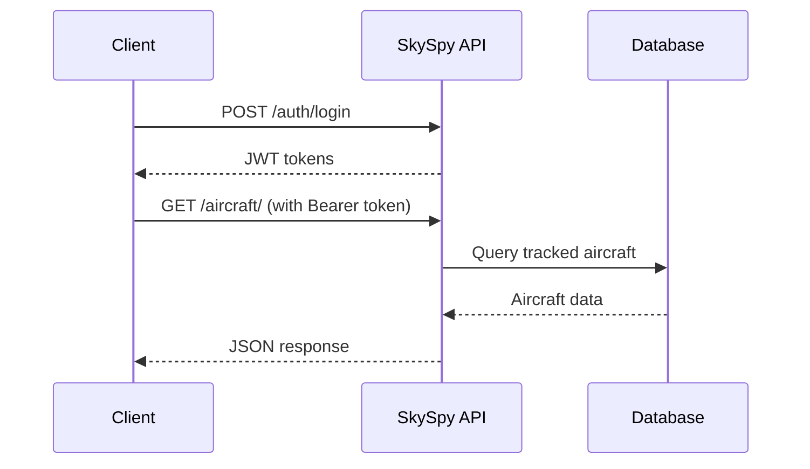
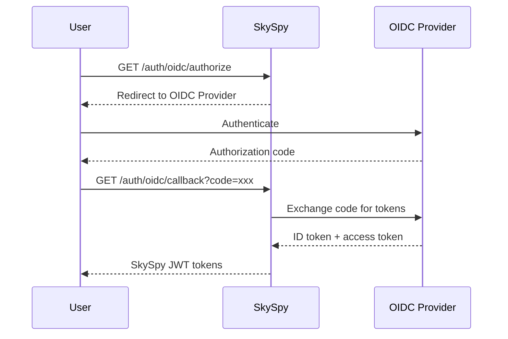
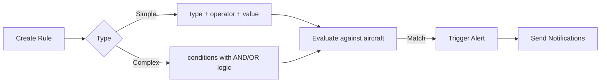
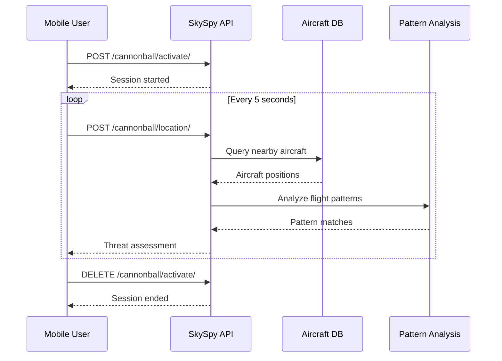
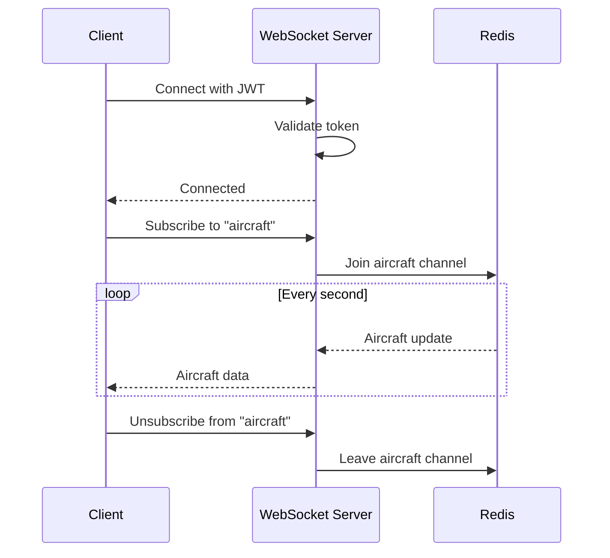

# SkySpy REST API Reference

> **Enterprise-Ready API for Real-Time Aircraft Tracking and Aviation Intelligence**

Welcome to the SkySpy API documentation. This comprehensive guide covers authentication, endpoints, request/response formats, and error handling for integrating with SkySpy's powerful aircraft tracking platform.

---

## Quick Start



---

## API Overview

### Base URL

| Environment | URL |
|-------------|-----|
| **Production** | `https://your-domain.com/api/v1/` |
| **Development** | `http://localhost:8000/api/v1/` |

> **API Version**: `v1` - All endpoints are prefixed with `/api/v1/`

### Content Type

All requests and responses use JSON format:

```http
Content-Type: application/json
Accept: application/json
```

### Interactive Documentation

| Tool | URL | Description |
|------|-----|-------------|
| **Swagger UI** | `/api/v1/docs/` | Interactive API explorer |
| **ReDoc** | `/api/v1/redoc/` | Beautiful API reference |
| **OpenAPI Schema** | `/api/v1/schema/` | Raw OpenAPI 3.0 spec |

> **Tip:** Visit `/api/v1/docs/` for an interactive playground where you can test endpoints directly.

---

## Authentication

SkySpy supports multiple authentication methods to accommodate different use cases.

### Authentication Modes

| Mode | Badge | Description |
|------|-------|-------------|
| `public` |  | All endpoints accessible without authentication |
| `authenticated` |  | All endpoints require valid authentication |
| `hybrid` |  | Public read access, authentication required for writes |

> Check `/api/v1/auth/config` to discover the current authentication mode.

<details>
<summary><strong>JWT Bearer Token (Primary)</strong></summary>

The primary authentication method using JSON Web Tokens.

**Request Header:**
```http
Authorization: Bearer <access_token>
```

**Obtaining Tokens:**

```bash
curl -X POST https://your-domain.com/api/v1/auth/login \
  -H "Content-Type: application/json" \
  -d '{
    "username": "your-username",
    "password": "your-password"
  }'
```

```javascript
const response = await fetch('/api/v1/auth/login', {
  method: 'POST',
  headers: { 'Content-Type': 'application/json' },
  body: JSON.stringify({
    username: 'your-username',
    password: 'your-password'
  })
});
const { access, refresh } = await response.json();
```

```python
import requests

response = requests.post(
    'https://your-domain.com/api/v1/auth/login',
    json={
        'username': 'your-username',
        'password': 'your-password'
    }
)
tokens = response.json()
```

**Response:**
```json
{
  "access": "eyJ0eXAiOiJKV1QiLCJhbGciOiJIUzI1NiJ9...",
  "refresh": "eyJ0eXAiOiJKV1QiLCJhbGciOiJIUzI1NiJ9...",
  "user": {
    "id": 1,
    "username": "your-username",
    "email": "user@example.com",
    "is_superuser": false,
    "roles": ["viewer"],
    "permissions": ["aircraft.view", "alerts.view"]
  }
}
```

**Token Refresh:**
```bash
curl -X POST https://your-domain.com/api/v1/auth/refresh \
  -H "Content-Type: application/json" \
  -d '{"refresh": "<refresh_token>"}'
```

</details>

<details>
<summary><strong>API Key Authentication</strong></summary>

For server-to-server integrations and automated systems.

**Request Headers (choose one):**
```http
Authorization: ApiKey sk_live_xxxxxxxxxxxx
```
or
```http
X-API-Key: sk_live_xxxxxxxxxxxx
```

> API keys are scoped with specific permissions and can be managed through the user profile or admin interface.

</details>

<details>
<summary><strong>Cookie-Based Authentication</strong></summary>

JWT tokens can also be stored in HTTP-only cookies for browser-based applications:

| Cookie | Purpose | Lifetime |
|--------|---------|----------|
| `access_token` | Short-lived access token | ~15 minutes |
| `refresh_token` | Long-lived refresh token | ~7 days |

</details>

<details>
<summary><strong>OIDC (OpenID Connect)</strong></summary>

Enterprise single sign-on support via OIDC providers.



**Initiate OIDC Flow:**
```http
GET /api/v1/auth/oidc/authorize?redirect_uri=https://your-app.com/callback
```

**Handle Callback:**
```http
GET /api/v1/auth/oidc/callback?code=<authorization_code>&state=<state>
```

</details>

---

## Error Handling

### Standard Error Format

```json
{
  "error": "error_type",
  "detail": "Human-readable error description"
}
```

### HTTP Status Codes

| Status | Description |
|--------|-------------|
| `200` | Success |
| `201` | Created |
| `204` | No Content (successful deletion) |
| `400` | Bad Request - Invalid parameters |
| `401` | Unauthorized - Authentication required |
| `403` | Forbidden - Insufficient permissions |
| `404` | Not Found |
| `429` | Too Many Requests - Rate limit exceeded |
| `500` | Internal Server Error |

<details>
<summary><strong>Error Examples</strong></summary>

**Authentication Error (401):**
```json
{
  "detail": "Authentication credentials were not provided."
}
```

**Permission Error (403):**
```json
{
  "detail": "You do not have permission to perform this action."
}
```

**Validation Error (400):**
```json
{
  "error": "validation_error",
  "detail": "lat and lon parameters are required"
}
```

**Rate Limit Error (429):**
```json
{
  "detail": "Request was throttled. Expected available in 60 seconds."
}
```

</details>

---

## Rate Limiting

API requests are subject to rate limiting to ensure fair usage.

### Default Limits

| Endpoint Type | Limit | Badge |
|---------------|-------|-------|
| Authentication endpoints | 5 req/min |  |
| General API endpoints | 100 req/min |  |
| Heavy endpoints (export, bulk) | 10 req/min |  |

### Rate Limit Headers

```http
X-RateLimit-Limit: 100
X-RateLimit-Remaining: 95
X-RateLimit-Reset: 1640000000
```

---

## Pagination

List endpoints support cursor-based or offset pagination.

### Query Parameters

| Parameter | Type | Default | Description |
|-----------|------|---------|-------------|
| `limit` | `integer` | `100` | Maximum items per page |
| `offset` | `integer` | `0` | Number of items to skip |

### Paginated Response Format

```json
{
  "count": 1250,
  "next": "/api/v1/alerts/history?limit=100&offset=100",
  "previous": null,
  "results": [...]
}
```

---

## Endpoints

---

<details open>
<summary><h3>Authentication</h3></summary>

---

#### GET `/auth/config`

> Get Auth Configuration

 

Returns the current authentication configuration for the API.

```bash
curl https://your-domain.com/api/v1/auth/config
```

**Response Fields:**

| Field | Type | Description |
|-------|------|-------------|
| `auth_mode` | `string` | Current auth mode (public, authenticated, hybrid) |
| `local_login_enabled` | `boolean` | Whether username/password login is enabled |
| `oidc_enabled` | `boolean` | Whether OIDC SSO is available |
| `api_key_enabled` | `boolean` | Whether API key auth is available |

**Response:**
```json
{
  "auth_mode": "hybrid",
  "local_login_enabled": true,
  "oidc_enabled": true,
  "oidc_provider_name": "Authentik",
  "api_key_enabled": true,
  "allow_registration": false
}
```

---

#### POST `/auth/login`

> Authenticate User

 

Authenticate with username and password to obtain JWT tokens.

**Request Body:**

| Field | Type | Required | Description |
|-------|------|----------|-------------|
| `username` | `string` | Yes | User's username |
| `password` | `string` | Yes | User's password |

```bash
curl -X POST https://your-domain.com/api/v1/auth/login \
  -H "Content-Type: application/json" \
  -d '{
    "username": "admin",
    "password": "your-password"
  }'
```

```javascript
const response = await fetch('/api/v1/auth/login', {
  method: 'POST',
  headers: { 'Content-Type': 'application/json' },
  body: JSON.stringify({
    username: 'admin',
    password: 'your-password'
  })
});
```

**Response:**
```json
{
  "access": "eyJ0eXAiOiJKV1QiLCJhbGciOiJIUzI1NiJ9...",
  "refresh": "eyJ0eXAiOiJKV1QiLCJhbGciOiJIUzI1NiJ9...",
  "user": {
    "id": 1,
    "username": "admin",
    "email": "admin@example.com",
    "is_superuser": true,
    "roles": ["admin"],
    "permissions": ["*"]
  }
}
```

---

#### POST `/auth/logout`

> Invalidate Session

 

Invalidate the current session and blacklist the refresh token.

```bash
curl -X POST https://your-domain.com/api/v1/auth/logout \
  -H "Authorization: Bearer $ACCESS_TOKEN" \
  -H "Content-Type: application/json" \
  -d '{"refresh": "<refresh_token>"}'
```

**Response:**
```json
{
  "success": true,
  "message": "Successfully logged out"
}
```

---

#### POST `/auth/refresh`

> Refresh Access Token

 

Obtain a new access token using a refresh token.

**Request Body:**

| Field | Type | Required | Description |
|-------|------|----------|-------------|
| `refresh` | `string` | Yes | Valid refresh token |

**Response:**
```json
{
  "access": "eyJ0eXAiOiJKV1QiLCJhbGciOiJIUzI1NiJ9..."
}
```

---

#### GET `/auth/profile`

> Get User Profile


Retrieve the authenticated user's profile including roles and permissions.

```bash
curl https://your-domain.com/api/v1/auth/profile \
  -H "Authorization: Bearer $ACCESS_TOKEN"
```

**Response:**
```json
{
  "id": 1,
  "username": "user",
  "email": "user@example.com",
  "first_name": "John",
  "last_name": "Doe",
  "is_superuser": false,
  "roles": [
    {
      "id": 1,
      "name": "viewer",
      "permissions": ["aircraft.view", "alerts.view"]
    }
  ],
  "permissions": ["aircraft.view", "alerts.view", "history.view"],
  "api_keys": [
    {
      "id": 1,
      "name": "My API Key",
      "key_prefix": "sk_live_abc",
      "scopes": ["aircraft:read", "alerts:read"],
      "last_used": "2024-01-15T10:30:00Z",
      "created_at": "2024-01-01T00:00:00Z"
    }
  ]
}
```

---

#### PATCH `/auth/profile`

> Update User Profile


Update the authenticated user's profile.

**Request Body:**

| Field | Type | Required | Description |
|-------|------|----------|-------------|
| `first_name` | `string` | No | User's first name |
| `last_name` | `string` | No | User's last name |
| `email` | `string` | No | User's email address |

---

#### POST `/auth/password`

> Change Password


Change the authenticated user's password.

**Request Body:**

| Field | Type | Required | Description |
|-------|------|----------|-------------|
| `current_password` | `string` | Yes | Current password |
| `new_password` | `string` | Yes | New password |

</details>

---

<details open>
<summary><h3>Aircraft Tracking</h3></summary>

---

#### GET `/aircraft/`

> List All Aircraft

 

Get all currently tracked aircraft with optional filtering.

**Query Parameters:**

| Parameter | Type | Default | Description |
|-----------|------|---------|-------------|
| `military` | `boolean` | - | Filter military aircraft only |
| `min_alt` | `integer` | - | Minimum altitude in feet |
| `max_alt` | `integer` | - | Maximum altitude in feet |
| `min_distance` | `float` | - | Minimum distance in NM |
| `max_distance` | `float` | - | Maximum distance in NM |

```bash
# Get all aircraft
curl https://your-domain.com/api/v1/aircraft/

# Get military aircraft under 10,000 ft
curl "https://your-domain.com/api/v1/aircraft/?military=true&max_alt=10000"
```

```javascript
const aircraft = await fetch('/api/v1/aircraft/?military=true')
  .then(r => r.json());

console.log(`Tracking ${aircraft.count} military aircraft`);
```

**Response:**
```json
{
  "aircraft": [
    {
      "hex": "A1B2C3",
      "flight": "UAL123",
      "type": "B738",
      "alt": 35000,
      "gs": 450,
      "vr": 0,
      "lat": 47.6062,
      "lon": -122.3321,
      "track": 180,
      "squawk": "1200",
      "category": "A3",
      "rssi": -28.5,
      "distance_nm": 15.2,
      "military": false,
      "emergency": false
    }
  ],
  "count": 42,
  "now": 1704067200.0,
  "messages": 1250000,
  "timestamp": "2024-01-01T00:00:00Z"
}
```

---

#### GET `/aircraft/{icao_hex}/`

> Get Aircraft Detail


Get detailed information for a specific aircraft including airframe data, photos, and matched radio calls.

**Path Parameters:**

| Parameter | Type | Description |
|-----------|------|-------------|
| `icao_hex` | `string` | ICAO 24-bit hex identifier (e.g., `A1B2C3`) |

```bash
curl https://your-domain.com/api/v1/aircraft/A1B2C3/
```

**Response:**
```json
{
  "icao_hex": "A1B2C3",
  "registration": "N12345",
  "type_code": "B738",
  "type_name": "Boeing 737-800",
  "manufacturer": "Boeing",
  "model": "737-8AS",
  "serial_number": "12345",
  "year_built": 2015,
  "age_years": 9,
  "operator": "United Airlines",
  "operator_icao": "UAL",
  "owner": "United Airlines, Inc.",
  "country": "United States",
  "country_code": "US",
  "category": "A3",
  "is_military": false,
  "photo_url": "/api/v1/photos/A1B2C3",
  "photo_thumbnail_url": "/api/v1/photos/A1B2C3/thumb",
  "photo_photographer": "John Doe",
  "photo_source": "JetPhotos",
  "source_data": [...],
  "matched_radio_calls": [...]
}
```

---

#### GET `/aircraft/top/`

> Get Top Aircraft


Get notable aircraft sorted by various criteria (closest, highest, fastest, etc.).

**Query Parameters:**

| Parameter | Type | Default | Description |
|-----------|------|---------|-------------|
| `limit` | `integer` | `5` | Number of aircraft per category |

**Response:**
```json
{
  "closest": [...],
  "highest": [...],
  "fastest": [...],
  "climbing": [...],
  "military": [...],
  "total": 42,
  "timestamp": "2024-01-01T00:00:00Z"
}
```

---

#### GET `/aircraft/stats/`

> Get Aircraft Statistics


Get statistical summary of currently tracked aircraft.

**Response:**
```json
{
  "total": 42,
  "with_position": 38,
  "military": 3,
  "emergency": [],
  "categories": {
    "A1": 5,
    "A3": 25,
    "A5": 8
  },
  "altitude": {
    "0-10000": 10,
    "10000-25000": 15,
    "25000-40000": 12,
    "40000+": 5
  },
  "messages": 1250000,
  "timestamp": "2024-01-01T00:00:00Z"
}
```

---

#### GET `/aircraft/geojson/`

> Get Aircraft GeoJSON


Get aircraft positions in GeoJSON format for mapping applications.

**Response:**
```json
{
  "type": "FeatureCollection",
  "features": [
    {
      "type": "Feature",
      "id": "A1B2C3",
      "geometry": {
        "type": "Point",
        "coordinates": [-122.3321, 47.6062]
      },
      "properties": {
        "hex": "A1B2C3",
        "flight": "UAL123",
        "altitude": 35000,
        "track": 180
      }
    }
  ],
  "metadata": {
    "count": 42,
    "timestamp": "2024-01-01T00:00:00Z"
  }
}
```

---

#### POST `/aircraft/bulk-info/`

> Bulk Aircraft Info

 

Get information for multiple aircraft at once.

**Request Body:**

| Field | Type | Required | Description |
|-------|------|----------|-------------|
| `icao_list` | `array` | Yes | Array of ICAO hex codes |

```bash
curl -X POST https://your-domain.com/api/v1/aircraft/bulk-info/ \
  -H "Content-Type: application/json" \
  -d '{"icao_list": ["A1B2C3", "D4E5F6", "G7H8I9"]}'
```

**Response:**
```json
{
  "aircraft": {
    "A1B2C3": {
      "registration": "N12345",
      "type_code": "B738",
      "operator": "United Airlines"
    },
    "D4E5F6": {
      "registration": "N67890",
      "type_code": "A320",
      "operator": "Delta Air Lines"
    }
  },
  "found": 2,
  "requested": 3
}
```

</details>

---

<details>
<summary><h3>Aircraft Photos</h3></summary>

---

#### GET `/photos/{icao_hex}`

> Get Aircraft Photo


Retrieve a cached aircraft photo. Returns the image file directly with appropriate Content-Type header.

---

#### GET `/photos/{icao_hex}/thumb`

> Get Aircraft Thumbnail


Retrieve a cached aircraft photo thumbnail.

</details>

---

<details open>
<summary><h3>Alert Rules</h3></summary>

---

#### GET `/alerts/rules/`

> List Alert Rules


Get all alert rules accessible to the current user.

**Query Parameters:**

| Parameter | Type | Description |
|-----------|------|-------------|
| `enabled` | `boolean` | Filter by enabled status |
| `priority` | `string` | Filter by priority (`info`, `warning`, `critical`) |
| `visibility` | `string` | Filter by visibility (`private`, `shared`, `public`) |

**Response:**
```json
{
  "rules": [
    {
      "id": 1,
      "name": "Military Aircraft",
      "type": "military",
      "operator": "eq",
      "value": "true",
      "conditions": null,
      "description": "Alert when military aircraft detected",
      "enabled": true,
      "priority": "info",
      "cooldown_minutes": 5,
      "last_triggered": "2024-01-01T00:00:00Z",
      "visibility": "private",
      "notification_channels": [...],
      "is_owner": true,
      "can_edit": true,
      "can_delete": true
    }
  ],
  "count": 1
}
```

---

#### POST `/alerts/rules/`

> Create Alert Rule

 

Create a new alert rule.



**Simple Rule Request:**

| Field | Type | Required | Description |
|-------|------|----------|-------------|
| `name` | `string` | Yes | Rule name |
| `type` | `string` | Yes | Rule type (military, squawk, callsign, etc.) |
| `operator` | `string` | Yes | Comparison operator (eq, ne, lt, gt, in, contains) |
| `value` | `string` | Yes | Value to compare against |
| `priority` | `string` | No | Priority level (info, warning, critical) |
| `enabled` | `boolean` | No | Whether rule is active |
| `cooldown_minutes` | `integer` | No | Minutes between repeat alerts |

**Simple Rule Example - Alert on emergency squawks:**

```bash
curl -X POST https://your-domain.com/api/v1/alerts/rules/ \
  -H "Authorization: Bearer $TOKEN" \
  -H "Content-Type: application/json" \
  -d '{
    "name": "Emergency Squawk",
    "type": "squawk",
    "operator": "in",
    "value": "7500,7600,7700",
    "priority": "critical",
    "cooldown_minutes": 0
  }'
```

**Complex Rule Example - Low-flying military aircraft:**

```bash
curl -X POST https://your-domain.com/api/v1/alerts/rules/ \
  -H "Authorization: Bearer $TOKEN" \
  -H "Content-Type: application/json" \
  -d '{
    "name": "Low Military Aircraft",
    "conditions": {
      "logic": "AND",
      "groups": [
        {
          "logic": "AND",
          "conditions": [
            {"type": "military", "operator": "eq", "value": "true"},
            {"type": "altitude", "operator": "lt", "value": "5000"}
          ]
        }
      ]
    },
    "priority": "warning"
  }'
```

---

#### PATCH `/alerts/rules/{id}/`

> Update Alert Rule

 

Update an existing alert rule.

---

#### DELETE `/alerts/rules/{id}/`

> Delete Alert Rule

 

Delete an alert rule. Returns `204 No Content` on success.

---

#### POST `/alerts/rules/test/`

> Test Alert Rule


Test a rule configuration against current or provided aircraft data.

```bash
curl -X POST https://your-domain.com/api/v1/alerts/rules/test/ \
  -H "Authorization: Bearer $TOKEN" \
  -H "Content-Type: application/json" \
  -d '{
    "rule": {
      "type": "altitude",
      "operator": "lt",
      "value": "1000"
    },
    "aircraft": [
      {"hex": "A1B2C3", "alt_baro": 500},
      {"hex": "D4E5F6", "alt_baro": 5000}
    ]
  }'
```

**Response:**
```json
{
  "matches": [
    {"hex": "A1B2C3", "alt_baro": 500}
  ],
  "match_count": 1,
  "tested_count": 2
}
```

---

#### POST `/alerts/rules/bulk-toggle/`

> Bulk Toggle Rules


Enable or disable multiple rules at once.

---

#### GET `/alerts/rules/export/`

> Export Rules


Export alert rules as JSON for backup or sharing.

---

#### POST `/alerts/rules/import/`

> Import Rules


Import alert rules from JSON.

</details>

---

<details>
<summary><h3>Alert History</h3></summary>

---

#### GET `/alerts/history/`

> List Alert History


Get triggered alert history.

**Query Parameters:**

| Parameter | Type | Default | Description |
|-----------|------|---------|-------------|
| `rule_id` | `integer` | - | Filter by rule ID |
| `priority` | `string` | - | Filter by priority |
| `acknowledged` | `boolean` | - | Filter by acknowledgment status |
| `hours` | `integer` | `24` | Time range in hours |
| `limit` | `integer` | `100` | Maximum results |
| `offset` | `integer` | `0` | Pagination offset |

**Response:**
```json
{
  "history": [
    {
      "id": 1,
      "rule_id": 1,
      "rule_name": "Military Aircraft",
      "icao": "AE1234",
      "callsign": "EVAC01",
      "message": "Military aircraft detected: EVAC01",
      "priority": "info",
      "aircraft_data": {
        "hex": "AE1234",
        "flight": "EVAC01",
        "alt": 15000,
        "type": "C130"
      },
      "timestamp": "2024-01-01T12:00:00Z",
      "acknowledged": false
    }
  ],
  "count": 1
}
```

---

#### POST `/alerts/history/{id}/acknowledge/`

> Acknowledge Alert


Mark an alert as acknowledged.

---

#### POST `/alerts/history/bulk-acknowledge/`

> Bulk Acknowledge Alerts


Acknowledge multiple alerts at once.

</details>

---

<details>
<summary><h3>Notification Channels</h3></summary>

---

#### GET `/notifications/channels/`

> List Notification Channels


Get configured notification channels.

**Response:**
```json
{
  "channels": [
    {
      "id": 1,
      "name": "Discord Alerts",
      "channel_type": "discord",
      "config": {
        "webhook_url": "https://discord.com/api/webhooks/..."
      },
      "enabled": true,
      "verified": true,
      "last_used": "2024-01-01T12:00:00Z"
    }
  ],
  "count": 1
}
```

---

#### POST `/notifications/channels/`

> Create Notification Channel


Create a new notification channel.

**Discord webhook:**

```bash
curl -X POST https://your-domain.com/api/v1/notifications/channels/ \
  -H "Authorization: Bearer $TOKEN" \
  -H "Content-Type: application/json" \
  -d '{
    "name": "Discord Alerts",
    "channel_type": "discord",
    "config": {
      "webhook_url": "https://discord.com/api/webhooks/..."
    }
  }'
```

**Email channel:**

```bash
curl -X POST https://your-domain.com/api/v1/notifications/channels/ \
  -H "Authorization: Bearer $TOKEN" \
  -H "Content-Type: application/json" \
  -d '{
    "name": "Email Alerts",
    "channel_type": "email",
    "config": {
      "recipients": ["alerts@example.com"]
    }
  }'
```

**Custom webhook:**

```bash
curl -X POST https://your-domain.com/api/v1/notifications/channels/ \
  -H "Authorization: Bearer $TOKEN" \
  -H "Content-Type: application/json" \
  -d '{
    "name": "Custom Webhook",
    "channel_type": "webhook",
    "config": {
      "url": "https://your-server.com/webhook",
      "method": "POST",
      "headers": {"Authorization": "Bearer your-token"}
    }
  }'
```

---

#### POST `/notifications/channels/{id}/test/`

> Test Notification Channel


Send a test notification to verify configuration.

</details>

---

<details>
<summary><h3>Safety Events</h3></summary>

---

#### GET `/safety/events/`

> List Safety Events


Get safety monitoring events (TCAS alerts, conflicts, etc.).

**Query Parameters:**

| Parameter | Type | Default | Description |
|-----------|------|---------|-------------|
| `event_type` | `string` | - | Filter by type (`tcas_ra`, `tcas_ta`, `conflict`, `separation`) |
| `severity` | `string` | - | Filter by severity (`info`, `warning`, `critical`) |
| `hours` | `integer` | `24` | Time range in hours |
| `icao` | `string` | - | Filter by aircraft ICAO hex |
| `acknowledged` | `boolean` | - | Filter by acknowledgment status |

**Response:**
```json
{
  "events": [
    {
      "id": 1,
      "event_type": "tcas_ra",
      "severity": "critical",
      "icao": "A1B2C3",
      "icao_2": "D4E5F6",
      "callsign": "UAL123",
      "callsign_2": "DAL456",
      "message": "TCAS Resolution Advisory between UAL123 and DAL456",
      "details": {
        "vertical_separation_ft": 400,
        "horizontal_separation_nm": 0.5
      },
      "timestamp": "2024-01-01T12:00:00Z"
    }
  ],
  "count": 1
}
```

---

#### GET `/safety/events/{id}/`

> Get Safety Event Detail


Get detailed information about a specific safety event.

---

#### POST `/safety/events/{id}/acknowledge/`

> Acknowledge Safety Event


Mark a safety event as reviewed.

---

#### GET `/safety/stats/`

> Get Safety Statistics


Get safety monitoring statistics.

**Response:**
```json
{
  "monitoring_enabled": true,
  "thresholds": {
    "vertical_separation_ft": 1000,
    "horizontal_separation_nm": 3.0
  },
  "time_range_hours": 24,
  "events_by_type": {
    "tcas_ra": 2,
    "tcas_ta": 15,
    "conflict": 5
  },
  "events_by_severity": {
    "critical": 2,
    "warning": 10,
    "info": 10
  },
  "total_events": 22,
  "event_rate_per_hour": 0.92
}
```

---

#### GET `/safety/aircraft/{icao_hex}/stats/`

> Get Aircraft Safety Stats


Get safety statistics for a specific aircraft.

</details>

---

<details>
<summary><h3>History</h3></summary>

---

#### GET `/history/sightings/`

> List Sightings


Get historical aircraft sighting records.

**Query Parameters:**

| Parameter | Type | Default | Description |
|-----------|------|---------|-------------|
| `icao` | `string` | - | Filter by ICAO hex |
| `callsign` | `string` | - | Filter by callsign |
| `start` | `datetime` | - | Start timestamp (ISO 8601) |
| `end` | `datetime` | - | End timestamp (ISO 8601) |
| `military` | `boolean` | - | Filter military only |
| `limit` | `integer` | `100` | Maximum results |
| `offset` | `integer` | `0` | Pagination offset |

---

#### GET `/history/sessions/`

> List Sessions


Get aircraft tracking sessions.

**Query Parameters:**

| Parameter | Type | Default | Description |
|-----------|------|---------|-------------|
| `icao` | `string` | - | Filter by ICAO hex |
| `hours` | `integer` | `24` | Time range in hours |
| `military` | `boolean` | - | Filter military only |
| `min_duration` | `integer` | - | Minimum session duration in minutes |
| `limit` | `integer` | `100` | Maximum results |

---

#### GET `/history/stats/`

> Get History Statistics


Get historical tracking statistics.

---

#### GET `/history/trends/`

> Get Trends


Get time-series trend data.

**Query Parameters:**

| Parameter | Type | Default | Description |
|-----------|------|---------|-------------|
| `hours` | `integer` | `24` | Time range in hours |
| `interval` | `string` | `hour` | Interval type (`15min`, `hour`, `day`) |

---

#### GET `/history/top/`

> Get Top Performers


Get notable tracking sessions (longest tracked, furthest distance, etc.).

</details>

---

<details>
<summary><h3>Aviation Data</h3></summary>

---

#### GET `/aviation/metar/`

> Get METAR


Get current METAR weather observations.

**Query Parameters:**

| Parameter | Type | Description |
|-----------|------|-------------|
| `icao` | `string` | Airport ICAO code (e.g., `KSEA`) |
| `lat` | `float` | Center latitude for area search |
| `lon` | `float` | Center longitude for area search |
| `radius_nm` | `float` | Search radius in nautical miles |

```bash
# Get METAR for specific airport
curl "https://your-domain.com/api/v1/aviation/metar/?icao=KSEA"

# Get METARs within 50nm of a location
curl "https://your-domain.com/api/v1/aviation/metar/?lat=47.6&lon=-122.3&radius_nm=50"
```

**Response:**
```json
{
  "data": [
    {
      "icao": "KSEA",
      "observation_time": "2024-01-01T12:00:00Z",
      "raw_text": "KSEA 011200Z 18008KT 10SM FEW040 12/08 A3012",
      "temp_c": 12,
      "dewpoint_c": 8,
      "wind_dir": 180,
      "wind_speed_kt": 8,
      "visibility_sm": 10,
      "altimeter_hg": 30.12,
      "flight_category": "VFR"
    }
  ],
  "count": 1,
  "source": "aviationweather.gov",
  "cached": true,
  "cache_age_seconds": 120
}
```

---

#### GET `/aviation/taf/`

> Get TAF


Get terminal aerodrome forecasts.

---

#### GET `/aviation/pireps/`

> Get PIREPs


Get pilot reports.

**Query Parameters:**

| Parameter | Type | Default | Description |
|-----------|------|---------|-------------|
| `lat` | `float` | - | Center latitude |
| `lon` | `float` | - | Center longitude |
| `radius_nm` | `float` | `100` | Search radius |
| `hours` | `integer` | `6` | Time range in hours |

---

#### GET `/aviation/airports/`

> Get Airports


Get airport information.

---

#### GET `/aviation/navaids/`

> Get Navaids


Get navigation aids.

---

#### GET `/aviation/airspace/`

> Get Airspace


Get airspace boundaries and advisories.

</details>

---

<details>
<summary><h3>NOTAMs</h3></summary>

---

#### GET `/notams/`

> List NOTAMs


Get Notices to Air Missions.

**Query Parameters:**

| Parameter | Type | Default | Description |
|-----------|------|---------|-------------|
| `icao` | `string` | - | Airport ICAO code |
| `lat` | `float` | - | Center latitude for area search |
| `lon` | `float` | - | Center longitude for area search |
| `radius_nm` | `float` | `100` | Search radius |
| `type` | `string` | - | NOTAM type filter (`D`, `FDC`, `TFR`, `GPS`) |
| `active_only` | `boolean` | `true` | Only active NOTAMs |
| `limit` | `integer` | `100` | Maximum results |

---

#### GET `/notams/tfrs/`

> Get TFRs


Get Temporary Flight Restrictions.

---

#### GET `/notams/nearby/`

> Get Nearby NOTAMs


Get NOTAMs near a specific location.

**Query Parameters:**

| Parameter | Type | Required | Description |
|-----------|------|----------|-------------|
| `lat` | `float` | Yes | Center latitude |
| `lon` | `float` | Yes | Center longitude |
| `radius_nm` | `float` | No | Search radius (default: 50) |

---

#### GET `/notams/airport/{icao}/`

> Get Airport NOTAMs


Get all NOTAMs for a specific airport.

---

#### GET `/notams/stats/`

> Get NOTAM Statistics


Get NOTAM cache statistics.

---

#### POST `/notams/refresh/`

> Refresh NOTAMs

 

Manually trigger a NOTAM cache refresh.

</details>

---

<details>
<summary><h3>ACARS Messages</h3></summary>

---

#### GET `/acars/`

> List ACARS Messages


Get ACARS/CPDLC messages.

**Query Parameters:**

| Parameter | Type | Default | Description |
|-----------|------|---------|-------------|
| `icao` | `string` | - | Filter by aircraft ICAO hex |
| `flight` | `string` | - | Filter by flight number |
| `label` | `string` | - | Filter by ACARS label |
| `hours` | `integer` | `24` | Time range in hours |
| `limit` | `integer` | `100` | Maximum results |

**Response:**
```json
{
  "messages": [
    {
      "id": 1,
      "timestamp": "2024-01-01T12:00:00Z",
      "icao_hex": "A1B2C3",
      "registration": "N12345",
      "flight": "UAL123",
      "label": "H1",
      "text": "POSITION REPORT...",
      "decoded": {
        "type": "position",
        "lat": 47.6,
        "lon": -122.3
      },
      "source": "VDL2"
    }
  ],
  "count": 50
}
```

---

#### GET `/acars/stats/`

> Get ACARS Statistics


Get ACARS reception statistics.

</details>

---

<details>
<summary><h3>Audio Transmissions</h3></summary>

---

#### GET `/audio/`

> List Audio Transmissions


Get recorded radio transmissions.

**Query Parameters:**

| Parameter | Type | Default | Description |
|-----------|------|---------|-------------|
| `frequency` | `float` | - | Filter by frequency in MHz |
| `channel` | `string` | - | Filter by channel name |
| `hours` | `integer` | `24` | Time range in hours |
| `transcribed` | `boolean` | - | Filter by transcription status |
| `limit` | `integer` | `100` | Maximum results |

---

#### GET `/audio/{id}/file`

> Get Audio File


Download an audio transmission file. Returns audio file with appropriate Content-Type (`audio/mpeg`, `audio/wav`).

---

#### GET `/audio/stats/`

> Get Audio Statistics


Get audio reception statistics.

</details>

---

<details>
<summary><h3>Map Data</h3></summary>

---

#### GET `/map/overlays/`

> Get Map Overlays


Get GeoJSON overlays for map display.

**Query Parameters:**

| Parameter | Type | Description |
|-----------|------|-------------|
| `type` | `string` | Overlay type (`artcc`, `fir`, `class_b`, etc.) |
| `bbox` | `string` | Bounding box (`min_lon,min_lat,max_lon,max_lat`) |

---

#### GET `/map/routes/`

> Get Routes


Get common flight routes.

**Query Parameters:**

| Parameter | Type | Description |
|-----------|------|-------------|
| `origin` | `string` | Origin airport ICAO |
| `destination` | `string` | Destination airport ICAO |

</details>

---

<details>
<summary><h3>Cannonball Mode</h3></summary>

> Law enforcement aircraft detection and tracking



---

#### GET `/cannonball/threats/`

> Get Threats


Get real-time threat data based on user location.

**Query Parameters:**

| Parameter | Type | Required | Description |
|-----------|------|----------|-------------|
| `lat` | `float` | Yes | User latitude |
| `lon` | `float` | Yes | User longitude |
| `range_nm` | `float` | No | Detection range (default: 15) |

**Response:**
```json
{
  "threats": [
    {
      "icao_hex": "A1B2C3",
      "callsign": "N1234P",
      "lat": 47.5,
      "lon": -122.4,
      "altitude": 1500,
      "ground_speed": 90,
      "distance_nm": 3.5,
      "bearing": 45,
      "closing_speed": 25,
      "threat_level": "warning",
      "urgency_score": 0.75,
      "is_known_le": true,
      "identification_method": "database",
      "identification_reason": "Known police helicopter",
      "operator_name": "Seattle Police",
      "patterns": [
        {
          "type": "circling",
          "confidence": 0.85,
          "duration_seconds": 300
        }
      ]
    }
  ],
  "timestamp": "2024-01-01T12:00:00Z"
}
```

---

#### POST `/cannonball/location/`

> Update Location


Update user location for threat tracking.

**Request Body:**

| Field | Type | Required | Description |
|-------|------|----------|-------------|
| `lat` | `float` | Yes | Current latitude |
| `lon` | `float` | Yes | Current longitude |
| `heading` | `integer` | No | Current heading (0-360) |
| `speed` | `float` | No | Current speed |

---

#### POST `/cannonball/activate/`

> Activate Cannonball Mode


Activate threat detection mode with custom settings.

```bash
curl -X POST https://your-domain.com/api/v1/cannonball/activate/ \
  -H "Authorization: Bearer $TOKEN" \
  -H "Content-Type: application/json" \
  -d '{
    "lat": 47.6062,
    "lon": -122.3321,
    "settings": {
      "max_range_nm": 15,
      "alert_distance_nm": 5,
      "voice_enabled": true,
      "patterns_enabled": ["circling", "loitering", "grid_search"]
    }
  }'
```

---

#### DELETE `/cannonball/activate/`

> Deactivate Cannonball Mode


Deactivate threat detection mode.

---

#### GET `/cannonball/sessions/`

> List Sessions


Get Cannonball tracking sessions.

---

#### GET `/cannonball/patterns/`

> List Patterns


Get detected flight patterns.

---

#### GET `/cannonball/alerts/`

> List Cannonball Alerts


Get Cannonball-specific alerts.

---

#### GET `/cannonball/known/`

> Get Known Aircraft Database


Get known law enforcement aircraft.

---

#### POST `/cannonball/known/`

> Add Known Aircraft


Add an aircraft to the known LE database.

</details>

---

<details>
<summary><h3>Mobile Position API</h3></summary>

> Mobile device position tracking for Cannonball mode

---

#### POST `/mobile/position/`

> Update Position


Update mobile device position and get nearby threats.

**Request Body:**

| Field | Type | Required | Description |
|-------|------|----------|-------------|
| `lat` | `float` | Yes | Current latitude |
| `lon` | `float` | Yes | Current longitude |
| `session_id` | `string` | No | Optional session ID |
| `heading` | `integer` | No | Current heading |
| `radius_nm` | `float` | No | Search radius (default: 25) |

---

#### GET `/mobile/threats/`

> Get Threats


Get threats for a stored session position.

**Query Parameters:**

| Parameter | Type | Required | Description |
|-----------|------|----------|-------------|
| `session_id` | `string` | Yes | Session ID from position update |
| `radius_nm` | `float` | No | Threat radius (default: 25) |

---

#### POST `/mobile/session/start/`

> Start Session


Start a new mobile tracking session.

---

#### POST `/mobile/session/end/`

> End Session


End a mobile tracking session.

---

#### GET `/mobile/session/history/`

> Get Session History


Get encounter history for a persistent session.

</details>

---

<details>
<summary><h3>System</h3></summary>

---

#### GET `/health`

> Health Check


Basic health check endpoint (no authentication required).

```bash
curl https://your-domain.com/health
```

**Response:**
```json
{
  "status": "healthy",
  "services": {
    "database": {"status": "up", "latency_ms": 2.5},
    "redis": {"status": "up", "latency_ms": 0.8},
    "celery": {"status": "up"}
  },
  "timestamp": "2024-01-01T12:00:00Z"
}
```

---

#### GET `/system/status/`

> System Status


Get comprehensive system status.

**Response:**
```json
{
  "version": "2.0.0",
  "adsb_online": true,
  "aircraft_count": 42,
  "total_sightings": 125000,
  "total_sessions": 850,
  "active_rules": 15,
  "safety_monitoring_enabled": true,
  "redis_enabled": true,
  "websocket_connections": 5,
  "celery_running": true
}
```

---

#### GET `/system/info/`

> API Info


Get API information and available endpoints.

---

#### GET `/metrics`

> Prometheus Metrics


Get metrics in Prometheus format.

**Response:**
```prometheus
# HELP skyspy_aircraft_count Current number of tracked aircraft
# TYPE skyspy_aircraft_count gauge
skyspy_aircraft_count 42
# HELP skyspy_messages_total Total ADS-B messages received
# TYPE skyspy_messages_total counter
skyspy_messages_total 1250000
```

</details>

---

<details>
<summary><h3>Archive</h3></summary>

---

#### GET `/archive/export/`

> Export Data

 

Export historical data for archival.

**Query Parameters:**

| Parameter | Type | Description |
|-----------|------|-------------|
| `start` | `datetime` | Start timestamp (ISO 8601) |
| `end` | `datetime` | End timestamp (ISO 8601) |
| `format` | `string` | Export format (`json`, `csv`) |
| `type` | `string` | Data type (`sightings`, `sessions`, `alerts`) |

</details>

---

<details>
<summary><h3>Statistics</h3></summary>

---

#### GET `/stats/`

> Get Current Statistics


Get real-time feeder statistics.

**Response:**
```json
{
  "aircraft_count": 42,
  "aircraft_with_position": 38,
  "military_count": 3,
  "messages_per_second": 450,
  "range_nm": {
    "current": 185,
    "max_today": 250,
    "max_ever": 285
  },
  "signal_strength": {
    "avg_rssi": -28.5,
    "best_rssi": -15.2
  },
  "uptime_seconds": 86400,
  "timestamp": "2024-01-01T00:00:00Z"
}
```

---

#### GET `/stats/antenna/`

> Get Antenna Statistics


Get antenna performance metrics.

</details>

---

<details>
<summary><h3>Airframe Data</h3></summary>

---

#### GET `/airframe/{identifier}/`

> Lookup Airframe


Look up aircraft information by ICAO hex or registration.

**Path Parameters:**

| Parameter | Type | Description |
|-----------|------|-------------|
| `identifier` | `string` | ICAO hex (`A1B2C3`) or registration (`N12345`) |

---

#### POST `/airframe/{icao_hex}/refresh/`

> Refresh Airframe Data


Force refresh of airframe data from external sources.

</details>

---

## WebSocket API

Real-time data is available via Django Channels WebSocket connections.

### Connection URL

```
wss://your-domain.com/ws/
```

### Authentication

Include JWT token in the connection:

```javascript
const ws = new WebSocket('wss://your-domain.com/ws/?token=' + accessToken);
```

### Available Topics

| Topic | Description | Update Frequency |
|-------|-------------|------------------|
| `aircraft` | Real-time aircraft positions | ~1s |
| `alerts` | Alert notifications | On trigger |
| `safety` | Safety event notifications | On detection |
| `stats` | System statistics updates | ~5s |
| `acars` | ACARS message stream | On receive |
| `audio` | Audio transmission notifications | On receive |

### Subscribe to Topics

```json
{
  "action": "subscribe",
  "topic": "aircraft"
}
```

### Unsubscribe from Topics

```json
{
  "action": "unsubscribe",
  "topic": "aircraft"
}
```



---

## SDK and Code Examples

<details open>
<summary><strong>Python</strong></summary>

```python
import requests

BASE_URL = "https://your-domain.com/api/v1"

# Login
response = requests.post(f"{BASE_URL}/auth/login", json={
    "username": "user",
    "password": "password"
})
tokens = response.json()
access_token = tokens["access"]

# Get aircraft
headers = {"Authorization": f"Bearer {access_token}"}
aircraft = requests.get(f"{BASE_URL}/aircraft/", headers=headers).json()

print(f"Tracking {aircraft['count']} aircraft")

# Create an alert rule
rule = requests.post(f"{BASE_URL}/alerts/rules/",
    headers=headers,
    json={
        "name": "Military Aircraft",
        "type": "military",
        "operator": "eq",
        "value": "true",
        "priority": "info"
    }
).json()

print(f"Created rule: {rule['name']}")
```

</details>

<details>
<summary><strong>JavaScript</strong></summary>

```javascript
const BASE_URL = 'https://your-domain.com/api/v1';

// Login
const loginResponse = await fetch(`${BASE_URL}/auth/login`, {
  method: 'POST',
  headers: { 'Content-Type': 'application/json' },
  body: JSON.stringify({ username: 'user', password: 'password' })
});
const { access } = await loginResponse.json();

// Get aircraft
const aircraftResponse = await fetch(`${BASE_URL}/aircraft/`, {
  headers: { 'Authorization': `Bearer ${access}` }
});
const aircraft = await aircraftResponse.json();

console.log(`Tracking ${aircraft.count} aircraft`);

// WebSocket connection
const ws = new WebSocket(`wss://your-domain.com/ws/?token=${access}`);

ws.onopen = () => {
  ws.send(JSON.stringify({ action: 'subscribe', topic: 'aircraft' }));
};

ws.onmessage = (event) => {
  const data = JSON.parse(event.data);
  console.log('Aircraft update:', data);
};
```

</details>

<details>
<summary><strong>cURL</strong></summary>

```bash
# Set your domain
API_URL="https://your-domain.com/api/v1"

# Login and extract token
TOKEN=$(curl -s -X POST "$API_URL/auth/login" \
  -H "Content-Type: application/json" \
  -d '{"username":"user","password":"password"}' | jq -r '.access')

# Get all aircraft
curl -s "$API_URL/aircraft/" \
  -H "Authorization: Bearer $TOKEN" | jq '.count'

# Get military aircraft only
curl -s "$API_URL/aircraft/?military=true" \
  -H "Authorization: Bearer $TOKEN" | jq '.aircraft[] | {hex, flight, type}'

# Create an alert rule
curl -s -X POST "$API_URL/alerts/rules/" \
  -H "Authorization: Bearer $TOKEN" \
  -H "Content-Type: application/json" \
  -d '{
    "name": "Emergency Squawk",
    "type": "squawk",
    "operator": "in",
    "value": "7500,7600,7700",
    "priority": "critical"
  }' | jq '.id'

# Get METAR weather
curl -s "$API_URL/aviation/metar/?icao=KSEA" | jq '.data[0].raw_text'
```

</details>

---

## Changelog

### Version 2.0.0

- Added Cannonball Mode endpoints for law enforcement aircraft detection
- Added Mobile Position API for real-time threat tracking
- Added notification channel management
- Added complex alert conditions with nested logic
- Added safety event monitoring and statistics
- Added OIDC authentication support
- Added API key authentication with scopes
- Added feature-based permissions system

### Version 1.0.0

- Initial release with core aircraft tracking
- Alert rules and history
- Historical sightings and sessions
- Aviation data (METAR, TAF, PIREPs)
- ACARS message handling
- Audio transmission recording

---

> **Need help?** Check out our [Getting Started Guide](./getting-started) or visit the [interactive API explorer](/api/v1/docs/).
