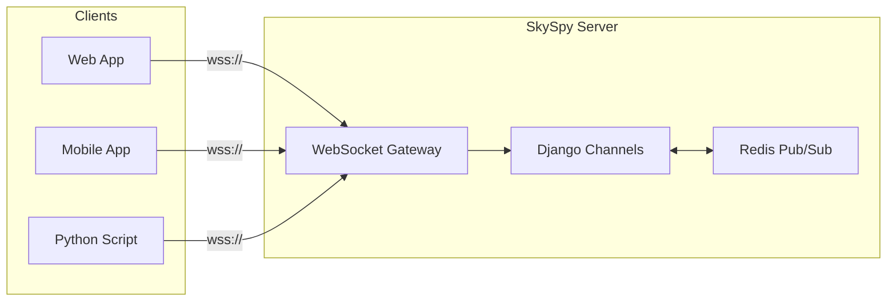
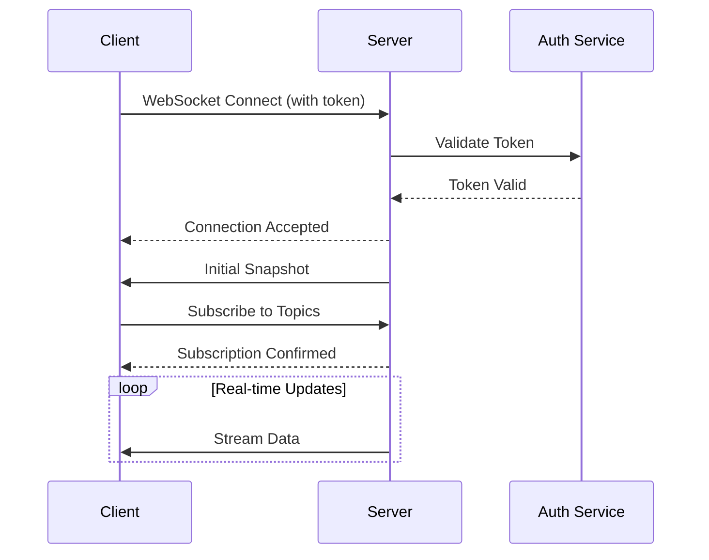
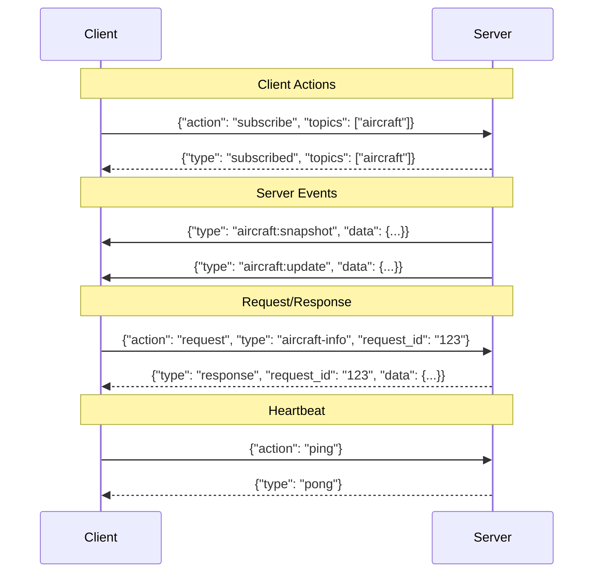
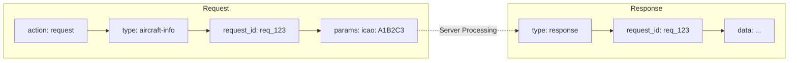
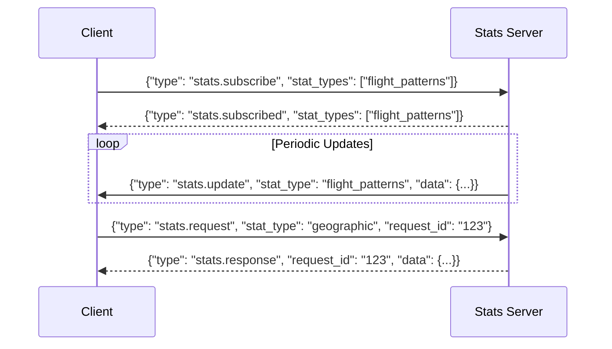
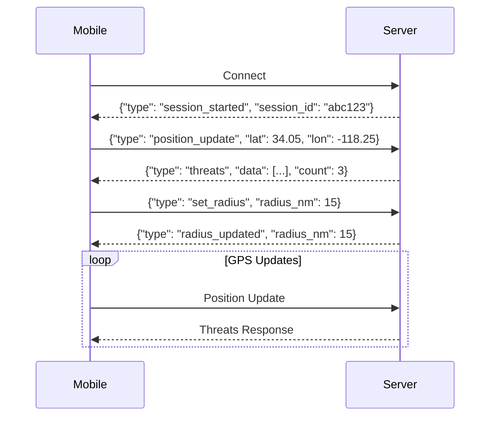
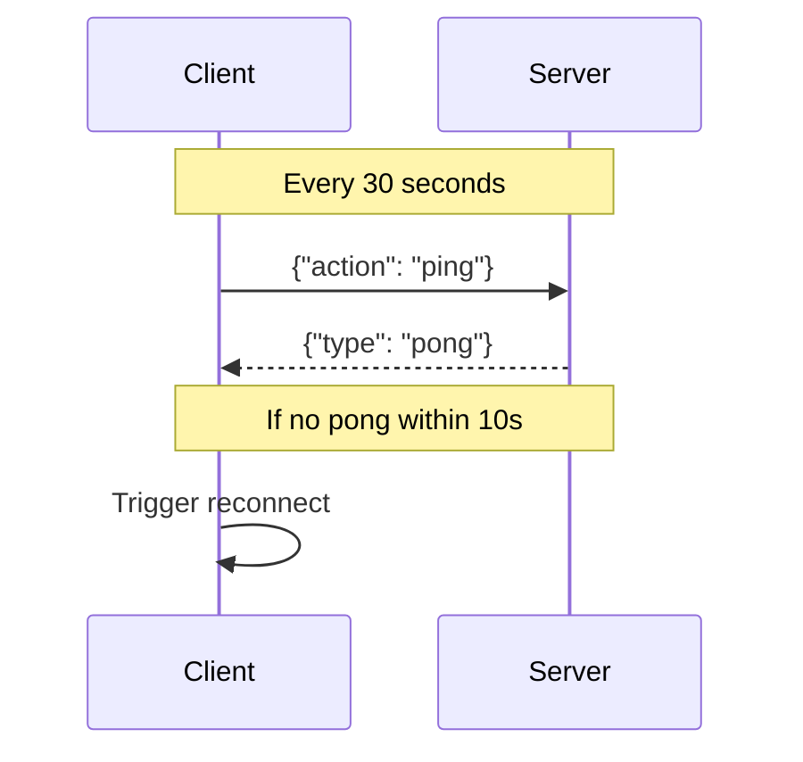
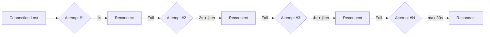

# WebSocket API Reference

> **Real-time aviation data at your fingertips.** SkySpy provides live streaming through Django Channels WebSocket connections with intelligent rate limiting, delta compression, and automatic reconnection.

---

## Overview

SkySpy's WebSocket API delivers real-time bidirectional communication for tracking aircraft, monitoring safety events, and streaming aviation data.



### What You Can Stream

| Channel | Description | Use Case |
|:--------|:------------|:---------|
| **Aircraft** | Live ADS-B position updates | Real-time tracking map |
| **Safety** | TCAS alerts, emergency squawks, conflicts | Safety monitoring |
| **Alerts** | Custom rule-based notifications | Personalized alerts |
| **ACARS/VDL2** | Datalink messages | Message decoding |
| **Statistics** | Live analytics and metrics | Dashboard widgets |
| **Airspace** | Advisories, NOTAMs, TFRs | Airspace awareness |

---

## Key Features

> **Note:** SkySpy's WebSocket implementation is optimized for both high-performance servers and resource-constrained devices like Raspberry Pi.

| Feature | Description |
|:--------|:------------|
| **Rate Limiting** | Per-topic rate limits optimize bandwidth |
| **Message Batching** | High-frequency updates collected into efficient batches |
| **Delta Updates** | Only changed fields sent for position updates |
| **Heartbeat** | Ping/pong keepalive every 30 seconds |
| **Auto-reconnect** | Exponential backoff with jitter |
| **Topic Subscriptions** | Subscribe only to the data you need |

---

## Connection URLs

All WebSocket endpoints follow this pattern:

```
wss://{host}/ws/{endpoint}/
```

### Available Endpoints

> **Tip:** Use the **Combined Feed** (`/ws/all/`) for most applications. It provides all data streams through a single connection.

| Endpoint | Path | Badge | Description |
|:---------|:-----|:------|:------------|
| Combined Feed | `/ws/all/` |  | All data streams in one connection |
| Aircraft | `/ws/aircraft/` |  | Aircraft positions and updates |
| Airspace | `/ws/airspace/` |  | Advisories, boundaries, weather |
| Safety | `/ws/safety/` |  | TCAS, emergencies, conflicts |
| ACARS | `/ws/acars/` |  | ACARS/VDL2 messages |
| Audio | `/ws/audio/` |  | Radio transcription updates |
| Alerts | `/ws/alerts/` |  | Custom alert triggers |
| NOTAMs | `/ws/notams/` |  | NOTAMs and TFRs |
| Stats | `/ws/stats/` |  | Statistics and analytics |
| Cannonball | `/ws/cannonball/` |  | Mobile threat detection |

---

## Authentication

### Connection Handshake Flow



### Authentication Modes

| Mode | Status | Behavior |
|:-----|:------:|:---------|
| `public` | Open | All connections allowed without authentication |
| `hybrid` | Mixed | Anonymous access to public features, auth required for private |
| `private` | Locked | All connections require valid authentication |

### Token Methods

> **Warning:** Query string tokens are logged by most web servers. Use the header method in production.

**Header (Recommended):**

```javascript
// Recommended: Sec-WebSocket-Protocol Header
const ws = new WebSocket(url, ['Bearer', 'eyJhbGciOiJIUzI1NiIs...']);
```

**Query String (Discouraged):**

```javascript
// Discouraged: Query String
const ws = new WebSocket('wss://example.com/ws/all/?token=eyJhbGciOiJIUzI1NiIs...');
```

### Supported Token Types

| Token Type | Format | Example |
|:-----------|:-------|:--------|
| JWT Access Token | `eyJ...` | From `/api/auth/token/` endpoint |
| API Key (Live) | `sk_live_...` | Production API key |
| API Key (Test) | `sk_test_...` | Development API key |

---

## Message Protocol

### Message Flow Diagram



### Client-to-Server Actions

| Action | Description | Parameters |
|:-------|:------------|:-----------|
| `subscribe` | Subscribe to topics | `topics: string[]` |
| `unsubscribe` | Unsubscribe from topics | `topics: string[]` |
| `ping` | Heartbeat ping | None |
| `request` | Request/response query | `type`, `request_id`, `params` |

```json
{
  "action": "subscribe",
  "topics": ["aircraft", "safety"]
}
```

### Server-to-Client Events

Server messages use a `type` field with namespace prefix:

```json
{
  "type": "aircraft:update",
  "data": { }
}
```

### Batch Messages

> **Info:** High-frequency updates are batched for efficiency. Critical messages like `alert`, `safety`, and `emergency` **bypass batching** for immediate delivery.

```json
{
  "type": "batch",
  "messages": [
    { "type": "aircraft:update", "data": {} },
    { "type": "aircraft:update", "data": {} }
  ],
  "count": 2,
  "timestamp": "2024-01-15T10:30:00.000Z"
}
```

---

## Request/Response Pattern

For on-demand queries, use the request/response pattern with a unique `request_id`.

### Message Structure



**Request:**

```json
{
  "action": "request",
  "type": "aircraft-info",
  "request_id": "req_abc123",
  "params": {
    "icao": "A1B2C3"
  }
}
```

**Success Response:**

```json
{
  "type": "response",
  "request_id": "req_abc123",
  "request_type": "aircraft-info",
  "data": {
    "icao_hex": "A1B2C3",
    "registration": "N12345",
    "type_code": "B738",
    "operator": "Southwest Airlines"
  }
}
```

**Error Response:**

```json
{
  "type": "error",
  "request_id": "req_abc123",
  "message": "Aircraft not found"
}
```

---

## Aircraft Consumer

> **Endpoint:** `/ws/aircraft/`
>
> Real-time aircraft position tracking with high-frequency updates, delta compression, and message batching.

### Topics

| Topic | Badge | Description |
|:------|:------|:------------|
| `aircraft` |  | All aircraft updates |
| `stats` |  | Filtered statistics |
| `all` |  | Combined feed |

### Event Types

| Event | Trigger | Description |
|:------|:--------|:------------|
| `aircraft:snapshot` | On connect | Full state of all tracked aircraft |
| `aircraft:update` | Periodic (rate-limited) | Full aircraft list update |
| `aircraft:new` | New detection | New aircraft detected in range |
| `aircraft:remove` | Timeout/out of range | Aircraft no longer tracked |
| `aircraft:delta` | Position change | Only changed fields (RPi optimization) |
| `aircraft:heartbeat` | Every 5 seconds | Count and timestamp only |

#### `aircraft:snapshot`

Sent immediately on connection with the current aircraft state.

```json
{
  "type": "aircraft:snapshot",
  "data": {
    "aircraft": [
      {
        "hex": "A1B2C3",
        "flight": "SWA1234",
        "lat": 33.9425,
        "lon": -118.4081,
        "alt_baro": 35000,
        "gs": 450,
        "track": 270,
        "baro_rate": 0,
        "squawk": "1200",
        "category": "A3",
        "is_military": false,
        "distance_nm": 25.4
      }
    ],
    "count": 42,
    "timestamp": "2024-01-15T10:30:00.000Z"
  }
}
```

#### `aircraft:delta`

> **Tip:** Delta updates significantly reduce bandwidth on constrained connections. Only changed fields are transmitted.

```json
{
  "type": "aircraft:delta",
  "data": {
    "hex": "A1B2C3",
    "changes": {
      "lat": 33.9430,
      "lon": -118.4090,
      "alt": 35100
    }
  }
}
```

#### `aircraft:new` and `aircraft:remove`

**New Aircraft:**

```json
{
  "type": "aircraft:new",
  "data": {
    "hex": "A1B2C3",
    "flight": "UAL456",
    "lat": 34.0522,
    "lon": -118.2437,
    "alt_baro": 5000
  }
}
```

**Remove Aircraft:**

```json
{
  "type": "aircraft:remove",
  "data": {
    "hex": "A1B2C3",
    "reason": "timeout"
  }
}
```

### Request Types

| Request Type | Parameters | Description |
|:-------------|:-----------|:------------|
| `aircraft` | `icao` | Get single aircraft by ICAO |
| `aircraft_list` | `military_only`, `category`, `min_altitude`, `max_altitude` | Get filtered aircraft list |
| `aircraft-info` | `icao` | Get detailed aircraft info |
| `aircraft-info-bulk` | `icaos: string[]` | Get info for multiple aircraft |
| `aircraft-stats` | None | Get live statistics |
| `photo` | `icao`, `thumbnail` | Get aircraft photo URL |
| `sightings` | `hours`, `limit`, `offset`, `icao_hex`, `callsign` | Get historical sightings |
| `antenna-polar` | `hours` | Get antenna polar coverage |
| `antenna-rssi` | `hours`, `sample_size` | Get RSSI vs distance data |

---

## Safety Consumer

> **Endpoint:** `/ws/safety/`
>
> Real-time safety event monitoring including TCAS alerts, emergency squawks, and conflict detection.

### Topics

| Topic | Badge | Description |
|:------|:------|:------------|
| `events` |  | All safety events |
| `tcas` |  | TCAS-specific events |
| `emergency` |  | Emergency squawk events |
| `all` |  | All safety data |

### Event Severity Levels

| Severity | Indicator | Description |
|:---------|:---------:|:------------|
| `critical` | Red | Immediate attention required (e.g., 7700 squawk) |
| `high` | Orange | Significant event (e.g., TCAS RA) |
| `medium` | Yellow | Notable event (e.g., TCAS TA) |
| `low` | Green | Informational (e.g., unusual squawk) |

### Event Types

#### `safety:event`

New safety event detected - **delivered immediately** (bypasses batching).

```json
{
  "type": "safety:event",
  "data": {
    "id": 124,
    "timestamp": "2024-01-15T10:31:00.000Z",
    "event_type": "emergency_squawk",
    "severity": "critical",
    "icao_hex": "A1B2C3",
    "callsign": "N12345",
    "message": "Emergency squawk 7700 detected",
    "details": {
      "squawk": "7700",
      "altitude": 10000,
      "position": { "lat": 34.05, "lon": -118.25 }
    }
  }
}
```

#### `safety:snapshot`

Initial active events on connect.

```json
{
  "type": "safety:snapshot",
  "data": {
    "events": [
      {
        "id": 123,
        "timestamp": "2024-01-15T10:30:00.000Z",
        "event_type": "TCAS_RA",
        "severity": "high",
        "icao_hex": "A1B2C3",
        "icao_hex_2": "D4E5F6",
        "callsign": "UAL123",
        "callsign_2": "DAL456",
        "message": "TCAS Resolution Advisory - Climb",
        "acknowledged": false
      }
    ],
    "count": 1,
    "timestamp": "2024-01-15T10:30:00.000Z"
  }
}
```

### Request Types

| Request Type | Parameters | Description |
|:-------------|:-----------|:------------|
| `active_events` | `event_type`, `severity` | Get active safety events |
| `event_history` | `event_type`, `icao`, `limit` | Get event history |
| `acknowledge` | `event_id` | Acknowledge a safety event |
| `safety-event-detail` | `event_id` | Get detailed event info |

---

## Alerts Consumer

> **Endpoint:** `/ws/alerts/`
>
> Custom alert rule triggers with user-specific channels for personalized notifications.

### Topics

| Topic | Badge | Description |
|:------|:------|:------------|
| `alerts` |  | All alert triggers (public) |
| `triggers` |  | Alert trigger events |
| `all` |  | All alert data |

### User-Specific Channels

Authenticated users receive alerts on private channels:

```
alerts_user_{user_id}      - User's private alerts
alerts_session_{session_key} - Session-based alerts
```

### Event Types

#### `alert:triggered`

New alert triggered - **delivered immediately**.

```json
{
  "type": "alert:triggered",
  "data": {
    "id": 457,
    "rule_id": 12,
    "rule_name": "Low Altitude Alert",
    "icao_hex": "A1B2C3",
    "callsign": "N12345",
    "message": "Aircraft below 1000ft detected",
    "priority": "medium",
    "aircraft_data": {
      "hex": "A1B2C3",
      "alt_baro": 800,
      "lat": 34.05,
      "lon": -118.25
    },
    "triggered_at": "2024-01-15T10:31:00.000Z"
  }
}
```

### Request Types

| Request Type | Parameters | Description |
|:-------------|:-----------|:------------|
| `alerts` | `hours`, `limit` | Get alert history |
| `alert-rules` | None | Get active alert rules |
| `acknowledge-alert` | `id` | Acknowledge single alert |
| `acknowledge-all-alerts` | None | Acknowledge all alerts |
| `my-subscriptions` | None | Get user's rule subscriptions |

---

## ACARS Consumer

> **Endpoint:** `/ws/acars/`
>
> ACARS/VDL2 datalink message streaming with frequency and label filtering.

### Topics

| Topic | Badge | Description |
|:------|:------|:------------|
| `messages` |  | All ACARS messages |
| `vdlm2` |  | VDL Mode 2 messages only |
| `all` |  | All ACARS data |

### Event Types

#### `acars:message`

New ACARS message received.

```json
{
  "type": "acars:message",
  "data": {
    "id": 790,
    "timestamp": "2024-01-15T10:31:00.000Z",
    "source": "ACARS",
    "channel": 3,
    "frequency": "131.550",
    "icao_hex": "A1B2C3",
    "registration": "N12345",
    "callsign": "UAL123",
    "label": "SQ",
    "block_id": "A",
    "msg_num": "001",
    "text": "REQUEST OCEANIC CLEARANCE",
    "decoded": {
      "message_type": "clearance_request",
      "route": "NATU TRACK A"
    },
    "signal_level": -42.5
  }
}
```

### Request Types

| Request Type | Parameters | Description |
|:-------------|:-----------|:------------|
| `messages` | `icao`, `callsign`, `label`, `source`, `frequency`, `hours`, `limit` | Get filtered messages |
| `stats` | None | Get ACARS statistics |
| `labels` | None | Get label reference data |

---

## Stats Consumer

> **Endpoint:** `/ws/stats/`
>
> Real-time statistics and analytics streaming with subscription-based updates.

### Message Format

The stats consumer uses a different message format with `type` prefixes:



### Available Stat Types

| Category | Stat Types |
|:---------|:-----------|
| **Flight Patterns** | `flight_patterns`, `geographic`, `busiest_hours`, `common_aircraft_types`, `countries`, `airlines`, `airports` |
| **Session Analytics** | `tracking_quality`, `coverage_gaps`, `engagement` |
| **Time Comparison** | `week_comparison`, `seasonal_trends`, `day_night`, `weekend_weekday`, `daily_totals`, `weekly_totals`, `monthly_totals` |
| **ACARS** | `acars_stats`, `acars_trends`, `acars_airlines`, `acars_categories` |
| **Gamification** | `personal_records`, `rare_sightings`, `collection_stats`, `spotted_by_type`, `spotted_by_operator`, `streaks`, `lifetime_stats` |
| **General** | `history_stats`, `history_trends`, `history_top`, `safety_stats`, `aircraft_stats` |

---

## Airspace Consumer

> **Endpoint:** `/ws/airspace/`
>
> Airspace advisories, boundaries, and aviation weather data.

### Topics

| Topic | Badge | Description |
|:------|:------|:------------|
| `advisories` |  | G-AIRMETs, SIGMETs |
| `boundaries` |  | Class B/C/D, MOAs |
| `all` |  | All airspace data |

### Request Types

| Request Type | Parameters | Description |
|:-------------|:-----------|:------------|
| `advisories` | `hazard`, `advisory_type` | Get active advisories |
| `boundaries` | `airspace_class`, `lat`, `lon`, `radius_nm` | Get airspace boundaries |
| `metars` | `lat`, `lon`, `radius_nm`, `limit` | Get METAR observations |
| `taf` | `station` | Get TAF forecast |
| `pireps` | `lat`, `lon`, `radius_nm`, `hours` | Get PIREPs |
| `sigmets` | `hazard` | Get SIGMETs |
| `airports` | `lat`, `lon`, `radius_nm`, `limit` | Get nearby airports |
| `navaids` | `lat`, `lon`, `radius_nm`, `type`, `limit` | Get navigation aids |

---

## NOTAMs Consumer

> **Endpoint:** `/ws/notams/`
>
> NOTAMs and Temporary Flight Restrictions (TFRs).

### Topics

| Topic | Badge | Description |
|:------|:------|:------------|
| `notams` |  | All NOTAM types |
| `tfrs` |  | Only Temporary Flight Restrictions |
| `all` |  | All NOTAM updates |

### Event Types

#### `notams:tfr_new`

New TFR alert - critical for flight planning.

```json
{
  "type": "notams:tfr_new",
  "data": {
    "id": 302,
    "notam_id": "1/2346",
    "type": "TFR",
    "location": "KSFO",
    "latitude": 37.6213,
    "longitude": -122.3790,
    "radius_nm": 10,
    "floor_ft": 0,
    "ceiling_ft": 18000,
    "reason": "Stadium Event",
    "effective_start": "2024-01-15T18:00:00.000Z",
    "effective_end": "2024-01-15T23:00:00.000Z"
  }
}
```

---

## Audio Consumer

> **Endpoint:** `/ws/audio/`
>
> Radio transcription updates and audio transmission streaming.

### Topics

| Topic | Badge | Description |
|:------|:------|:------------|
| `transmissions` |  | All audio transmissions |
| `transcriptions` |  | Transcription updates only |
| `all` |  | All audio data |

### Event Types

#### `audio:transcription_completed`

Transcription finished with identified callsigns.

```json
{
  "type": "audio:transcription_completed",
  "data": {
    "id": 501,
    "transcript": "United four five six heavy, runway two five left, cleared for takeoff",
    "transcript_confidence": 0.95,
    "identified_airframes": ["UAL456"],
    "transcription_completed_at": "2024-01-15T10:30:15.000Z"
  }
}
```

---

## Cannonball Consumer

> **Endpoint:** `/ws/cannonball/`
>
> Mobile threat detection mode for real-time overhead tracking. Optimized for battery efficiency and GPS integration.

### Message Flow



### Threat Levels

| Level | Indicator | Description |
|:------|:---------:|:------------|
| `critical` | Red | Immediate threat - very close, approaching |
| `warning` | Orange | Nearby threat requiring attention |
| `info` | Green | Distant or departing aircraft |

### Trend Values

| Trend | Indicator | Description |
|:------|:---------:|:------------|
| `approaching` | Up | Getting closer (\> 0.05nm/update) |
| `holding` | Right | Maintaining distance |
| `departing` | Down | Moving away (\> 0.05nm/update) |
| `unknown` | Unknown | First observation |

### Threat Response

```json
{
  "type": "threats",
  "data": [
    {
      "hex": "A1B2C3",
      "callsign": "N12345",
      "category": "Law Enforcement",
      "description": "Police Helicopter",
      "distance_nm": 2.5,
      "bearing": 45,
      "relative_bearing": 315,
      "direction": "NE",
      "altitude": 1500,
      "ground_speed": 80,
      "trend": "approaching",
      "threat_level": "warning",
      "is_law_enforcement": true,
      "is_helicopter": true,
      "confidence": "high",
      "lat": 34.06,
      "lon": -118.24
    }
  ],
  "count": 1,
  "position": { "lat": 34.05, "lon": -118.25 },
  "timestamp": "2024-01-15T10:30:00.000Z"
}
```

---

## Connection Lifecycle

### Heartbeat Protocol



### Connection States

| State | Indicator | Description |
|:------|:---------:|:------------|
| `connecting` | Yellow | Establishing WebSocket connection |
| `connected` | Green | Connection established, receiving data |
| `reconnecting` | Orange | Connection lost, attempting to reconnect |
| `disconnected` | Red | Connection closed |
| `error` | Error | Authentication or protocol error |

### Reconnection Strategy

The client uses **exponential backoff with jitter** for resilient reconnection:



**Configuration:**

| Setting | Value | Description |
|:--------|:------|:------------|
| `initialDelay` | 1000ms | Starting delay |
| `maxDelay` | 30000ms | Maximum delay cap |
| `multiplier` | 2x | Exponential factor |
| `jitter` | 0-30% | Random variance |
| `maxAttempts` | Infinity | Never give up |

### Close Codes

| Code | Status | Meaning | Action |
|:-----|:------:|:--------|:-------|
| `1000` | OK | Normal closure | No reconnect |
| `1001` | Out | Going away (page unload) | No reconnect |
| `4000` | Timeout | Heartbeat timeout | Reconnect |
| `4001` | Locked | Unauthorized | No reconnect - check auth |
| Other | Warning | Unexpected error | Reconnect with backoff |

---

## Client Implementation

### React Hook Example

```javascript
import { useState, useEffect, useCallback, useRef } from 'react';

function useSkySpy(endpoint = 'all', topics = ['aircraft']) {
  const [connected, setConnected] = useState(false);
  const [aircraft, setAircraft] = useState([]);
  const wsRef = useRef(null);
  const reconnectAttempt = useRef(0);

  const connect = useCallback(() => {
    const protocol = window.location.protocol === 'https:' ? 'wss:' : 'ws:';
    const url = `${protocol}//${window.location.host}/ws/${endpoint}/`;

    const ws = new WebSocket(url);
    wsRef.current = ws;

    ws.onopen = () => {
      setConnected(true);
      reconnectAttempt.current = 0;

      // Subscribe to topics
      ws.send(JSON.stringify({
        action: 'subscribe',
        topics: topics
      }));
    };

    ws.onmessage = (event) => {
      const data = JSON.parse(event.data);

      // Handle batch messages
      if (data.type === 'batch') {
        data.messages.forEach(handleMessage);
        return;
      }

      handleMessage(data);
    };

    ws.onclose = (event) => {
      setConnected(false);

      // Reconnect unless normal close or auth failure
      if (event.code !== 1000 && event.code !== 1001 && event.code !== 4001) {
        const delay = Math.min(1000 * Math.pow(2, reconnectAttempt.current), 30000);
        reconnectAttempt.current++;
        setTimeout(connect, delay);
      }
    };
  }, [endpoint, topics]);

  const handleMessage = useCallback((data) => {
    switch (data.type) {
      case 'aircraft:snapshot':
      case 'aircraft:update':
        setAircraft(data.data.aircraft || []);
        break;
      case 'aircraft:new':
        setAircraft(prev => [...prev, data.data]);
        break;
      case 'aircraft:remove':
        setAircraft(prev => prev.filter(a => a.hex !== data.data.hex));
        break;
    }
  }, []);

  useEffect(() => {
    connect();
    return () => {
      if (wsRef.current) {
        wsRef.current.close(1000);
      }
    };
  }, [connect]);

  return { connected, aircraft };
}
```

### Python (asyncio) Example

```python
import asyncio
import json
import websockets

async def skyspy_client():
    uri = "wss://example.com/ws/all/"

    async with websockets.connect(uri) as websocket:
        # Subscribe to topics
        await websocket.send(json.dumps({
            "action": "subscribe",
            "topics": ["aircraft", "safety"]
        }))

        # Listen for messages
        async for message in websocket:
            data = json.loads(message)

            if data["type"] == "batch":
                for msg in data["messages"]:
                    process_message(msg)
            else:
                process_message(data)

def process_message(data):
    msg_type = data.get("type", "")

    if msg_type == "aircraft:snapshot":
        aircraft = data["data"]["aircraft"]
        print(f"Received {len(aircraft)} aircraft")

    elif msg_type == "safety:event":
        event = data["data"]
        print(f"Safety event: {event['event_type']} - {event['message']}")

# Run the client
asyncio.run(skyspy_client())
```

### CLI (websocat) Example

```bash
# Using websocat for testing
websocat wss://example.com/ws/all/

# Send subscription
{"action": "subscribe", "topics": ["aircraft"]}

# Send request
{"action": "request", "type": "aircraft-stats", "request_id": "test1", "params": {}}
```

---

## Rate Limits

### Default Rate Limits

| Topic | Max Rate | Indicator | Description |
|:------|:---------|:---------:|:------------|
| `aircraft:update` | 10 Hz | Green | Full aircraft updates |
| `aircraft:position` | 5 Hz | Green | Position-only updates |
| `aircraft:delta` | 10 Hz | Green | Delta updates |
| `stats:update` | 0.5 Hz | Yellow | Statistics updates (2s min) |
| `default` | 5 Hz | Green | All other message types |

### Batching Configuration

| Setting | Default | Description |
|:--------|:--------|:------------|
| `window_ms` | 200 | Batch collection window |
| `max_size` | 50 | Maximum messages per batch |
| `max_bytes` | 1 MB | Maximum batch size |
| `immediate_types` | `alert`, `safety`, `emergency` | Types that **bypass batching** |

> **Warning:** Clients exceeding rate limits may be throttled. Design your application to handle reduced update frequencies gracefully.

---

## Error Handling

### Error Message Format

```json
{
  "type": "error",
  "message": "Description of the error",
  "request_id": "abc123"
}
```

### Error Reference

| Error | Cause | Resolution |
|:------|:------|:-----------|
| `Invalid JSON format` | Malformed JSON | Check JSON syntax |
| `Unknown action` | Unsupported action type | Use valid action |
| `Unknown request type` | Unsupported request | Check request type |
| `Missing parameter` | Required param missing | Include required params |
| `Permission denied` | Insufficient access | Check authentication |
| `Message too large` | Exceeds 10MB limit | Reduce message size |
| `Rate limited` | Too many requests | Slow down request rate |
| `Invalid token` | Token expired/invalid | Refresh token |

---

## Security Considerations

> **Caution:** Always follow these security best practices when implementing WebSocket clients.

| Practice | Priority | Description |
|:---------|:--------:|:------------|
| **Use WSS** | Critical | Always use TLS in production |
| **Token Expiry** | High | JWT tokens expire; implement token refresh |
| **Avoid Query Tokens** | High | Use `Sec-WebSocket-Protocol` header instead |
| **Topic Permissions** | Medium | Some topics require specific permissions |
| **Rate Limiting** | Medium | Clients exceeding limits may be throttled |
| **Connection Cleanup** | Low | Close connections properly on unmount |

---

## Troubleshooting

### Common Issues

| Symptom | Possible Cause | Solution |
|:--------|:---------------|:---------|
| `4001` close code | Authentication failed | Check token validity |
| Frequent disconnects | Network instability | Check network; increase timeouts |
| No messages received | Not subscribed | Send subscribe action |
| Delayed updates | Rate limiting active | Expected behavior for RPi mode |
| Connection refused | Server unavailable | Check server status |

### Debug Logging

**Browser Console:**

```javascript
localStorage.setItem('ws_debug', 'true');
```

**Django Server:**

```python
LOGGING = {
    'loggers': {
        'skyspy.channels': {
            'level': 'DEBUG',
        },
    },
}
```

---

> **Need help?** Check out our [examples repository](https://github.com/skyspy/examples) or [join our Discord](https://discord.gg/skyspy) for community support.
