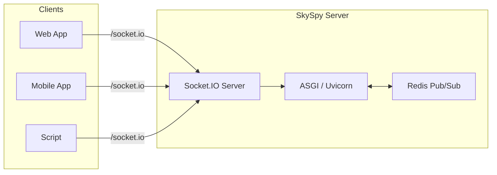
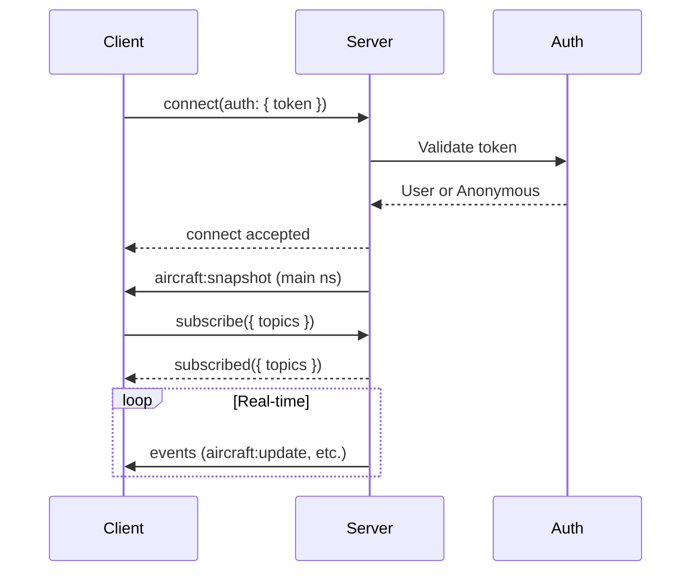

# Socket.IO API Reference

> **Real-time aviation data at your fingertips.** SkySpy provides live streaming through Socket.IO with namespaces, topic subscriptions, rate limiting, and optional Redis-backed scaling.

---

## Overview

SkySpy's Socket.IO API delivers real-time bidirectional communication for tracking aircraft, monitoring safety events, and streaming aviation data. The server uses **python-socketio** (ASGI) with optional Redis for multi-process support.


```mermaid
graph LR
    subgraph Clients
        A[Web App]
        B[Mobile App]
        C[Script]
    end

    subgraph SkySpy Server
        D[Socket.IO Server]
        E[ASGI / Uvicorn]
        F[Redis Pub/Sub]
    end

    A -->|/socket.io| D
    B -->|/socket.io| D
    C -->|/socket.io| D
    D --> E
    E <--> F
```

### What You Can Stream

| Topic / Namespace | Description | Use Case |
|:------------------|:------------|:---------|
| **Aircraft** | Live ADS-B position updates | Real-time tracking map |
| **Safety** | TCAS alerts, emergency squawks, conflicts | Safety monitoring |
| **Alerts** | Custom rule-based notifications | Personalized alerts |
| **ACARS** | Datalink messages (namespace or topic) | Message decoding |
| **Stats** | Live analytics and metrics | Dashboard widgets |
| **Airspace** | Advisories, NOTAMs, boundaries | Airspace awareness |
| **Audio** | Transcriptions, transmissions | Radio tab (/audio namespace) |
| **Cannonball** | Mobile threat detection | Mobile app (/cannonball namespace) |

---

## Key Features

| Feature | Description |
|:--------|:------------|
| **Namespaces** | `/` (main), `/audio`, `/cannonball`; optional `/acars` for ACARS-only clients |
| **Topic Subscriptions** | Subscribe only to aircraft, safety, alerts, etc. on the main namespace |
| **Rate Limiting** | Per-topic rate limits to optimize bandwidth |
| **Message Batching** | High-frequency updates can be batched (alert/safety/emergency bypass batching) |
| **Delta Updates** | Only changed fields sent for position updates where supported |
| **Built-in Heartbeat** | Engine.IO ping/pong; custom `ping` event supported |
| **Auto-reconnect** | Socket.IO client exponential backoff with jitter |
| **Request/Response** | `request` event with `request_id` for on-demand queries |

---

## Connection

### Base URL and Path

Socket.IO is served on the same host as the HTTP API. The default path is `/socket.io`.

- **Base URL:** `https://{host}` or `http://{host}` (same as your API base)
- **Path:** `/socket.io` (default; configurable on server)
- **Namespaces:** Connect to `/` (default), `/audio`, or `/cannonball` depending on what you need.

There are **no separate URLs per stream** (e.g. no `/ws/aircraft/`). Use a single connection to the default namespace and subscribe to topics, or connect to a dedicated namespace for audio or cannonball.

### Namespaces

| Namespace | Path | Description |
|:----------|:-----|:------------|
| **Main** | `/` | Aircraft, safety, alerts, ACARS, airspace, NOTAMs, stats. Subscribe via `subscribe` event. |
| **Audio** | `/audio` | Radio transmissions and transcription events. |
| **Cannonball** | `/cannonball` | Mobile threat detection; position updates and threat list. |
| **ACARS** (optional) | `/acars` | ACARS-only stream for clients that only want datalink messages. |

For most apps, connect to the **main namespace** (`/`) and subscribe to `aircraft`, `safety`, `alerts`, etc. Use `/audio` or `/cannonball` only when you need those features.

---

## Authentication

### Connection Handshake


```mermaid
sequenceDiagram
    participant C as Client
    participant S as Server
    participant A as Auth

    C->>S: connect(auth: { token })
    S->>A: Validate token
    A-->>S: User or Anonymous
    S-->>C: connect accepted
    S->>C: aircraft:snapshot (main ns)
    C->>S: subscribe({ topics })
    S-->>C: subscribed({ topics })
    loop Real-time
        S->>C: events (aircraft:update, etc.)
    end
```

### Authentication Modes

| Mode | Behavior |
|:-----|:---------|
| `public` | All connections allowed without authentication |
| `hybrid` | Anonymous allowed; auth required for some features; invalid token can be rejected if `WS_REJECT_INVALID_TOKENS` is True |
| `private` | All connections require valid authentication |

### Passing the Token

Send credentials in the **auth** object when connecting. Do not put tokens in query strings (they are often logged).

**JavaScript (socket.io-client):**

```javascript
const io = require('socket.io-client');

const socket = io('https://example.com', {
  path: '/socket.io',
  auth: {
    token: 'eyJhbGciOiJIUzI1NiIs...'  // JWT or API key
  },
  transports: ['websocket']
});
```

**Python (python-socketio):**

```python
import socketio

sio = socketio.Client()

@sio.event
def connect():
    print('connected')

sio.connect(
    'https://example.com',
    socketio_path='/socket.io',
    auth={'token': 'eyJhbGciOiJIUzI1NiIs...'},
    transports=['websocket']
)
```

### Supported Token Types

| Token Type | Format | Example |
|:-----------|:-------|:--------|
| JWT Access Token | `eyJ...` | From `/api/auth/token/` |
| API Key (Live) | `sk_live_...` | Production API key |
| API Key (Test) | `sk_test_...` | Development API key |

---

## Message Protocol

### Event-Based API

Socket.IO uses **events**. Client sends events (e.g. `subscribe`, `request`, `ping`); server sends events (e.g. `aircraft:snapshot`, `subscribed`, `response`). Each event has a **name** and a **payload** (usually an object).

### Client → Server Events

| Event | Payload | Description |
|:------|:--------|:------------|
| `subscribe` | `{ topics: string[] }` | Subscribe to topics (e.g. `['aircraft','safety']`; use `'all'` for all). |
| `unsubscribe` | `{ topics: string[] }` | Unsubscribe from topics. |
| `request` | `{ type, request_id, params? }` | On-demand query; server replies with `response` or `error`. |
| `ping` | optional data | Custom keepalive; server replies with `pong`. |

Example:

```javascript
socket.emit('subscribe', { topics: ['aircraft', 'safety'] });
socket.emit('request', {
  type: 'aircraft-info',
  request_id: 'req_abc123',
  params: { icao: 'A1B2C3' }
});
```

### Server → Client Events

Server emits named events. The payload is typically a single object (e.g. snapshot data, list of topics).

| Event | When | Payload |
|:------|:-----|:--------|
| `subscribed` | After subscribe | `{ topics, joined?, denied? }` |
| `unsubscribed` | After unsubscribe | `{ topics, remaining }` |
| `response` | Reply to request | `{ type, request_id, request_type, data }` |
| `error` | Request failed or generic error | `{ type?, request_id?, message }` |
| `pong` | Reply to ping | `{ timestamp }` |
| `aircraft:snapshot` | On connect (main ns) / snapshot request | `{ aircraft, count, timestamp }` |
| `aircraft:update` | Periodic / batched updates | aircraft list or delta |
| `aircraft:new` | New aircraft in range | single aircraft |
| `aircraft:remove` | Aircraft left / timeout | `{ hex, reason? }` |
| `aircraft:heartbeat` | Heartbeat | count/timestamp |
| `safety:snapshot` | Initial safety state | `{ events, count, timestamp }` |
| `safety:event` | New safety event | event object |
| `alert:triggered` | Alert rule fired | alert payload |
| `acars:message` | New ACARS message | message object |
| `batch` | Batched messages | `{ messages, count?, timestamp? }` |

Payloads match the formats described in the old WebSocket docs (aircraft, safety, alerts, etc.); only the transport is Socket.IO events instead of raw JSON messages.

### Batch Messages

High-frequency updates may be sent as a single `batch` event:

```json
{
  "messages": [
    { "type": "aircraft:update", "data": {} },
    { "type": "aircraft:update", "data": {} }
  ],
  "count": 2,
  "timestamp": "2024-01-15T10:30:00.000Z"
}
```

Critical types (e.g. alert, safety, emergency) bypass batching and are emitted immediately.

---

## Request/Response Pattern

Use the `request` event with a unique `request_id`; listen for `response` and `error`.

**Client send:**

```json
{
  "type": "aircraft-info",
  "request_id": "req_abc123",
  "params": { "icao": "A1B2C3" }
}
```

**Success:** server emits `response` with payload:

```json
{
  "type": "response",
  "request_id": "req_abc123",
  "request_type": "aircraft-info",
  "data": {
    "icao_hex": "A1B2C3",
    "registration": "N12345",
    "type_code": "B738",
    "operator": "Southwest Airlines"
  }
}
```

**Error:** server emits `error` with payload:

```json
{
  "type": "error",
  "request_id": "req_abc123",
  "message": "Aircraft not found"
}
```

---

## Main Namespace (`/`)

Default namespace. Connect here and use `subscribe` / `unsubscribe` to control which topics you receive.

### Topics

| Topic | Badge | Description |
|:------|:------|:------------|
| `aircraft` | aircraft | Position and state updates |
| `safety` | safety | Safety events |
| `stats` | stats | Statistics |
| `alerts` | alerts | Alert triggers |
| `acars` | acars | ACARS messages (if also broadcast to main) |
| `airspace` | airspace | Advisories, boundaries |
| `notams` | notams | NOTAMs and TFRs |
| `all` | all | All of the above |

### Aircraft Events (main namespace)

| Event | Trigger | Payload |
|:------|:--------|:--------|
| `aircraft:snapshot` | On connect / request | `{ aircraft[], count, timestamp }` |
| `aircraft:update` | Periodic (rate-limited) | Full or batched list |
| `aircraft:new` | New detection | Single aircraft |
| `aircraft:remove` | Timeout / out of range | `{ hex, reason? }` |
| `aircraft:delta` | Position change (if used) | Delta object |
| `aircraft:heartbeat` | Keepalive | Count/timestamp |

Aircraft payload fields match the previous API (e.g. `hex`, `flight`, `lat`, `lon`, `alt_baro`, `gs`, `track`, `squawk`, `category`, `distance_nm`).

### Request Types (main namespace)

Supported `request` types include (subset):

| Request Type | Parameters | Description |
|:-------------|:-----------|:------------|
| `aircraft` | `icao` | Single aircraft by ICAO |
| `aircraft_list` | `military_only`, `category`, `min_altitude`, `max_altitude` | Filtered list |
| `aircraft-info` | `icao` | Detailed aircraft info |
| `aircraft-info-bulk` | `icaos[]` | Bulk aircraft info |
| `aircraft-stats` | — | Live statistics |
| `aircraft-snapshot` | — | Current aircraft snapshot |
| `photo` | `icao`, `thumbnail` | Aircraft photo URL |
| `sightings` | `hours`, `limit`, `offset`, `icao_hex`, `callsign` | Historical sightings |
| `antenna-polar` | `hours` | Antenna polar coverage |
| `antenna-rssi` | `hours`, `sample_size` | RSSI vs distance |
| `safety-events` | `event_type`, `severity`, etc. | Safety events |
| `safety-event-detail` | `id` / `event_id` | Event detail |
| `safety-acknowledge` | `id` / `event_id` | Acknowledge event |
| `acars-stats` | — | ACARS statistics |
| `alert-rules` | — | Alert rules |
| `notification-channels` | — | Notification channels |
| `metars` / `taf` / `pireps` | `lat`, `lon`, `radius_nm`, etc. | Weather / PIREPs |
| `airports` / `navaids` | `lat`, `lon`, `radius_nm`, `limit` | Geodata |
| `airspace-boundaries` / airspace advisories | — | Airspace |
| `system-info` / `system-status` / `health` | — | System |
| `stats-flight-patterns`, `stats-geographic`, etc. | — | Extended stats |

(Full set is implemented in the main namespace handler; permission checks apply where configured.)

---

## Safety Events (main namespace)

- **Topics:** `safety`, or `all`.
- **Events:** `safety:snapshot` (initial), `safety:event` (new event). Severity and payload shape match the previous API (e.g. `event_type`, `severity`, `icao_hex`, `callsign`, `message`, `details`).
- **Requests:** `safety-events`, `safety-event-detail`, `safety-acknowledge`, `safety-stats`, etc.

---

## Alerts (main namespace)

- **Topics:** `alerts`, or `all`. User-specific channels for authenticated users.
- **Events:** `alert:triggered`, `alert:snapshot`. Payload includes rule and aircraft data.
- **Requests:** `alert-rules`, `alert-rule-create`, `alert-rule-update`, `alert-rule-delete`, `alert-rule-toggle`, etc.

---

## ACARS

- **Main namespace:** Subscribe to topic `acars` to receive `acars:message` (if the server broadcasts to the main namespace).
- **Dedicated namespace:** For ACARS-only clients, connect to namespace `/acars`; server broadcasts to room `acars_all` (and per-ICAO rooms). Event name: `acars:message`; payload format unchanged (e.g. `id`, `timestamp`, `source`, `icao_hex`, `callsign`, `label`, `text`, `decoded`, etc.).
- **Requests:** On main namespace, `acars-stats` and related request types.

---

## Stats (main namespace)

- **Topic:** `stats` or `all`.
- **Events:** `stats:update` and/or stat-specific events with `stat_type` and `data`.
- **Requests:** `stats-flight-patterns`, `stats-geographic`, `stats-tracking-quality`, `stats-engagement`, `stats-time-comparison`, `history-stats`, `history-trends`, etc.

---

## Airspace & NOTAMs (main namespace)

- **Topics:** `airspace`, `notams`, or `all`.
- **Events:** e.g. `airspace:update`, `notams:tfr_new`, `notams:stats`, etc.
- **Requests:** `airspace-boundaries`, advisories, `metars`, `taf`, `pireps`, `airports`, `navaids`, NOTAM-related types as implemented.

---

## Audio Namespace (`/audio`)

Connect to namespace `/audio` for radio and transcription streams.

- **Events:** `audio:snapshot`, `audio:transmission`, `audio:transcription_started`, `audio:transcription_completed`, `audio:transcription_failed`.
- **Requests:** e.g. `transmissions`, `transmission` (by ID), `stats`.

Permission for the `audio` topic/feature is required.

---

## Cannonball Namespace (`/cannonball`)

Connect to namespace `/cannonball` for mobile threat detection.

- **Flow:** Client sends `position_update` (lat, lon, optional heading); server emits `threats` with filtered list. Client can send `set_radius` (radius_nm); server confirms with `radius_updated`.
- **Events (server → client):** `session_started` (session_id), `threats`, `radius_updated`, `error`.
- **Events (client → server):** `position_update`, `set_radius`, `get_threats`, `request` (for other request types).
- **Threat payload:** e.g. `hex`, `callsign`, `distance_nm`, `bearing`, `threat_level`, `trend`, `altitude`, etc.

---

## Connection Lifecycle

### Heartbeat

- Socket.IO’s Engine.IO layer provides built-in ping/pong.
- The app also supports a custom `ping` event; server replies with `pong` and optional `timestamp`.

### Connection States (client)

| State | Description |
|:------|:------------|
| Connecting | Initial connection or reconnecting |
| Connected | Connected and ready to emit/subscribe |
| Disconnected | Disconnected (check reason) |
| Connect error | Authentication or network error |

### Reconnection

Socket.IO client reconnection (exponential backoff, jitter) is enabled by default. Typical config:

- `reconnection: true`
- `reconnectionDelay`: 1000 ms
- `reconnectionDelayMax`: 30000 ms
- `reconnectionAttempts`: Infinity
- `randomizationFactor`: 0.3

Disconnect reasons (e.g. `io server disconnect`, `io client disconnect`, `transport close`) indicate whether to reconnect or not (e.g. do not reconnect on auth failure if the server disconnects for that).

---

## Client Implementation

### JavaScript (socket.io-client)

```javascript
import { io } from 'socket.io-client';

const socket = io('https://example.com', {
  path: '/socket.io',
  auth: { token: getAccessToken() },
  transports: ['websocket'],
  reconnection: true,
  reconnectionDelay: 1000,
  reconnectionDelayMax: 30000,
  reconnectionAttempts: Infinity,
  randomizationFactor: 0.3,
});

socket.on('connect', () => {
  socket.emit('subscribe', { topics: ['aircraft', 'safety'] });
});

socket.on('subscribed', (data) => {
  console.log('Subscribed:', data.topics);
});

socket.on('aircraft:snapshot', (data) => {
  console.log('Aircraft count:', data.count);
});

socket.on('aircraft:update', (data) => {
  // Merge or replace aircraft state
});

socket.on('batch', (data) => {
  data.messages.forEach(msg => {
    socket.emit(msg.type, msg.data); // or handle by msg.type
  });
});

socket.on('response', (data) => {
  console.log('Response:', data.request_id, data.data);
});

socket.on('error', (data) => {
  console.error('Error:', data.message);
});
```

### Python (python-socketio)

```python
import socketio

sio = socketio.Client()

@sio.event
def connect():
    sio.emit('subscribe', {'topics': ['aircraft', 'safety']})

@sio.event
def subscribed(data):
    print('Subscribed:', data.get('topics'))

@sio.event
def aircraft_snapshot(data):
    print('Aircraft count:', data.get('count'))

@sio.event
def aircraft_update(data):
    pass  # merge aircraft state

@sio.event
def batch(data):
    for msg in data.get('messages', []):
        event = msg.get('type', '').replace(':', '_')
        payload = msg.get('data', msg)
        sio.emit(event, payload)

@sio.event
def response(data):
    print('Response:', data.get('request_id'), data.get('data'))

@sio.event
def error(data):
    print('Error:', data.get('message'))

sio.connect(
    'https://example.com',
    socketio_path='/socket.io',
    auth={'token': 'eyJ...'},
    transports=['websocket']
)
sio.wait()
```

(Note: python-socketio may use `aircraft_snapshot` for the event `aircraft:snapshot`; check client docs for colon handling.)

### Request with timeout (JavaScript)

```javascript
function request(socket, type, params = {}, timeoutMs = 10000) {
  return new Promise((resolve, reject) => {
    const requestId = `req_${Date.now()}_${Math.random().toString(36).slice(2)}`;
    const t = setTimeout(() => {
      reject(new Error(`Timeout: ${type}`));
    }, timeoutMs);

    const onResponse = (data) => {
      if (data.request_id !== requestId) return;
      clearTimeout(t);
      socket.off('response', onResponse);
      socket.off('error', onError);
      resolve(data.data ?? data);
    };
    const onError = (data) => {
      if (data.request_id !== requestId) return;
      clearTimeout(t);
      socket.off('response', onResponse);
      socket.off('error', onError);
      reject(new Error(data.message || 'Request failed'));
    };

    socket.once('response', onResponse);
    socket.once('error', onError);
    socket.emit('request', { type, request_id: requestId, params });
  });
}

// Usage
const info = await request(socket, 'aircraft-info', { icao: 'A1B2C3' });
```

---

## Rate Limits

| Topic / Type | Max rate (typical) | Notes |
|:-------------|:-------------------|:------|
| `aircraft:update` | ~10 Hz | Full updates |
| `aircraft:delta` | ~10 Hz | Delta updates |
| `stats:update` | ~0.5 Hz | 2 s min interval |
| Default | ~5 Hz | Other types |

Batching: window ~200 ms, max batch size ~50 messages or ~1 MB; alert/safety/emergency types are not batched.

---

## Error Handling

**Error event payload:**

```json
{
  "type": "error",
  "request_id": "req_abc123",
  "message": "Description of the error"
}
```

| Message / Cause | Resolution |
|:----------------|:-----------|
| Invalid JSON / malformed | Check payload format |
| Unknown action / request type | Use supported events and request types |
| Missing parameter | Include required params |
| Permission denied | Check authentication and topic/request permissions |
| Invalid token | Refresh or re-issue token |

---

## Security

- Use **TLS** in production (https / wss).
- Prefer **auth** object for token; avoid query-string tokens.
- Respect **topic and request permissions** (some require auth or specific permissions).
- Handle **token expiry** and refresh (e.g. JWT).

---

## Troubleshooting

| Symptom | Possible cause | Action |
|:--------|:---------------|:-------|
| Connection rejected | Auth required or invalid token | Check token; try in hybrid/public if testing |
| No events after connect | Not subscribed | Emit `subscribe` with `topics` after `connect` |
| No `aircraft:snapshot` | Listeners attached after connect | Subscribe and request `aircraft-snapshot` if needed |
| Delayed updates | Rate limiting / batching | Expected; critical events are not batched |
| ACARS not received on main ns | Server may send only on `/acars` | Connect to namespace `/acars` for ACARS-only stream |

**Debug (client):**

```javascript
localStorage.setItem('debug', 'socket.io-client:*');
```

**Server (Django):**

```python
LOGGING = {
    'loggers': {
        'skyspy.socketio': {'level': 'DEBUG'},
        'socketio': {'level': 'DEBUG'},
    },
}
```

---

> **Need help?** See the [REST API](05-rest-api.md), [testing guide](12-testing.md), or project README for more context.
