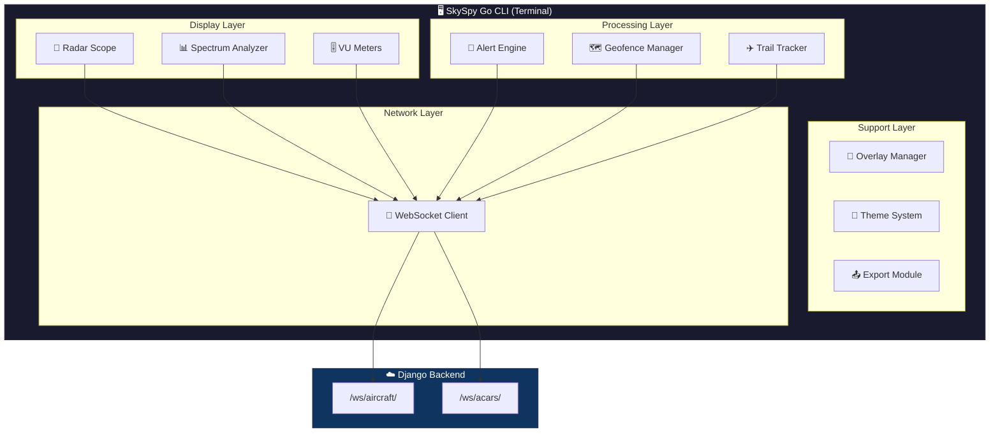
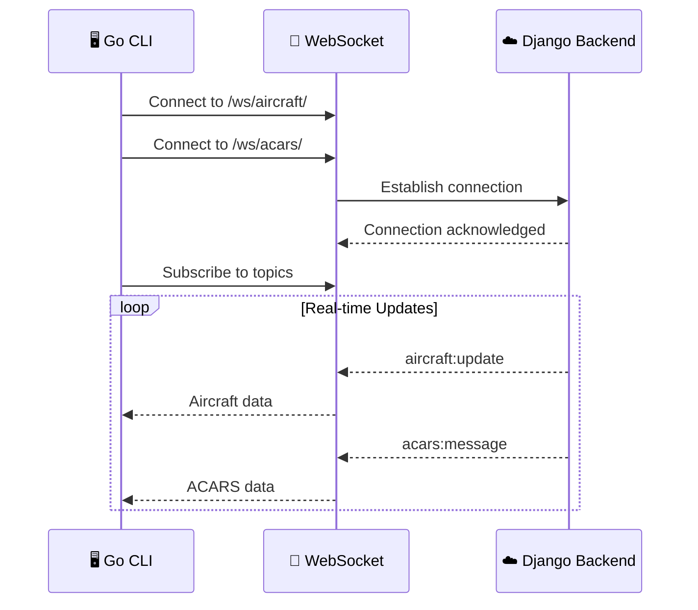
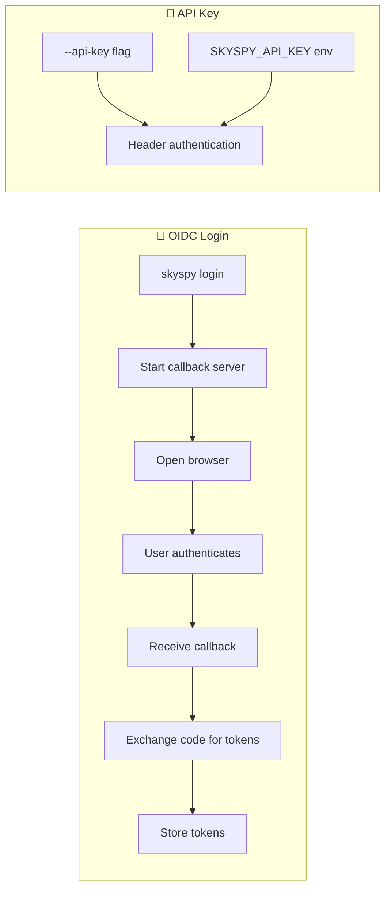
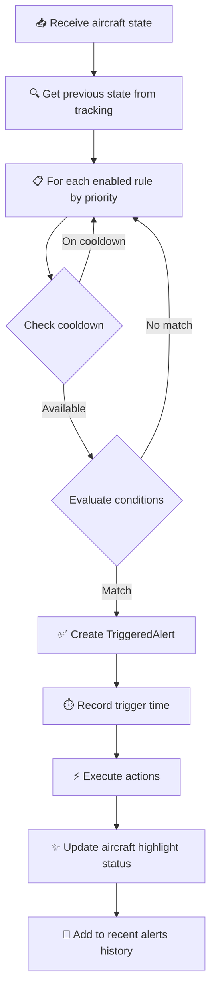

# 🦫 Go Services Architecture

> SkySpy's high-performance terminal radar interface, built with love in Go

SkySpy includes a lightning-fast Go-based CLI application (`skyspy-go`) that delivers a rich terminal-based radar experience for real-time aircraft tracking. This document covers the architecture, configuration, and operation of the Go components.

---

## 🎯 Overview

The SkySpy Go CLI is a feature-rich terminal application built using the [Bubble Tea](https://github.com/charmbracelet/bubbletea) framework. It connects to the Django backend via WebSocket to receive real-time aircraft data and presents it in an interactive radar display with VU meters, spectrum visualization, and customizable themes.

> 📘 **Built with Bubble Tea**
>
> The CLI leverages Charm's excellent Bubble Tea framework for a delightful terminal UI experience with smooth animations and responsive controls.

---

## 🖥️ Platform Support

| Platform | Architecture | Status |
|----------|--------------|--------|
|  | amd64 / arm64 | ✅ Supported |
|  | amd64 / arm64 | ✅ Supported |
|  | amd64 / arm64 | ✅ Supported |

---

## ✨ Key Features

<table>
<tr>
<td width="50%">

### 📡 Real-time Radar Display
Interactive ASCII radar scope with sweep animation and range rings

### 🛫 Aircraft Trail Tracking
Historical position trails for each aircraft with configurable history

### 🚨 Alert Engine
Configurable rules for emergency squawks, military aircraft, geofence monitoring

### 🔊 Audio Alerts
Sound notifications for new aircraft, emergencies, and military contacts

</td>
<td width="50%">

### 🗺️ Geographic Overlays
Support for GeoJSON, Shapefiles, and KML/KMZ formats

### 🎨 Multiple Themes
10 built-in color schemes from Classic Green to Cyberpunk

### 📤 Data Export
CSV, JSON, and HTML screenshot exports

### 🔐 OIDC Authentication
Browser-based SSO login flow with token refresh

</td>
</tr>
</table>

---

## 🏗️ Architecture Diagram



---

## 📁 Package Structure

```
skyspy-go/
│
├── 📂 cmd/skyspy/              # Main application entry point
│   ├── 🚀 main.go              # CLI setup and root command
│   ├── 🔐 auth.go              # Authentication commands (login/logout/status)
│   ├── 📻 radio.go             # Basic radio command
│   ├── 📻 radio_pro.go         # Advanced radio features
│   └── ⚙️ configure.go         # Configuration wizard
│
├── 📂 internal/                # Private packages
│   │
│   ├── 📂 app/                 # Bubble Tea application model
│   │   ├── app.go              # Main application state and logic
│   │   ├── view.go             # UI rendering
│   │   ├── alerts.go           # Alert state management
│   │   └── alert_rules_view.go
│   │
│   ├── 📂 alerts/              # Alert system
│   │   ├── engine.go           # Alert processing engine
│   │   ├── rules.go            # Rule definitions and matching
│   │   └── geofence.go         # Geographic boundary monitoring
│   │
│   ├── 📂 auth/                # Authentication
│   │   ├── auth.go             # Auth manager (OIDC/API key)
│   │   ├── browser.go          # Browser launcher for OIDC
│   │   ├── callback.go         # OAuth callback server
│   │   ├── config.go           # Auth configuration fetching
│   │   └── tokens.go           # Token storage and refresh
│   │
│   ├── 📂 audio/               # Audio alerts
│   │   ├── alerts.go           # Alert player
│   │   └── sounds.go           # WAV generation
│   │
│   ├── 📂 config/              # Configuration management
│   │   └── config.go           # Settings load/save
│   │
│   ├── 📂 export/              # Data export
│   │   ├── csv.go              # CSV export
│   │   ├── json.go             # JSON export
│   │   └── screenshot.go       # HTML screenshot
│   │
│   ├── 📂 geo/                 # Geographic utilities
│   │   ├── overlay.go          # GeoJSON/overlay rendering
│   │   ├── shapefile.go        # Shapefile parsing
│   │   └── kml.go              # KML/KMZ parsing
│   │
│   ├── 📂 radar/               # Radar display
│   │   └── scope.go            # Radar scope rendering
│   │
│   ├── 📂 search/              # Search and filtering
│   │   └── filter.go           # Query parser and filter
│   │
│   ├── 📂 spectrum/            # Signal visualization
│   │   └── analyzer.go         # RSSI spectrum analysis
│   │
│   ├── 📂 theme/               # Color themes
│   │   └── theme.go            # Theme definitions
│   │
│   ├── 📂 trails/              # Aircraft trails
│   │   └── tracker.go          # Position history tracking
│   │
│   ├── 📂 ui/                  # UI components
│   │   ├── vumeter.go          # VU meter rendering
│   │   └── spectrum.go         # Spectrum display
│   │
│   ├── 📂 ws/                  # WebSocket client
│   │   └── client.go           # Connection and message handling
│   │
│   └── 📂 testutil/            # Test utilities
│
├── 📄 Makefile                 # Build automation
├── 📄 .golangci.yml            # Linter configuration
└── 📂 .github/workflows/       # CI/CD pipelines
```

---

## 🔧 Core Components

### 1. 🔌 WebSocket Client (`internal/ws`)

The WebSocket client maintains persistent connections to the Django backend for real-time data streaming.

> ℹ️ **Message Types**
>
> The client handles snapshot, update, new, and remove events for both aircraft and ACARS data streams.

```go
// Message types from the server
const (
    AircraftSnapshot MessageType = "aircraft:snapshot"
    AircraftUpdate   MessageType = "aircraft:update"
    AircraftNew      MessageType = "aircraft:new"
    AircraftRemove   MessageType = "aircraft:remove"
    ACARSMessage     MessageType = "acars:message"
    ACARSSnapshot    MessageType = "acars:snapshot"
)
```

**Connection Configuration:**

```go
// Creating a WebSocket client with authentication
client := ws.NewClientWithAuth(
    host,           // Server hostname
    port,           // Server port
    reconnectDelay, // Seconds between reconnection attempts
    authProvider,   // Function returning auth header
)

// Start the connection (non-blocking)
client.Start()

// Receive aircraft messages
for msg := range client.AircraftMessages() {
    // Process aircraft data
}
```

**Authentication Support:**

The client supports both OIDC tokens and API keys via the `Sec-WebSocket-Protocol` header:

```go
// Bearer token authentication
header.Set("Sec-WebSocket-Protocol", "Bearer, "+token)

// API key authentication
header.Set("Sec-WebSocket-Protocol", "ApiKey, "+apiKey)
```

---

### 2. 🚨 Alert Engine (`internal/alerts`)

The alert engine evaluates configurable rules against aircraft data to trigger notifications.

#### Condition Types

| Condition | Description | Example |
|-----------|-------------|---------|
| `squawk` | Match squawk codes (supports wildcards) | `77*` for emergencies |
| `callsign` | Match callsign pattern | `UAL*` for United |
| `hex` | Match ICAO hex code | `A12345` |
| `military` | Check military flag | `true` |
| `altitude_above` | Minimum altitude (ft) | `35000` |
| `altitude_below` | Maximum altitude (ft) | `1000` |
| `distance_within` | Maximum distance (nm) | `50` |
| `entering_geofence` | Geofence entry detection | `home_area` |
| `speed_above` | Minimum ground speed (kts) | `500` |

#### Action Types

| Action | Icon | Description |
|--------|------|-------------|
| `sound` | 🔊 | Play audio alert |
| `notify` | 💬 | Display notification message |
| `log` | 📝 | Write to log file |
| `highlight` | ✨ | Highlight aircraft on radar |

**Creating Custom Rules:**

```go
rule := alerts.NewAlertRule("my_rule", "Custom Alert")
rule.AddCondition(alerts.ConditionSquawk, "7700")
rule.AddCondition(alerts.ConditionDistanceWithin, "25")
rule.AddAction(alerts.ActionNotify, "Emergency at {distance}nm!")
rule.AddAction(alerts.ActionSound, "emergency")
rule.SetCooldown(time.Minute * 5)
rule.SetPriority(100)

engine.AddRule(rule)
```

> ⚠️ **Default Rules Included**
>
> Three default rules are pre-configured:
> 1. **Emergency Squawk** (Priority 100) - Triggers on 75xx, 76xx, 77xx squawks
> 2. **Military Aircraft Nearby** (Priority 50) - Military aircraft within 50nm
> 3. **Low Altitude Aircraft** (Priority 30) - Aircraft below 1000ft within 25nm

---

### 3. 🗺️ Geofence Manager (`internal/alerts/geofence.go`)

Supports polygon and circular geofences for boundary monitoring.

```go
// Create a circular geofence (5nm radius)
geofence := alerts.NewCircleGeofence(
    "home_area",           // ID
    "Home Area",           // Name
    52.3676,               // Center latitude
    4.9041,                // Center longitude
    5.0,                   // Radius in nautical miles
)

// Create a polygon geofence
polygon := alerts.NewPolygonGeofence(
    "restricted_area",
    "Restricted Airspace",
    []alerts.GeofencePoint{
        {Lat: 52.0, Lon: 4.0},
        {Lat: 52.5, Lon: 4.0},
        {Lat: 52.5, Lon: 5.0},
        {Lat: 52.0, Lon: 5.0},
    },
)

// Check if aircraft entered a geofence
entered := manager.CheckEntering(prevLat, prevLon, currLat, currLon)
```

**Loading from GeoJSON:**

```go
geofence, err := alerts.LoadGeofenceFromGeoJSON("/path/to/area.geojson")
if err == nil {
    manager.AddGeofence(geofence)
}
```

---

### 4. 📡 Radar Scope (`internal/radar`)

Renders aircraft positions on an ASCII radar display with range rings, compass, and sweep animation.

```go
// Create a radar scope
scope := radar.NewScope(theme, maxRange, rangeRings, showCompass)

// Render cycle
scope.Clear()
scope.DrawRangeRings()
scope.DrawCompass()
scope.DrawOverlays(overlays, receiverLat, receiverLon, color)
scope.DrawTrails(trails, receiverLat, receiverLon)
scope.DrawSweep(sweepAngle)
sortedTargets := scope.DrawTargets(aircraft, selectedHex, militaryOnly, hideGround, showLabels, blink)

output := scope.Render()
```

#### Target Symbols

| Symbol | Meaning |
|--------|---------|
| `*` | ✈️ Regular aircraft |
| `!` | 🚨 Emergency (blinking) |
| `X` | ⚠️ Emergency (alternate) |
| `◆` | 🎖️ Military aircraft |
| `●` | 🔘 Selected aircraft |

---

### 5. 📊 Spectrum Analyzer (`internal/spectrum`)

Visualizes aircraft signal distribution by distance band.

```go
analyzer := spectrum.NewAnalyzer()

// Add aircraft data
analyzer.AddAircraft(hex, rssi, distance)

// Get smoothed spectrum values (0.0 to 1.0)
spectrum := analyzer.GetSpectrumSmoothed(24) // 24 bins

// Get peak hold values
peaks := analyzer.GetPeaks(24)
```

#### Distance Bands

| Band | Range (nm) | Coverage |
|------|------------|----------|
| 1 | 0-10 | 🟢 Near |
| 2 | 10-25 | 🟢 Near |
| 3 | 25-50 | 🟡 Medium |
| 4 | 50-75 | 🟡 Medium |
| 5 | 75-100 | 🟡 Medium |
| 6 | 100-150 | 🟠 Far |
| 7 | 150-200 | 🟠 Far |
| 8 | 200-300 | 🔴 Extended |
| 9 | 300-400 | 🔴 Extended |
| 10 | 400+ | 🔴 Maximum |

---

### 6. 🗺️ Geographic Overlays (`internal/geo`)

Load and render geographic data on the radar display.

#### Supported Formats

| Format | Extension | Icon | Description |
|--------|-----------|------|-------------|
| GeoJSON | `.geojson`, `.json` | 📄 | Standard GeoJSON features |
| Shapefile | `.shp` | 📊 | ESRI Shapefile format |
| KML | `.kml` | 🌍 | Keyhole Markup Language |
| KMZ | `.kmz` | 📦 | Compressed KML |

```go
// Load an overlay
overlay, err := geo.LoadOverlay("/path/to/airspace.geojson")
if err == nil {
    manager.AddOverlay(overlay, "airspace")
}

// Render to radar
points := geo.RenderOverlayToRadar(
    overlay,
    receiverLat, receiverLon,
    maxRange,
    radarWidth, radarHeight,
    color,
)
```

---

### 7. ✈️ Trail Tracker (`internal/trails`)

Maintains position history for each aircraft to render flight paths.

```go
tracker := trails.NewTrailTracker()

// Add position (automatically deduplicates)
tracker.AddPosition(hex, lat, lon)

// Get trail for rendering
trail := tracker.GetTrail(hex)

// Cleanup stale trails (>5 minutes old)
removed := tracker.Cleanup()
```

> 📘 **Trail Configuration**
>
> - Default trail length: **20 positions**
> - Stale timeout: **5 minutes**
> - Deduplication threshold: **~100m movement**

---

## ⚙️ Configuration

### Configuration File Location

```
~/.config/skyspy/settings.json
```

### Configuration Schema

```json
{
  "display": {
    "theme": "classic",
    "show_labels": true,
    "show_trails": false,
    "refresh_rate": 10,
    "compact_mode": false,
    "show_acars": true,
    "show_target_list": true,
    "show_vu_meters": true,
    "show_spectrum": true,
    "show_frequencies": true,
    "show_stats_panel": true
  },
  "radar": {
    "default_range": 100,
    "range_rings": 4,
    "sweep_speed": 6,
    "show_compass": true,
    "show_grid": false,
    "show_overlays": true,
    "overlay_color": "cyan"
  },
  "filters": {
    "military_only": false,
    "min_altitude": null,
    "max_altitude": null,
    "min_distance": null,
    "max_distance": null,
    "hide_ground": false
  },
  "connection": {
    "host": "localhost",
    "port": 80,
    "receiver_lat": 52.3676,
    "receiver_lon": 4.9041,
    "auto_reconnect": true,
    "reconnect_delay": 2
  },
  "audio": {
    "enabled": false,
    "new_aircraft_sound": true,
    "emergency_sound": true,
    "military_sound": false
  },
  "overlays": {
    "overlays": [
      {
        "path": "/path/to/airspace.geojson",
        "enabled": true,
        "color": "cyan"
      }
    ],
    "custom_range_rings": []
  },
  "export": {
    "directory": ""
  },
  "alerts": {
    "enabled": true,
    "rules": [],
    "geofences": [],
    "log_file": "",
    "sound_dir": ""
  }
}
```

### 🌐 Environment Variables

| Variable | Description | Example |
|----------|-------------|---------|
| `SKYSPY_API_KEY` | API key for authentication | `sk_live_abc123...` |

### 🖥️ Command Line Flags

```bash
# Connection
--host string       Server hostname
--port int          Server port

# Display
--lat float         Receiver latitude
--lon float         Receiver longitude
--range int         Initial range (nm)
--theme string      Color theme name
--overlay string    Load overlay file (repeatable)
--list-themes       List available themes

# Authentication
--api-key string    API key for authentication

# Export
--export-dir string Directory for export files

# Audio
--no-audio          Disable audio alerts
```

---

## 🔗 Django Backend Integration

### WebSocket Endpoints

The Go CLI connects to two WebSocket endpoints on the Django backend:



### Message Protocol

**Subscription:**

```json
{
  "action": "subscribe",
  "topics": ["aircraft"]
}
```

**Aircraft Data (from server):**

```json
{
  "type": "aircraft:update",
  "data": {
    "hex": "A12345",
    "flight": "UAL123",
    "lat": 52.3676,
    "lon": 4.9041,
    "alt_baro": 35000,
    "gs": 450.5,
    "track": 270.0,
    "baro_rate": -500,
    "squawk": "1234",
    "rssi": -15.5,
    "t": "A320",
    "military": false,
    "distance_nm": 25.5,
    "bearing": 180.0
  }
}
```

### 🔐 Authentication Flow



1. **OIDC Login:**
   ```bash
   skyspy login --host myserver.com --port 443
   ```

2. **API Key:**
   ```bash
   skyspy --api-key sk_live_abc123...
   # or
   export SKYSPY_API_KEY=sk_live_abc123...
   skyspy
   ```

3. **Token Refresh:**
   - Tokens auto-refresh when within 5 minutes of expiry
   - Refresh tokens stored securely with access tokens

---

## 📊 Data Processing Pipeline

### Aircraft Update Flow

```mermaid
flowchart TD
    A[📥 WebSocket receives message] --> B[🔄 Parse JSON to Aircraft struct]
    B --> C[✏️ Create/Update radar.Target]
    C --> D{Receiver coords set?}
    D -->|Yes| E[📐 Calculate distance/bearing]
    D -->|No| F[Skip calculation]
    E --> G[📍 Add position to TrailTracker]
    F --> G
    G --> H[🚨 Check alert rules]
    H --> I[📊 Update spectrum analyzer]
    I --> J{Alert triggered?}
    J -->|Yes| K[🔊 Trigger audio alerts]
    J -->|No| L[⏱️ Update UI on next tick]
    K --> L

    style A fill:#2d5a27,stroke:#1e3d19
    style L fill:#1a4d6e,stroke:#0f2d42
```



### Alert Evaluation Flow



---

## 📡 ADS-B Data Ingestion

> ℹ️ **Data Flow**
>
> The Go CLI does not directly ingest ADS-B data. It relies on the Django backend which receives data from `dump1090` or `readsb` via Beast protocol.

### Data Fields Consumed

| Field | Type | Description |
|-------|------|-------------|
| `hex` | string | 🔢 ICAO 24-bit address |
| `flight` | string | ✈️ Callsign/flight number |
| `lat` | float64 | 🌐 Latitude (WGS84) |
| `lon` | float64 | 🌐 Longitude (WGS84) |
| `alt_baro` | int | 📏 Barometric altitude (ft) |
| `alt` | int | 📏 Altitude (ft, fallback) |
| `gs` | float64 | 💨 Ground speed (knots) |
| `track` | float64 | 🧭 Track angle (degrees) |
| `baro_rate` | float64 | ↕️ Vertical rate (ft/min) |
| `vr` | float64 | ↕️ Vertical rate (fallback) |
| `squawk` | string | 📟 Transponder code |
| `rssi` | float64 | 📶 Signal strength (dBm) |
| `t` | string | 🛩️ Aircraft type code |
| `military` | bool | 🎖️ Military aircraft flag |
| `distance_nm` | float64 | 📍 Pre-calculated distance |
| `bearing` | float64 | 🧭 Pre-calculated bearing |

---

## ⚡ Performance Considerations

### Memory Management

> 🧹 **Automatic Cleanup**
>
> The CLI automatically manages memory through periodic cleanup tasks.

| Task | Interval | Description |
|------|----------|-------------|
| Trail Cleanup | 30 seconds | Purge stale trails (5+ minutes) |
| Alert Cooldowns | Periodic | Clean old trigger records |
| Message Buffers | Continuous | WebSocket channels buffered to 100 messages |
| Spectrum Decay | Per update | Old signal data decays at 15% per cycle |

### CPU Optimization

| Optimization | Impact |
|--------------|--------|
| 🖥️ Render Rate | UI updates every 150ms (not per message) |
| 📐 Haversine Calculations | Only when receiver coordinates set |
| 📂 Lazy Loading | Overlays parsed only on demand |
| 🔌 Gorilla WebSocket | Efficient WebSocket implementation |

### Network Efficiency

| Feature | Benefit |
|---------|---------|
| 📋 Topic Subscription | Only subscribes to needed topics |
| 🔄 Reconnection Backoff | Configurable delay between attempts |
| 📦 Message Batching | Handles snapshot messages with multiple aircraft |

### 💻 Recommended System Requirements

| Requirement | Minimum | Recommended |
|-------------|---------|-------------|
| 🔲 CPU | 1 core | 2+ cores |
| 🧠 RAM | 64 MB | 128 MB |
| 🖥️ Terminal | 80x24 | 120x40+ |
| 🌐 Network | 1 Mbps | 5+ Mbps |

---

## 🔨 Building and Running

### Prerequisites

- 🦫 Go 1.22 or later
- 🛠️ Make (optional, for build automation)

### 🚀 Quick Start

```bash
cd skyspy-go

# Build for current platform
make build

# Run the CLI
./bin/skyspy --host myserver.com --port 80

# Or build and run in one step
make run
```

### 📦 Build Commands

<table>
<tr>
<td>

#### Development

| Command | Description |
|---------|-------------|
| `make build` | 🔨 Build for current platform |
| `make run` | 🚀 Build and run |
| `make fmt` | 🎨 Format code |
| `make lint` | 🔍 Run linter |

</td>
<td>

#### Testing

| Command | Description |
|---------|-------------|
| `make test` | ✅ Run tests |
| `make test-coverage` | 📊 Tests with coverage |
| `make test-race` | 🏁 Tests with race detector |
| `make ci` | 🔄 Full CI pipeline |

</td>
</tr>
<tr>
<td>

#### Release

| Command | Description |
|---------|-------------|
| `make build-all` | 🌍 Cross-compile all platforms |
| `make install` | 📥 Install to $GOPATH/bin |
| `make clean` | 🧹 Clean build artifacts |

</td>
<td>

#### Docker

| Command | Description |
|---------|-------------|
| `docker build -t skyspy-cli .` | 🐳 Build image |
| `docker run -it --rm skyspy-cli` | 🐳 Run container |

</td>
</tr>
</table>

### 🌍 Cross-Compilation Targets

```bash
# Build creates binaries for all platforms:
make build-all
```

| Platform | Architectures |
|----------|---------------|
| 🐧 Linux | `amd64` `arm64` |
| 🍎 macOS | `amd64` `arm64` |
| 🪟 Windows | `amd64` `arm64` |

### 📋 Version Information

Builds include embedded version information via ldflags:

```bash
VERSION=$(git describe --tags --always --dirty)
COMMIT=$(git rev-parse --short HEAD)
BUILD_TIME=$(date -u +"%Y-%m-%dT%H:%M:%SZ")

go build -ldflags "-X main.version=$VERSION -X main.commit=$COMMIT -X main.buildTime=$BUILD_TIME"
```

---

## ⌨️ Keyboard Controls

### Radar View

#### Navigation

| Key | | Action |
|-----|---|--------|
| `j` | <kbd>↓</kbd> | Select next aircraft |
| `k` | <kbd>↑</kbd> | Select previous aircraft |
| `+` | <kbd>=</kbd> | Zoom out (increase range) |
| `-` | <kbd>_</kbd> | Zoom in (decrease range) |

#### Display Toggles

| Key | Action |
|-----|--------|
| <kbd>L</kbd> | Toggle labels |
| <kbd>M</kbd> | Toggle military-only filter |
| <kbd>G</kbd> | Toggle ground aircraft |
| <kbd>A</kbd> | Toggle ACARS panel |
| <kbd>V</kbd> | Toggle VU meters |
| <kbd>S</kbd> | Toggle spectrum |
| <kbd>B</kbd> | Toggle trails |

#### Panels & Menus

| Key | Action |
|-----|--------|
| <kbd>T</kbd> | Open theme selector |
| <kbd>O</kbd> | Open overlay manager |
| <kbd>R</kbd> | Open alert rules |
| <kbd>/</kbd> | Enter search mode |

#### Quick Filters

| Key | Filter |
|-----|--------|
| <kbd>F1</kbd> | All aircraft |
| <kbd>F2</kbd> | Military only |
| <kbd>F3</kbd> | Emergencies |
| <kbd>F4</kbd> | Low altitude |

#### Export

| Key | Action |
|-----|--------|
| <kbd>P</kbd> | Export screenshot (HTML) |
| <kbd>E</kbd> | Export to CSV |
| <kbd>Ctrl</kbd>+<kbd>E</kbd> | Export to JSON |

#### Help & Exit

| Key | Action |
|-----|--------|
| <kbd>?</kbd> / <kbd>H</kbd> | Show help |
| <kbd>Q</kbd> | Quit |

### Search Mode

| Key | Action |
|-----|--------|
| <kbd>Enter</kbd> | Apply filter |
| <kbd>Esc</kbd> | Cancel search |
| <kbd>↑</kbd> / <kbd>↓</kbd> | Navigate results |

### 🔍 Search Syntax

```bash
# Plain text search (callsign or hex)
UAL

# Squawk filter
sq:7700
sq:7500,7600,7700

# Altitude filters
alt:>35000
alt:<10000
alt:5000-10000

# Distance filters
dist:<50
dist:>10
dist:10-50

# Military only
mil

# Combined
UAL alt:>35000 dist:<100
```

---

## 🎨 Themes

### Available Themes

| Theme | Preview | Description |
|-------|---------|-------------|
| `classic` | 🟢 | Traditional green phosphor display |
| `amber` | 🟠 | Vintage amber monochrome |
| `ice` | 🔵 | Cold blue tactical display |
| `cyberpunk` | 🟣 | Neon futuristic display |
| `military` | 🟤 | Tactical military style |
| `high_contrast` | ⚪ | Maximum visibility white |
| `phosphor` | 🟢 | Realistic CRT phosphor glow |
| `sunset` | 🟠 | Warm orange sunset tones |
| `matrix` | 🟢 | Matrix digital rain inspired |
| `ocean` | 🔵 | Deep blue oceanic display |

### 📋 Listing Themes

```bash
skyspy --list-themes
```

### 🎨 Selecting a Theme

```bash
# Via command line
skyspy --theme cyberpunk

# Via configuration
{
  "display": {
    "theme": "cyberpunk"
  }
}

# Runtime: Press 't' to open theme selector
```

---

## 📤 Export Formats

### CSV Export

```csv
hex,callsign,lat,lon,altitude,speed,track,vertical_rate,squawk,distance_nm,bearing,military,rssi,aircraft_type,timestamp
A12345,UAL123,52.367600,4.904100,35000,450.500000,270.000000,-500.000000,1234,25.500000,180.000000,false,-15.500000,A320,2024-01-15T12:30:45Z
```

### JSON Export

```json
[
  {
    "hex": "A12345",
    "callsign": "UAL123",
    "lat": 52.3676,
    "lon": 4.9041,
    "altitude": 35000,
    "speed": 450.5,
    "track": 270.0,
    "vertical_rate": -500,
    "squawk": "1234",
    "distance_nm": 25.5,
    "bearing": 180.0,
    "military": false,
    "rssi": -15.5,
    "aircraft_type": "A320",
    "timestamp": "2024-01-15T12:30:45Z"
  }
]
```

### HTML Screenshot

> 📸 **Screenshots are exported as styled HTML files preserving the terminal appearance with theme colors.**

---

## 🔧 Troubleshooting

### Connection Issues

```bash
# Check server connectivity
curl http://myserver.com/api/v1/status/

# Verify WebSocket endpoint
wscat -c "ws://myserver.com/ws/aircraft/?topics=aircraft"

# Check auth configuration
skyspy auth status --host myserver.com
```

### Authentication Problems

```bash
# Clear stored tokens and re-login
skyspy logout
skyspy login

# Use API key instead
skyspy --api-key sk_live_...
```

### Display Issues

> ⚠️ **Terminal Requirements**
>
> - Ensure terminal supports Unicode characters
> - Use a terminal with 256-color support
> - Minimum recommended size: 120x40 characters

### Audio Not Working

> 🔊 **Audio Troubleshooting**
>
> - Check that audio is enabled in config
> - Verify sound files exist in `~/.config/skyspy/sounds/`
> - Try `--no-audio` flag to disable audio

---

## 🔄 CI/CD Pipeline

### GitHub Actions Workflows

#### Test Workflow (`.github/workflows/test.yml`)

- 🔀 Runs on push and pull requests
- 🦫 Tests with Go 1.22
- ✅ Runs `go test -v -race ./...`
- 🔍 Includes linting with golangci-lint

#### Release Workflow (`.github/workflows/release.yml`)

- 🏷️ Triggered on version tags (`v*`)
- 🔨 Builds binaries for all platforms
- 📦 Creates GitHub release with:
  - Platform-specific archives
  - SHA256 checksums
  - Auto-generated changelog
- 🐳 Builds and pushes Docker image to GHCR

### 🚀 Creating a Release

```bash
# Tag a new version
git tag v1.0.0
git push origin v1.0.0

# The release workflow will automatically:
# 1. Run tests
# 2. Build all binaries
# 3. Create GitHub release
# 4. Push Docker image
```

---

## 📚 API Reference

For detailed Go API documentation, generate with:

```bash
cd skyspy-go
go doc -all ./...
```

Or view online documentation after pushing to a public repository:

```
https://pkg.go.dev/github.com/skyspy/skyspy-go
```
