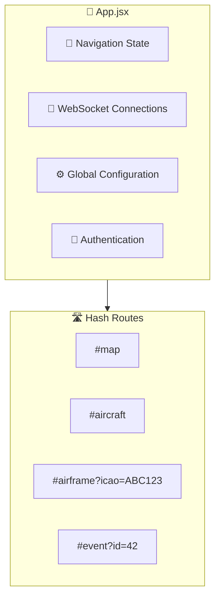
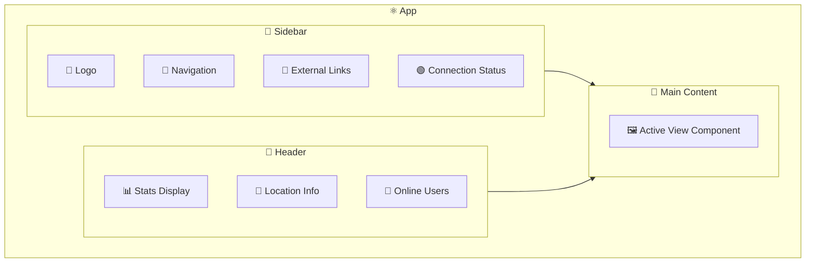
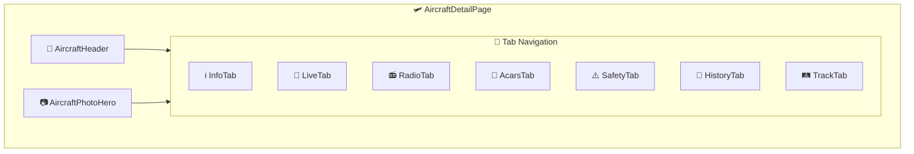
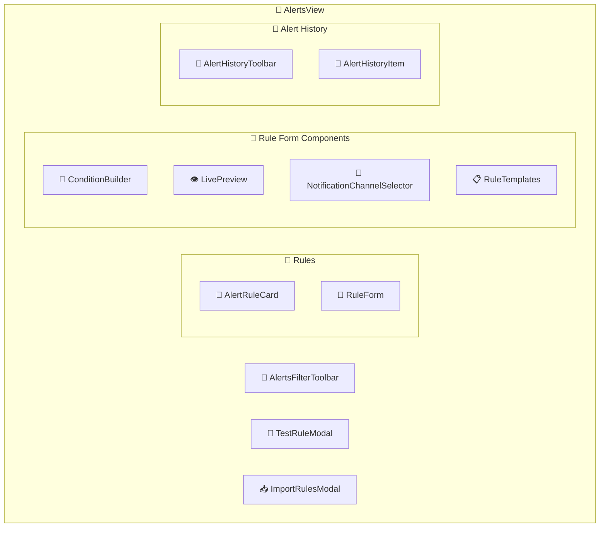
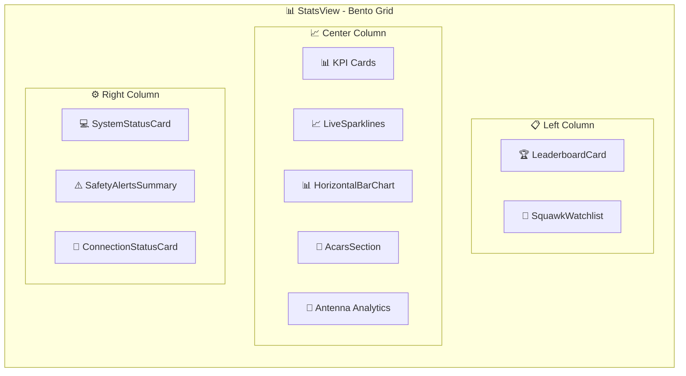
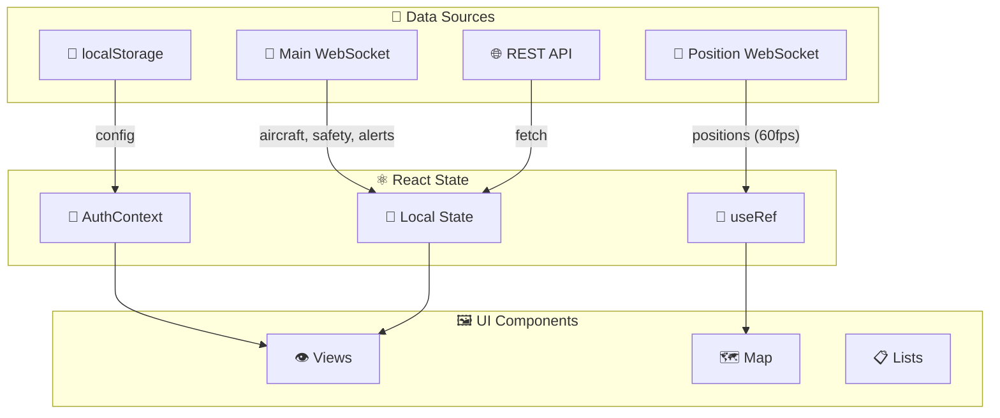
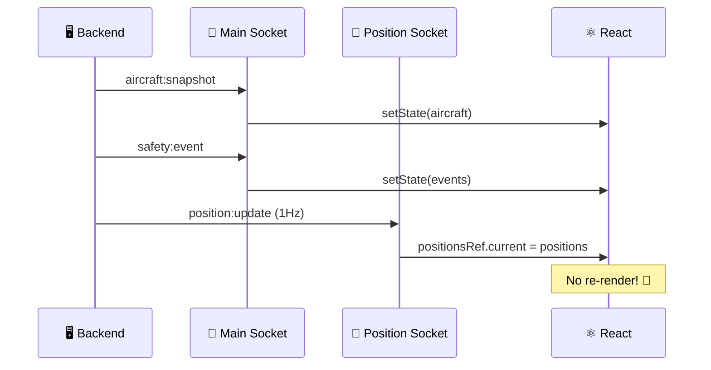
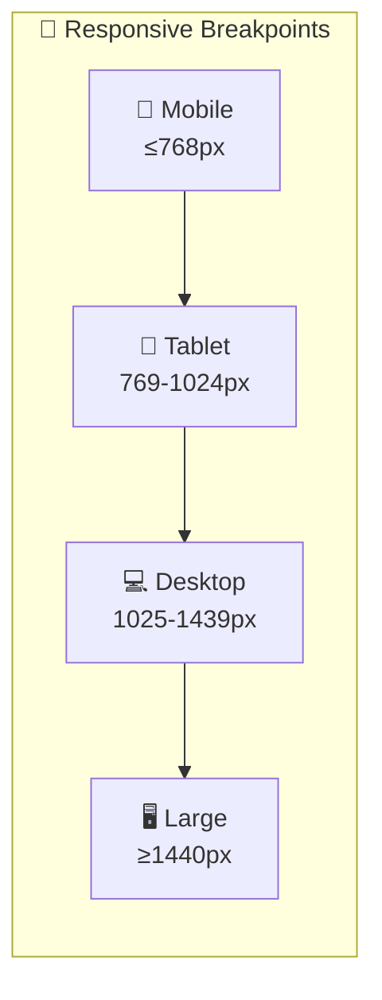
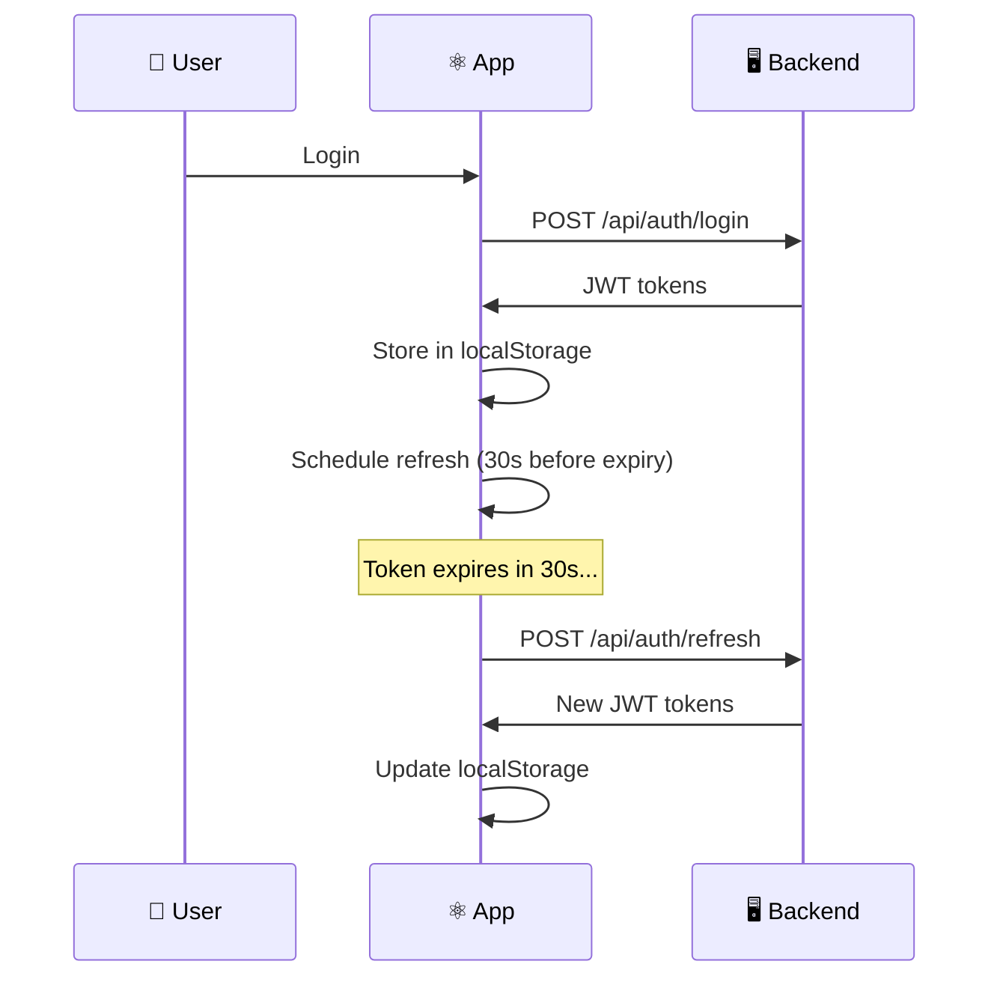

# ⚛️ SkySpy Frontend Architecture

> **Premium React application for real-time aircraft tracking and monitoring**


---

## 🎯 Overview

The SkySpy frontend is a **modern React application** built with Vite, delivering a real-time aircraft tracking and monitoring dashboard. Features include a modular component architecture, WebSocket-based real-time data streaming, and responsive design for desktop and mobile.

> 📸 **Screenshot Placeholder**
> 
> *The main dashboard showing live aircraft tracking with real-time updates*

---

## 🛠️ Technology Stack

| Technology | Purpose | Badge |
|:----------:|:--------|:-----:|
| ⚛️ **React 18+** | UI framework with hooks-based architecture |  |
| ⚡ **Vite** | Lightning-fast build tool and dev server |  |
| 🗺️ **Leaflet** | Interactive map rendering |  |
| 🔌 **WebSocket** | Real-time data via Django Channels |  |
| 🎨 **CSS3** | Custom styling with CSS variables |  |
| 🔷 **Lucide** | Icon library |  |

---

## 📁 Directory Structure

```
web/src/
├── 📄 App.jsx                    # 🚀 Main application entry point
│
├── 📂 components/                # React components by feature
│   ├── 🛩️ aircraft/             # Aircraft detail components
│   ├── 📋 aircraft-list/        # Aircraft list view
│   ├── 🔔 alerts/               # Alert rule management
│   ├── 📦 archive/              # Historical data archive
│   ├── 🎵 audio/                # Radio transmission playback
│   ├── 🔐 auth/                 # Authentication components
│   ├── 🎯 cannonball/           # Mobile proximity mode
│   ├── 🧩 common/               # Shared components
│   ├── 🏆 gamification/         # Achievement system
│   ├── 📜 history/              # Historical views
│   ├── 📐 layout/               # Layout (Sidebar, Header)
│   ├── 🗺️ map/                  # Map view and overlays
│   ├── 📋 notams/               # NOTAM display
│   ├── ⚠️ safety/               # Safety event components
│   └── 👁️ views/                # Main view containers
│
├── 📂 contexts/                  # React context providers
│   └── 🔑 AuthContext.jsx       # Auth state management
│
├── 📂 hooks/                     # Custom React hooks
│   ├── 📡 channels/             # WebSocket handlers
│   └── ℹ️ aircraftInfo/         # Data fetching utilities
│
├── 📂 styles/                    # CSS stylesheets
└── 📂 utils/                     # Utility functions
```

---

## 🏗️ Application Architecture

### Main Application Flow

The application uses **hash-based routing** for view navigation. `App.jsx` serves as the central orchestrator:



> 💡 **Tip**
> Hash routing enables deep linking and browser history support without server-side routing configuration.

### 🗺️ Valid Navigation Tabs

| Tab | Icon | Description |
|:----|:----:|:------------|
| `map` | 🗺️ | Live aircraft map *(default)* |
| `aircraft` | ✈️ | Sortable aircraft list |
| `stats` | 📊 | Statistics dashboard |
| `history` | 📜 | Historical data (sessions, sightings, ACARS, safety) |
| `audio` | 🎵 | Radio transmission archive |
| `notams` | 📋 | NOTAMs display |
| `archive` | 📦 | Data archive browser |
| `alerts` | 🔔 | Alert rule management |
| `system` | ⚙️ | System status and configuration |
| `airframe` | 🛩️ | Aircraft detail page |
| `event` | ⚠️ | Safety event detail page |

---

## 🧩 Component Hierarchy

### 🏠 Layout Architecture



### 🗺️ Map View Components

> 📸 **Screenshot Placeholder**
> 
> *Interactive map with aircraft tracking, safety events, and ACARS panel*

```mermaid
graph TB
    subgraph MapView["🗺️ MapView.jsx"]
        Leaflet["🌍 Leaflet Map"]

        subgraph Panels["📊 Panels"]
            ListPanel["📋 AircraftListPanel"]
            SafetyPanel["⚠️ SafetyEventsPanel"]
            AcarsPanel["📡 AcarsPanel"]
        end

        subgraph Controls["🎛️ Controls"]
            MapCtrl["🔧 MapControls"]
            Filter["🔍 FilterMenu"]
            Overlay["📂 OverlayMenu"]
            Legend["📖 LegendPanel"]
        end

        subgraph Overlays["🎨 Overlays"]
            Popup["💬 AircraftPopup"]
            Banner["🚨 ConflictBanner"]
        end
    end
```



#### 🎨 Map Display Modes

| Mode | Description | Preview |
|:-----|:------------|:-------:|
| `radar` | Traditional radar display with sweep animation | 🟢 |
| `crt` | Retro CRT-style phosphor display | 🟡 |
| `pro` | Professional ATC-style with customizable themes | 🔵 |
| `map` | Standard map with satellite/terrain options | 🟠 |

**Pro Mode Theme Colors:**
- 🔵 **Classic Cyan** — Default professional look
- 🟡 **Amber/Gold** — Traditional ATC aesthetic
- 🟢 **Green Phosphor** — Retro terminal style
- ⚪ **High Contrast** — Accessibility optimized

---

### 🛩️ Aircraft Detail Components



> ⚡ **Performance**
> All tabs are **lazy-loaded** using `React.lazy()` for optimal initial load performance.

---

### 🔔 Alerts System Components



#### 🎯 Alert Condition Types

> ℹ️ **Supported Alert Conditions**
> Create complex rules using AND/OR logic with these condition types:

| Category | Conditions |
|:---------|:-----------|
| **🔢 Identifiers** | ICAO hex, Callsign pattern, Squawk code, Aircraft type |
| **📏 Telemetry** | Altitude thresholds, Speed thresholds, Distance proximity |
| **🏷️ Classification** | Military aircraft, Emergency status, Law enforcement, Helicopter |
| **📱 Mobile** | Proximity detection (Cannonball mode) |

---

### 📊 Stats Dashboard Layout

> 📸 **Screenshot Placeholder**
> 
> *Bento grid layout with live data, charts, and system status*



---

### 🎯 Cannonball Mode (Mobile)

> 📸 **Screenshot Placeholder**
> 
> *Fullscreen mobile proximity detection with HUD overlay*

A **fullscreen mobile-optimized mode** for proximity-based aircraft detection:

| Component | Purpose | Icon |
|:----------|:--------|:----:|
| `CannonballMode.jsx` | Main container | 🎯 |
| `HeadsUpDisplay.jsx` | HUD-style overlay | 🎮 |
| `RadarView.jsx` | Radar-style display | 📡 |
| `ThreatDisplay.jsx` | Proximity threat cards | ⚠️ |
| `ThreatList.jsx` | Sorted threat list | 📋 |
| `StatusBar.jsx` | GPS and connection status | 📍 |
| `EdgeIndicators.jsx` | Off-screen aircraft indicators | ↗️ |

---

## 🔄 State Management

### State Flow Diagram



### 🔑 AuthContext API

```javascript
const {
  // 📊 State
  status,           // 'loading' | 'anonymous' | 'authenticated'
  user,             // User object with permissions
  config,           // Auth configuration
  error,            // Last auth error
  isAuthenticated,  // Boolean shorthand

  // 🔧 Methods
  login,            // Username/password login
  logout,           // Clear session
  loginWithOIDC,    // OAuth/OIDC popup flow
  authFetch,        // Authenticated fetch wrapper
  hasPermission,    // Check single permission
  hasAnyPermission, // Check any of the permissions
  hasAllPermissions,// Check all permissions
  canAccessFeature, // Feature-based access check
  getAccessToken,   // Get JWT for WebSocket
} = useAuth();
```

### 🔌 WebSocket State



### 💾 localStorage Keys

| Key | Purpose | Icon |
|:----|:--------|:----:|
| `adsb-dashboard-config` | Map mode, dark mode, notifications | ⚙️ |
| `adsb-dashboard-overlays` | Map overlay visibility | 🗺️ |
| `adsb-layer-opacities` | Overlay opacity settings | 🎨 |
| `adsb-show-aircraft-list` | List panel visibility | 📋 |
| `adsb-show-short-tracks` | Track trail display | 🛤️ |
| `adsb-sound-muted` | Sound preferences | 🔇 |
| `skyspy-auth-tokens` | JWT access/refresh tokens | 🔑 |
| `skyspy-user` | Cached user profile | 👤 |

---

## 🪝 Custom Hooks Reference

### 📡 Data Hooks

| Hook | Purpose | Example |
|:-----|:--------|:--------|
| `useApi` | HTTP API calls with loading/error states | `const { data, loading, error } = useApi('/api/stats')` |
| `useSocketApi` | HTTP with WebSocket fallback | `useSocketApi('/api/aircraft', wsData)` |
| `useAircraftInfo` | Aircraft registry lookups with caching | `const info = useAircraftInfo(icao)` |
| `useAviationData` | Aviation reference data (airports, VORs) | `const { airports } = useAviationData()` |
| `useAlertRules` | Alert rule CRUD operations | `const { rules, createRule } = useAlertRules()` |
| `useStatsData` | Statistics data aggregation | `const stats = useStatsData(timeRange)` |

### 🔌 WebSocket Hooks

```javascript
// 📡 Main channels socket
const { aircraft, safetyEvents, acarsMessages } = useChannelsSocket();

// 📍 High-frequency position updates (ref-based)
const positionsRef = usePositionChannels();

// 🎵 Audio streaming
const { transmissions, isConnected } = useAudioSocket();
```

### 🗺️ Map Hooks

| Hook | Purpose | Returns |
|:-----|:--------|:--------|
| `useTrackHistory` | Aircraft track trail management | `{ tracks, addTrack, clearTracks }` |
| `useMapAlarms` | Proximity and alert sound triggers | `{ playAlarm, stopAlarm }` |
| `useSafetyEvents` | Safety event state management | `{ events, activeEvent }` |
| `useGestures` | Touch gesture handling | `{ onPinch, onPan }` |
| `useDraggable` | Drag interaction for panels | `{ position, handlers }` |

### 🎯 Cannonball Mode Hooks

```javascript
// 📍 GPS tracking
const { position, accuracy, error } = useDeviceGPS();

// ⚠️ Threat calculation
const threats = useThreatCalculation(aircraft, position);

// 🔊 Voice alerts
const { speak, isSpeaking } = useVoiceAlerts();

// 📳 Haptic feedback
const { vibrate } = useHapticFeedback();

// 🔒 Screen wake lock
const { requestWakeLock, releaseWakeLock } = useWakeLock();
```

---

## 🔧 Utility Functions

### ✈️ Aircraft Utilities

```javascript
import {
  icaoToNNumber,
  getCountryFromIcao,
  getTailNumber,
  getCategoryName,
  callsignsMatch,
  getPirepType
} from '@/utils/aircraft';

// 🔢 ICAO to N-number conversion
icaoToNNumber('A1B2C3');      // → "N12345"

// 🌍 Country identification
getCountryFromIcao('A1B2C3'); // → { country: 'USA', flag: '🇺🇸' }

// 📋 Category names
getCategoryName('A1');        // → "Light"

// 🔀 Callsign matching (IATA/ICAO)
callsignsMatch('AAL123', 'AA123'); // → true
```

### 🔔 Alert Evaluation

```javascript
import {
  evaluateCondition,
  evaluateConditionGroup,
  evaluateRule,
  findMatchingAircraft,
  getMatchReasons
} from '@/utils/alertEvaluator';

// ✅ Single condition evaluation
evaluateCondition(condition, aircraft, distanceNm);

// 🔀 Group evaluation with AND/OR logic
evaluateConditionGroup(group, aircraft, distanceNm);

// 📋 Find all matching aircraft
const matches = findMatchingAircraft(rule, aircraftList, feederLocation);

// 💬 Human-readable match reasons
const reasons = getMatchReasons(rule, aircraft, distanceNm);
// → ["Squawk 7700 (Emergency)", "Altitude below 1000ft"]
```

---

## 🎨 Styling Architecture

### 📁 CSS File Organization

```
styles/
├── 📄 index.css              # 🚀 Main entry, imports all
├── 📄 base.css               # 🎨 Variables, reset, typography
├── 📄 layout.css             # 📐 Layout grid and containers
├── 📄 components.css         # 🧩 Shared component styles
├── 📄 map.css                # 🗺️ Map-specific styles
├── 📄 pro-mode.css           # 📡 Pro radar mode
├── 📄 views.css              # 👁️ View-specific styles
├── 📄 aircraft-detail.css    # 🛩️ Aircraft detail page
├── 📄 stats-extended.css     # 📊 Statistics dashboard
├── 📄 cannonball.css         # 🎯 Cannonball mode
├── 📄 acars.css              # 📨 ACARS messages
├── 📄 auth.css               # 🔐 Authentication forms
├── 📄 toast.css              # 🔔 Toast notifications
├── 📄 visualizations.css     # 📈 Charts and graphs
└── 📄 responsive.css         # 📱 Mobile breakpoints
```

### 🎨 CSS Variables Reference

```css
:root {
  /* 🎨 Colors */
  --bg-primary: #0a0d12;      /* Main background */
  --bg-secondary: #141922;    /* Card background */
  --text-primary: #e5e5e5;    /* Main text */
  --text-secondary: #9ca3af;  /* Muted text */

  /* 🌈 Accent Colors */
  --accent-cyan: #00c8ff;     /* Primary accent */
  --accent-green: #10b981;    /* Success states */
  --accent-red: #ef4444;      /* Error/danger */
  --accent-yellow: #f59e0b;   /* Warning states */

  /* 📏 Spacing Scale */
  --spacing-xs: 0.25rem;      /* 4px */
  --spacing-sm: 0.5rem;       /* 8px */
  --spacing-md: 1rem;         /* 16px */
  --spacing-lg: 1.5rem;       /* 24px */
  --spacing-xl: 2rem;         /* 32px */

  /* 🔤 Typography */
  --font-mono: 'JetBrains Mono', monospace;
  --font-sans: -apple-system, BlinkMacSystemFont, 'Segoe UI', sans-serif;

  /* ⚡ Transitions */
  --transition-fast: 150ms ease;
  --transition-normal: 250ms ease;
}
```

#### 🎨 Color Palette Visual

| Variable | Color | Usage |
|:---------|:-----:|:------|
| `--bg-primary` |  `#0a0d12` | Main background |
| `--bg-secondary` |  `#141922` | Card background |
| `--accent-cyan` |  `#00c8ff` | Primary accent |
| `--accent-green` |  `#10b981` | Success states |
| `--accent-red` |  `#ef4444` | Error/danger |
| `--accent-yellow` |  `#f59e0b` | Warnings |

### 📱 Responsive Breakpoints



---

## 🏗️ Build and Development

### ⚡ Vite Configuration

```javascript
// vite.config.js
export default defineConfig({
  plugins: [react()],
  base: '/static/',           // 🗂️ Django static path
  build: {
    outDir: 'dist',
    sourcemap: false,
    minify: 'terser',
  },
  server: {
    host: '0.0.0.0',
    port: 3000,
    proxy: {
      '/api': {
        target: process.env.VITE_API_TARGET || 'http://localhost:8000',
        changeOrigin: true,
      },
      '/ws': {
        target: apiTarget.replace('http', 'ws'),
        ws: true,
        changeOrigin: true,
      },
    },
  },
});
```

### 🛠️ Development Commands

```bash
# 📦 Install dependencies
npm install

# 🚀 Start development server
npm run dev

# 🏗️ Build for production
npm run build

# 👁️ Preview production build
npm run preview

# 🔍 Lint code
npm run lint
```

### 🌍 Environment Variables

| Variable | Purpose | Default |
|:---------|:--------|:--------|
| `VITE_API_TARGET` | Backend API URL for dev proxy | `http://localhost:8000` |

> 📝 **Note**
> In production, the frontend is served by Django using relative URLs. `VITE_API_TARGET` is only used for the Vite dev server proxy.

---

## ⚡ Performance Optimization

> ✅ **Performance Tips**
> SkySpy is optimized for real-time data at 60fps. Here's how:

### 🚀 Virtual Scrolling

Large lists use the `VirtualList` component to render **only visible items**, enabling smooth scrolling with thousands of aircraft.

### 🧠 Memoization

```javascript
// ✅ Expensive computations memoized
const filteredAircraft = useMemo(() => {
  return aircraft
    .filter(a => matchesFilters(a, filters))
    .sort((a, b) => sortComparator(a, b, sortField));
}, [aircraft, filters, sortField]);
```

### 🔗 Ref-Based State for High-Frequency Data

```javascript
// 🚀 Positions in ref = no React re-renders!
const positionsRef = useRef({});

// Animation loop reads directly from ref
requestAnimationFrame(() => {
  const positions = positionsRef.current;
  // Update map markers at 60fps
  // Zero React overhead! ⚡
});
```

### ⏱️ Debounced Updates

Search and filter inputs are **debounced** to prevent excessive re-renders during typing.

### 📦 Lazy Loading

```javascript
// 📦 Components loaded on-demand
const InfoTab = lazy(() => import('./tabs/InfoTab'));
const LiveTab = lazy(() => import('./tabs/LiveTab'));
const RadioTab = lazy(() => import('./tabs/RadioTab'));
const AcarsTab = lazy(() => import('./tabs/AcarsTab'));
const SafetyTab = lazy(() => import('./tabs/SafetyTab'));
const HistoryTab = lazy(() => import('./tabs/HistoryTab'));
const TrackTab = lazy(() => import('./tabs/TrackTab'));
```

### 🛡️ Error Boundaries

```jsx
// 🛡️ Prevents cascading failures
<ErrorBoundary
  onRetry={retry}
  fallback={<ErrorFallback />}
>
  {renderTabContent()}
</ErrorBoundary>
```

---

## 🔐 Authentication Integration

### 🔑 Token Management



### 🔒 Permission-Based UI

```jsx
const { canAccessFeature } = useAuth();

// 🔐 Conditional rendering based on permissions
if (canAccessFeature('alerts', 'write')) {
  return <AlertRuleForm />;
}

// 🛡️ Protected route wrapper
<ProtectedRoute permission="audio:read">
  <AudioView />
</ProtectedRoute>
```

---

## 🌐 Browser Compatibility

### Desktop Browsers

| Browser | Version | Status |
|:--------|:--------|:------:|
|  | 90+ | ✅ Supported |
|  | 88+ | ✅ Supported |
|  | 14+ | ✅ Supported |
|  | 90+ | ✅ Supported |

### Mobile Browsers

| Browser | Version | Status |
|:--------|:--------|:------:|
|  | 14+ | ✅ Supported |
|  | 90+ | ✅ Supported |

---

## 📚 Related Documentation

| Document | Description |
|:---------|:------------|
| 📡 [Backend API Documentation](./07-api.md) | REST API reference |
| 🔌 [WebSocket Protocol](./06-websocket.md) | Real-time messaging protocol |
| 🚀 [Deployment Guide](./03-deployment.md) | Production deployment |
| ⚙️ [Configuration Reference](./02-configuration.md) | Environment configuration |

---

<div align="center">

**Built with ⚛️ React + ⚡ Vite + 🗺️ Leaflet**

*Real-time aircraft tracking at 60fps*

</div>
