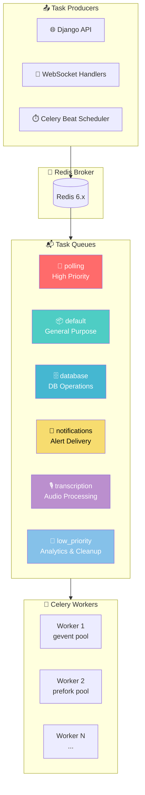
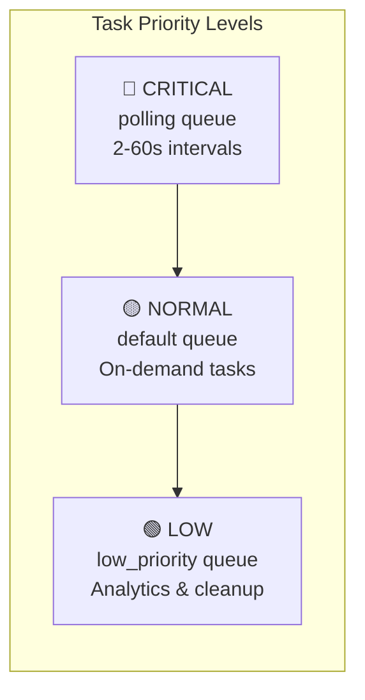
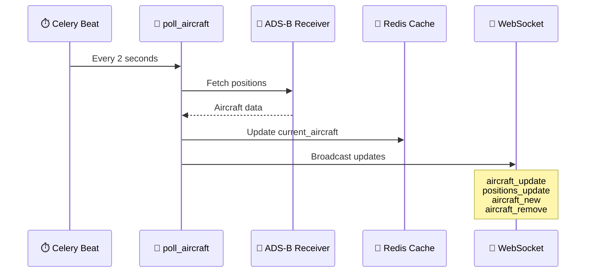
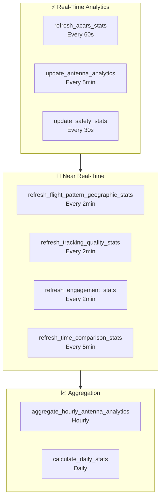
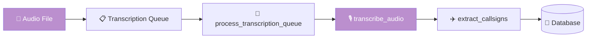
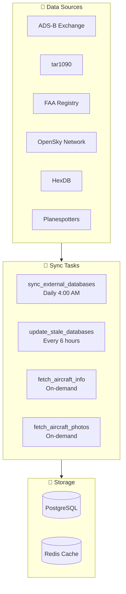
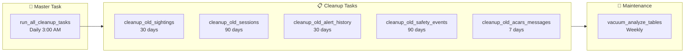
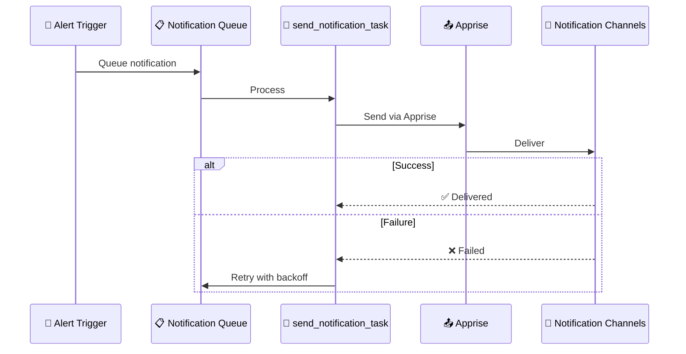
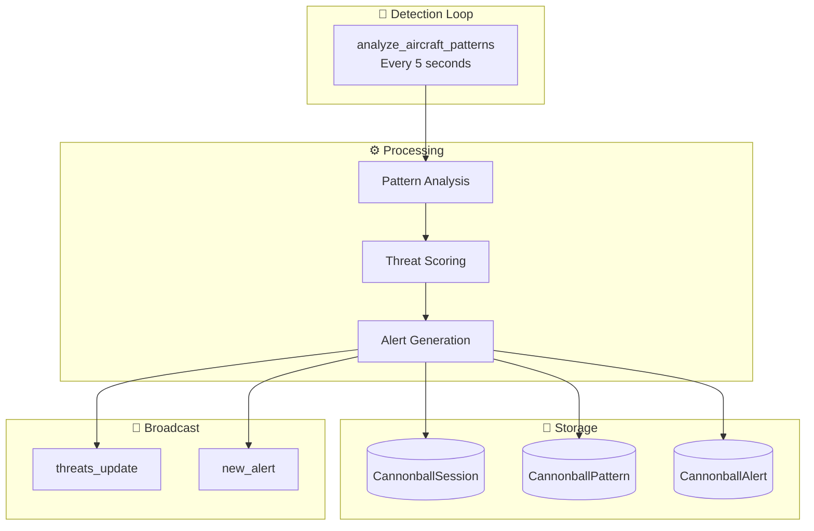

# ⏰ Background Tasks

> 🚀 **Powering Real-Time Aviation Intelligence**
>
> SkysPy uses [Celery](https://docs.celeryq.dev/) for distributed background task processing, enabling real-time aircraft tracking, analytics computation, external data synchronization, and notification delivery without blocking the main application.

---

## 🏗️ Architecture Overview



---

## 🎯 Quick Reference

> 📊 **At a Glance**
>
> | Metric | Value |
> |--------|-------|
> | Total Tasks | 45+ |
> | Queue Count | 6 |
> | Fastest Interval | 2 seconds |
> | Slowest Interval | Weekly |

<details>
<summary>📋 <strong>Task Categories Overview</strong></summary>

| Category | Tasks | Primary Queue | Frequency Range |
|----------|-------|---------------|-----------------|
| ✈️ Aircraft Tracking | 5 | `polling` | 2s - 5min |
| 📊 Analytics | 12 | `polling` / `low_priority` | 30s - Daily |
| 🎙️ Transcription | 4 | `transcription` | 10s - On-demand |
| 🌍 Geographic Data | 8 | `database` | 10min - Daily |
| 🔔 Notifications | 5 | `notifications` | 30s - Daily |
| 🧹 Cleanup | 8 | `low_priority` | Daily - Weekly |
| 🎯 Cannonball Mode | 5 | `polling` / `database` | 5s - Daily |
| 📡 External Sync | 6 | `database` | On-demand - Daily |

</details>

---

## 📬 Queue System



### 🚨 Queue Configuration

| Queue | Priority | Purpose | Concurrency | Tasks |
|:------|:--------:|:--------|:-----------:|:------|
| `polling` | 🔴 Critical | Time-sensitive, high-frequency | 50+ | Aircraft polling, stats, cannonball |
| `default` | 🟡 Normal | General-purpose operations | 10-20 | Cache cleanup, info lookups |
| `database` | 🟠 Medium | Database-intensive operations | 5-10 | External DB sync, geodata |
| `notifications` | 🟡 Normal | Notification delivery | 10-20 | Send notifications, queue processing |
| `transcription` | 🔵 Background | Long-running audio processing | 2-4 | Whisper transcription |
| `low_priority` | 🟢 Low | Expensive, non-urgent | 2-4 | Daily stats, vacuum, aggregation |

> ⚡ **Performance Tip**
>
> For high-load deployments, run dedicated workers per queue to isolate time-critical tasks from long-running operations.

---

## ✈️ Aircraft Tasks

> 📍 **Location:** `skyspy/tasks/aircraft.py`

<details open>
<summary>🔄 <strong>poll_aircraft</strong> - Core Tracking Loop</summary>

Polls aircraft positions from the ADS-B receiver and broadcasts real-time updates to connected clients.



| Property | Value |
|:---------|:------|
| ⏱️ **Schedule** | Every 2 seconds |
| 📬 **Queue** | `polling` |
| 🔄 **Max Retries** | 0 |
| ⏳ **Expires** | 2 seconds |
| 📤 **Events** | `aircraft_update`, `positions_update`, `aircraft_new`, `aircraft_remove` |

</details>

<details>
<summary>📊 <strong>update_stats_cache</strong> - Statistics Refresh</summary>

Updates cached statistics for quick API retrieval.

| Property | Value |
|:---------|:------|
| ⏱️ **Schedule** | Every 60 seconds |
| 📬 **Queue** | `polling` |
| 💾 **Cache Key** | `aircraft_stats` |

</details>

<details>
<summary>🛡️ <strong>update_safety_stats</strong> - Safety Metrics</summary>

Updates cached safety event statistics for real-time safety monitoring.

| Property | Value |
|:---------|:------|
| ⏱️ **Schedule** | Every 30 seconds |
| 📬 **Queue** | `polling` |
| 💾 **Cache Key** | `safety_stats` |

</details>

<details>
<summary>🗄️ <strong>cleanup_sessions</strong> - Session Management</summary>

Identifies and marks stale aircraft tracking sessions.

| Property | Value |
|:---------|:------|
| ⏱️ **Schedule** | Every 5 minutes |
| 📬 **Queue** | `database` |

</details>

<details>
<summary>💾 <strong>store_aircraft_sightings</strong> - Batch Storage</summary>

Batch stores aircraft sightings to the database for historical tracking.

| Property | Value |
|:---------|:------|
| ⏱️ **Schedule** | On-demand |
| 📬 **Queue** | `default` |

**Parameters:**
| Name | Type | Description |
|:-----|:-----|:------------|
| `aircraft_data` | `list` | List of aircraft position dictionaries |

</details>

---

## 📊 Analytics Tasks

> 📍 **Location:** `skyspy/tasks/analytics.py`



<details open>
<summary>📡 <strong>update_antenna_analytics</strong> - Antenna Performance</summary>

Calculates antenna performance metrics including range, RSSI, and coverage analysis.

| Property | Value |
|:---------|:------|
| ⏱️ **Schedule** | Every 5 minutes |
| 📬 **Queue** | `polling` |

**Returns:**
```json
{
    "max_range_by_direction": {"0": 125.3, "30": 98.7},
    "overall_max_range": 125.3,
    "avg_range": 45.2,
    "total_positions": 15234,
    "unique_aircraft": 127,
    "avg_rssi": -12.5,
    "coverage_percentage": 91.7,
    "range_percentiles": {"p50": 35.2, "p75": 52.1, "p90": 78.4, "p95": 95.2}
}
```

</details>

<details>
<summary>📅 <strong>calculate_daily_stats</strong> - Daily Aggregates</summary>

Generates daily statistics for historical analysis and trending.

| Property | Value |
|:---------|:------|
| ⏱️ **Schedule** | Daily at 1:00 AM UTC |
| 📬 **Queue** | `low_priority` |

**Returns:**
```json
{
    "date": "2024-01-14",
    "total_sightings": 125000,
    "unique_aircraft": 1523,
    "total_sessions": 892,
    "military_sessions": 45,
    "avg_distance": 32.5,
    "max_distance": 156.2
}
```

</details>

<details>
<summary>🕐 <strong>aggregate_hourly_antenna_analytics</strong></summary>

Creates hourly aggregate snapshots from 5-minute snapshots for trend analysis.

| Property | Value |
|:---------|:------|
| ⏱️ **Schedule** | 5 minutes past each hour |
| 📬 **Queue** | `low_priority` |

</details>

<details>
<summary>🧹 <strong>cleanup_antenna_analytics_snapshots</strong></summary>

Removes old antenna analytics snapshots based on retention policy.

| Property | Value |
|:---------|:------|
| ⏱️ **Schedule** | Daily at 4:30 AM UTC |
| 📬 **Queue** | `low_priority` |
| 🗑️ **Default Retention** | 7 days |

</details>

<details>
<summary>📻 <strong>refresh_acars_stats</strong> - ACARS Metrics</summary>

Refreshes ACARS/VDL2 message statistics cache.

| Property | Value |
|:---------|:------|
| ⏱️ **Schedule** | Every 60 seconds |
| 📬 **Queue** | `polling` |

</details>

<details>
<summary>📈 <strong>refresh_time_comparison_stats</strong></summary>

Calculates week-over-week, seasonal, and time-of-day comparisons.

| Property | Value |
|:---------|:------|
| ⏱️ **Schedule** | Every 5 minutes |
| 📬 **Queue** | `low_priority` |

</details>

<details>
<summary>🗺️ <strong>refresh_flight_pattern_geographic_stats</strong></summary>

Refreshes flight pattern and geographic statistics.

| Property | Value |
|:---------|:------|
| ⏱️ **Schedule** | Every 2 minutes |
| 📬 **Queue** | `low_priority` |

</details>

<details>
<summary>📶 <strong>refresh_tracking_quality_stats</strong></summary>

Calculates tracking quality metrics and grade distribution.

| Property | Value |
|:---------|:------|
| ⏱️ **Schedule** | Every 2 minutes |
| 📬 **Queue** | `low_priority` |

</details>

<details>
<summary>💫 <strong>refresh_engagement_stats</strong></summary>

Computes user engagement and favorite tracking statistics.

| Property | Value |
|:---------|:------|
| ⏱️ **Schedule** | Every 2 minutes |
| 📬 **Queue** | `low_priority` |

</details>

<details>
<summary>⭐ <strong>update_favorite_tracking</strong></summary>

Updates tracking statistics for favorited aircraft.

| Property | Value |
|:---------|:------|
| ⏱️ **Schedule** | Every 5 minutes |
| 📬 **Queue** | `database` |

</details>

<details>
<summary>🧠 <strong>cleanup_memory_cache</strong></summary>

Cleans expired entries from in-memory caches to prevent memory growth.

| Property | Value |
|:---------|:------|
| ⏱️ **Schedule** | Every 5 minutes |
| 📬 **Queue** | `default` |

</details>

---

## 🎙️ Transcription Tasks

> 📍 **Location:** `skyspy/tasks/transcription.py`



<details open>
<summary>🔄 <strong>process_transcription_queue</strong> - Queue Processor</summary>

Processes queued audio files for transcription.

| Property | Value |
|:---------|:------|
| ⏱️ **Schedule** | Every 10 seconds |
| 📬 **Queue** | `transcription` |
| ⏳ **Expires** | 10 seconds |

</details>

<details>
<summary>🎙️ <strong>transcribe_audio</strong> - Whisper Transcription</summary>

Transcribes a single audio file using Whisper or ATC-Whisper.

| Property | Value |
|:---------|:------|
| ⏱️ **Schedule** | On-demand |
| 📬 **Queue** | `transcription` |
| 🔄 **Max Retries** | 3 |
| ⏳ **Retry Delay** | 60 seconds |

**Parameters:**
| Name | Type | Description |
|:-----|:-----|:------------|
| `transmission_id` | `int` | AudioTransmission database ID |

</details>

<details>
<summary>✈️ <strong>extract_callsigns</strong> - Callsign Extraction</summary>

Extracts aircraft callsigns from transcripts using pattern matching.

| Property | Value |
|:---------|:------|
| ⏱️ **Schedule** | On-demand |
| 📬 **Queue** | `transcription` |

</details>

<details>
<summary>🔄 <strong>reprocess_all_transcripts</strong> - Bulk Reprocessing</summary>

Re-runs callsign extraction on all completed transcripts.

| Property | Value |
|:---------|:------|
| ⏱️ **Schedule** | On-demand |
| 📬 **Queue** | `transcription` |

</details>

---

## 🌍 Geographic Data Tasks

> 📍 **Location:** `skyspy/tasks/geodata.py`

<details open>
<summary>🌐 <strong>refresh_all_geodata</strong> - Full Refresh</summary>

Refreshes all geographic data including airports, navaids, and GeoJSON boundaries.

| Property | Value |
|:---------|:------|
| ⏱️ **Schedule** | Daily at 3:30 AM UTC |
| 📬 **Queue** | `database` |
| 🔄 **Max Retries** | 3 |
| ⏳ **Retry Delay** | 300 seconds |

**Returns:**
```json
{
    "airports": 15234,
    "navaids": 8923,
    "geojson": 127
}
```

</details>

<details>
<summary>🔍 <strong>check_and_refresh_geodata</strong> - Staleness Check</summary>

Checks staleness and triggers refresh if needed.

| Property | Value |
|:---------|:------|
| ⏱️ **Schedule** | Every hour |
| 📬 **Queue** | `database` |

</details>

<details>
<summary>🛩️ <strong>refresh_pireps</strong> - Pilot Reports</summary>

Fetches PIREPs from Aviation Weather Center.

| Property | Value |
|:---------|:------|
| ⏱️ **Schedule** | Every 10 minutes |
| 📬 **Queue** | `database` |
| 🔄 **Max Retries** | 3 |

**Parameters:**
| Name | Type | Default | Description |
|:-----|:-----|:--------|:------------|
| `bbox` | `str` | `"24,-130,50,-60"` | Geographic bounding box |
| `hours` | `int` | `6` | Hours of PIREPs to fetch |

</details>

<details>
<summary>🌤️ <strong>refresh_metars</strong> - Weather Reports</summary>

Fetches METARs from Aviation Weather Center.

| Property | Value |
|:---------|:------|
| ⏱️ **Schedule** | Every 10 minutes |
| 📬 **Queue** | `database` |
| 🔄 **Max Retries** | 3 |

</details>

<details>
<summary>📋 <strong>refresh_tafs</strong> - Terminal Forecasts</summary>

Fetches TAFs from Aviation Weather Center.

| Property | Value |
|:---------|:------|
| ⏱️ **Schedule** | Every 30 minutes |
| 📬 **Queue** | `database` |
| 🔄 **Max Retries** | 3 |

</details>

<details>
<summary>🧹 <strong>cleanup_old_pireps</strong></summary>

Removes expired PIREPs from the database.

| Property | Value |
|:---------|:------|
| ⏱️ **Schedule** | Every hour |
| 📬 **Queue** | `database` |
| 🗑️ **Default Retention** | 24 hours |

</details>

---

## 🔲 Airspace Tasks

> 📍 **Location:** `skyspy/tasks/airspace.py`

<details open>
<summary>⚠️ <strong>refresh_airspace_advisories</strong> - Live Advisories</summary>

Fetches G-AIRMETs, SIGMETs, and advisories from Aviation Weather Center.

| Property | Value |
|:---------|:------|
| ⏱️ **Schedule** | Every 5 minutes |
| 📬 **Queue** | `database` |
| 📤 **Events** | `airspace_advisory` |

</details>

<details>
<summary>🗺️ <strong>refresh_airspace_boundaries</strong> - Static Boundaries</summary>

Refreshes static airspace boundaries from OpenAIP.

| Property | Value |
|:---------|:------|
| ⏱️ **Schedule** | Daily at 3:00 AM UTC |
| 📬 **Queue** | `database` |
| 🔄 **Max Retries** | 3 |

</details>

---

## 🗂️ OpenAIP Tasks

> 📍 **Location:** `skyspy/tasks/openaip.py`

<details>
<summary>🌐 <strong>refresh_openaip_data</strong> - Cache Warming</summary>

Warms the OpenAIP cache by prefetching data for major US regions.

| Property | Value |
|:---------|:------|
| ⏱️ **Schedule** | Daily at 5:15 AM UTC |
| 📬 **Queue** | `database` |
| 🔄 **Max Retries** | 3 |

</details>

<details>
<summary>📍 <strong>prefetch_openaip_airspaces</strong> - Region Prefetch</summary>

Prefetches airspaces for a specific region.

| Property | Value |
|:---------|:------|
| ⏱️ **Schedule** | On-demand |
| 📬 **Queue** | `database` |

**Parameters:**
| Name | Type | Default | Description |
|:-----|:-----|:--------|:------------|
| `lat` | `float` | Required | Center latitude |
| `lon` | `float` | Required | Center longitude |
| `radius_nm` | `float` | `200` | Search radius in nautical miles |

</details>

---

## 📜 NOTAM Tasks

> 📍 **Location:** `skyspy/tasks/notams.py`

<details open>
<summary>🔄 <strong>refresh_notams</strong> - NOTAM Sync</summary>

Refreshes all NOTAMs from FAA Aviation Weather API.

| Property | Value |
|:---------|:------|
| ⏱️ **Schedule** | Every 15 minutes |
| 📬 **Queue** | `database` |
| 🔄 **Max Retries** | 3 |
| 📤 **Events** | `notam_refresh`, `stats_update` |

</details>

<details>
<summary>🧹 <strong>cleanup_expired_notams</strong></summary>

Archives and deletes expired NOTAMs based on retention policy.

| Property | Value |
|:---------|:------|
| ⏱️ **Schedule** | Daily at 4:15 AM UTC |
| 📬 **Queue** | `database` |

**Parameters:**
| Name | Type | Default | Description |
|:-----|:-----|:--------|:------------|
| `archive_days` | `int` | `7` | Days after expiration to archive |
| `delete_days` | `int` | `90` | Days after archival to hard delete |

</details>

<details>
<summary>🚨 <strong>broadcast_new_tfr</strong> - TFR Alerts</summary>

Broadcasts a new TFR notification via WebSocket.

| Property | Value |
|:---------|:------|
| ⏱️ **Schedule** | On-demand |
| 📬 **Queue** | `database` |

</details>

---

## 🗄️ External Database Tasks

> 📍 **Location:** `skyspy/tasks/external_db.py`



<details open>
<summary>🔄 <strong>sync_external_databases</strong> - Full Sync</summary>

Syncs aircraft databases from external sources (ADS-B Exchange, tar1090, FAA, OpenSky).

| Property | Value |
|:---------|:------|
| ⏱️ **Schedule** | Daily at 4:00 AM UTC |
| 📬 **Queue** | `database` |
| 🔄 **Max Retries** | 3 |

</details>

<details>
<summary>🕐 <strong>update_stale_databases</strong> - Incremental Update</summary>

Checks and updates databases older than 24 hours.

| Property | Value |
|:---------|:------|
| ⏱️ **Schedule** | Every 6 hours |
| 📬 **Queue** | `database` |
| 🔄 **Max Retries** | 3 |

</details>

<details>
<summary>✈️ <strong>fetch_aircraft_info</strong> - Info Lookup</summary>

Fetches aircraft info from multiple sources (in-memory DB, HexDB, adsb.lol).

| Property | Value |
|:---------|:------|
| ⏱️ **Schedule** | On-demand |
| 📬 **Queue** | `default` |

</details>

<details>
<summary>📷 <strong>fetch_aircraft_photos</strong> - Photo Download</summary>

Fetches and caches aircraft photos from Planespotters or HexDB.

| Property | Value |
|:---------|:------|
| ⏱️ **Schedule** | On-demand |
| 📬 **Queue** | `default` |

</details>

<details>
<summary>🔃 <strong>refresh_stale_aircraft_info</strong></summary>

Refreshes aircraft info records older than the specified age.

| Property | Value |
|:---------|:------|
| ⏱️ **Schedule** | Daily at 5:00 AM UTC |
| 📬 **Queue** | `database` |

</details>

<details>
<summary>📸 <strong>batch_upgrade_aircraft_photos</strong></summary>

Upgrades photos to higher resolution versions.

| Property | Value |
|:---------|:------|
| ⏱️ **Schedule** | Daily at 5:30 AM UTC |
| 📬 **Queue** | `database` |

</details>

<details>
<summary>🧹 <strong>cleanup_orphan_aircraft_info</strong></summary>

Removes AircraftInfo records for aircraft not seen recently.

| Property | Value |
|:---------|:------|
| ⏱️ **Schedule** | Weekly on Sundays at 6:00 AM UTC |
| 📬 **Queue** | `database` |

</details>

---

## 🧹 Cleanup Tasks

> 📍 **Location:** `skyspy/tasks/cleanup.py`



<details open>
<summary>🎯 <strong>run_all_cleanup_tasks</strong> - Master Cleanup</summary>

Master cleanup task that orchestrates all data retention cleanups.

| Property | Value |
|:---------|:------|
| ⏱️ **Schedule** | Daily at 3:00 AM UTC |
| 📬 **Queue** | `low_priority` |

</details>

<details>
<summary>✈️ <strong>cleanup_old_sightings</strong></summary>

| Property | Value |
|:---------|:------|
| 🗑️ **Retention** | `SIGHTING_RETENTION_DAYS` (default: 30) |

</details>

<details>
<summary>📋 <strong>cleanup_old_sessions</strong></summary>

| Property | Value |
|:---------|:------|
| 🗑️ **Retention** | `SESSION_RETENTION_DAYS` (default: 90) |

</details>

<details>
<summary>🔔 <strong>cleanup_old_alert_history</strong></summary>

| Property | Value |
|:---------|:------|
| 🗑️ **Retention** | `ALERT_HISTORY_DAYS` (default: 30) |

</details>

<details>
<summary>🛡️ <strong>cleanup_old_safety_events</strong></summary>

| Property | Value |
|:---------|:------|
| 🗑️ **Retention** | `SAFETY_EVENT_RETENTION_DAYS` (default: 90) |

</details>

<details>
<summary>📻 <strong>cleanup_old_acars_messages</strong></summary>

| Property | Value |
|:---------|:------|
| 🗑️ **Retention** | 7 days (fixed) |

</details>

<details>
<summary>🔧 <strong>vacuum_analyze_tables</strong> - PostgreSQL Maintenance</summary>

Runs PostgreSQL VACUUM ANALYZE on frequently updated tables.

| Property | Value |
|:---------|:------|
| ⏱️ **Schedule** | Weekly on Sundays at 4:00 AM UTC |
| 📬 **Queue** | `low_priority` |

</details>

---

## 🔔 Notification Tasks

> 📍 **Location:** `skyspy/tasks/notifications.py`



<details open>
<summary>📤 <strong>send_notification_task</strong> - Notification Delivery</summary>

Sends a notification via Apprise with automatic retry and exponential backoff.

| Property | Value |
|:---------|:------|
| ⏱️ **Schedule** | On-demand |
| 📬 **Queue** | `notifications` |
| 🔄 **Max Retries** | 5 |
| ⏳ **Retry Backoff** | Exponential (max 1 hour) |

**Parameters:**
| Name | Type | Default | Description |
|:-----|:-----|:--------|:------------|
| `channel_url` | `str` | Required | Apprise-compatible URL |
| `title` | `str` | Required | Notification title |
| `body` | `str` | Required | Notification body |
| `priority` | `str` | `'info'` | Priority level |
| `event_type` | `str` | `'alert'` | Event type |

</details>

<details>
<summary>🔄 <strong>process_notification_queue</strong></summary>

Processes notifications pending retry.

| Property | Value |
|:---------|:------|
| ⏱️ **Schedule** | Every 30 seconds |
| 📬 **Queue** | `notifications` |

</details>

<details>
<summary>🧹 <strong>cleanup_old_notification_logs</strong></summary>

Removes old notification logs.

| Property | Value |
|:---------|:------|
| ⏱️ **Schedule** | Daily at 3:15 AM UTC |
| 📬 **Queue** | `notifications` |
| 🗑️ **Default Retention** | 30 days |

</details>

<details>
<summary>⏰ <strong>cleanup_notification_cooldowns</strong></summary>

Cleans up notification cooldown entries to prevent memory growth.

| Property | Value |
|:---------|:------|
| ⏱️ **Schedule** | Every 30 minutes |
| 📬 **Queue** | `notifications` |

</details>

<details>
<summary>🧪 <strong>test_notification_channel</strong></summary>

Sends a test notification to verify channel configuration.

| Property | Value |
|:---------|:------|
| ⏱️ **Schedule** | On-demand |
| 📬 **Queue** | `notifications` |

</details>

---

## 🎯 Cannonball Mode Tasks

> 📍 **Location:** `skyspy/tasks/cannonball.py`
>
> 🚨 **Real-time law enforcement aircraft detection and pattern analysis.**



<details open>
<summary>🔍 <strong>analyze_aircraft_patterns</strong> - Pattern Detection</summary>

Analyzes current aircraft for law enforcement patterns (orbiting, surveillance, etc.).

| Property | Value |
|:---------|:------|
| ⏱️ **Schedule** | Every 5 seconds |
| 📬 **Queue** | `polling` |
| ⏳ **Expires** | 5 seconds |
| 🔄 **Max Retries** | 0 |
| 📤 **Events** | `threats_update`, `new_alert` |

</details>

<details>
<summary>🧹 <strong>cleanup_cannonball_sessions</strong></summary>

Marks stale Cannonball sessions as inactive.

| Property | Value |
|:---------|:------|
| ⏱️ **Schedule** | Every 5 minutes |
| 📬 **Queue** | `database` |

</details>

<details>
<summary>🗑️ <strong>cleanup_old_patterns</strong></summary>

Deletes patterns older than retention period.

| Property | Value |
|:---------|:------|
| ⏱️ **Schedule** | Daily at 3:45 AM UTC |
| 📬 **Queue** | `low_priority` |
| 🗑️ **Retention** | `CANNONBALL_PATTERN_RETENTION_DAYS` (default: 30) |

</details>

<details>
<summary>📊 <strong>aggregate_cannonball_stats</strong></summary>

Creates hourly statistics aggregates for trend analysis.

| Property | Value |
|:---------|:------|
| ⏱️ **Schedule** | 10 minutes past each hour |
| 📬 **Queue** | `low_priority` |

</details>

<details>
<summary>📍 <strong>update_user_location</strong></summary>

Updates user location for threat calculations.

| Property | Value |
|:---------|:------|
| ⏱️ **Schedule** | On-demand |
| 📬 **Queue** | `default` |

</details>

---

## 📅 Complete Schedule Reference

> ⏱️ **Celery Beat Schedule**
>
> All times are in UTC. The scheduler is configured in `skyspy/celery.py`.

### ⚡ High-Frequency Tasks (< 1 minute)

| Task | Frequency | Queue | Notes |
|:-----|:---------:|:-----:|:------|
| `poll_aircraft` | 🔴 2s | `polling` | Expires after 2s |
| `analyze_aircraft_patterns` | 🔴 5s | `polling` | Cannonball mode |
| `process_transcription_queue` | 🟠 10s | `transcription` | Expires after 10s |
| `update_safety_stats` | 🟡 30s | `polling` | |
| `process_notification_queue` | 🟡 30s | `notifications` | |
| `update_stats_cache` | 🟢 60s | `polling` | |
| `refresh_acars_stats` | 🟢 60s | `polling` | |

### 🔄 Medium-Frequency Tasks (1-10 minutes)

| Task | Frequency | Queue | Notes |
|:-----|:---------:|:-----:|:------|
| `refresh_flight_pattern_geographic_stats` | 2m | `low_priority` | |
| `refresh_tracking_quality_stats` | 2m | `low_priority` | |
| `refresh_engagement_stats` | 2m | `low_priority` | |
| `cleanup_cannonball_sessions` | 5m | `database` | |
| `cleanup_memory_cache` | 5m | `default` | |
| `cleanup_sessions` | 5m | `database` | |
| `refresh_airspace_advisories` | 5m | `database` | |
| `update_antenna_analytics` | 5m | `polling` | |
| `update_favorite_tracking` | 5m | `database` | |
| `refresh_time_comparison_stats` | 5m | `low_priority` | |
| `refresh_metars` | 10m | `database` | |
| `refresh_pireps` | 10m | `database` | |
| `refresh_notams` | 15m | `database` | |
| `cleanup_notification_cooldowns` | 30m | `notifications` | |
| `refresh_tafs` | 30m | `database` | |

### 🕐 Low-Frequency Tasks (Hourly+)

| Task | Frequency | Queue | Notes |
|:-----|:---------:|:-----:|:------|
| `aggregate_hourly_antenna_analytics` | :05 past hour | `low_priority` | |
| `aggregate_cannonball_stats` | :10 past hour | `low_priority` | |
| `cleanup_pireps_hourly` | Hourly | `database` | |
| `check_geodata_freshness_hourly` | Hourly | `database` | |
| `update_stale_databases` | 6 hours | `database` | |

### 📆 Daily Tasks

| Task | Time (UTC) | Queue | Notes |
|:-----|:----------:|:-----:|:------|
| `calculate_daily_stats` | 1:00 AM | `low_priority` | |
| `run_all_cleanup_tasks` | 3:00 AM | `low_priority` | Master cleanup |
| `refresh_airspace_boundaries` | 3:00 AM | `database` | |
| `cleanup_notification_logs` | 3:15 AM | `notifications` | |
| `refresh_geodata_daily` | 3:30 AM | `database` | |
| `cleanup_cannonball_patterns` | 3:45 AM | `low_priority` | |
| `sync_external_databases` | 4:00 AM | `database` | |
| `cleanup_expired_notams` | 4:15 AM | `database` | |
| `cleanup_antenna_analytics` | 4:30 AM | `low_priority` | |
| `refresh_stale_aircraft_info` | 5:00 AM | `database` | |
| `refresh_openaip_data` | 5:15 AM | `database` | |
| `batch_upgrade_aircraft_photos` | 5:30 AM | `database` | |

### 📅 Weekly Tasks

| Task | Schedule (UTC) | Queue | Notes |
|:-----|:--------------:|:-----:|:------|
| `vacuum_analyze_tables` | Sunday 4:00 AM | `low_priority` | PostgreSQL maintenance |
| `cleanup_orphan_aircraft_info` | Sunday 6:00 AM | `database` | |

---

## 🔄 Retry Policy

```mermaid
flowchart LR
    subgraph Attempt["🎯 Task Execution"]
        A[Execute Task]
    end

    subgraph Decision{"Success?"}
        B{Check Result}
    end

    subgraph Success["✅ Success"]
        C[Complete]
    end

    subgraph Retry["🔄 Retry Logic"]
        D[Calculate Backoff]
        E[Add Jitter]
        F[Schedule Retry]
    end

    subgraph Fail["❌ Max Retries"]
        G[Mark Failed]
        H[Log to Sentry]
    end

    A --> B
    B -->|Yes| C
    B -->|No| D --> E --> F --> A
    F -->|Max Reached| G --> H
```

### ⚙️ Retry Configuration

| Parameter | Description | Default |
|:----------|:------------|:--------|
| `max_retries` | Maximum retry attempts | `3` |
| `retry_backoff` | Enable exponential backoff | `False` |
| `retry_backoff_max` | Maximum backoff delay (seconds) | `600` |
| `retry_jitter` | Add randomness to delays | `True` |
| `autoretry_for` | Exception types to auto-retry | `()` |

> 💡 **Best Practice**
>
> Use `expires` for time-sensitive tasks to prevent queue buildup when the system is under load.

```python
@shared_task(
    bind=True,
    max_retries=3,
    autoretry_for=(Exception,),
    retry_backoff=True,
    retry_backoff_max=3600,
    retry_jitter=True,
)
def example_task(self):
    try:
        # Task logic
        pass
    except Exception as e:
        raise self.retry(exc=e, countdown=60)
```

### 📊 Dead Letter Handling

Failed notifications are tracked in `NotificationLog` with status:

| Status | Description |
|:-------|:------------|
| `pending` | ⏳ Awaiting delivery |
| `retrying` | 🔄 Scheduled for retry |
| `sent` | ✅ Successfully delivered |
| `failed` | ❌ All retries exhausted |

---

## 📊 Monitoring Dashboard

### 🌸 Flower Dashboard

Deploy Flower for real-time task monitoring:

```bash
celery -A skyspy flower --port=5555
```

> 🌐 Access at `http://localhost:5555`

### 🖥️ Command-Line Monitoring

```bash
# Watch active tasks
celery -A skyspy inspect active

# View scheduled tasks
celery -A skyspy inspect scheduled

# Check worker stats
celery -A skyspy inspect stats

# View registered tasks
celery -A skyspy inspect registered
```

### 📝 Logging Configuration

```python
LOGGING = {
    'handlers': {
        'celery': {
            'level': 'INFO',
            'class': 'logging.FileHandler',
            'filename': '/var/log/skyspy/celery.log',
            'formatter': 'verbose',
        },
    },
    'loggers': {
        'celery': {
            'handlers': ['celery'],
            'level': 'INFO',
            'propagate': False,
        },
        'skyspy.tasks': {
            'handlers': ['celery'],
            'level': 'DEBUG',
            'propagate': False,
        },
    },
}
```

### 🔍 Sentry Integration

SkysPy automatically reports task errors to Sentry when configured:

```python
from skyspy.utils.sentry import capture_task_error

try:
    # Task logic
    pass
except Exception as e:
    capture_task_error(e, 'task_name', extra={'key': 'value'})
    raise
```

---

## ⚡ Performance Tuning

> 🎯 **Optimization Guide**

### 🏭 Worker Configuration

<details open>
<summary>🚀 <strong>Production Configuration (Gevent)</strong></summary>

```bash
celery -A skyspy worker \
    --pool=gevent \
    --concurrency=100 \
    --loglevel=INFO \
    -Q polling,default,database,notifications,transcription,low_priority
```

</details>

<details>
<summary>🔧 <strong>Development Configuration (Prefork)</strong></summary>

```bash
celery -A skyspy worker \
    --pool=prefork \
    --concurrency=4 \
    --loglevel=DEBUG \
    -Q polling,default,database,notifications,transcription,low_priority
```

</details>

### 🎛️ Queue-Specific Workers

> ⚡ **High-Load Tip**
>
> For high-load deployments, run dedicated workers per queue to isolate time-critical tasks.

```bash
# High-priority polling worker
celery -A skyspy worker -Q polling -c 50 --pool=gevent -n polling@%h

# Database operations worker
celery -A skyspy worker -Q database -c 10 --pool=prefork -n database@%h

# Low-priority worker
celery -A skyspy worker -Q low_priority -c 4 --pool=prefork -n lowprio@%h
```

### 🧠 Memory Optimization

```python
# Disable prefetching for time-sensitive tasks
app.conf.worker_prefetch_multiplier = 1

# Acknowledge after completion (prevents lost tasks)
app.conf.task_acks_late = True

# Re-queue tasks if worker dies
app.conf.task_reject_on_worker_lost = True
```

### 🍓 Raspberry Pi Optimization

> 📦 **Resource-Constrained Devices**
>
> SkysPy includes RPi-specific optimizations in `settings_rpi.py`.

| Setting | Standard | RPi | Reduction |
|:--------|:--------:|:---:|:---------:|
| `stats_cache` interval | 60s | 90s | 1.5x slower |
| `safety_stats` interval | 30s | 60s | 2x slower |
| `acars_stats` interval | 60s | 120s | 2x slower |
| `MAX_SEEN_AIRCRAFT` | 10000 | 1000 | 10x smaller |
| `SIGHTING_RETENTION_DAYS` | 30 | 7 | 4x shorter |
| `SESSION_RETENTION_DAYS` | 90 | 14 | 6x shorter |

### 🔴 Redis Configuration

```ini
# redis.conf - Production settings
maxmemory 512mb
maxmemory-policy allkeys-lru
appendonly yes
appendfsync everysec
```

---

## 🔧 Configuration Reference

### 📋 Django Settings

| Setting | Default | Description |
|:--------|:--------|:------------|
| `CELERY_BROKER_URL` | `redis://localhost:6379/0` | Redis broker connection URL |
| `CELERY_RESULT_BACKEND` | `redis://localhost:6379/0` | Task result storage backend |
| `CELERY_ACCEPT_CONTENT` | `['json']` | Accepted serialization formats |
| `CELERY_TASK_SERIALIZER` | `json` | Task serialization format |
| `CELERY_RESULT_SERIALIZER` | `json` | Result serialization format |
| `CELERY_TIMEZONE` | `UTC` | Scheduler timezone |
| `CELERY_TASK_TRACK_STARTED` | `True` | Track task start times |
| `CELERY_TASK_TIME_LIMIT` | `1800` | 30-minute task timeout |
| `CELERY_BEAT_SCHEDULER` | `DatabaseScheduler` | Database-backed scheduler |

### 🗓️ Retention Configuration

| Variable | Default | RPi Default | Description |
|:---------|:-------:|:-----------:|:------------|
| `SIGHTING_RETENTION_DAYS` | 30 | 7 | Days to retain sightings |
| `SESSION_RETENTION_DAYS` | 90 | 14 | Days to retain sessions |
| `ALERT_HISTORY_DAYS` | 30 | 7 | Days to retain alert history |
| `SAFETY_EVENT_RETENTION_DAYS` | 90 | 14 | Days to retain safety events |
| `ANTENNA_SNAPSHOT_RETENTION_DAYS` | 7 | 3 | Days to retain 5-min snapshots |

### 🎛️ Feature Flags

| Variable | Default | Description |
|:---------|:-------:|:------------|
| `TRANSCRIPTION_ENABLED` | `False` | Enable audio transcription |
| `WHISPER_ENABLED` | `False` | Enable Whisper transcription |
| `ATC_WHISPER_ENABLED` | `False` | Enable ATC-Whisper |
| `PHOTO_AUTO_DOWNLOAD` | `False` | Auto-download aircraft photos |
| `OPENSKY_DB_ENABLED` | `True` | Enable OpenSky database |

---

## 🐳 Docker Deployment

### 📦 Docker Compose Configuration

```yaml
services:
  redis:
    image: redis:7-alpine
    command: redis-server --appendonly yes
    volumes:
      - redis_data:/data
    ports:
      - "6379:6379"
    healthcheck:
      test: ["CMD", "redis-cli", "ping"]
      interval: 10s
      timeout: 5s
      retries: 5

  celery-worker:
    build: ./skyspy_django
    command: celery -A skyspy worker -l INFO -Q polling,default,database,notifications,transcription,low_priority
    environment:
      - CELERY_BROKER_URL=redis://redis:6379/0
    depends_on:
      redis:
        condition: service_healthy

  celery-beat:
    build: ./skyspy_django
    command: celery -A skyspy beat -l INFO
    environment:
      - CELERY_BROKER_URL=redis://redis:6379/0
    depends_on:
      redis:
        condition: service_healthy
```

---

## 🔥 Troubleshooting

<details>
<summary>❓ <strong>Tasks not running</strong></summary>

```bash
# Check worker is connected
celery -A skyspy inspect ping

# Verify beat is running
celery -A skyspy inspect scheduled
```

</details>

<details>
<summary>❓ <strong>Tasks stuck in queue</strong></summary>

```bash
# Check queue length
redis-cli LLEN celery

# Purge all tasks (use cautiously!)
celery -A skyspy purge
```

</details>

<details>
<summary>❓ <strong>Memory growth</strong></summary>

```bash
# Restart workers periodically
celery -A skyspy control shutdown
```

</details>

<details>
<summary>❓ <strong>Redis connection issues</strong></summary>

```bash
# Test Redis connectivity
redis-cli ping

# Check Redis memory
redis-cli info memory
```

</details>

### 🏥 Health Checks

SkysPy exposes a Celery health check via the `celery_heartbeat` cache key:

```python
from django.core.cache import cache

def celery_health_check():
    return cache.get('celery_heartbeat', False)
```

> 💡 This is updated every 60 seconds by `update_stats_cache`.

---

## 📚 Additional Resources

- [Celery Documentation](https://docs.celeryq.dev/)
- [Django Celery Beat](https://django-celery-beat.readthedocs.io/)
- [Redis Documentation](https://redis.io/docs/)
- [Flower Monitoring](https://flower.readthedocs.io/)
