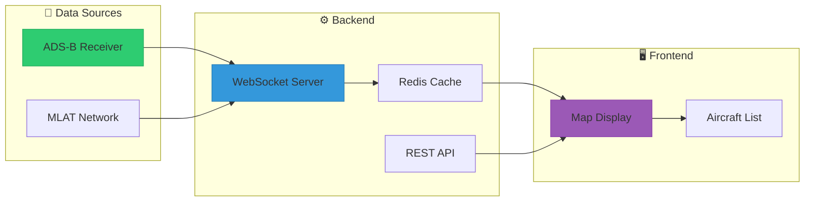
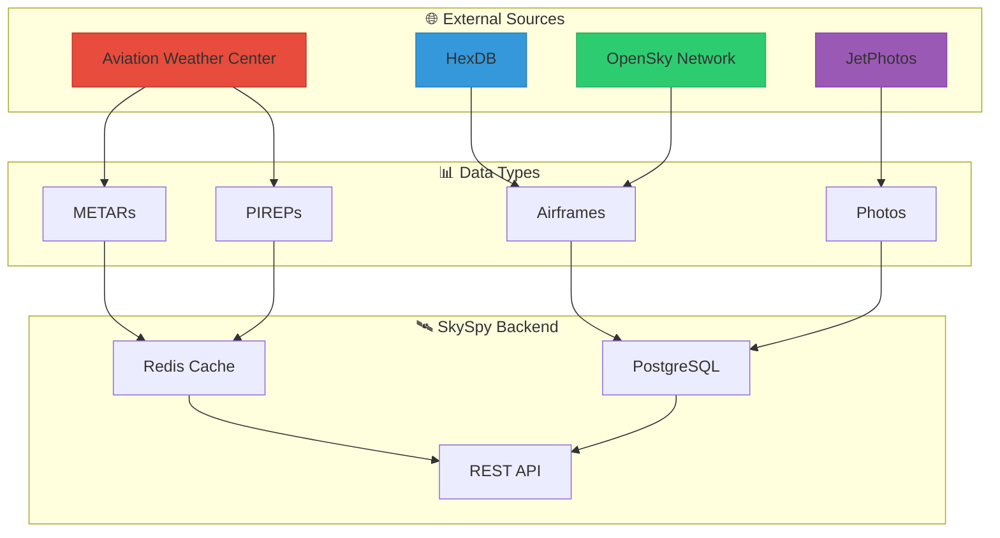
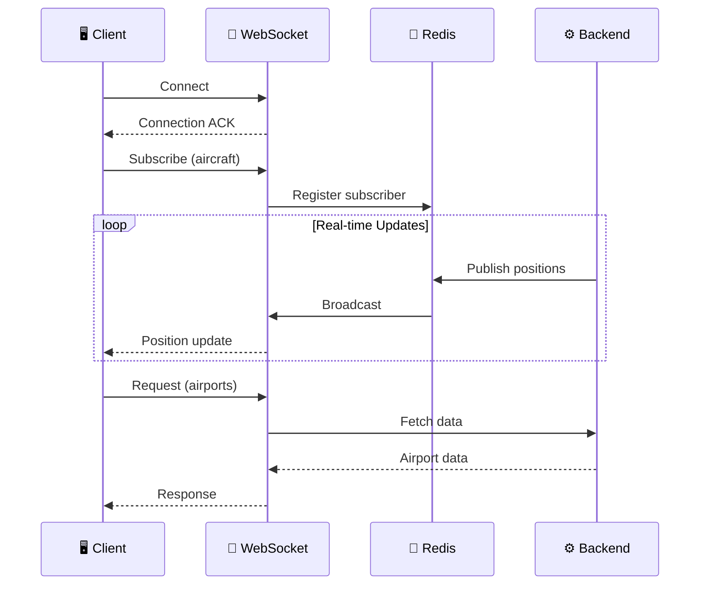
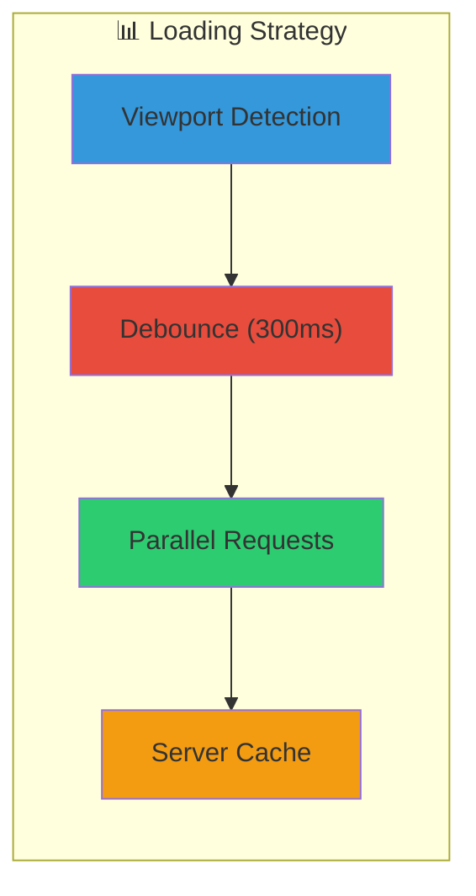

# ✈️ Map and Aviation Data

SkySpy provides a comprehensive real-time aircraft tracking map with rich aviation data overlays. The map system supports two display modes and integrates multiple aviation data sources for professional-grade situational awareness.

> 📸 **Screenshot Placeholder**: *Main map interface showing live aircraft tracking with weather overlays*

---

## 🗺️ Map Features Overview

### Display Modes

SkySpy offers two distinct map visualization modes optimized for different use cases:

> 🖼️ **Screenshot Placeholder**: *Side-by-side comparison of CRT Mode vs Pro Mode*

> 💡 **Mode Selection Tip**: CRT Mode works great on mobile and touch devices. Pro Mode is recommended for desktop power users who want ATC-style precision.

| Mode | Description | Best For |
|------|-------------|----------|
| 🖥️ **CRT Mode** | Classic radar-style display with Leaflet-based interactive maps | General use, touch devices |
| 🎯 **Pro Mode** | Professional ATC-style canvas-based radar display | Desktop power users, ATC simulation |

---

## 🎯 Pro Mode Features

> ⚡ **High-Performance Radar Display**: Pro Mode renders aircraft using HTML5 Canvas for smooth 60fps performance even with hundreds of targets.

> 📸 **Screenshot Placeholder**: *Pro Mode interface showing compass rose, data blocks, and velocity vectors*

### Feature Cards

| Feature | Description |
|---------|-------------|
| 🎨 **Color Themes** | Classic Cyan, Amber/Gold, Green Phosphor, High Contrast |
| 🧭 **Compass Rose** | Toggleable directional reference overlay with cardinal markers |
| 📊 **Data Blocks** | Customizable aircraft information callouts |
| ➡️ **Velocity Vectors** | Prediction lines showing future aircraft positions |
| 🌈 **Speed Coloring** | Visual speed differentiation by color gradient |
| 📏 **Measurement Tools** | Distance and bearing between any two points |
| ⚠️ **Conflict Detection** | Automatic proximity alerts visualization |
| 📐 **Grid Controls** | Adjustable lat/lon grid opacity |

---

## ⌨️ Keyboard Shortcuts (Pro Mode)

> ⚠️ **Pro Tip**: Master these shortcuts to navigate the radar display like a professional controller!

| Shortcut | Action | Description |
|:--------:|--------|-------------|
|  | **Toggle Compass Rose** | Show/hide directional overlay |
|  | **Cycle Grid Opacity** | Adjust lat/lon grid visibility |
|  | **Toggle Data Blocks** | Show/hide aircraft info callouts |
|  | **Toggle Velocity Vectors** | Show/hide prediction lines |
|  | **Toggle Speed Coloring** | Enable/disable speed gradients |
|  | **Toggle Altitude Trails** | Show/hide historical tracks |
|  | **Toggle Conflict Viz** | Show/hide proximity alerts |

---

## 🛩️ Aircraft Tracking

### Real-Time Data Flow



### 📡 Position Data Structure

Each aircraft broadcasts comprehensive telemetry data:

```json
{
  "hex": "A12345",
  "flight": "UAL123",
  "type": "B738",
  "lat": 40.7128,
  "lon": -74.0060,
  "alt": 35000,
  "gs": 450,
  "track": 270,
  "vr": 0,
  "squawk": "1234",
  "category": "A3",
  "military": false,
  "emergency": false,
  "distance_nm": 25.3,
  "rssi": -28.5
}
```

### Aircraft Properties Reference

| Property | Type | Description |
|----------|:----:|-------------|
| `hex` | `string` | 🔑 ICAO 24-bit hex identifier |
| `flight` | `string` | ✈️ Callsign or flight number |
| `type` | `string` | 🏷️ ICAO aircraft type code |
| `lat` / `lon` | `float` | 📍 Position coordinates |
| `alt` | `integer` | ⬆️ Barometric altitude (feet) |
| `gs` | `float` | 💨 Ground speed (knots) |
| `track` | `float` | 🧭 Ground track (degrees) |
| `vr` | `integer` | ↕️ Vertical rate (ft/min) |
| `squawk` | `string` | 📻 Transponder squawk code |
| `category` | `string` | 📊 ADS-B emitter category |
| `military` | `boolean` | 🎖️ Military aircraft flag |
| `emergency` | `boolean` | 🚨 Emergency status |
| `distance_nm` | `float` | 📏 Distance from feeder |
| `rssi` | `float` | 📶 Signal strength (dBFS) |

---

## 🚨 Emergency Squawk Codes

> ⚠️ **Emergency Detection**: SkySpy automatically highlights aircraft transmitting emergency transponder codes with visual and audible alerts.

| Squawk | Meaning | Visual Display |
|:------:|---------|----------------|
|  | **Hijack** | 🔴 Red highlight, HIJACK badge |
|  | **Radio Failure** | 🟠 Orange highlight, RADIO badge |
|  | **General Emergency** | 🔴 Red pulsing, EMERGENCY badge |

> 📸 **Screenshot Placeholder**: *Emergency aircraft display with highlighting and badge*

---

## 🎨 Aircraft Visual Categories

### Category Markers

| Category | Marker | Visual Style |
|----------|:------:|--------------|
| ✈️ Civil Aircraft | △ | Standard triangle marker |
| 🎖️ Military Aircraft | △ + MIL | Triangle with badge, distinct color |
| 🚗 Ground Vehicles | ○ | Gray circle for surface movement |
| 🚁 Helicopters | ◯ | Circular marker |

### 🌈 Altitude Color Coding

| Altitude Range | Color | Description |
|----------------|-------|-------------|
| FL350+ (35,000+ ft) | 🔵 Cyan | High altitude cruise |
| FL180-FL350 | 🟢 Green | Medium altitude |
| 0-FL180 | 🟡 Yellow | Low altitude |
| Ground/Unknown | ⚪ Gray | Surface or no data |

---

## 🗃️ Aviation Data Integration

### Data Sources Overview



### Data Source Badges

| Source | Status | Data Provided |
|--------|:------:|---------------|
|  | ✅ Active | METARs, TAFs, PIREPs, SIGMETs |
|  | ✅ Active | Aircraft registrations |
|  | ✅ Active | Aircraft metadata |
|  | ✅ Active | Aircraft images |
|  | ✅ Active | Terrain boundaries |

---

## ✈️ Airframe Database

> ℹ️ **Photo Caching**: Aircraft photos are automatically fetched and cached locally or in S3 with a 24-hour refresh cycle.

### Aircraft Info Fields

| Field | Description |
|-------|-------------|
| `icao_hex` | 🔑 ICAO 24-bit hex identifier |
| `registration` | 🏷️ Aircraft tail number |
| `type_code` | ✈️ ICAO type designator |
| `type_name` | 📝 Full aircraft type name |
| `manufacturer` | 🏭 Aircraft manufacturer |
| `model` | 📋 Specific model designation |
| `serial_number` | 🔢 Manufacturer serial number |
| `year_built` | 📅 Year of manufacture |
| `operator` | 🏢 Operating airline/company |
| `operator_icao` | 🔤 Operator ICAO code |
| `owner` | 👤 Registered owner |
| `country` | 🌍 Registration country |
| `is_military` | 🎖️ Military aircraft flag |

### Photo Endpoints

| Endpoint | Description |
|----------|-------------|
| `/api/v1/photos/{icao}` | 🖼️ Full-size aircraft photo |
| `/api/v1/photos/{icao}/thumb` | 📷 Thumbnail image |

---

## 🏛️ Airports

> 📸 **Screenshot Placeholder**: *Airport markers with class badges on map*

```json
{
  "icao": "KJFK",
  "name": "John F. Kennedy International Airport",
  "city": "New York",
  "state": "NY",
  "lat": 40.6398,
  "lon": -73.7789,
  "elev": 13,
  "class": "B",
  "rwy_length": 14511
}
```

### Airport Display Features

- 🏷️ Airport markers with class badges (Class B/C/D)
- 📋 Popup with detailed airport information
- 🔗 External links to AirNav and SkyVector
- 📏 Distance and bearing from feeder location

---

## 📍 NAVAIDs

Navigation aids are displayed as diamond markers on the map:

```json
{
  "ident": "JFK",
  "name": "Kennedy",
  "navaid_type": "VOR-DME",
  "lat": 40.6398,
  "lon": -73.7789,
  "frequency": 115.9,
  "channel": "106X"
}
```

---

## 🔘 Map Layers and Customization

### Standard Layer Toggles

| Layer | Default |
|-------|---------|
| ✅ **Aircraft** | ON |
| ⬜ **VORs & NAVAIDs** | OFF |
| ⬜ **Airports** | OFF |
| ⬜ **Airspace** | OFF |
| ⬜ **METARs** | OFF |
| ⬜ **PIREPs** | OFF |

### Pro Mode Terrain Overlays

| Overlay | Description |
|---------|-------------|
| 🌍 Countries | International boundaries |
| 🗺️ States | US state boundaries |
| 📍 Counties | US county boundaries |
| 💧 Water Bodies | Lakes and rivers |

### Pro Mode Aviation Overlays

| Overlay | Description |
|---------|-------------|
| 🇺🇸 US ARTCC Boundaries | Air Route Traffic Control Center regions |
| ⛽ US Refueling Tracks | Air-to-air refueling tracks |
| 🇬🇧 UK Military Zones | UK military airspace |
| 🔄 EU AWACS Orbits | European AWACS operating areas |
| 🎯 Training Areas | Military training airspace |

### Layer Opacity Controls

Each overlay supports individual opacity adjustment (0-100%):

```javascript
layerOpacities: {
  usArtcc: 0.5,
  usRefueling: 0.5,
  ukMilZones: 0.5,
  water: 0.5
}
```

### Data Block Configuration

| Field | Description | Icon |
|-------|-------------|:----:|
| Callsign | Flight number/callsign | ✈️ |
| Altitude | Current altitude | ⬆️ |
| Speed | Ground speed | 💨 |
| Heading | Track direction | 🧭 |
| Vertical Speed | Climb/descent rate | ↕️ |
| Aircraft Type | Type code | 🏷️ |
| Compact Mode | Condensed display | 📦 |

---

## 🔍 Filtering and Search

### Traffic Filters

| Filter | Options | Default |
|--------|---------|---------|
| 🚨 Safety Events Only | Show only safety event aircraft | ⬜ Off |
| 🎖️ Military | Show military aircraft | ✅ On |
| ✈️ Civil | Show civil aircraft | ✅ On |
| 🛩️ GA / Light | General aviation aircraft | ✅ On |
| 🛫 Airliners / Heavy | Commercial aircraft | ✅ On |
| ☁️ Airborne | Aircraft in flight | ✅ On |
| 🛬 On Ground | Surface vehicles/aircraft | ⬜ Off |
| 📻 With Squawk | Mode A/C transponder | ✅ On |
| 📡 No Squawk (ADS-B) | ADS-B only aircraft | ✅ On |

### Altitude Filter

Set minimum and maximum altitude bounds (0-60,000 ft) to filter aircraft by flight level.

### 🔎 Search Capabilities

The Pro mode search bar supports:

- ✈️ **Callsign** — e.g., "UAL123"
- 📻 **Squawk code** — e.g., "7700"
- 🔑 **ICAO hex** — e.g., "A12345"

---

## 🌐 Geographic Features

### 📏 Range Rings

Concentric circles showing distance from the feeder:

- 🔧 Configurable range (default: 50 nm)
- 📐 Automatic scaling based on zoom level
- 🏷️ Distance labels at each ring

### 🧭 Compass Rose

Directional reference overlay showing:

- 🧭 Cardinal directions (N, E, S, W)
- 📐 30-degree increment marks
- 🧲 Magnetic heading reference

### 📏 Measurement Tools

Pro mode supports distance/bearing measurement:

- 👆 Click two points to measure
- 📏 Shows great-circle distance in nautical miles
- 🧭 Shows magnetic bearing between points

> 📸 **Screenshot Placeholder**: *Measurement tool showing distance between two points*

### Map Bounds

The system tracks aircraft bounding box:

```json
{
  "bounds": {
    "min_lat": 39.5,
    "max_lat": 41.5,
    "min_lon": -75.0,
    "max_lon": -73.0
  },
  "center": {
    "latitude": 40.5,
    "longitude": -74.0
  },
  "aircraft_count": 145
}
```

---

## 🌤️ Weather Data

### METARs

> ℹ️ **Real-Time Weather**: METAR observations are fetched from aviationweather.gov and cached for 2-5 minutes.

| Field | Description | Icon |
|-------|-------------|:----:|
| `stationId` | ICAO station identifier | 🏛️ |
| `fltCat` | Flight category | 🎨 |
| Temperature | Temp and dewpoint | 🌡️ |
| Wind | Direction, speed, gusts | 💨 |
| Visibility | Statute miles | 👁️ |
| Clouds | Layer coverage and heights | ☁️ |
| Altimeter | Barometric pressure | 📊 |
| Weather | Precipitation/phenomena | 🌧️ |
| Raw METAR | Original encoded report | 📝 |

### 🎨 Flight Category Visualization

| Category | Color | Conditions |
|----------|-------|------------|
| VFR | 🟢 Green | Ceiling \>3000 ft AGL, Visibility \>5 SM |
| MVFR | 🔵 Blue | Ceiling 1000-3000 ft, Visibility 3-5 SM |
| IFR | 🔴 Red | Ceiling 500-999 ft, Visibility 1-3 SM |
| LIFR | 🟣 Magenta | Ceiling \<500 ft, Visibility \<1 SM |

> 📸 **Screenshot Placeholder**: *Map showing METAR station markers colored by flight category*

### PIREPs (Pilot Reports)

| Field | Description | Icon |
|-------|-------------|:----:|
| `report_type` | UA (routine) or UUA (urgent) | 📋 |
| `location` | Position reference | 📍 |
| `flight_level` | Altitude of report | ⬆️ |
| `aircraft_type` | Reporting aircraft | ✈️ |
| `turbulence_type` | Clear air or convective | 🌀 |
| `turbulence_freq` | Frequency | ⏱️ |
| `icing_type` | Rime, clear, or mixed | ❄️ |
| `icing_intensity` | Light/moderate/severe | 📊 |
| `sky_cover` | Cloud observations | ☁️ |
| `weather` | Precipitation/phenomena | 🌧️ |

### Weather Icon Reference

| Icon | Meaning |
|:----:|---------|
| ☀️ | Clear skies |
| ⛅ | Partly cloudy |
| ☁️ | Overcast |
| 🌧️ | Rain |
| 🌨️ | Snow |
| ⛈️ | Thunderstorms |
| 🌫️ | Fog/Mist |
| 💨 | Strong winds |
| ❄️ | Icing conditions |
| 🌀 | Turbulence |

### Airspace Advisories

Active SIGMETs, AIRMETs, and G-AIRMETs display:

- 📐 Polygon boundaries
- ⚠️ Hazard type (turbulence, icing, convection)
- ⏱️ Valid time range
- ⬆️ Altitude range affected

---

## 🔌 API Endpoints

### Map Data Endpoints

#### 🗺️ Get GeoJSON Aircraft Data

```http
GET /api/v1/map/geojson/
```

 Returns all aircraft as a GeoJSON FeatureCollection.

**Response:**
```json
{
  "type": "FeatureCollection",
  "features": [
    {
      "type": "Feature",
      "id": "A12345",
      "geometry": {
        "type": "Point",
        "coordinates": [-74.006, 40.7128]
      },
      "properties": {
        "hex": "A12345",
        "flight": "UAL123",
        "type": "B738",
        "altitude": 35000,
        "speed": 450,
        "track": 270,
        "military": false,
        "emergency": false
      }
    }
  ],
  "metadata": {
    "count": 145,
    "timestamp": "2024-01-15T12:30:00Z",
    "feeder_location": {
      "latitude": 40.7128,
      "longitude": -74.006
    }
  }
}
```

---

#### 📍 Get Map Bounds

```http
GET /api/v1/map/bounds/
```

 Returns bounding box of current aircraft positions.

**Response:**
```json
{
  "bounds": {
    "min_lat": 39.5,
    "max_lat": 41.5,
    "min_lon": -75.0,
    "max_lon": -73.0
  },
  "center": {
    "latitude": 40.5,
    "longitude": -74.0
  },
  "aircraft_count": 145
}
```

---

#### 🔗 Get Clustered Aircraft

```http
GET /api/v1/map/cluster/?zoom=8
```

 Returns aircraft clustered by location for dense traffic areas.

**Parameters:**

| Parameter | Type | Description |
|-----------|:----:|-------------|
| `zoom` | `integer` | Map zoom level (affects cluster size) |
| `cluster_distance` | `float` | Custom clustering distance |

---

#### 📡 Get SSE/WebSocket Status

```http
GET /api/v1/map/sse/status/
```

 Returns real-time streaming service status.

---

### Aviation Data Endpoints

#### 🗺️ Get GeoJSON Overlay Data

```http
GET /api/v1/aviation/geojson/{data_type}/?lat={lat}&lon={lon}&radius_nm={radius}
```

 Returns GeoJSON data for map overlays.

**Available Data Types:**

| Data Type | Description |
|-----------|-------------|
| `us_artcc` | 🇺🇸 US ARTCC boundaries |
| `us_a2a_refueling` | ⛽ US refueling tracks |
| `uk_mil_awacs` | 🇬🇧 UK military AWACS zones |
| `uk_mil_aar` | ⛽ UK air-to-air refueling areas |
| `de_mil_awacs` | 🇩🇪 German military zones |
| `ift_training_areas` | 🎯 Training airspace |

---

#### 🌤️ Get METARs

```http
GET /api/v1/aviation/metars/?lat={lat}&lon={lon}&radius_nm={radius}
```

 Returns METAR weather observations.

**Alternative:**
```http
GET /api/v1/aviation/metars/?icao={icao}&hours={hours}
```

**Parameters:**

| Parameter | Type | Default | Description |
|-----------|:----:|:-------:|-------------|
| `lat` | `float` | — | Center latitude |
| `lon` | `float` | — | Center longitude |
| `radius_nm` | `float` | `200` | Search radius (nm) |
| `icao` | `string` | — | Airport ICAO code |
| `hours` | `integer` | `2` | Hours of history |

---

#### 📋 Get PIREPs

```http
GET /api/v1/aviation/pireps/?lat={lat}&lon={lon}&radius_nm={radius}&hours={hours}
```

 Returns pilot reports.

**Parameters:**

| Parameter | Type | Default | Description |
|-----------|:----:|:-------:|-------------|
| `lat` | `float` | — | Center latitude |
| `lon` | `float` | — | Center longitude |
| `radius_nm` | `float` | `500` | Search radius (nm) |
| `hours` | `integer` | `6` | Time range |

---

#### ⚠️ Get SIGMETs & AIRMETs

```http
GET /api/v1/aviation/sigmets/
```

 Returns active SIGMETs and AIRMETs.

---

#### 🛫 Get Airports

```http
GET /api/v1/aviation/airports/?lat={lat}&lon={lon}&radius_nm={radius}&type={type}&limit={limit}
```

 Returns airports within search area.

**Parameters:**

| Parameter | Type | Default | Description |
|-----------|:----:|:-------:|-------------|
| `lat` | `float` | — | Center latitude |
| `lon` | `float` | — | Center longitude |
| `radius_nm` | `float` | `100` | Search radius |
| `type` | `string` | — | Airport type filter |
| `limit` | `integer` | `500` | Max results |

---

#### 📍 Get NAVAIDs

```http
GET /api/v1/aviation/navaids/?lat={lat}&lon={lon}&radius_nm={radius}&type={type}
```

 Returns navigation aids.

---

### Airframe Data Endpoints

#### ✈️ Get Aircraft Info

```http
GET /api/v1/airframes/{icao}/
```

 Returns detailed aircraft registration information.

**Response:**
```json
{
  "icao_hex": "A12345",
  "registration": "N123AB",
  "type_code": "B738",
  "type_name": "Boeing 737-800",
  "manufacturer": "Boeing",
  "model": "737-8H4",
  "serial_number": "12345",
  "year_built": 2015,
  "age_years": 9,
  "operator": "United Airlines",
  "operator_icao": "UAL",
  "owner": "Wells Fargo Trust",
  "country": "United States",
  "country_code": "US",
  "is_military": false,
  "photo_url": "/api/v1/photos/A12345",
  "photo_thumbnail_url": "/api/v1/photos/A12345/thumb",
  "photo_photographer": "John Smith",
  "photo_source": "JetPhotos"
}
```

---

#### 📦 Bulk Aircraft Lookup

```http
GET /api/v1/airframes/bulk/?icao={icao1},{icao2},{icao3}
```

 Look up multiple aircraft (max 100) in a single request.

---

#### 🔍 Search Aircraft

```http
GET /api/v1/airframes/search/?q={query}&operator={operator}&type={type}&limit={limit}
```

 Search aircraft database.

**Parameters:**

| Parameter | Type | Default | Description |
|-----------|:----:|:-------:|-------------|
| `q` | `string` | — | Search query |
| `operator` | `string` | — | Filter by operator |
| `type` | `string` | — | Filter by type code |
| `limit` | `integer` | `50` | Max results (max: 500) |

---

#### 🔄 Refresh Aircraft Info

```http
POST /api/v1/airframes/{icao}/refresh/
```

 Force refresh aircraft info from external sources.

---

#### 📊 Get Cache Statistics

```http
GET /api/v1/airframes/cache/stats/
```

 Returns aircraft info cache statistics.

---

### Photo Endpoints

#### 🖼️ Get Full Photo

```http
GET /api/v1/photos/{icao}/
```

 Serves the full-size cached aircraft photo. Returns 404 if not cached.

---

#### 📷 Get Thumbnail

```http
GET /api/v1/photos/{icao}/thumb/
```

 Serves the thumbnail-size cached aircraft photo.

---

## 🔌 WebSocket Integration



### WebSocket Request Types

| Type | Description |
|------|-------------|
| `navaids` | 📍 Request NAVAIDs in viewport |
| `airports` | 🛫 Request airports in viewport |
| `airspace-boundaries` | 📐 Request static airspace |
| `airspaces` | ⚠️ Request active advisories |
| `metars` | 🌤️ Request METAR observations |
| `pireps` | 📋 Request pilot reports |
| `metar` | 🌡️ Request single station METAR |
| `taf` | 📊 Request single station TAF |
| `aircraft-info` | ✈️ Request aircraft info by ICAO |

### Example WebSocket Request

```javascript
wsRequest('airports', {
  lat: 40.7128,
  lon: -74.006,
  radius: 100,
  limit: 50
}, 10000);  // 10 second timeout
```

---

## ⚙️ Configuration

### Environment Variables

```bash
# 📍 Feeder location (required for distance calculations)
FEEDER_LAT=40.7128
FEEDER_LON=-74.006

# 📷 Photo caching
PHOTO_CACHE_ENABLED=true
PHOTO_CACHE_DIR=/var/lib/skyspy/photos
S3_ENABLED=false

# ⏱️ Cache settings
AIRPORT_CACHE_TIMEOUT=300  # 5 minutes
METAR_CACHE_TIMEOUT=120    # 2 minutes
PIREP_CACHE_TIMEOUT=120    # 2 minutes
```

### Frontend Configuration (localStorage)

| Key | Description |
|-----|-------------|
| `adsb-overlays` | 🗺️ Enabled overlay layers |
| `adsb-layer-opacities` | 🎨 Layer opacity settings |
| `adsb-traffic-filters` | 🔍 Traffic filter configuration |
| `adsb-pro-theme` | 🎨 Pro mode color theme |
| `adsb-pro-grid-opacity` | 📐 Grid line opacity |
| `adsb-pro-compass-rose` | 🧭 Compass rose visibility |
| `adsb-pro-datablock-config` | 📊 Data block field configuration |

---

## ⚡ Performance Considerations

### Data Loading Strategy



1. **📍 Viewport-Based Loading** — Aviation data loads based on current map viewport, not globally
2. **⏱️ Debouncing** — Requests are debounced to prevent excessive API calls during pan/zoom
3. **⚡ Parallel Requests** — Multiple data types are fetched in parallel for faster loading
4. **💾 Caching** — Server-side caching reduces load on external APIs

### 💡 Recommended Practices

> ✅ **Performance Tips**:
> - Enable only necessary overlays to reduce rendering overhead
> - Use clustering for areas with dense traffic
> - Consider shorter trail lengths in high-traffic scenarios
> - Use Pro mode's canvas rendering for better performance with many aircraft

### ⏱️ Timeouts

| Request Type | Timeout |
|--------------|:-------:|
| 🗃️ Database queries | 10 seconds |
| 🌐 External API calls | 20 seconds |
| 📡 WebSocket requests | 10-20 seconds |
