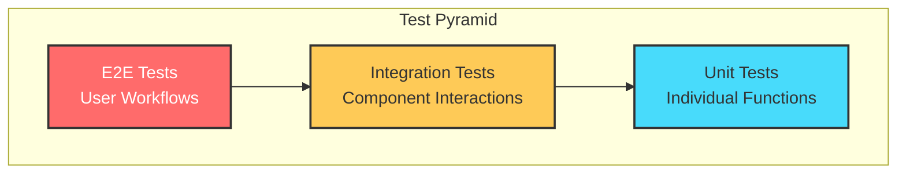
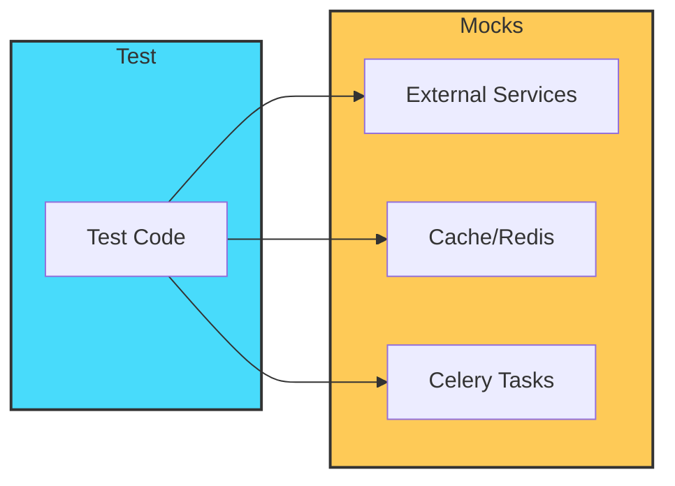
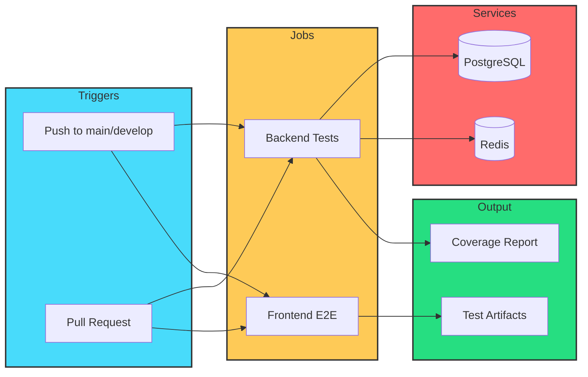

# Testing Guide

> **Premium Documentation**
>
> This guide covers the SkySpy test suite architecture, running tests, writing new tests, and best practices for maintaining comprehensive test coverage.

---

## Testing Overview

SkySpy employs a multi-layered testing strategy to ensure reliability across the entire stack.



| Layer | Framework | Location | Purpose |
|-------|-----------|----------|---------|
| **Unit Tests** | pytest + pytest-django | `skyspy_django/skyspy/tests/` | Test individual functions, methods, and classes |
| **Integration Tests** | pytest + pytest-asyncio | `skyspy_django/skyspy/tests/` | Test component interactions and data flow |
| **Backend E2E** | pytest + Django Channels | `skyspy_django/skyspy/tests/e2e/` | Test WebSocket consumers and real-time features |
| **Frontend E2E** | Playwright | `web/e2e/` | Test user workflows in the browser |

### Coverage Targets

**Coverage Goals:**

- **80%+** Backend Coverage
- **100%** Critical Paths
- **All** User Workflows

> **Coverage Requirements**
>
> - **Backend**: Minimum 80% line coverage
> - **Critical Paths**: 100% coverage for authentication, alerts, and safety features
> - **Frontend E2E**: Cover all major user workflows

---

## Test Structure and Organization

### Backend Tests

```
skyspy_django/skyspy/tests/
├── conftest.py                    # Shared fixtures for all tests
├── factories.py                   # Factory Boy model factories
├── e2e/
│   ├── conftest.py               # E2E-specific fixtures
│   ├── test_e2e_stats.py         # Statistics E2E tests
│   └── test_e2e_websocket.py     # WebSocket E2E tests
├── test_api_*.py                 # REST API endpoint tests
├── test_consumers_*.py           # WebSocket consumer tests
├── test_services_*.py            # Business logic/service tests
├── test_tasks_*.py               # Celery task tests
├── test_integration.py           # Cross-component integration tests
└── test_settings.py              # Configuration tests
```

### Frontend E2E Tests

```
web/e2e/
├── fixtures/
│   └── test-setup.js             # Mock data generators and test utilities
├── tests/
│   ├── alerts.spec.js            # Alert management tests
│   ├── map.spec.js               # Map and aircraft display tests
│   └── ...                       # Additional feature tests
└── playwright.config.js          # Playwright configuration
```

### Naming Conventions

| Pattern | Description | Example |
|---------|-------------|---------|
| `test_api_*.py` | API endpoint tests | `test_api_aircraft.py` |
| `test_consumers_*.py` | WebSocket consumer tests | `test_consumers_aircraft.py` |
| `test_services_*.py` | Service layer tests | `test_services_alerts.py` |
| `test_tasks_*.py` | Celery task tests | `test_tasks_airspace.py` |
| `test_e2e_*.py` | Backend E2E tests | `test_e2e_websocket.py` |
| `*.spec.js` | Frontend E2E tests | `map.spec.js` |

---

## Running Tests

### Prerequisites

> **Setup Required**
>
> Ensure you have the test dependencies installed before running tests.

**Backend Setup:**

```bash
# Backend dependencies
cd skyspy_django
pip install -e ".[test]"
```

**Frontend Setup:**

```bash
# Frontend dependencies
cd web
npm install
npx playwright install
```

### Unit Tests

**Run All Tests:**

```bash
cd skyspy_django
pytest
```

**Specific Module:**

```bash
pytest skyspy/tests/test_api_aircraft.py
```

**Pattern Matching:**

```bash
pytest -k "aircraft"
```

**Verbose Output:**

```bash
pytest -v
```

### Integration Tests

```bash
# Run integration tests
pytest skyspy/tests/test_integration.py

# Run async integration tests
pytest skyspy/tests/test_integration.py -v --asyncio-mode=auto
```

### E2E Tests

> **Backend E2E (WebSocket/Channels)**
>
> Tests real-time WebSocket functionality and Django Channels consumers.

**All Backend E2E:**

```bash
pytest skyspy/tests/e2e/ -v
```

**Specific E2E Test:**

```bash
pytest skyspy/tests/e2e/test_e2e_websocket.py::test_aircraft_position_updates -v
```

> **Frontend E2E (Playwright)**
>
> Tests user workflows in real browser environments.

**All Frontend E2E:**

```bash
cd web
npx playwright test
```

**Specific Test File:**

```bash
npx playwright test tests/map.spec.js
```

**Headed Mode:**

```bash
npx playwright test --headed
```

**UI Mode (Debug):**

```bash
npx playwright test --ui
```

### Docker-Based Testing

```bash
docker-compose -f docker-compose.test.yaml up --build --abort-on-container-exit
```

> **Docker Test Environment Includes:**
>
> - Isolated PostgreSQL database
> - Redis for caching and Channels
> - Proper network configuration
> - Coverage report generation

---

## Test Fixtures and Factories

### Backend Fixtures (`conftest.py`)

SkySpy uses pytest fixtures for test setup. Key fixtures are defined in `skyspy_django/skyspy/tests/conftest.py`:

> **Database Fixtures**
>
> Manage database state and provide API clients for testing.

```python
@pytest.fixture
def db_session(db):
    """Provides a database session with automatic rollback."""
    yield
    # Automatic rollback after test

@pytest.fixture
def api_client():
    """Returns a DRF APIClient for testing API endpoints."""
    from rest_framework.test import APIClient
    return APIClient()

@pytest.fixture
def authenticated_client(api_client, user):
    """Returns an authenticated API client."""
    api_client.force_authenticate(user=user)
    return api_client
```

> **WebSocket Fixtures**
>
> Enable testing of real-time WebSocket functionality.

```python
@pytest.fixture
async def communicator(application):
    """WebSocket communicator for testing consumers."""
    from channels.testing import WebsocketCommunicator
    communicator = WebsocketCommunicator(application, "/ws/aircraft/")
    connected, _ = await communicator.connect()
    assert connected
    yield communicator
    await communicator.disconnect()
```

> **User Fixtures**
>
> Create test users with various permission levels.

```python
@pytest.fixture
def user(db):
    """Creates a standard test user."""
    from skyspy.models import User
    return User.objects.create_user(
        username="testuser",
        email="test@example.com",
        password="testpass123"
    )

@pytest.fixture
def admin_user(db):
    """Creates an admin user with elevated permissions."""
    from skyspy.models import User
    return User.objects.create_superuser(
        username="admin",
        email="admin@example.com",
        password="adminpass123"
    )
```

### Factory Boy Factories (`factories.py`)

Factories generate realistic test data using Factory Boy:

```python
import factory
from factory.django import DjangoModelFactory
from skyspy.models import Aircraft, Alert, User

class UserFactory(DjangoModelFactory):
    class Meta:
        model = User

    username = factory.Sequence(lambda n: f"user{n}")
    email = factory.LazyAttribute(lambda obj: f"{obj.username}@example.com")
    password = factory.PostGenerationMethodCall("set_password", "testpass123")

class AircraftFactory(DjangoModelFactory):
    class Meta:
        model = Aircraft

    icao_hex = factory.Sequence(lambda n: f"A{n:05X}")
    callsign = factory.Sequence(lambda n: f"TEST{n:03d}")
    latitude = factory.Faker("latitude")
    longitude = factory.Faker("longitude")
    altitude = factory.Faker("random_int", min=1000, max=45000)
    speed = factory.Faker("random_int", min=100, max=600)
    heading = factory.Faker("random_int", min=0, max=359)

class AlertFactory(DjangoModelFactory):
    class Meta:
        model = Alert

    user = factory.SubFactory(UserFactory)
    name = factory.Sequence(lambda n: f"Alert Rule {n}")
    conditions = factory.LazyFunction(lambda: {
        "field": "altitude",
        "operator": "less_than",
        "value": 5000
    })
    is_active = True
```

> **Using Factories in Tests**
>
> Factories simplify test data creation and make tests more readable.

```python
def test_aircraft_list(authenticated_client):
    # Create test aircraft
    aircraft = AircraftFactory.create_batch(5)

    response = authenticated_client.get("/api/v1/aircraft/")

    assert response.status_code == 200
    assert len(response.json()["results"]) == 5

def test_alert_triggers(user):
    alert = AlertFactory(user=user, conditions={
        "field": "altitude",
        "operator": "less_than",
        "value": 3000
    })
    aircraft = AircraftFactory(altitude=2500)

    # Test alert evaluation logic
    assert alert.evaluate(aircraft) is True
```

### Frontend Test Fixtures (`test-setup.js`)

Frontend E2E tests use custom fixtures for mock data and API mocking:

**Mock Aircraft:**

```javascript
// Generate mock aircraft data
export function generateMockAircraft(count = 10) {
    return Array.from({ length: count }, (_, i) => ({
        icao_hex: `A${String(i).padStart(5, '0')}`,
        callsign: `TEST${String(i).padStart(3, '0')}`,
        latitude: 40.7128 + (Math.random() - 0.5) * 2,
        longitude: -74.0060 + (Math.random() - 0.5) * 2,
        altitude: Math.floor(Math.random() * 40000) + 5000,
        speed: Math.floor(Math.random() * 500) + 100,
        heading: Math.floor(Math.random() * 360),
        aircraft_type: 'B738',
        registration: `N${100 + i}AA`
    }));
}
```

**Mock ACARS:**

```javascript
// Generate mock ACARS messages
export function generateMockAcarsMessages(count = 5) {
    return Array.from({ length: count }, (_, i) => ({
        id: i + 1,
        timestamp: new Date(Date.now() - i * 60000).toISOString(),
        icao_hex: `A${String(i).padStart(5, '0')}`,
        message: `ACARS message content ${i}`,
        label: 'H1',
        block_id: String.fromCharCode(65 + i)
    }));
}
```

**Mock Alerts:**

```javascript
// Generate mock alert rules
export function generateMockAlertRules(count = 3) {
    return Array.from({ length: count }, (_, i) => ({
        id: i + 1,
        name: `Alert Rule ${i + 1}`,
        conditions: [{ field: 'altitude', operator: 'lt', value: 5000 }],
        is_active: true,
        notification_channels: ['browser']
    }));
}
```

#### Extended Playwright Test Fixture

```javascript
import { test as base, expect } from '@playwright/test';

export const test = base.extend({
    // Mock API routes
    mockApi: async ({ page }, use) => {
        const mocks = {
            aircraft: generateMockAircraft(20),
            alerts: generateMockAlertRules(3),
            acars: generateMockAcarsMessages(10)
        };

        await page.route('**/api/v1/aircraft/**', route => {
            route.fulfill({ json: { results: mocks.aircraft } });
        });

        await page.route('**/api/v1/alerts/**', route => {
            route.fulfill({ json: { results: mocks.alerts } });
        });

        await use(mocks);
    },

    // WebSocket mock
    wsMock: async ({ page }, use) => {
        const wsMock = new WebSocketMock();
        await page.exposeFunction('__wsMockSend', (data) => {
            wsMock.emit(JSON.parse(data));
        });
        await use(wsMock);
    },

    // Helper utilities
    helpers: async ({ page }, use) => {
        await use({
            waitForMapLoad: () => page.waitForSelector('.mapboxgl-canvas'),
            waitForAircraftMarkers: () => page.waitForSelector('[data-testid="aircraft-marker"]'),
            clickAircraft: (icao) => page.click(`[data-aircraft-id="${icao}"]`)
        });
    }
});
```

---

## Mocking Strategies

### Backend Mocking



> **Mocking External Services**
>
> Isolate tests from external API dependencies.

```python
from unittest.mock import patch, MagicMock

def test_external_api_call():
    with patch("skyspy.services.external.fetch_weather") as mock_weather:
        mock_weather.return_value = {"temperature": 72, "conditions": "clear"}

        result = get_flight_conditions("KJFK")

        mock_weather.assert_called_once_with("KJFK")
        assert result["conditions"] == "clear"
```

> **Mocking Redis/Cache**
>
> Control cache behavior in tests.

```python
@pytest.fixture
def mock_cache():
    with patch("django.core.cache.cache") as mock:
        mock.get.return_value = None
        mock.set.return_value = True
        yield mock

def test_cached_aircraft_data(mock_cache):
    mock_cache.get.return_value = {"icao": "ABC123", "cached": True}

    result = get_aircraft_data("ABC123")

    assert result["cached"] is True
```

> **Mocking Celery Tasks**
>
> Test task scheduling without running background workers.

```python
from unittest.mock import patch

def test_task_scheduling():
    with patch("skyspy.tasks.process_aircraft.delay") as mock_task:
        mock_task.return_value.id = "test-task-id"

        schedule_aircraft_processing(["ABC123", "DEF456"])

        assert mock_task.call_count == 2
```

### Frontend Mocking

> **API Route Mocking with Playwright**
>
> Intercept and mock API calls in browser tests.

```javascript
test('displays aircraft list', async ({ page }) => {
    // Mock the aircraft API endpoint
    await page.route('**/api/v1/aircraft/', async route => {
        await route.fulfill({
            status: 200,
            contentType: 'application/json',
            body: JSON.stringify({
                results: [
                    { icao_hex: 'ABC123', callsign: 'TEST001', altitude: 35000 },
                    { icao_hex: 'DEF456', callsign: 'TEST002', altitude: 28000 }
                ],
                count: 2
            })
        });
    });

    await page.goto('/');
    await expect(page.locator('[data-testid="aircraft-list"]')).toContainText('TEST001');
});
```

> **WebSocket Mocking**
>
> Simulate real-time updates in browser tests.

```javascript
class WebSocketMock {
    constructor() {
        this.handlers = new Map();
        this.messages = [];
    }

    on(event, handler) {
        this.handlers.set(event, handler);
    }

    emit(data) {
        const handler = this.handlers.get('message');
        if (handler) handler({ data: JSON.stringify(data) });
    }

    send(data) {
        this.messages.push(JSON.parse(data));
    }

    simulateAircraftUpdate(aircraft) {
        this.emit({
            type: 'aircraft.position',
            payload: aircraft
        });
    }
}

test('receives real-time aircraft updates', async ({ page, wsMock }) => {
    await page.goto('/');

    // Simulate incoming WebSocket message
    wsMock.simulateAircraftUpdate({
        icao_hex: 'ABC123',
        latitude: 40.7128,
        longitude: -74.0060,
        altitude: 35000
    });

    await expect(page.locator('[data-aircraft-id="ABC123"]')).toBeVisible();
});
```

> **Mocking Authentication State**
>
> Test authenticated user flows without real login.

```javascript
test('authenticated user sees alerts', async ({ page }) => {
    // Set auth token in storage before navigation
    await page.addInitScript(() => {
        localStorage.setItem('auth_token', 'test-jwt-token');
        localStorage.setItem('user', JSON.stringify({
            id: 1,
            username: 'testuser',
            permissions: ['view_alerts', 'create_alerts']
        }));
    });

    await page.goto('/alerts');
    await expect(page.locator('h1')).toContainText('Alert Rules');
});
```

---

## Coverage Reporting

### Backend Coverage

**Generate Coverage:**

```bash
cd skyspy_django
pytest --cov=skyspy --cov-report=html --cov-report=xml
```

**View HTML Report:**

```bash
# Generate and open HTML report
pytest --cov=skyspy --cov-report=html
open htmlcov/index.html
```

**Generate Badge:**

```bash
# Generate coverage badge
coverage-badge -o coverage.svg -f
```

> **Coverage Report Locations:**
>
> - **HTML Report**: `htmlcov/index.html` (open in browser)
> - **XML Report**: `coverage.xml` (for CI integration)
> - **Terminal Summary**: Displayed after test run

#### Coverage Configuration (`pyproject.toml`)

```toml
[tool.coverage.run]
source = ["skyspy"]
omit = [
    "*/migrations/*",
    "*/tests/*",
    "*/__pycache__/*",
    "*/admin.py"
]
branch = true

[tool.coverage.report]
exclude_lines = [
    "pragma: no cover",
    "def __repr__",
    "raise NotImplementedError",
    "if TYPE_CHECKING:",
    "if settings.DEBUG"
]
fail_under = 80
show_missing = true
```

---

## CI/CD Integration



### GitHub Actions Workflow

SkySpy uses GitHub Actions for continuous integration. The test workflow is triggered on:
- Push to `main` or `develop` branches
- Pull requests targeting `main`

**Backend Tests:**

```yaml
name: Tests

on:
  push:
    branches: [main, develop]
  pull_request:
    branches: [main]

jobs:
  backend-tests:
    runs-on: ubuntu-latest
    services:
      postgres:
        image: postgres:15
        env:
          POSTGRES_DB: skyspy_test
          POSTGRES_USER: postgres
          POSTGRES_PASSWORD: postgres
        ports:
          - 5432:5432
      redis:
        image: redis:7
        ports:
          - 6379:6379

    steps:
      - uses: actions/checkout@v4

      - name: Set up Python
        uses: actions/setup-python@v5
        with:
          python-version: '3.11'

      - name: Install dependencies
        run: |
          cd skyspy_django
          pip install -e ".[test]"

      - name: Run tests with coverage
        run: |
          cd skyspy_django
          pytest --cov=skyspy --cov-report=xml

      - name: Upload coverage
        uses: codecov/codecov-action@v4
        with:
          file: skyspy_django/coverage.xml
```

**Frontend E2E:**

```yaml
  frontend-e2e:
    runs-on: ubuntu-latest
    steps:
      - uses: actions/checkout@v4

      - name: Set up Node.js
        uses: actions/setup-node@v4
        with:
          node-version: '20'

      - name: Install dependencies
        run: |
          cd web
          npm ci
          npx playwright install --with-deps

      - name: Run E2E tests
        run: |
          cd web
          npx playwright test

      - name: Upload test artifacts
        uses: actions/upload-artifact@v4
        if: failure()
        with:
          name: playwright-report
          path: web/playwright-report/
```

### Pre-commit Hooks

```bash
pip install pre-commit
pre-commit install
```

**Pre-commit configuration** (`.pre-commit-config.yaml`):

```yaml
repos:
  - repo: local
    hooks:
      - id: pytest-check
        name: pytest-check
        entry: pytest skyspy_django/skyspy/tests/ -x -q
        language: system
        pass_filenames: false
        always_run: true
```

### Local CI Simulation

```bash
docker-compose -f docker-compose.test.yaml up --build
```

---

## Writing New Tests

### Backend Unit Test Template

```python
import pytest
from skyspy.tests.factories import AircraftFactory, UserFactory

class TestAircraftService:
    """Tests for the Aircraft service layer."""

    @pytest.fixture
    def service(self):
        from skyspy.services.aircraft import AircraftService
        return AircraftService()

    def test_get_aircraft_by_icao(self, db, service):
        """Test retrieving aircraft by ICAO hex code."""
        aircraft = AircraftFactory(icao_hex="ABC123")

        result = service.get_by_icao("ABC123")

        assert result is not None
        assert result.icao_hex == "ABC123"

    def test_get_aircraft_not_found(self, db, service):
        """Test behavior when aircraft is not found."""
        result = service.get_by_icao("NONEXISTENT")

        assert result is None

    def test_filter_by_altitude(self, db, service):
        """Test filtering aircraft by altitude range."""
        AircraftFactory(altitude=10000)
        AircraftFactory(altitude=20000)
        AircraftFactory(altitude=30000)

        result = service.filter_by_altitude(min_alt=15000, max_alt=25000)

        assert len(result) == 1
        assert result[0].altitude == 20000
```

### Backend API Test Template

```python
import pytest
from rest_framework import status
from skyspy.tests.factories import AircraftFactory, UserFactory

class TestAircraftAPI:
    """Tests for the Aircraft REST API."""

    @pytest.fixture
    def auth_client(self, api_client, db):
        user = UserFactory()
        api_client.force_authenticate(user=user)
        return api_client

    def test_list_aircraft(self, auth_client):
        """Test listing all aircraft."""
        AircraftFactory.create_batch(3)

        response = auth_client.get("/api/v1/aircraft/")

        assert response.status_code == status.HTTP_200_OK
        assert len(response.json()["results"]) == 3

    def test_retrieve_aircraft(self, auth_client):
        """Test retrieving single aircraft."""
        aircraft = AircraftFactory(icao_hex="ABC123")

        response = auth_client.get(f"/api/v1/aircraft/{aircraft.id}/")

        assert response.status_code == status.HTTP_200_OK
        assert response.json()["icao_hex"] == "ABC123"

    def test_unauthenticated_access_denied(self, api_client):
        """Test that unauthenticated requests are rejected."""
        response = api_client.get("/api/v1/aircraft/")

        assert response.status_code == status.HTTP_401_UNAUTHORIZED
```

### Backend WebSocket Consumer Test Template

```python
import pytest
from channels.testing import WebsocketCommunicator
from skyspy.channels.consumers.aircraft import AircraftConsumer

@pytest.mark.asyncio
class TestAircraftConsumer:
    """Tests for the Aircraft WebSocket consumer."""

    @pytest.fixture
    async def communicator(self, application):
        communicator = WebsocketCommunicator(application, "/ws/aircraft/")
        connected, _ = await communicator.connect()
        assert connected
        yield communicator
        await communicator.disconnect()

    async def test_subscribe_to_aircraft(self, communicator):
        """Test subscribing to aircraft updates."""
        await communicator.send_json_to({
            "type": "subscribe",
            "channel": "aircraft.updates"
        })

        response = await communicator.receive_json_from()

        assert response["type"] == "subscription.confirmed"

    async def test_receive_position_update(self, communicator):
        """Test receiving aircraft position updates."""
        await communicator.send_json_to({
            "type": "subscribe",
            "channel": "aircraft.ABC123"
        })

        # Simulate position update from channel layer
        await self.send_position_update("ABC123", lat=40.7128, lon=-74.0060)

        response = await communicator.receive_json_from(timeout=5)

        assert response["type"] == "aircraft.position"
        assert response["payload"]["icao_hex"] == "ABC123"
```

### Frontend E2E Test Template

```javascript
import { test, expect } from '../fixtures/test-setup';

test.describe('Aircraft Map Features', () => {
    test.beforeEach(async ({ page, mockApi }) => {
        // mockApi fixture automatically sets up API mocks
        await page.goto('/');
        await page.waitForSelector('.mapboxgl-canvas');
    });

    test('displays aircraft markers on map', async ({ page, helpers }) => {
        await helpers.waitForAircraftMarkers();

        const markers = await page.locator('[data-testid="aircraft-marker"]').count();
        expect(markers).toBeGreaterThan(0);
    });

    test('clicking aircraft shows detail panel', async ({ page }) => {
        await page.click('[data-testid="aircraft-marker"]');

        await expect(page.locator('[data-testid="aircraft-detail"]')).toBeVisible();
    });

    test('filter aircraft by altitude', async ({ page }) => {
        await page.click('[data-testid="filter-button"]');
        await page.fill('[data-testid="min-altitude"]', '10000');
        await page.fill('[data-testid="max-altitude"]', '20000');
        await page.click('[data-testid="apply-filter"]');

        // Verify filtered results
        const markers = await page.locator('[data-testid="aircraft-marker"]').all();
        for (const marker of markers) {
            const altitude = await marker.getAttribute('data-altitude');
            expect(parseInt(altitude)).toBeGreaterThanOrEqual(10000);
            expect(parseInt(altitude)).toBeLessThanOrEqual(20000);
        }
    });
});
```

---

## Test Checklist

When writing new tests, ensure you follow these best practices:

**Pre-Submit Checklist:**

- [ ] Use descriptive test names that explain the expected behavior
- [ ] Follow the Arrange-Act-Assert pattern
- [ ] Use factories for test data creation
- [ ] Mock external dependencies
- [ ] Test both success and error cases
- [ ] Test edge cases and boundary conditions
- [ ] Include proper cleanup in fixtures
- [ ] Add appropriate test markers (`@pytest.mark.slow`, `@pytest.mark.integration`)
- [ ] Verify test runs in isolation (no test interdependencies)

### Common Pytest Markers

```python
# Mark test as slow-running
@pytest.mark.slow
def test_large_dataset_processing():
    pass

# Mark test as requiring database
@pytest.mark.django_db
def test_database_operation():
    pass

# Mark test as async
@pytest.mark.asyncio
async def test_async_operation():
    pass

# Skip test conditionally
@pytest.mark.skipif(condition, reason="...")
def test_feature():
    pass

# Parametrize test with multiple inputs
@pytest.mark.parametrize("input,expected", [
    (1, 2),
    (2, 4),
    (3, 6),
])
def test_double(input, expected):
    assert input * 2 == expected
```

---

## Troubleshooting

> **Warning: Database Not Cleaned Between Tests**
>
> Ensure you're using the `db` fixture or `@pytest.mark.django_db`

```python
@pytest.mark.django_db
def test_needs_database():
    # Database access works here
    pass
```

> **Warning: WebSocket Tests Timing Out**
>
> Increase the timeout or check consumer connection logic

```python
response = await communicator.receive_json_from(timeout=10)
```

> **Warning: Playwright Tests Flaky**
>
> Add explicit waits for elements

```javascript
await page.waitForSelector('[data-testid="element"]', { state: 'visible' });
```

> **Warning: Coverage Not Detecting Async Code**
>
> Ensure `pytest-asyncio` is properly configured

```ini
[pytest]
asyncio_mode = auto
```

### Debug Mode

**Backend Debug:**

```bash
pytest -v --tb=long --capture=no
```

**Frontend Debug:**

```bash
npx playwright test --debug
```

---

## Quick Reference

| Task | Command |
|------|---------|
| Run all backend tests | `pytest` |
| Run with coverage | `pytest --cov=skyspy` |
| Run specific test file | `pytest path/to/test_file.py` |
| Run matching tests | `pytest -k "pattern"` |
| Run frontend E2E | `npx playwright test` |
| Run E2E headed | `npx playwright test --headed` |
| Run E2E with UI | `npx playwright test --ui` |
| Docker test suite | `docker-compose -f docker-compose.test.yaml up` |
| Generate coverage HTML | `pytest --cov=skyspy --cov-report=html` |
| Debug backend tests | `pytest -v --tb=long --capture=no` |
| Debug frontend tests | `npx playwright test --debug` |

---

> **Need Help?**
>
> For questions or issues with testing, please open an issue on the GitHub repository.
