# Safety Events & Alert System

> **Real-time flight safety monitoring with intelligent alerting** - Detect emergencies, TCAS events, and custom conditions as they happen.

---

## Overview

SkysPy provides a powerful **dual-layer** alert and monitoring system:

| Feature | Description |
|---------|-------------|
| **Automated Safety Monitoring** | Real-time detection of dangerous flight conditions, TCAS events, and emergency squawks |
| **Custom Alert Rules** | User-defined rules with flexible conditions, scheduling, and multi-channel notifications |

> Both systems integrate with **WebSocket streaming** for real-time notifications and support enterprise features including role-based access control, notification channels, and audit history.

---

## Safety Events

### What Are Safety Events?

Safety events are **automatically detected anomalies** in aircraft behavior that may indicate dangerous situations. The `SafetyMonitor` service continuously analyzes incoming ADS-B data to identify potential safety concerns.

```mermaid
flowchart LR
    A[📡 ADS-B Data] --> B{Safety Monitor}
    B --> C[🔴 Emergency Squawk]
    B --> D[⚡ TCAS RA]
    B --> E[📉 Extreme VS]
    B --> F[✈️ Proximity Conflict]
    C & D & E & F --> G[🔔 Alert Dispatch]
    G --> H[📱 WebSocket]
    G --> I[📧 Notifications]
```



---

### Types of Safety Events

| Event Type | Icon | Description | Severity |
|------------|------|-------------|----------|
| `squawk_hijack` | SOS | Aircraft squawking **7500** (hijack code) | Critical |
| `squawk_radio_failure` | Radio | Aircraft squawking **7600** (radio failure) | Warning |
| `squawk_emergency` | Alert | Aircraft squawking **7700** (general emergency) | Critical |
| `tcas_ra` | Lightning | Suspected TCAS Resolution Advisory - rapid VS reversal indicating collision avoidance | Critical |
| `vs_reversal` | Chart | Significant vertical speed reversal without TCAS-level magnitude | Warning / Low |
| `extreme_vs` | Down | Vertical speed exceeding 6,000 fpm (configurable) | Low - Critical |
| `proximity_conflict` | Planes | Two aircraft within dangerous proximity (&lt; 1nm horizontal, &lt; 1000ft vertical) | Warning - Critical |

---

### Severity Levels

#### Critical

**Immediate attention required**

- Emergency squawks (7500, 7700)
- TCAS Resolution Advisories
- Very close proximity conflicts
- Extreme vertical rates

> Critical events trigger immediate notifications and are highlighted prominently in the UI.

#### Warning

**Notable events requiring awareness**

- Radio failure squawks (7600)
- Moderate proximity conflicts
- Significant VS reversals

> Warning events are logged and displayed but may not require immediate action.

#### Low

**Informational events for logging**

- Minor anomalies
- Informational VS changes
- Events filtered by smart detection

> Low severity events are primarily for record-keeping and analysis.

---

### Detection Thresholds

> **Quick Setup** - Configure these thresholds in your Django `settings.py` to tune sensitivity.

```python
# Django settings.py
SAFETY_MONITORING_ENABLED = True
SAFETY_VS_CHANGE_THRESHOLD = 3000      # fpm - triggers VS reversal detection
SAFETY_VS_EXTREME_THRESHOLD = 6000     # fpm - triggers extreme VS event
SAFETY_PROXIMITY_NM = 1.0              # nautical miles - horizontal proximity
SAFETY_ALTITUDE_DIFF_FT = 1000         # feet - vertical separation
SAFETY_CLOSURE_RATE_KT = 100           # knots - minimum closure rate
SAFETY_TCAS_VS_THRESHOLD = 1500        # fpm - magnitude for TCAS RA detection
```

| Setting | Default | Description |
|---------|---------|-------------|
| `SAFETY_VS_CHANGE_THRESHOLD` | 3000 fpm | Minimum VS change to trigger reversal detection |
| `SAFETY_VS_EXTREME_THRESHOLD` | 6000 fpm | Threshold for extreme vertical speed events |
| `SAFETY_PROXIMITY_NM` | 1.0 nm | Horizontal separation for proximity alerts |
| `SAFETY_ALTITUDE_DIFF_FT` | 1000 ft | Vertical separation for proximity alerts |
| `SAFETY_TCAS_VS_THRESHOLD` | 1500 fpm | VS magnitude indicating TCAS RA |

---

### Safety Event Data Structure

<details>
<summary>View Complete Event Schema</summary>

Each safety event contains comprehensive data:

```json
{
  "id": "tcas_ra:ABC123",
  "event_type": "tcas_ra",
  "severity": "critical",
  "icao_hex": "ABC123",
  "icao_hex_2": "DEF456",
  "callsign": "UAL123",
  "callsign_2": "DAL456",
  "message": "TCAS RA suspected: UAL123 VS reversed from -2500 to +2500 fpm",
  "timestamp": "2024-01-15T10:30:00Z",
  "acknowledged": false,
  "details": {
    "previous_vs": -2500,
    "current_vs": 2500,
    "vs_change": 5000,
    "altitude": 35000,
    "lat": 47.5,
    "lon": -122.3,
    "distance_nm": 0.8,
    "altitude_diff_ft": 400
  },
  "aircraft_snapshot": {
    "hex": "ABC123",
    "flight": "UAL123",
    "lat": 47.5,
    "lon": -122.3,
    "alt_baro": 35000,
    "gs": 450,
    "track": 180,
    "baro_rate": 2500,
    "squawk": "1200"
  }
}
```

</details>

---

### Smart Filtering

> **Pro Tip** - The safety monitor includes intelligent filtering to reduce false positives.

| Filter | Description |
|--------|-------------|
| **Airport Proximity Filter** | Ignores low-altitude proximity events near major airports (takeoff/landing pairs) |
| **Diverging Aircraft Filter** | Skips proximity alerts when aircraft are moving apart from each other |
| **Takeoff VS Filter** | Ignores VS reversals during initial climb phase |

---

## Alert Rule System

### Overview

Custom alert rules allow users to define specific conditions for notification:

```mermaid
flowchart TB
    subgraph Rule["📋 Alert Rule"]
        A[Conditions] --> B{Logic: AND/OR}
        B --> C[Group 1]
        B --> D[Group 2]
        C --> E[Condition 1]
        C --> F[Condition 2]
    end

    subgraph Evaluation["⚙️ Evaluation"]
        G[Aircraft Data] --> H{Rule Engine}
        Rule --> H
        H --> I{Match?}
    end

    I -->|Yes| J[🔔 Trigger Alert]
    I -->|No| K[Continue Monitoring]

    J --> L[Check Cooldown]
    L --> M[📤 Send Notifications]
```



| Feature | Description |
|---------|-------------|
| **Complex Conditions** | AND/OR logic with multiple condition groups |
| **Scheduling** | Start/expiration times and suppression windows |
| **Cooldowns** | Prevent alert spam for the same aircraft |
| **Multi-Channel** | Discord, Slack, Telegram, Email, and more |
| **Visibility Control** | Private, shared, or public rules |
| **Live Preview** | Test rules against current aircraft before saving |

---

### Alert Rule Builder

#### Basic Rule Structure

> **Quick Start** - Here's a simple rule to detect military aircraft.

**Basic Rule**

```json
{
  "name": "Military Aircraft Alert",
  "description": "Alert when military aircraft are detected",
  "priority": "warning",
  "enabled": true,
  "cooldown": 300,
  "conditions": {
    "logic": "AND",
    "groups": [
      {
        "logic": "AND",
        "conditions": [
          {
            "type": "military",
            "operator": "eq",
            "value": "true"
          }
        ]
      }
    ]
  }
}
```

**Complex Multi-Condition**

```json
{
  "name": "Low Flying Helicopter Near Me",
  "description": "Alert when helicopters fly low within 5nm",
  "priority": "info",
  "enabled": true,
  "cooldown": 300,
  "conditions": {
    "logic": "AND",
    "groups": [
      {
        "logic": "AND",
        "conditions": [
          { "type": "helicopter", "operator": "eq", "value": "true" },
          { "type": "altitude_below", "operator": "lt", "value": "2000" },
          { "type": "distance_within", "operator": "lte", "value": "5" }
        ]
      }
    ]
  }
}
```

**OR Logic Example**

```json
{
  "name": "Track N12345 or UAL Flights",
  "priority": "info",
  "conditions": {
    "logic": "OR",
    "groups": [
      {
        "logic": "AND",
        "conditions": [
          { "type": "registration", "operator": "eq", "value": "N12345" }
        ]
      },
      {
        "logic": "AND",
        "conditions": [
          { "type": "callsign", "operator": "startswith", "value": "UAL" }
        ]
      }
    ]
  }
}
```

---

### Condition Types

#### Aircraft Identity

| Type | Description | Example Value | Operators |
|------|-------------|---------------|-----------|
| `icao` / `hex` | Aircraft ICAO hex code | `A12345` | eq, neq, contains, startswith, endswith |
| `callsign` | Flight callsign | `UAL123` | eq, neq, contains, startswith, endswith |
| `registration` | Aircraft registration | `N12345` | eq, neq, contains, startswith, endswith |
| `type` / `aircraft_type` | Aircraft type code | `B738` | eq, neq, contains, startswith, endswith |
| `category` | ADS-B category | `A3` | eq, neq |

#### Flight Data

| Type | Description | Example Value | Operators |
|------|-------------|---------------|-----------|
| `altitude_above` | Altitude floor (ft) | `10000` | N/A (implicit &gt;) |
| `altitude_below` | Altitude ceiling (ft) | `5000` | N/A (implicit &lt;) |
| `altitude` | Exact altitude comparison | `35000` | eq, lt, gt, lte, gte |
| `speed_above` | Ground speed floor (kts) | `300` | N/A (implicit &gt;) |
| `speed_below` | Ground speed ceiling (kts) | `100` | N/A (implicit &lt;) |
| `speed` | Exact speed comparison | `250` | eq, lt, gt, lte, gte |
| `vertical_rate` | Vertical rate (fpm) | `-2000` | eq, lt, gt, lte, gte |

#### Location

| Type | Description | Example Value | Operators |
|------|-------------|---------------|-----------|
| `distance_within` | Distance from feeder (nm) | `10` | N/A (implicit &lt;=) |
| `distance_from_mobile` | Distance from mobile GPS (nm) | `5` | N/A (implicit &lt;=) |

#### Classifications

| Type | Description | Example Value | Operators |
|------|-------------|---------------|-----------|
| `military` | Military aircraft flag | `true` | eq (boolean) |
| `emergency` | Emergency squawk active | `true` | eq (boolean) |
| `law_enforcement` | Law enforcement aircraft | `true` | eq (boolean) |
| `helicopter` | Rotorcraft category | `true` | eq (boolean) |
| `squawk` | Transponder squawk code | `7700` | eq, neq |

---

### Available Operators

#### String Operators

| Operator | Label | Example | Description |
|----------|-------|---------|-------------|
| `eq` | equals | `callsign eq "UAL123"` | Exact match (case-insensitive) |
| `neq` | not equals | `type neq "B738"` | Does not match |
| `contains` | contains | `callsign contains "UAL"` | Value contains substring |
| `startswith` | starts with | `callsign startswith "DAL"` | Value starts with string |
| `endswith` | ends with | `registration endswith "AB"` | Value ends with string |
| `regex` | regex match | `callsign regex "^[A-Z]{3}\d+"` | Regular expression match |

#### Numeric Operators

| Operator | Symbol | Example | Description |
|----------|--------|---------|-------------|
| `eq` | = | `altitude eq 35000` | Equal to |
| `lt` | &lt; | `altitude lt 10000` | Less than |
| `gt` | &gt; | `speed gt 500` | Greater than |
| `lte` | &lt;= | `distance_within lte 5` | Less than or equal |
| `gte` | &gt;= | `altitude gte 20000` | Greater than or equal |

---

### Rule Templates

> **Quick Start** - Use these pre-built templates for common use cases.

| Template | Description | Priority |
|----------|-------------|----------|
| **Military Aircraft** | Detect military aircraft in your airspace | Warning |
| **Emergency Squawk** | Emergency codes 7500/7600/7700 | Critical |
| **Low Flying Aircraft** | Aircraft below 2,000 ft | Info |
| **Nearby Aircraft** | Aircraft within 5nm of your location | Info |
| **Helicopter Activity** | Any helicopter detection | Info |
| **Law Enforcement** | Police/government aircraft | Warning |

---

### Scheduling & Suppression

#### Time-Based Scheduling

Rules can have start and expiration times:

```json
{
  "name": "Air Show Alert",
  "starts_at": "2024-07-04T10:00:00Z",
  "expires_at": "2024-07-04T18:00:00Z",
  "conditions": { }
}
```

#### Suppression Windows

Prevent alerts during specific times:

```json
{
  "name": "Night Alert",
  "suppression_windows": [
    {
      "day": "saturday",
      "start": "22:00",
      "end": "08:00"
    },
    {
      "day": "sunday",
      "start": "22:00",
      "end": "08:00"
    }
  ]
}
```

---

### Cooldowns

> **Best Practice** - Use cooldowns to prevent alert fatigue.

The cooldown system prevents alert spam:

| Feature | Description |
|---------|-------------|
| **Per-Aircraft Cooldown** | Same aircraft won't trigger the same rule within the cooldown period |
| **Distributed Cooldowns** | Redis-backed cooldowns work across multiple workers |
| **Default** | 5 minutes (300 seconds) |

---

## Notification Channels

### Supported Channel Types

| Channel | Description | Configuration |
|---------|-------------|---------------|
| **Discord** | Rich embeds with colors and fields | `webhook_id`, `webhook_token` |
| **Slack** | Rich message attachments | `token_a`, `token_b`, `token_c` |
| **Telegram** | Instant mobile notifications | `bot_token`, `chat_id` |
| **Email** | SMTP email delivery | `user`, `password`, `smtp_host`, `recipient` |
| **Pushover** | Push notifications | `user_key`, `api_token` |
| **ntfy.sh** | Simple pub/sub notifications | `topic` |
| **Home Assistant** | Smart home integration | `host`, `access_token` |
| **Webhook** | Generic JSON webhook | `webhook_url` |
| **Twilio SMS** | SMS text messages | `account_sid`, `auth_token`, `from_phone`, `to_phone` |
| **Custom** | Custom Apprise URL | `apprise_url` |

---

### Channel Configuration

#### Creating a Notification Channel

**POST** `/api/v1/notifications/channels/`

```json
{
  "name": "My Discord Server",
  "channel_type": "discord",
  "apprise_url": "discord://webhook_id/webhook_token",
  "enabled": true,
  "is_global": false
}
```

#### Assigning Channels to Rules

```json
{
  "name": "Emergency Alert",
  "notification_channel_ids": [1, 2, 5],
  "use_global_notifications": true,
  "conditions": { }
}
```

---

### Global vs Rule-Specific Notifications

| Type | Description | Configuration |
|------|-------------|---------------|
| **Global Notifications** | Apply to all rules by default | `APPRISE_URLS` environment variable (semicolon-separated) |
| **Rule-Specific** | Channels attached directly to rules | `notification_channel_ids` in rule |
| **`use_global_notifications`** | When `true`, rule also sends to global config | Default: `true` |

---

## Alert History & Management

### Viewing Alert History

Alert history is accessible via API and WebSocket, with filtering by:

- Time range (hours)
- Severity/priority
- Rule ID
- ICAO hex
- Acknowledged status

---

### Acknowledgment Workflow

```mermaid
flowchart LR
    A[📥 Incoming Alerts] --> B[📋 View Unacknowledged]
    B --> C{Review Alert}
    C --> D[✅ Acknowledge Single]
    C --> E[✅ Acknowledge All]
    C --> F[📤 Export CSV]
    D & E --> G[📁 Archived]
```



---

### Aggregation

For high-volume rules, alerts are aggregated into time windows to reduce noise:

```json
{
  "rule_name": "Military Aircraft",
  "window_start": "2024-01-15T10:00:00Z",
  "window_end": "2024-01-15T11:00:00Z",
  "trigger_count": 45,
  "unique_aircraft": 12,
  "sample_aircraft": [
    {"icao_hex": "AE1234", "callsign": "RCH123"},
    {"icao_hex": "AE5678", "callsign": "RCH456"}
  ]
}
```

---

## API Reference

### Alert Rules

#### List & Get

**List Rules**

**GET** `/api/v1/alerts/rules/`

Query parameters:
- `enabled`: Filter by enabled status
- `priority`: Filter by priority (info/warning/critical)
- `visibility`: Filter by visibility (private/shared/public)

**Get Rule**

**GET** `/api/v1/alerts/rules/{id}/`

#### Create & Update

**Create Rule**

**POST** `/api/v1/alerts/rules/`

**Update Rule**

**PATCH** `/api/v1/alerts/rules/{id}/`

**Delete Rule**

**DELETE** `/api/v1/alerts/rules/{id}/`

#### Actions

**Toggle Rule**

**POST** `/api/v1/alerts/rules/{id}/toggle/`

**Test Rule**

**POST** `/api/v1/alerts/rules/test/`

```json
{
  "rule": {
    "type": "military",
    "operator": "eq",
    "value": "true"
  },
  "aircraft": [
    {"hex": "AE1234", "military": true},
    {"hex": "A12345", "military": false}
  ]
}
```

Response:

```json
{
  "would_match": 1,
  "matched_aircraft": [{"hex": "AE1234", "military": true}],
  "rule_valid": true,
  "aircraft_tested": 2
}
```

#### Bulk Operations

**Bulk Create**

**POST** `/api/v1/alerts/rules/bulk_create/`

```json
{
  "rules": [{ }, { }]
}
```

**Bulk Delete**

**POST** `/api/v1/alerts/rules/bulk_delete/`

```json
{
  "rule_ids": [1, 2, 3]
}
```

**Bulk Toggle**

**POST** `/api/v1/alerts/rules/bulk_toggle/`

```json
{
  "rule_ids": [1, 2, 3],
  "enabled": true
}
```

#### Export/Import

**Export**

**GET** `/api/v1/alerts/rules/export/`

**Import**

**POST** `/api/v1/alerts/rules/import/`

```json
{
  "rules": [{ }],
  "replace_all": false
}
```

---

### Alert History

| Endpoint | Method | Description |
|----------|--------|-------------|
| `/api/v1/alerts/history/` | GET | List history with filters |
| `/api/v1/alerts/history/{id}/acknowledge/` | POST | Acknowledge single alert |
| `/api/v1/alerts/history/acknowledge-all/` | POST | Acknowledge all alerts |
| `/api/v1/alerts/history/clear/` | DELETE | Clear history |
| `/api/v1/alerts/history/aggregated/` | GET | Get aggregated history |

**Query Parameters for List:**
- `hours`: Time range (default: 24)
- `rule_id`: Filter by rule
- `icao_hex`: Filter by aircraft
- `priority`: Filter by priority
- `acknowledged`: Filter by acknowledged status
- `limit`: Pagination limit
- `offset`: Pagination offset

---

### Subscriptions

| Endpoint | Method | Description |
|----------|--------|-------------|
| `/api/v1/alerts/subscriptions/` | GET | List subscriptions |
| `/api/v1/alerts/subscriptions/` | POST | Subscribe to rule |
| `/api/v1/alerts/subscriptions/{rule_id}/` | DELETE | Unsubscribe |

```json
{
  "rule_id": 123,
  "notify_on_trigger": true
}
```

---

### Safety Events

| Endpoint | Method | Description |
|----------|--------|-------------|
| `/api/v1/safety/events/` | GET | List events |
| `/api/v1/safety/events/stats/` | GET | Get statistics |
| `/api/v1/safety/events/{id}/acknowledge/` | POST | Acknowledge event |

<details>
<summary>Statistics Response Example</summary>

```json
{
  "monitoring_enabled": true,
  "thresholds": {
    "vs_change_threshold": 3000,
    "vs_extreme_threshold": 6000,
    "proximity_nm": 1.0,
    "altitude_diff_ft": 1000
  },
  "time_range_hours": 24,
  "events_by_type": {
    "tcas_ra": 5,
    "proximity_conflict": 12,
    "extreme_vs": 8
  },
  "events_by_severity": {
    "critical": 7,
    "warning": 10,
    "low": 8
  },
  "total_events": 25,
  "unique_aircraft": 18,
  "event_rate_per_hour": 1.04
}
```

</details>

---

### Notification Channels

| Endpoint | Method | Description |
|----------|--------|-------------|
| `/api/v1/notifications/channels/` | GET | List channels |
| `/api/v1/notifications/channels/types/` | GET | Get channel types |
| `/api/v1/notifications/channels/` | POST | Create channel |
| `/api/v1/notifications/channels/{id}/test/` | POST | Test channel |

---

## WebSocket Alert Streaming

### Connection

Connect to the alerts WebSocket endpoint:

```
wss://your-skyspy-instance/ws/alerts/
```

---

### Message Types

#### Subscribe

```json
{
  "type": "subscribe",
  "topic": "alerts"
}
```

#### Alert Triggered

```json
{
  "type": "alert:triggered",
  "data": {
    "rule_id": 123,
    "rule_name": "Military Aircraft",
    "icao": "AE1234",
    "callsign": "RCH123",
    "message": "Alert 'Military Aircraft' triggered for RCH123",
    "priority": "warning",
    "aircraft": { },
    "timestamp": "2024-01-15T10:30:00Z"
  }
}
```

#### Safety Event

```json
{
  "type": "safety_event",
  "data": {
    "event_type": "tcas_ra",
    "severity": "critical",
    "icao_hex": "ABC123",
    "message": "TCAS RA suspected: ...",
    "timestamp": "2024-01-15T10:30:00Z"
  }
}
```

#### Snapshot

```json
{
  "type": "alert:snapshot",
  "data": {
    "alerts": [],
    "count": 20,
    "timestamp": "2024-01-15T10:30:00Z"
  }
}
```

---

### Request/Response Pattern

**Request:**

```json
{
  "type": "request",
  "request_id": "req-123",
  "request_type": "alerts",
  "params": {
    "hours": 24,
    "limit": 50
  }
}
```

**Response:**

```json
{
  "type": "response",
  "request_id": "req-123",
  "request_type": "alerts",
  "data": []
}
```

---

### Available Request Types

| Request Type | Description | Parameters |
|--------------|-------------|------------|
| `alerts` | Get alert history | `hours`, `limit` |
| `alert-rules` | Get active rules | - |
| `alert-stats` | Get statistics | - |
| `alert-count` | Get unacknowledged count | `acknowledged` |
| `my-subscriptions` | Get user's subscriptions | - |
| `acknowledge-alert` | Acknowledge single alert | `id` |
| `acknowledge-all-alerts` | Acknowledge all | - |

---

### User-Specific Channels

Authenticated users automatically join:
- `alerts_user_{user_id}` - Private alerts for owned rules
- `alerts_session_{session_key}` - Session-based alerts for anonymous users

---

## Custom Rule Examples

<details>
<summary>Track Specific Aircraft</summary>

```json
{
  "name": "Track N12345",
  "priority": "info",
  "cooldown": 60,
  "conditions": {
    "logic": "OR",
    "groups": [
      {
        "logic": "AND",
        "conditions": [
          { "type": "registration", "operator": "eq", "value": "N12345" }
        ]
      },
      {
        "logic": "AND",
        "conditions": [
          { "type": "icao", "operator": "eq", "value": "A12345" }
        ]
      }
    ]
  }
}
```

</details>

<details>
<summary>Emergency Detection with Cooldown</summary>

```json
{
  "name": "All Emergencies",
  "priority": "critical",
  "cooldown": 30,
  "conditions": {
    "logic": "AND",
    "groups": [
      {
        "logic": "AND",
        "conditions": [
          { "type": "emergency", "operator": "eq", "value": "true" }
        ]
      }
    ]
  },
  "notification_channel_ids": [1, 2],
  "use_global_notifications": true
}
```

</details>

<details>
<summary>Low-Flying Aircraft Near Location</summary>

```json
{
  "name": "Low Flyers Near Home",
  "priority": "info",
  "cooldown": 300,
  "conditions": {
    "logic": "AND",
    "groups": [
      {
        "logic": "AND",
        "conditions": [
          { "type": "altitude_below", "operator": "lt", "value": "3000" },
          { "type": "distance_within", "operator": "lte", "value": "5" }
        ]
      }
    ]
  }
}
```

</details>

<details>
<summary>Police Helicopter Activity</summary>

```json
{
  "name": "Police Helicopter Alert",
  "priority": "warning",
  "cooldown": 600,
  "conditions": {
    "logic": "AND",
    "groups": [
      {
        "logic": "AND",
        "conditions": [
          { "type": "law_enforcement", "operator": "eq", "value": "true" },
          { "type": "helicopter", "operator": "eq", "value": "true" },
          { "type": "distance_within", "operator": "lte", "value": "10" }
        ]
      }
    ]
  }
}
```

</details>

<details>
<summary>Fast-Moving Aircraft (Jets)</summary>

```json
{
  "name": "Fast Movers",
  "priority": "info",
  "cooldown": 300,
  "conditions": {
    "logic": "AND",
    "groups": [
      {
        "logic": "AND",
        "conditions": [
          { "type": "speed_above", "operator": "gt", "value": "500" },
          { "type": "altitude_above", "operator": "gt", "value": "20000" }
        ]
      }
    ]
  }
}
```

</details>

<details>
<summary>Airline Prefix Match</summary>

```json
{
  "name": "United Airlines",
  "priority": "info",
  "cooldown": 120,
  "conditions": {
    "logic": "AND",
    "groups": [
      {
        "logic": "AND",
        "conditions": [
          { "type": "callsign", "operator": "startswith", "value": "UAL" }
        ]
      }
    ]
  }
}
```

</details>

<details>
<summary>Multiple Aircraft Types</summary>

```json
{
  "name": "Interesting Aircraft Types",
  "priority": "info",
  "cooldown": 300,
  "conditions": {
    "logic": "OR",
    "groups": [
      {
        "logic": "AND",
        "conditions": [
          { "type": "type", "operator": "eq", "value": "A380" }
        ]
      },
      {
        "logic": "AND",
        "conditions": [
          { "type": "type", "operator": "eq", "value": "B748" }
        ]
      },
      {
        "logic": "AND",
        "conditions": [
          { "type": "type", "operator": "eq", "value": "AN124" }
        ]
      }
    ]
  }
}
```

</details>

<details>
<summary>Mobile-Based Proximity Alert</summary>

```json
{
  "name": "Aircraft Near Me (Mobile)",
  "description": "Alert when aircraft fly over my current GPS location",
  "priority": "info",
  "cooldown": 120,
  "conditions": {
    "logic": "AND",
    "groups": [
      {
        "logic": "AND",
        "conditions": [
          { "type": "distance_from_mobile", "operator": "lte", "value": "2" }
        ]
      }
    ]
  }
}
```

</details>

<details>
<summary>Scheduled Event Alert</summary>

```json
{
  "name": "Air Show Weekend",
  "description": "Track military aircraft during air show",
  "priority": "info",
  "starts_at": "2024-07-04T09:00:00Z",
  "expires_at": "2024-07-06T18:00:00Z",
  "cooldown": 60,
  "conditions": {
    "logic": "AND",
    "groups": [
      {
        "logic": "AND",
        "conditions": [
          { "type": "military", "operator": "eq", "value": "true" },
          { "type": "distance_within", "operator": "lte", "value": "20" }
        ]
      }
    ]
  }
}
```

</details>

---

## Access Control & Visibility

### Rule Visibility Levels

| Level | Icon | Description | Who Can See | Who Can Edit |
|-------|------|-------------|-------------|--------------|
| `private` | Lock | Owner only | Owner | Owner |
| `shared` | Group | Owner + subscribers | Owner, Subscribers | Owner |
| `public` | Globe | Everyone | Everyone | Owner |

---

### Role-Based Permissions

| Permission | Description |
|------------|-------------|
| `alerts.manage_all` | Full access to all rules (admin) |
| `alerts.view` | View public/shared rules |
| `alerts.create` | Create new rules |
| `alerts.subscribe` | Subscribe to shared rules |

---

### System Rules

> System rules (`is_system: true`) are protected:
> - Cannot be deleted by regular users
> - Only superadmins can modify
> - Used for built-in safety monitoring

---

## Best Practices

### Rule Design

| Practice | Description |
|----------|-------------|
| **Start Specific** | Begin with narrow conditions, expand if needed |
| **Use Cooldowns** | Prevent alert fatigue with appropriate cooldown periods |
| **Test Before Deploy** | Use the live preview and test endpoint |
| **Layer Priority** | Reserve critical/warning for important events |

---

### Notification Strategy

> **Pro Tips**

1. **Dedicated Channels** - Create separate channels for different alert priorities
2. **Global + Specific** - Use global config for critical alerts, rule-specific for others
3. **Test Channels** - Always verify channels with test notifications

---

### Performance

> **Important** - Optimize for production environments.

| Tip | Description |
|-----|-------------|
| Limit Active Rules | More rules = more CPU; disable unused rules |
| Use Efficient Conditions | ICAO/callsign matches are faster than regex |
| Reasonable Cooldowns | Shorter cooldowns increase processing load |

---

## Troubleshooting

### Common Issues

<details>
<summary>Rule not triggering</summary>

- Check if rule is enabled
- Verify scheduling (starts_at/expires_at)
- Check cooldown - may still be in cooldown period
- Test rule against current aircraft

</details>

<details>
<summary>Notifications not sending</summary>

- Test channel directly via API
- Check Apprise URL format
- Verify channel is enabled
- Check `use_global_notifications` setting

</details>

<details>
<summary>Safety events missing</summary>

- Verify `SAFETY_MONITORING_ENABLED` is `true`
- Check thresholds aren't too restrictive
- Ensure aircraft have required data (VS, altitude, position)

</details>

---

### Debugging

Enable debug logging:

```python
LOGGING = {
    'loggers': {
        'skyspy.services.alerts': {'level': 'DEBUG'},
        'skyspy.services.safety': {'level': 'DEBUG'},
    }
}
```

Check service status:

```
GET /api/v1/alerts/rules/metrics/
```

---

## Related Documentation

- [WebSocket Integration Guide](./websocket-guide.md)
- [API Authentication](./authentication.md)
- [Deployment Guide](./deployment.md)
