# 📡 ACARS Message Handling

> Real-time aircraft datalink message ingestion, decoding, and analysis

---

## 🚀 Quick Start

Get ACARS messages flowing in under 5 minutes:

> 📋 **Prerequisites**
>
> - Docker and Docker Compose installed
> - SDR hardware (RTL-SDR or similar)
> - SkySpy Django backend running

```bash
# 1. Add ACARS services to your docker-compose.yml
# 2. Start the stack
docker-compose up -d

# 3. Start the ACARS listener
python manage.py run_acars

# 4. Verify messages are flowing
curl http://localhost:8000/api/v1/acars/status/
```

> ✅ **Success!**
>
> You should see `"running": true` in the response. Messages will appear in the web UI within seconds.

---

## 📖 Overview

SkySpy receives, decodes, stores, and displays real-time **ACARS** (Aircraft Communications Addressing and Reporting System) and **VDL2** (VHF Data Link Mode 2) messages from aircraft. The system integrates with popular SDR-based decoders via the [acars_router](https://github.com/sdr-enthusiasts/acars_router) container.

### ✨ Key Features

> 🔌 **Dual Protocol Support**
>
> ACARS (VHF) and VDL Mode 2 on separate UDP ports

> ⚡ **Real-time Streaming**
>
> WebSocket-based live message delivery to connected clients

> 🏷️ **Message Enrichment**
>
> Automatic airline identification and label decoding

> 🔬 **libacars Integration**
>
> Advanced decoding of FANS-1/A, CPDLC, and MIAM messages

> 🔄 **Deduplication**
>
> LRU cache-based duplicate message filtering (30s TTL)

> 📊 **Statistics & Analytics**
>
> Comprehensive message analytics and trending

---

## 🏗️ Architecture

### System Data Flow

```mermaid
flowchart TB
    subgraph Hardware["📻 SDR Hardware"]
        SDR[RTL-SDR / AirSpy]
    end

    subgraph Decoders["🔧 Decoders"]
        ACARS[acarsdec<br/>VHF ACARS]
        VDL2[vdlm2dec<br/>VDL Mode 2]
        DUMP[dumpvdl2<br/>VDL Mode 2]
    end

    subgraph Router["🔀 Message Router"]
        AR[acars_router<br/>UDP Forwarder]
    end

    subgraph SkySpy["✈️ SkySpy Backend"]
        UDP5550["UDP :5550<br/>ACARS"]
        UDP5555["UDP :5555<br/>VDL2"]
        SVC[AcarsService<br/>Django]
    end

    subgraph Storage["💾 Storage & Delivery"]
        DB[(PostgreSQL)]
        WS[WebSocket<br/>Broadcast]
        API[REST API]
    end

    SDR --> ACARS
    SDR --> VDL2
    SDR --> DUMP

    ACARS --> AR
    VDL2 --> AR
    DUMP --> AR

    AR --> UDP5550
    AR --> UDP5555

    UDP5550 --> SVC
    UDP5555 --> SVC

    SVC --> DB
    SVC --> WS
    SVC --> API
```



### Message Processing Pipeline


---

## 📨 Message Types

### 🏷️ Label Categories

ACARS messages are identified by two-character label codes. SkySpy categorizes these into logical groups:

> 🛫 **OOOI Events** `Out/Off/On/In`
>
> Flight phase tracking from gate departure to arrival

| Label | Name | Description | Emoji |
|:-----:|:-----|:------------|:-----:|
| `10` | Out | Aircraft departed gate | 🚪 |
| `11` | Off | Aircraft took off | 🛫 |
| `12` | On | Aircraft landed | 🛬 |
| `13` | In | Aircraft arrived at gate | 🅿️ |
| `80` | OOOI | Generic OOOI event | ✈️ |

> 📍 **Position Reports**
>
> Real-time aircraft location and navigation data

| Label | Name | Description | Emoji |
|:-----:|:-----|:------------|:-----:|
| `H1` | Datalink | HF datalink / FANS-1/A message | 📡 |
| `H2` | Datalink | HF datalink message | 📡 |
| `2P` | Progress | Flight progress report | 📈 |
| `22` | Report | Periodic position report | 🗺️ |
| `C1` | Position | Position report | 📌 |

> 🌤️ **Weather**
>
> Meteorological requests and data

| Label | Name | Description | Emoji |
|:-----:|:-----|:------------|:-----:|
| `QA` - `QF` | Weather | Weather requests and data | 🌡️ |
| `Q0` - `Q2` | Weather | Weather link messages | 📊 |
| `44` | Weather | Weather request/data | ☁️ |
| `21` | Advisory | Weather advisory | ⚠️ |
| `30` - `39` | Weather | METAR, TAF, PIREP, SIGMET | 🌪️ |

> ⚙️ **Operational**
>
> Flight operations and clearances

| Label | Name | Description | Emoji |
|:-----:|:-----|:------------|:-----:|
| `15` | ETA | Estimated Time of Arrival | ⏱️ |
| `16` | Departure | Departure message | 🛫 |
| `17` | Arrival | Arrival message | 🛬 |
| `20` | Request | Operational request | 📋 |
| `33` | ATIS | Automatic Terminal Info | 📢 |
| `B1` - `B9` | Clearance | Departure/oceanic clearances | ✅ |

> 🔧 **System/Technical**
>
> Aircraft systems monitoring

| Label | Name | Description | Emoji |
|:-----:|:-----|:------------|:-----:|
| `SA` | System | System/general message | 💻 |
| `SQ` | Squitter | Ground station ID | 📶 |
| `5Z` | ACMS | Aircraft condition monitoring | 🔍 |
| `83` | Fuel | Fuel request/data | ⛽ |
| `50` - `59` | Maintenance | Engine, APU, system reports | 🛠️ |

> 🎯 **CPDLC/FANS**
>
> Controller-pilot data communications

| Label | Name | Description | Emoji |
|:-----:|:-----|:------------|:-----:|
| `CA` | CPDLC | Controller-Pilot Data Link | 🎙️ |
| `CR` | CPDLC | CPDLC Request | 📞 |
| `A0` - `A7` | FANS | FANS-1/A application messages | 🌐 |
| `AD` - `AF` | ADS-C | Automatic Dependent Surveillance | 📍 |

> 💬 **Free Text**
>
> General text communications

| Label | Name | Description | Emoji |
|:-----:|:-----|:------------|:-----:|
| `AA` | Free Text | General free text message | 📝 |
| `AB` | Free Text | Free text reply | ↩️ |
| `FA` - `FF` | Free Text | Various free text formats | 💬 |
| `_d` | Demand | Demand mode message | ❗ |

---

## 🔌 Data Ingestion

### UDP Listener Configuration

```python
# Default ports
ACARS_UDP_PORT = 5550  # Standard ACARS messages
VDLM2_UDP_PORT = 5555  # VDL Mode 2 messages
```

### Processing Steps

```mermaid
flowchart LR
    A["1️⃣ Reception"] --> B["2️⃣ Parsing"]
    B --> C["3️⃣ Normalization"]
    C --> D["4️⃣ Deduplication"]
    D --> E["5️⃣ Enrichment"]
    E --> F["6️⃣ Storage"]
    F --> G["7️⃣ Broadcast"]
```



| Step | Description |
|:----:|:------------|
| 1️⃣ | UDP datagram received on port 5550 (ACARS) or 5555 (VDL2) |
| 2️⃣ | JSON payload decoded from UTF-8 |
| 3️⃣ | Message format normalized to common schema |
| 4️⃣ | LRU cache check (30-second TTL) |
| 5️⃣ | Airline info extracted, label decoded, libacars parsing |
| 6️⃣ | Persisted to PostgreSQL database |
| 7️⃣ | Sent to WebSocket subscribers |

### 🚀 Starting the Service

```bash
# Using management command
python manage.py run_acars

# With custom ports
python manage.py run_acars --acars-port 5550 --vdlm2-port 5555

# Disable one listener
python manage.py run_acars --no-vdlm2

# Verbose logging
python manage.py run_acars -v 2
```

---

## 📋 Message Formats

### Decoder Comparison

| Feature | acarsdec | vdlm2dec | dumpvdl2 |
|:--------|:--------:|:--------:|:--------:|
| **Protocol** | ACARS VHF | VDL2 | VDL2 |
| **Frequencies** | 129-137 MHz | 136 MHz band | 136 MHz band |
| **Output Format** | Flat JSON | Nested JSON | Nested JSON |
| **ICAO Field** | `icao` | `avlc.src.addr` | `avlc.src.addr` |
| **Timestamp** | Unix float | sec/usec object | sec/usec object |
| **Signal Level** | `level` (dB) | `sig_level` (dB) | `sig_level` (dB) |

### 📥 Input: acarsdec Format

```json
{
  "timestamp": 1703001234.567,
  "freq": 131.55,
  "channel": 0,
  "icao": "ABC123",
  "tail": "N12345",
  "flight": "UAL456",
  "label": "SA",
  "text": "POSITION REPORT...",
  "level": -32,
  "error": 0
}
```

### 📥 Input: dumpvdl2 Format

```json
{
  "vdl2": {
    "t": { "sec": 1703001234, "usec": 567000 },
    "freq": 136975000,
    "sig_level": -28,
    "avlc": {
      "src": { "addr": "ABC123" },
      "acars": {
        "reg": ".N12345",
        "flight": "AAL123",
        "label": "SA",
        "msg_text": "POSITION REPORT..."
      }
    }
  }
}
```

### 📤 Output: Normalized Schema

| Field | Type | Description |
|:------|:----:|:------------|
| `timestamp` | float | Unix timestamp |
| `source` | string | `acars` or `vdlm2` |
| `channel` | string | Receiver channel |
| `frequency` | float | Frequency in MHz |
| `icao_hex` | string | Aircraft ICAO hex address |
| `registration` | string | Aircraft registration (tail) |
| `callsign` | string | Flight callsign |
| `label` | string | ACARS message label |
| `block_id` | string | Message block identifier |
| `msg_num` | string | Message sequence number |
| `ack` | string | Acknowledgment flag |
| `mode` | string | ACARS mode |
| `text` | string | Message text content |
| `signal_level` | float | Signal strength (dB) |
| `error_count` | int | Decoding errors |
| `station_id` | string | Receiving station ID |

---

## 💾 Database Model

```python
class AcarsMessage(models.Model):
    SOURCE_CHOICES = [
        ('acars', 'ACARS'),
        ('vdlm2', 'VDL Mode 2'),
    ]

    timestamp = models.DateTimeField(db_index=True)
    source = models.CharField(max_length=10, choices=SOURCE_CHOICES)
    channel = models.CharField(max_length=10, blank=True, null=True)
    frequency = models.FloatField(blank=True, null=True)
    icao_hex = models.CharField(max_length=10, db_index=True)
    registration = models.CharField(max_length=20, db_index=True)
    callsign = models.CharField(max_length=10, db_index=True)
    label = models.CharField(max_length=10, db_index=True)
    block_id = models.CharField(max_length=5)
    msg_num = models.CharField(max_length=10)
    ack = models.CharField(max_length=5)
    mode = models.CharField(max_length=5)
    text = models.TextField()
    decoded = models.JSONField(blank=True, null=True)
    signal_level = models.FloatField()
    error_count = models.IntegerField()
    station_id = models.CharField(max_length=50)

    class Meta:
        db_table = 'acars_messages'
        indexes = [
            models.Index(fields=['icao_hex', 'timestamp']),
            models.Index(fields=['label', 'timestamp']),
        ]
        ordering = ['-timestamp']
```

### 🏷️ Message Enrichment

Each message is automatically enriched with additional metadata:

> ✈️ **Airline Information**
>
> ```json
> {
>     "airline": {
>         "icao": "UAL",
>         "iata": "UA",
>         "name": "United Airlines",
>         "flight_number": "456"
>     }
> }
> ```

> 🏷️ **Label Information**
>
> ```json
> {
>     "label_info": {
>         "name": "Position Report",
>         "description": "Aircraft position and progress reports"
>     }
> }
> ```

> 🔍 **Decoded Text** (when applicable)
>
> ```json
> {
>     "decoded_text": {
>         "message_type": "Position Report",
>         "position": {"lat": 45.1234, "lon": -122.5678},
>         "altitude_ft": 35000,
>         "airports_mentioned": ["KSEA", "KJFK"]
>     }
> }
> ```

### 🔄 Deduplication

Messages are deduplicated using an LRU cache with a 30-second TTL:

```python
# Hash computation uses:
# - Timestamp (rounded to second)
# - ICAO hex address
# - Message label
# - First 50 characters of text

cache = LRUCache(maxsize=10000, ttl_seconds=30)
```

---

## 🌐 API Reference

### Base URL

```
/api/v1/acars/
```

### 📋 List Messages

`GET` `/api/v1/acars/`

**Query Parameters:**

| Parameter | Type | Default | Description |
|:----------|:----:|:-------:|:------------|
| `hours` | int | 24 | Time range filter |
| `source` | string | - | Filter by source (`acars`/`vdlm2`) |
| `icao_hex` | string | - | Filter by aircraft ICAO |
| `callsign` | string | - | Filter by callsign |
| `label` | string | - | Filter by message label |
| `limit` | int | - | Maximum results |

**Response:**

```json
{
  "messages": [
    {
      "id": 12345,
      "timestamp": "2024-01-15T10:30:00Z",
      "source": "acars",
      "frequency": 131.55,
      "icao_hex": "ABC123",
      "callsign": "UAL456",
      "label": "SA",
      "text": "ETA KJFK 1430Z",
      "airline": {
        "icao": "UAL",
        "name": "United Airlines"
      },
      "label_info": {
        "name": "System",
        "description": "System message"
      }
    }
  ],
  "count": 1,
  "filters": {"hours": 24}
}
```

---

### 📊 Get Statistics

`GET` `/api/v1/acars/stats/`

**Response:**

```json
{
  "total_messages": 15420,
  "last_hour": 245,
  "last_24h": 5832,
  "by_source": {
    "acars": 3200,
    "vdlm2": 2632
  },
  "top_labels": [
    {"label": "SA", "count": 1245},
    {"label": "H1", "count": 892}
  ]
}
```

---

### 📈 Get Message Breakdown

`GET` `/api/v1/acars/stats/breakdown/`

**Query Parameters:**

| Parameter | Type | Default | Description |
|:----------|:----:|:-------:|:------------|
| `hours` | int | 24 | Time range |
| `use_cache` | bool | true | Use cached stats |

**Response:**

```json
{
  "total_messages": 5832,
  "time_range_hours": 24,
  "by_source": {"acars": 3200, "vdlm2": 2632},
  "by_label": [
    {
      "label": "SA",
      "count": 1245,
      "name": "System",
      "description": "System message",
      "category": "system"
    }
  ],
  "by_category": [
    {
      "category": "oooi",
      "name": "OOOI Events",
      "count": 890,
      "percentage": 15.3
    }
  ],
  "top_frequencies": [
    {"frequency": 131.55, "frequency_mhz": "131.550", "count": 2100}
  ]
}
```

---

### 🏢 Get Airline Statistics

`GET` `/api/v1/acars/stats/airlines/`

**Response:**

```json
{
  "airlines": [
    {
      "airline_icao": "UAL",
      "airline_iata": "UA",
      "airline_name": "United Airlines",
      "message_count": 456,
      "unique_flights": 12
    }
  ],
  "total_with_airline_info": 4500,
  "total_messages": 5832
}
```

---

### 📉 Get Message Trends

`GET` `/api/v1/acars/stats/trends/`

**Query Parameters:**

| Parameter | Type | Default | Description |
|:----------|:----:|:-------:|:------------|
| `hours` | int | 24 | Time range |
| `interval` | string | hour | Interval type (`hour`/`day`) |

**Response:**

```json
{
  "intervals": [
    {
      "timestamp": "2024-01-15T10:00:00Z",
      "total": 245,
      "acars": 145,
      "vdl2": 100,
      "unique_aircraft": 45,
      "unique_flights": 38
    }
  ],
  "peak_interval": {
    "timestamp": "2024-01-15T14:00:00Z",
    "count": 312
  },
  "hourly_distribution": [
    {"hour": 0, "count": 89},
    {"hour": 1, "count": 67}
  ]
}
```

---

### 🔴 Get Receiver Status

`GET` `/api/v1/acars/status/`

**Response:**

```json
{
  "running": true,
  "acars": {
    "total": 15420,
    "last_hour": 245,
    "errors": 12,
    "duplicates": 89
  },
  "vdlm2": {
    "total": 12350,
    "last_hour": 198,
    "errors": 5,
    "duplicates": 45
  },
  "buffer_size": 100
}
```

---

### 🏷️ Get Label Reference

`GET` `/api/v1/acars/labels/`

**Response:**

```json
{
  "labels": {
    "H1": {"name": "Datalink", "description": "HF datalink message"},
    "SA": {"name": "System", "description": "System message"}
  },
  "sources": {
    "acars": "ACARS (VHF)",
    "vdlm2": "VDL Mode 2"
  }
}
```

---

## 🖥️ Frontend Integration

### WebSocket Connection

```mermaid
sequenceDiagram
    participant Client as 🖥️ Browser
    participant WS as 🔌 WebSocket
    participant Django as 🐍 Django

    Client->>WS: Connect ws://host/ws/acars/
    WS->>Django: Establish connection
    Django-->>Client: Connection ACK

    Client->>WS: {"type": "subscribe", "topic": "messages"}

    loop Real-time Updates
        Django->>WS: New ACARS message
        WS->>Client: acars:message event
    end
```



**WebSocket Endpoint:**
```
ws://hostname/ws/acars/
```

**Subscribe to Messages:**
```json
{
  "type": "subscribe",
  "topic": "messages"
}
```

### 📡 Events

| Event | Description |
|:------|:------------|
| `acars:message` | New ACARS message received |
| `acars:snapshot` | Initial message batch on connect |

### useAircraftAcars Hook

```javascript
import { useAircraftAcars } from './hooks/useAircraftAcars';

const {
  acarsMessages,        // Array of messages
  acarsHours,           // Time range filter
  setAcarsHours,        // Update time range
  acarsCompactMode,     // Display mode
  setAcarsCompactMode,  // Toggle compact mode
  acarsQuickFilters,    // Active category filters
  setAcarsQuickFilters, // Update filters
  acarsLoaded,          // Loading state
} = useAircraftAcars({
  hex: 'ABC123',
  baseUrl: 'http://localhost:8000',
  callsign: 'UAL456',
  activeTab: 'acars',
  wsRequest,
  wsConnected,
});
```

### 🏷️ Message Categories (Frontend)

```javascript
const quickFilterCategories = {
  position: {
    name: 'Position',
    labels: ['C1', 'SQ', '47', '2Z', 'AD', 'AE']
  },
  weather: {
    name: 'Weather',
    labels: ['15', '30', '31', '32', '33', '34', '35', '36', '37', '38', '39', '44', '80', '81', '83', '3M', '3S']
  },
  oooi: {
    name: 'OOOI',
    labels: ['10', '11', '12', '13', '14', '16', '17']
  },
  operational: {
    name: 'Operational',
    labels: ['H1', 'H2', '5Z', '20', '21', '22', '23', '24', '25', '26', '27', '28', '29', 'B1', 'B2', 'B9']
  },
  freetext: {
    name: 'Free Text',
    labels: ['AA', 'AB', 'FA', 'FF', 'F3', 'F5', 'F7']
  },
  maintenance: {
    name: 'Maintenance',
    labels: ['50', '51', '52', '53', '54', '55', '56', '57', '58', '59', '5A', '5U']
  },
};
```

### AcarsTab Component Features

> ⏱️ **Time Range Selector**
>
> Filter messages by time (1h to 7 days)

> 🔀 **View Toggle**
>
> Compact or expanded message display

> 🏷️ **Quick Filters**
>
> Category-based filtering chips

> 📜 **Message List**
>
> Scrollable list with expand/collapse

> 🔍 **Decoded Data**
>
> Displays enriched message information

---

## 🔧 External Decoder Integration

### Integration Architecture


### acars_router Configuration

```yaml
# docker-compose.yml
services:
  acars_router:
    image: ghcr.io/sdr-enthusiasts/acars_router:latest
    environment:
      # Input ports (receive from decoders)
      - AR_LISTEN_UDP_ACARS=5550
      - AR_LISTEN_UDP_VDLM2=5555
      # Output to SkySpy
      - AR_SEND_UDP_ACARS=skyspy:5550
      - AR_SEND_UDP_VDLM2=skyspy:5555
    ports:
      - "5550:5550/udp"
      - "5555:5555/udp"
```

### acarsdec Configuration

```yaml
acarsdec:
  image: ghcr.io/sdr-enthusiasts/docker-acarsdec:latest
  environment:
    - FEED_ID=MY-STATION
    - FREQUENCIES=130.025;130.425;130.450;131.125;131.550
    - OUTPUT_SERVER=acars_router:5550
```

### dumpvdl2 / vdlm2dec Configuration

```yaml
vdlm2dec:
  image: ghcr.io/sdr-enthusiasts/docker-vdlm2dec:latest
  environment:
    - FEED_ID=MY-STATION
    - FREQUENCIES=136.650;136.700;136.800;136.975
    - OUTPUT_SERVER=acars_router:5555
```

> 💡 **Direct Integration**
>
> Skip `acars_router` for simpler setups:
> ```yaml
> acarsdec:
>   environment:
>     - OUTPUT_SERVER=skyspy:5550
>
> vdlm2dec:
>   environment:
>     - OUTPUT_SERVER=skyspy:5555
> ```

---

## 🔬 libacars Integration

SkySpy integrates with [libacars](https://github.com/szpajder/libacars) for advanced message decoding.

### Supported Formats

> 🌐 **FANS-1/A ADS-C**
>
> Automatic Dependent Surveillance - Contract

> 🎙️ **FANS-1/A CPDLC**
>
> Controller-Pilot Data Link Communications

> 📦 **MIAM**
>
> Media Independent Aircraft Messaging

> ✈️ **Airline-Specific**
>
> Various proprietary message formats

### Decodable Labels

```python
decodable_labels = {
    "H1", "H2",           # FANS-1/A
    "SA", "S1", "S2",     # System address
    "AA", "AB", "AC",     # ARINC 622
    "BA", "B1"-"B6",      # Various airline formats
    "_d", "2Z", "5Z",     # MIAM compressed
}
```

### Usage

```python
from skyspy.services.libacars_binding import (
    decode_acars_apps,
    is_available,
    MsgDir,
)

if is_available():
    result = decode_acars_apps(
        label="H1",
        text="...",
        direction=MsgDir.AIR_TO_GROUND,
        use_cache=True
    )
```

### Performance Features

| Feature | Description |
|:--------|:------------|
| 🗄️ **LRU Cache** | Decoded results cached to avoid redundant processing |
| ⚡ **Circuit Breaker** | Automatic error recovery and rate limiting |
| 📊 **Prometheus Metrics** | Export decoding statistics |

---

## ⚙️ Configuration

### Django Settings

```python
# skyspy_django/skyspy/settings.py

# UDP listener ports
ACARS_UDP_PORT = int(os.environ.get('ACARS_UDP_PORT', 5550))
VDLM2_UDP_PORT = int(os.environ.get('VDLM2_UDP_PORT', 5555))

# Message retention (for cleanup tasks)
ACARS_RETENTION_DAYS = int(os.environ.get('ACARS_RETENTION_DAYS', 30))

# Cache settings
ACARS_STATS_CACHE_TIMEOUT = 120  # seconds
```

### Environment Variables

| Variable | Default | Description |
|:---------|:-------:|:------------|
| `ACARS_UDP_PORT` | 5550 | UDP port for ACARS messages |
| `VDLM2_UDP_PORT` | 5555 | UDP port for VDL2 messages |
| `ACARS_RETENTION_DAYS` | 30 | Days to retain messages |
| `LIBACARS_DISABLED` | false | Disable libacars decoding |

### Docker Compose

```yaml
services:
  skyspy:
    environment:
      - ACARS_UDP_PORT=5550
      - VDLM2_UDP_PORT=5555
      - ACARS_RETENTION_DAYS=30
    ports:
      - "5550:5550/udp"
      - "5555:5555/udp"
```

---

## 🧪 Testing

### Mock ACARS Service

A mock ACARS service is available for development and testing:

```bash
cd test/acars-mock
docker build -t acarshub-mock .
docker run -d \
  --name acarshub-mock \
  -p 8080:8080 \
  -p 5550:5550/udp \
  -p 5555:5555/udp \
  -e MOCK_ENABLED=true \
  -e RELAY_HOST=skyspy \
  -e RELAY_PORT=5550 \
  acarshub-mock
```

### Mock Features

| Feature | Description |
|:--------|:------------|
| 📨 **Realistic Messages** | Creates authentic ACARS/VDL2 messages |
| 📍 **Position Reports** | Uses real aircraft positions when available |
| 🔀 **Multiple Formats** | Generates both acarsdec and dumpvdl2 formats |
| 🖥️ **Web Interface** | Monitor at http://localhost:8080 |
| ⚡ **WebSocket Streaming** | Real-time message feed |
| 💉 **Message Injection** | POST custom messages via API |

### Mock API Endpoints

| Endpoint | Method | Description |
|:---------|:------:|:------------|
| `/api/stats` | `GET` | Service statistics |
| `/api/messages` | `GET` | Recent messages |
| `/api/mock/start` | `POST` | Start mock generation |
| `/api/mock/stop` | `POST` | Stop mock generation |
| `/api/inject` | `POST` | Inject custom message |

### Unit Tests

```bash
# Run ACARS service tests
python manage.py test skyspy.tests.test_services_acars

# Run with coverage
pytest skyspy/tests/test_services_acars.py --cov=skyspy.services.acars
```

### Test Coverage

- LRU cache operations and TTL expiration
- Message hash computation and deduplication
- Format normalization (ACARS and VDL2)
- Frequency conversion (Hz to MHz)
- Statistics tracking
- Message storage and broadcasting
- Service lifecycle (start/stop)

---

## 🚨 Troubleshooting

### No Messages Received

> ⚠️ **Problem**
>
> The ACARS listener is running but no messages appear

**Checklist:**

1. **Check UDP ports**: Ensure ports 5550/5555 are accessible
2. **Verify decoder output**: Check acarsdec/vdlm2dec logs
3. **Check acars_router**: Verify forwarding configuration
4. **Firewall**: Ensure UDP traffic is allowed

```bash
# Test UDP connectivity
nc -u localhost 5550 <<< '{"test": true}'
```

---

### High Duplicate Count

> ℹ️ **Information**
>
> Duplicates are normal when multiple receivers pick up the same message

- The 30-second TTL window filters most duplicates
- Check if multiple decoders are forwarding the same messages
- Consider adjusting `LRU_CACHE_SIZE` for high-traffic environments

---

### libacars Not Working

> ❓ **Diagnostic**
>
> Check if libacars is available and functioning

```python
from skyspy.services.libacars_binding import is_available, get_backend

print(f"Available: {is_available()}")
print(f"Backend: {get_backend()}")
```

---

### Database Growth

> ⚠️ **Problem**
>
> Database size growing rapidly

**Solution:**

```python
# Check message count
from skyspy.models import AcarsMessage
print(AcarsMessage.objects.count())

# Manual cleanup (older than 30 days)
from datetime import timedelta
from django.utils import timezone
cutoff = timezone.now() - timedelta(days=30)
AcarsMessage.objects.filter(timestamp__lt=cutoff).delete()
```

> 💡 **Tip**
>
> Set `ACARS_RETENTION_DAYS` environment variable to automate cleanup

---

## 📚 Glossary

| Term | Definition |
|:-----|:-----------|
| **ACARS** | Aircraft Communications Addressing and Reporting System |
| **VDL2** | VHF Data Link Mode 2 |
| **OOOI** | Out/Off/On/In - Flight phase events |
| **CPDLC** | Controller-Pilot Data Link Communications |
| **ADS-C** | Automatic Dependent Surveillance - Contract |
| **FANS-1/A** | Future Air Navigation System |
| **MIAM** | Media Independent Aircraft Messaging |
| **libacars** | C library for decoding ACARS message payloads |

---

## 🔗 Related Resources

| Resource | Description |
|:---------|:------------|
| [SDR Enthusiasts ACARS Hub](https://github.com/sdr-enthusiasts/docker-acarshub) | Complete ACARS receiving solution |
| [acars_router](https://github.com/sdr-enthusiasts/acars_router) | Message aggregation and forwarding |
| [libacars](https://github.com/szpajder/libacars) | C library for ACARS decoding |
| [acarsdec](https://github.com/TLeconte/acarsdec) | Multi-channel ACARS decoder |
| [dumpvdl2](https://github.com/szpajder/dumpvdl2) | VDL Mode 2 decoder |
