```mermaid
flowchart TD
    A[WebSocket Dropping] --> B{Can you connect<br/>to WS endpoint?}
    B -->|No| C{Is API server<br/>running?}
    B -->|Yes| D{Connections<br/>stable locally?}

    C -->|No| E[Start API server]
    C -->|Yes| F[Check reverse proxy config]

    D -->|Yes| G[Check network/firewall]
    D -->|No| H{Redis channel<br/>layer working?}

    H -->|No| I[Check Redis connection]
    H -->|Yes| J[Check rate limits]

    E --> K([🔄 Retry])
    F --> K
    G --> K
    I --> K
    J --> K
```

# 🔧 Troubleshooting Guide

> 📘 **Welcome to SkysPy Support**
>
> This comprehensive guide helps you diagnose and resolve issues quickly. Use the diagnostic flowcharts, quick fix tables, and detailed solutions to get back on track.

---

## 🎯 System Overview

SkysPy is a multi-component system. Understanding which component is affected speeds up troubleshooting.


---

## 🏥 Health Check Status

> ✅ **Quick Health Check**
>
> Always start troubleshooting by checking system health:
> ```bash
> curl -s http://localhost:8000/health | jq
> ```

### Status Indicators

| Status | Badge | Meaning |
|--------|-------|---------|
| Healthy |  | All services operational |
| Degraded |  | Some services experiencing issues |
| Unhealthy |  | Critical services down |

### Service Status Reference

| Service Status | Badge | Description |
|---------------|-------|-------------|
| `up` |  | Service responding normally |
| `down` |  | Service unreachable |
| `degraded` |  | Responding with issues |
| `unknown` |  | Status cannot be determined |

---

## 🔍 Diagnostic Flowchart

Use this flowchart to quickly identify your issue:

```mermaid
flowchart TD
    START([🚨 Issue Detected]) --> Q1{Can you access<br/>the web interface?}

    Q1 -->|No| WEB_ISSUE[🖥️ Frontend Issue]
    Q1 -->|Yes| Q2{Is data loading?}

    Q2 -->|No| Q3{Health check<br/>passing?}
    Q2 -->|Yes| Q4{Real-time updates<br/>working?}

    Q3 -->|No| API_ISSUE[⚡ API/Database Issue]
    Q3 -->|Yes| DATA_ISSUE[📡 ADS-B Connection Issue]

    Q4 -->|No| WS_ISSUE[🔌 WebSocket Issue]
    Q4 -->|Yes| Q5{Performance<br/>acceptable?}

    Q5 -->|No| PERF_ISSUE[🐢 Performance Issue]
    Q5 -->|Yes| SUCCESS([✅ System Healthy])

    WEB_ISSUE --> WEB_FIX["Check nginx/frontend logs"]
    API_ISSUE --> API_FIX["Check database & Redis"]
    DATA_ISSUE --> DATA_FIX["Check ultrafeeder connection"]
    WS_ISSUE --> WS_FIX["Check Redis channel layer"]
    PERF_ISSUE --> PERF_FIX["Review resource usage"]
```



---

## 📋 Quick Diagnostic Checklist

> 💡 **Pro Tip**
>
> Run these commands in order. Most issues are caught in the first 3 steps.

| Step | Command | What It Checks |
|------|---------|----------------|
| 1️⃣ | `curl -s http://localhost:8000/health \| jq` | Overall system health |
| 2️⃣ | `docker compose ps` | Container status |
| 3️⃣ | `docker compose logs --tail=50 api` | Recent API errors |
| 4️⃣ | `docker compose exec api ping postgres` | Database connectivity |
| 5️⃣ | `docker compose exec redis redis-cli ping` | Redis connectivity |
| 6️⃣ | `curl -s http://localhost:8000/api/v1/system/status \| jq` | Detailed system status |

---

## 🐛 Common Issues & Solutions

### 🔴 Connection Problems

<details>
<summary><strong>❌ API Server Cannot Connect to Database</strong></summary>

#### Symptoms
- 🚫 API returns 500 errors
- 📊 Health check shows `database: down`
- 📝 Logs show `OperationalError: could not connect to server`

#### Diagnostic Flowchart


#### Quick Fix Commands

| Issue | Command |
|-------|---------|
| Check if running | `docker compose ps postgres` |
| View logs | `docker compose logs postgres` |
| Test connection | `docker compose exec postgres psql -U adsb -d adsb -c "SELECT 1;"` |
| Check network | `docker compose exec api ping postgres` |
| Verify DATABASE_URL | `docker compose exec api python -c "from django.conf import settings; print(settings.DATABASE_URL)"` |

#### Solutions

1. **Verify PostgreSQL is running:**
   ```bash
   docker compose ps postgres
   docker compose logs postgres
   ```

2. **Check connection parameters:**
   ```bash
   docker compose exec api python -c "from django.conf import settings; print(settings.DATABASE_URL)"
   ```

3. **Test direct connection:**
   ```bash
   docker compose exec postgres psql -U adsb -d adsb -c "SELECT 1;"
   ```

4. **Review connection timeout settings:**
   ```python
   # In settings.py, connection timeout is set to 10 seconds
   'OPTIONS': {
       'connect_timeout': 10,
   }
   ```

> ⚠️ **Common Causes**
> - PostgreSQL container not fully initialized
> - Incorrect `DATABASE_URL` environment variable
> - Network isolation between containers
> - PostgreSQL max connections exceeded

</details>

---

<details>
<summary><strong>❌ Redis Connection Refused</strong></summary>

#### Symptoms
- 🔌 WebSocket connections fail
- ⚙️ Celery workers cannot start
- 💾 Cache operations fail
- 📊 Health check shows `cache: down`

#### Quick Fix Commands

| Issue | Command |
|-------|---------|
| Check if running | `docker compose ps redis` |
| View logs | `docker compose logs redis` |
| Test connection | `docker compose exec redis redis-cli ping` |
| Check memory | `docker compose exec redis redis-cli info memory` |
| Verify REDIS_URL | `docker compose exec api python -c "from django.conf import settings; print(settings.REDIS_URL)"` |

#### Solutions

1. **Verify Redis is running:**
   ```bash
   docker compose ps redis
   docker compose logs redis
   ```

2. **Test Redis connection:**
   ```bash
   docker compose exec redis redis-cli ping
   # Expected: PONG
   ```

3. **Verify Redis memory:**
   ```bash
   docker compose exec redis redis-cli info memory
   ```

> 📝 **Environment Variable**
> ```bash
> REDIS_URL=redis://redis:6379/0
> ```

</details>

---

<details>
<summary><strong>❌ Cannot Connect to Ultrafeeder/ADS-B Receiver</strong></summary>

#### Symptoms
- ✈️ No aircraft appearing in the interface
- 📊 Status shows `adsb_online: false`
- 📝 Logs show connection errors to ultrafeeder

#### Quick Fix Commands

| Issue | Command |
|-------|---------|
| Test ultrafeeder | `docker compose exec api curl -s http://ultrafeeder:80/data/aircraft.json \| head -c 200` |
| Check polling task | `docker compose logs -f celery-worker \| grep -E "(poll_aircraft\|ultrafeeder)"` |
| Test from host | `curl -s http://localhost:8080/data/aircraft.json` |

#### Solutions

1. **Verify ultrafeeder is accessible:**
   ```bash
   docker compose exec api curl -s http://ultrafeeder:80/data/aircraft.json | head -c 200
   ```

2. **Check environment configuration:**
   ```bash
   ULTRAFEEDER_HOST=ultrafeeder
   ULTRAFEEDER_PORT=80
   ```

3. **Review polling task logs:**
   ```bash
   docker compose logs -f celery-worker | grep -E "(poll_aircraft|ultrafeeder)"
   ```

</details>

---

### 🟡 Database Issues

<details>
<summary><strong>⚠️ Database Migrations Failing</strong></summary>

#### Symptoms
- 🚫 API fails to start
- 📝 Logs show `django.db.utils.ProgrammingError`
- ❓ Missing tables or columns

#### Quick Fix Commands

| Action | Command |
|--------|---------|
| Run migrations | `docker compose exec api python manage.py migrate` |
| Check status | `docker compose exec api python manage.py showmigrations` |
| Reset app migrations | `docker compose exec api python manage.py migrate skyspy zero && docker compose exec api python manage.py migrate skyspy` |
| Generate migrations | `docker compose exec api python manage.py makemigrations` |

</details>

---

<details>
<summary><strong>⚠️ Database Performance Degradation</strong></summary>

#### Symptoms
- 🐢 Slow API responses
- 📈 High database CPU usage
- ⏱️ Query timeouts

#### Quick Fix Commands

| Action | Command |
|--------|---------|
| Check table sizes | See SQL query below |
| Run VACUUM | `docker compose exec postgres psql -U adsb -d adsb -c "VACUUM ANALYZE;"` |
| List indexes | `docker compose exec api python manage.py dbshell` then `\di` |
| Monitor queries | See SQL query below |
| Enable RPi settings | `DJANGO_SETTINGS_MODULE=skyspy.settings_rpi` |

#### SQL Queries

**Check table sizes:**
```sql
SELECT relname, pg_size_pretty(pg_total_relation_size(relid))
FROM pg_catalog.pg_statio_user_tables
ORDER BY pg_total_relation_size(relid) DESC
LIMIT 10;
```

**Monitor active queries:**
```sql
SELECT pid, now() - pg_stat_activity.query_start AS duration, query
FROM pg_stat_activity
WHERE state = 'active'
ORDER BY duration DESC;
```

</details>

---

<details>
<summary><strong>⚠️ Database Disk Space Full</strong></summary>

#### Symptoms
- ✏️ Write operations fail
- 📝 Logs show `No space left on device`

#### Quick Fix Commands

| Action | Command |
|--------|---------|
| Check disk usage | `docker compose exec postgres df -h /var/lib/postgresql/data` |
| Run cleanup | See Python command below |
| Full vacuum | `docker compose exec postgres vacuumdb -U adsb -d adsb --full --analyze` |

#### Cleanup Command
```bash
docker compose exec api python manage.py shell -c "
from skyspy.tasks.cleanup import run_all_cleanup_tasks
run_all_cleanup_tasks()
"
```

> ⚠️ **Manual Truncation (Use with Caution)**
> ```sql
> -- Only if you're sure you want to delete data
> DELETE FROM skyspy_aircraftsighting WHERE timestamp < NOW() - INTERVAL '7 days';
> ```

</details>

---

### 🟠 WebSocket Issues

<details>
<summary><strong>🔌 WebSocket Connections Dropping Frequently</strong></summary>

#### Symptoms
- ✈️ Aircraft disappear intermittently
- 🖥️ Browser console shows WebSocket errors
- 👥 Users report real-time updates stopping

#### Diagnostic Flowchart



#### Quick Fix Commands

| Action | Command |
|--------|---------|
| Check channel layer | See Python command below |
| View ASGI logs | `docker compose logs -f api \| grep -E "(WebSocket\|channels)"` |
| Test WS endpoint | See browser console test below |

#### Test Channel Layer
```bash
docker compose exec api python -c "
from channels.layers import get_channel_layer
import asyncio
layer = get_channel_layer()
print('Channel layer:', layer)
"
```

#### Browser Console Test
```javascript
const ws = new WebSocket('ws://localhost:8000/ws/aircraft/');
ws.onopen = () => console.log('✅ Connected');
ws.onerror = (e) => console.error('❌ Error:', e);
ws.onclose = (e) => console.log('🔌 Closed:', e.code, e.reason);
```

> 💡 **Rate Limits**
> ```python
> WS_RATE_LIMITS = {
>     'aircraft:update': 10,      # Max 10 Hz
>     'aircraft:position': 5,     # Max 5 Hz
>     'stats:update': 0.5,        # Max 0.5 Hz
> }
> ```

> 📘 **Auto-Reconnection**
>
> The frontend implements automatic reconnection with exponential backoff:
> - Initial delay: 1 second
> - Maximum delay: 30 seconds
> - Heartbeat ping every 30 seconds with 10-second timeout

</details>

---

<details>
<summary><strong>🔐 WebSocket Authentication Failures</strong></summary>

#### Symptoms
- 🔒 WebSocket closes with code `4001`
- 📝 Logs show `WebSocket auth error`

#### Error Code Reference

| Code | Badge | Meaning | Solution |
|------|-------|---------|----------|
| `4001` |  | Authentication required | Pass JWT token |
| `4003` |  | Token expired | Refresh token |
| `4004` |  | Invalid token | Re-authenticate |

#### Solutions

1. **Check AUTH_MODE setting:**
   ```bash
   # public: No auth required
   # private: Auth required for all
   # hybrid: Feature-based auth (default)
   AUTH_MODE=hybrid
   ```

2. **Verify JWT token is being passed:**
   ```javascript
   // Token should be passed in query params
   const ws = new WebSocket('ws://host/ws/aircraft/?token=<jwt_token>');
   ```

3. **Check token expiration:**
   ```bash
   JWT_ACCESS_TOKEN_LIFETIME_MINUTES=60
   ```

</details>

---

### 🔴 Performance Problems

<details>
<summary><strong>🐢 High CPU Usage on Raspberry Pi</strong></summary>

#### Symptoms
- 💻 System becomes unresponsive
- ✈️ Aircraft updates lag
- 🌡️ Temperature warnings

#### Quick Fix Table

| Setting | Recommended Value | Purpose |
|---------|-------------------|---------|
| `DJANGO_SETTINGS_MODULE` | `skyspy.settings_rpi` | RPi-optimized config |
| `POLLING_INTERVAL` | `3` | Reduce poll frequency |
| `--concurrency` | `2` | Limit Celery workers |
| `TRANSCRIPTION_ENABLED` | `False` | Disable audio processing |
| `PHOTO_AUTO_DOWNLOAD` | `False` | Disable photo fetching |

#### Solutions

1. **Use RPi-optimized settings:**
   ```bash
   DJANGO_SETTINGS_MODULE=skyspy.settings_rpi
   ```

2. **Reduce polling frequency:**
   ```bash
   POLLING_INTERVAL=3  # Default is 2 seconds
   ```

3. **Limit Celery concurrency:**
   ```yaml
   # In docker-compose.yml
   command: celery -A skyspy worker -l info --concurrency=2
   ```

4. **Monitor resource usage:**
   ```bash
   docker stats
   ```

</details>

---

<details>
<summary><strong>💾 Memory Exhaustion</strong></summary>

#### Symptoms
- 💀 OOMKilled containers
- 📊 Swap usage high
- 🔄 Services restarting

#### Quick Fix Table

| Solution | Setting/Command |
|----------|-----------------|
| Check usage | `docker stats --no-stream` |
| Set memory limits | See docker-compose.yml example |
| Reduce cache size | `MAX_SEEN_AIRCRAFT=5000` |
| Manual cleanup | `cleanup_memory_cache` task |

#### Docker Compose Memory Limits
```yaml
services:
  api:
    deploy:
      resources:
        limits:
          memory: 512M
```

> 💡 **Bounded Caches**
> ```python
> # In services/cache.py - enabled by default
> aircraft_info_cache = BoundedCache(maxsize=5000)
> route_cache = BoundedCache(maxsize=1000)
> ```

</details>

---

<details>
<summary><strong>🐌 Slow API Responses</strong></summary>

#### Symptoms
- ⏱️ API requests taking > 1 second
- ⌛ Timeouts on complex queries

#### Quick Fix Table

| Action | How |
|--------|-----|
| Enable Debug Toolbar | `DEBUG=True` (dev only) |
| Check query counts | See Python command below |
| Check cache stats | `GET /api/v1/system/status` |
| Increase connection pooling | `CONN_MAX_AGE=60` |

#### Check Query Counts
```bash
docker compose exec api python manage.py shell -c "
from django.db import connection
# Make API request
print(len(connection.queries))
"
```

> 💡 **Performance Tips**
> - Use `select_related()` and `prefetch_related()` in querysets
> - Review N+1 query issues
> - Enable query logging in development

</details>

---

## 🛠️ Debug Command Reference

### Django Management Commands

| Command | Purpose | Badge |
|---------|---------|-------|
| `python manage.py check` | Validate Django config |  |
| `python manage.py dbshell` | Database shell |  |
| `python manage.py shell` | Django shell |  |
| `python manage.py show_urls` | List all URL routes |  |
| `python manage.py sync_celery_tasks` | Sync Celery tasks to DB |  |

```bash
# Full commands with docker compose
docker compose exec api python manage.py check
docker compose exec api python manage.py dbshell
docker compose exec api python manage.py shell
docker compose exec api python manage.py show_urls
docker compose exec api python manage.py sync_celery_tasks
```

### Celery Debugging

| Command | Purpose |
|---------|---------|
| `celery -A skyspy inspect registered` | Check registered tasks |
| `celery -A skyspy inspect active` | View active tasks |
| `celery -A skyspy inspect scheduled` | View scheduled tasks |
| `celery -A skyspy purge` | Purge pending tasks |
| `celery -A skyspy events` | Monitor tasks real-time |

```bash
# Full commands with docker compose
docker compose exec celery-worker celery -A skyspy inspect registered
docker compose exec celery-worker celery -A skyspy inspect active
docker compose exec celery-worker celery -A skyspy inspect scheduled
docker compose exec celery-worker celery -A skyspy purge
docker compose exec celery-worker celery -A skyspy events
```

### Network Debugging

| Command | Purpose |
|---------|---------|
| `nslookup postgres` | Test DNS resolution |
| `nc -zv postgres 5432` | Check port connectivity |
| `netstat -tuln` | List network connections |

```bash
# Full commands with docker compose
docker compose exec api nslookup postgres
docker compose exec api nslookup redis
docker compose exec api nc -zv postgres 5432
docker compose exec api nc -zv redis 6379
docker compose exec api netstat -tuln
```

### Redis Debugging

| Command | Purpose |
|---------|---------|
| `redis-cli monitor` | Monitor commands real-time |
| `redis-cli keys "skyspy*"` | Check key patterns |
| `redis-cli pubsub channels` | View channel subscribers |
| `redis-cli --bigkeys` | Memory usage by key pattern |

```bash
# Full commands with docker compose
docker compose exec redis redis-cli monitor
docker compose exec redis redis-cli keys "skyspy*"
docker compose exec redis redis-cli pubsub channels
docker compose exec redis redis-cli --bigkeys
```

---

## 📊 Log Analysis

### Log Configuration

> 📝 **Environment Variables**
> ```bash
> DJANGO_LOG_LEVEL=INFO    # Django framework logs
> DEBUG=False              # Set True for verbose output
> ```

### Logger Reference

| Logger | Purpose | Default Level | Badge |
|--------|---------|---------------|-------|
| `django` | Django framework | INFO |  |
| `skyspy` | Application code | DEBUG (if DEBUG=True) |  |
| `celery` | Celery workers | INFO |  |

### Log Commands

| Action | Command |
|--------|---------|
| All services | `docker compose logs -f` |
| Specific service | `docker compose logs -f api` |
| Filter errors | `docker compose logs -f api \| grep -E "(ERROR\|WARNING)"` |
| Last N lines | `docker compose logs --tail=100 api` |
| Since timestamp | `docker compose logs --since="2024-01-01T00:00:00" api` |

### Common Log Patterns

> ✅ **Successful Aircraft Poll**
> ```
> INFO skyspy.tasks.aircraft Polled 47 aircraft in 0.12s
> ```

> ❌ **Database Connection Issue**
> ```
> ERROR django.db.backends OperationalError: could not connect to server
> ```

> 🔌 **WebSocket Connection**
> ```
> INFO skyspy.channels.consumers.base WebSocket connected: specific.ABC123, topics: ['all']
> ```

> ⚠️ **Celery Task Failure**
> ```
> ERROR celery.app.trace Task skyspy.tasks.aircraft.poll_aircraft raised unexpected exception
> ```

### Sentry Integration

> 🔍 **Production Error Tracking**
>
> Configure Sentry for comprehensive error monitoring:
> ```bash
> SENTRY_DSN=https://key@sentry.io/project
> SENTRY_ENVIRONMENT=production
> SENTRY_TRACES_SAMPLE_RATE=0.1  # 10% of transactions
> SENTRY_PROFILES_SAMPLE_RATE=0.1
> ```

Sentry automatically captures:
- 🐛 Unhandled exceptions
- 📊 Performance traces
- ⚙️ Celery task failures
- 💾 Database query timing

---

## 🏥 Health Check Endpoints

### GET /health

Simple health check for load balancers and monitoring systems.

```json
{
  "status": "healthy",
  "services": {
    "database": {
      "status": "up",
      "latency_ms": 1.23
    },
    "cache": {
      "status": "up"
    },
    "celery": {
      "status": "up"
    },
    "libacars": {
      "status": "up",
      "circuit_state": "closed",
      "healthy": true
    }
  },
  "timestamp": "2024-01-15T12:00:00Z"
}
```

### GET /api/v1/system/status

Comprehensive system status including statistics.

```json
{
  "version": "2.6.0",
  "adsb_online": true,
  "aircraft_count": 47,
  "total_sightings": 125000,
  "total_sessions": 8500,
  "active_rules": 5,
  "safety_monitoring_enabled": true,
  "safety_tracked_aircraft": 12,
  "notifications_configured": true,
  "redis_enabled": true,
  "websocket_connections": 3,
  "acars_enabled": true,
  "acars_running": true,
  "polling_interval_seconds": 2,
  "celery_running": true,
  "celery_tasks": [
    "poll-aircraft-every-2s",
    "cleanup-sessions-every-5m"
  ],
  "location": {
    "latitude": 47.9377,
    "longitude": -121.9687
  },
  "antenna": {
    "max_range_nm": 250.5,
    "coverage_percentage": 85.2
  },
  "libacars": {
    "available": true,
    "stats": {
      "decoded": 1500,
      "failed": 12
    }
  }
}
```

### GET /api/v1/system/info

API information and endpoint documentation.

### GET /metrics (Prometheus)

> 📊 **Prometheus Metrics**
>
> Enable with `PROMETHEUS_ENABLED=True`

**Metrics Include:**
- 📈 Request counts and latencies
- 💾 Database connection pool stats
- 🎯 Cache hit/miss rates
- ⚙️ Celery task execution times
- 📡 libacars decoding statistics

---

## ❓ FAQ

### 🔧 General

<details>
<summary><strong>How do I reset everything and start fresh?</strong></summary>

Remove all containers and volumes:
```bash
docker compose down -v
docker compose up -d
```

> ⚠️ **Warning**
>
> This deletes all data including aircraft history.

</details>

<details>
<summary><strong>How do I backup my database?</strong></summary>

**Backup:**
```bash
docker compose exec postgres pg_dump -U adsb adsb > backup.sql
```

**Restore:**
```bash
cat backup.sql | docker compose exec -T postgres psql -U adsb adsb
```

</details>

<details>
<summary><strong>How do I update to a new version?</strong></summary>

```bash
docker compose pull
docker compose up -d
docker compose exec api python manage.py migrate
```

</details>

---

### 🔐 Authentication

<details>
<summary><strong>I forgot the admin password. How do I reset it?</strong></summary>

```bash
docker compose exec api python manage.py changepassword admin
```

Or create a new superuser:
```bash
docker compose exec api python manage.py createsuperuser
```

</details>

<details>
<summary><strong>How do I disable authentication for testing?</strong></summary>

Set `AUTH_MODE=public` in your environment:
```bash
AUTH_MODE=public
```

> 🚨 **Security Warning**
>
> Never use public mode in production.

</details>

<details>
<summary><strong>Why am I getting 401 Unauthorized errors?</strong></summary>

Check that:
1. ✅ Your JWT token is valid and not expired
2. ✅ The Authorization header format is correct: `Authorization: Bearer <token>`
3. ✅ AUTH_MODE is not set to `private` without providing credentials
4. ✅ API keys are enabled if using `X-API-Key` header

</details>

---

### ⚡ Performance

<details>
<summary><strong>How many aircraft can SkysPy track?</strong></summary>

| Hardware | RAM | Capacity |
|----------|-----|----------|
| Standard server | 4GB+ | 500+ aircraft (full features), 1000+ (optimized) |
| Raspberry Pi | 1-2GB | 200-300 aircraft (RPi settings) |

</details>

<details>
<summary><strong>Why is my Raspberry Pi running slow?</strong></summary>

Use the RPi-optimized settings:
```bash
DJANGO_SETTINGS_MODULE=skyspy.settings_rpi
POLLING_INTERVAL=3
```

Also consider:
- ❌ Disabling transcription
- ⬇️ Reducing Celery worker concurrency
- ❌ Disabling auto photo downloads

</details>

<details>
<summary><strong>How do I reduce database storage usage?</strong></summary>

Adjust data retention settings:
```bash
# In cleanup task settings
DATA_RETENTION_DAYS=7  # Default is 30
```

Or manually clean old data:
```bash
docker compose exec api python manage.py shell -c "
from skyspy.tasks.cleanup import cleanup_old_sightings
cleanup_old_sightings(days=7)
"
```

</details>

---

### 🔌 WebSockets

<details>
<summary><strong>Why do I see "WebSocket connection failed" in the console?</strong></summary>

**Common causes:**
1. 🌐 **CORS issues:** Ensure `CORS_ALLOWED_ORIGINS` includes your frontend URL
2. 🔀 **Reverse proxy:** Configure WebSocket proxying in nginx/traefik
3. 🔥 **Firewall:** Ensure WebSocket port is accessible

**For nginx, add:**
```nginx
location /ws/ {
    proxy_pass http://api:8000;
    proxy_http_version 1.1;
    proxy_set_header Upgrade $http_upgrade;
    proxy_set_header Connection "upgrade";
    proxy_set_header Host $host;
}
```

</details>

<details>
<summary><strong>How do I test WebSocket connectivity?</strong></summary>

**Using wscat:**
```bash
# Install wscat
npm install -g wscat

# Connect
wscat -c ws://localhost:8000/ws/aircraft/
```

**Using browser console:**
```javascript
const ws = new WebSocket('ws://localhost:8000/ws/aircraft/');
ws.onmessage = (e) => console.log(JSON.parse(e.data));
ws.onopen = () => ws.send(JSON.stringify({action: 'ping'}));
```

</details>

---

### 📡 ACARS

<details>
<summary><strong>ACARS messages are not appearing. What should I check?</strong></summary>

| Check | Expected Value |
|-------|----------------|
| `ACARS_ENABLED` | `True` |
| `ACARS_PORT` | `5555` |
| `VDLM2_PORT` | `5556` |

**View ACARS logs:**
```bash
docker compose logs -f api | grep -i acars
```

</details>

<details>
<summary><strong>How do I decode ACARS messages locally?</strong></summary>

SkysPy uses libacars for enhanced decoding. Check status:
```bash
curl -s http://localhost:8000/health | jq '.services.libacars'
```

</details>

---

### 🌐 External Services

<details>
<summary><strong>How do I enable weather data (METAR/TAF)?</strong></summary>

Configure one of the weather APIs:

**AVWX (free, unlimited basic requests):**
```bash
AVWX_ENABLED=True
AVWX_API_KEY=your-key  # Optional but recommended
```

**CheckWX (free tier: 3000/day):**
```bash
CHECKWX_ENABLED=True
CHECKWX_API_KEY=your-key
```

</details>

<details>
<summary><strong>Why are aircraft photos not loading?</strong></summary>

Check photo cache settings:
```bash
PHOTO_CACHE_ENABLED=True
PHOTO_AUTO_DOWNLOAD=True
```

Check the cache status:
```bash
docker compose exec api python manage.py shell -c "
from skyspy.services.cache import photo_cache
print(photo_cache.get_stats())
"
```

> 💡 Photos are fetched from planespotters.net with rate limiting.

</details>

<details>
<summary><strong>How do I configure S3 for photo/audio storage?</strong></summary>

```bash
S3_ENABLED=True
S3_BUCKET=your-bucket
S3_REGION=us-east-1
S3_ACCESS_KEY=your-key
S3_SECRET_KEY=your-secret
S3_PREFIX=aircraft-photos
```

**For S3-compatible storage (MinIO, Backblaze B2):**
```bash
S3_ENDPOINT_URL=https://s3.example.com
```

</details>

---

## 🆘 Support Resources

### 📚 Documentation Links

| Resource | Link | Description |
|----------|------|-------------|
| 📖 Swagger UI | `/api/docs/` | Interactive API documentation |
| 📋 OpenAPI Schema | `/api/schema/` | Machine-readable API spec |
| 📘 ReDoc | `/api/redoc/` | Alternative API docs |

### 🌐 Community Resources

| Platform | Purpose |
|----------|---------|
| 🐛 GitHub Issues | Report bugs and feature requests |
| 💬 GitHub Discussions | Ask questions and share configurations |
| 💬 Discord/Slack | Real-time community support (if available) |

### 📋 Collecting Debug Information

When reporting issues, include:

1. **System Information:**
   ```bash
   docker compose exec api python -c "
   import sys, platform, django
   print(f'Python: {sys.version}')
   print(f'Platform: {platform.platform()}')
   print(f'Django: {django.get_version()}')
   "
   ```

2. **Configuration (sanitized):**
   ```bash
   docker compose exec api env | grep -E "^(DEBUG|AUTH_MODE|POLLING|SAFETY)" | sort
   ```

3. **Health Check Output:**
   ```bash
   curl -s http://localhost:8000/health | jq
   ```

4. **Relevant Logs:**
   ```bash
   docker compose logs --tail=200 api celery-worker
   ```

5. **Error Messages:**
   Include full stack traces and error messages.

---

> 💡 **Still Need Help?**
>
> If you've tried the solutions above and still have issues:
> 1. 🔍 Search existing GitHub issues
> 2. 📝 Create a new issue with debug information
> 3. 💬 Join the community discussion
>
> We're here to help! 🚀
