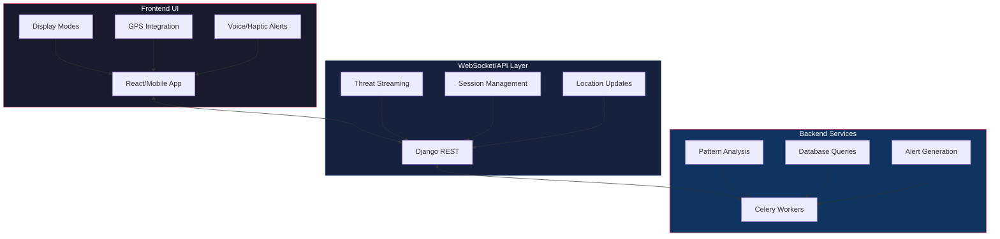
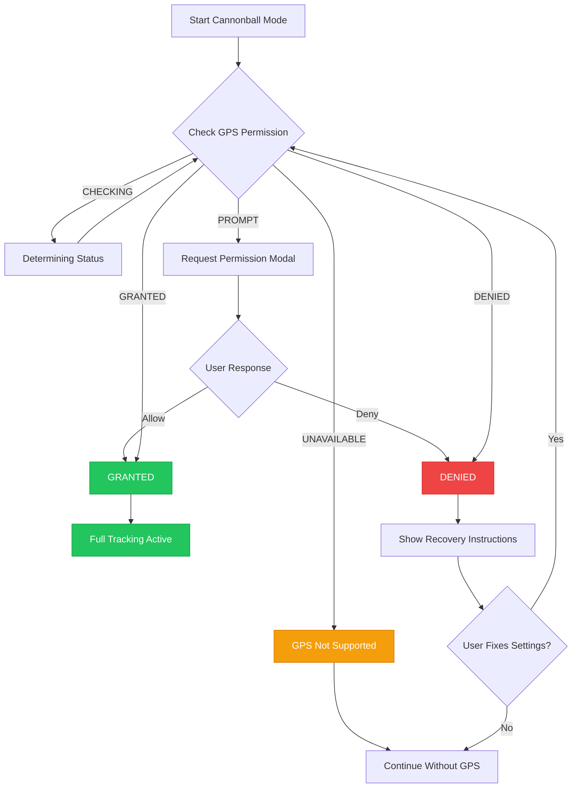
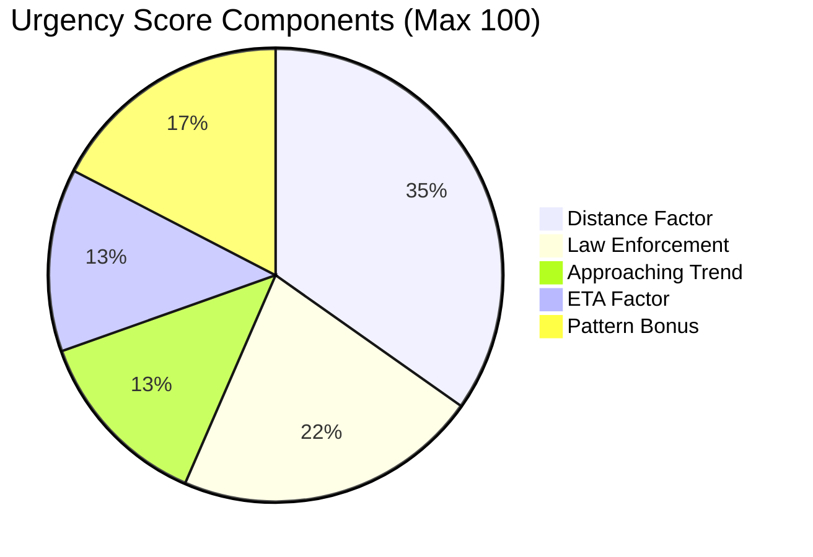
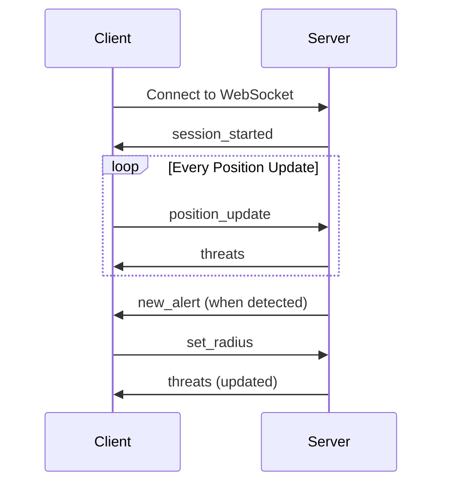

# Cannonball Mode

> **Enterprise-grade law enforcement aircraft detection and situational awareness system**

Cannonball Mode is SkySpy's advanced feature designed to detect, track, and alert users about potential law enforcement and surveillance aircraft in real-time. It provides a full-screen, high-contrast, glanceable interface optimized for situational awareness while driving.

---

## Feature Highlights

- **Real-time Detection** - Sub-second threat identification using ADS-B data streams
- **GPS-based Tracking** - Distance, bearing, and closing speed calculations from your position
- **Pattern Analysis** - Automatic detection of surveillance flight patterns
- **Multi-modal Alerts** - Voice, haptic, and visual alert notifications
- **Wake Lock** - Keeps screen on during active monitoring sessions
- **Voice Control** - Hands-free operation via voice commands

---

## What Cannonball Detects

> **Info:** Cannonball Mode identifies and tracks multiple categories of aircraft that may be of interest.

| Category | Examples | Icon |
|----------|----------|------|
| **Law Enforcement** | Police helicopters, CBP aircraft, DEA planes, FBI platforms | Red |
| **Traffic Enforcement** | Highway patrol aircraft, speed enforcement helicopters | Orange |
| **Surveillance Patterns** | Aircraft exhibiting circling, loitering, or grid-search behavior | Yellow |
| **Government Aircraft** | Federal agency aircraft (DHS, ICE, USMS, ATF) | Red |

---

## Architecture Overview



### Component Overview

| Layer | Component | Purpose |
|-------|-----------|---------|
| **Frontend** | `CannonballMode.jsx` | Main orchestration component |
| **Frontend** | `HeadsUpDisplay.jsx` | Minimal glanceable HUD |
| **Frontend** | `ThreatDisplay.jsx` | Detailed single-threat view |
| **Frontend** | `RadarView.jsx` | Full-screen radar visualization |
| **Backend** | `CannonballService` | Core threat analysis engine |
| **Backend** | `analyze_aircraft_patterns` | Celery task for real-time analysis |
| **Backend** | `CannonballConsumer` | WebSocket consumer for real-time updates |

---

## Aircraft Identification Methods

### 1. Callsign Pattern Matching

```python
# Example law enforcement patterns
LAW_ENFORCEMENT_PATTERNS = [
    (r'^N?(PAS|POL)\d*', 'Police Aviation', 'Police Air Support'),
    (r'^CHP\d*', 'Police Aviation', 'California Highway Patrol'),
    (r'^CBP\d*', 'Federal Law Enforcement', 'Customs & Border Protection'),
    (r'^DEA\d*', 'Federal Law Enforcement', 'Drug Enforcement Admin'),
    (r'^FBI\d*', 'Federal Law Enforcement', 'FBI'),
    (r'^TROOPER\d*', 'State Police', 'State Trooper'),
]
```

### 2. Operator ICAO Code Matching

```python
LE_OPERATORS = {
    'CBP': ('Federal Law Enforcement', 'Customs & Border Protection'),
    'USMS': ('Federal Law Enforcement', 'US Marshals Service'),
    'TSA': ('Federal Law Enforcement', 'Transportation Security Administration'),
    'USCG': ('Federal Law Enforcement', 'US Coast Guard'),
}
```

### 3. Aircraft Type Analysis

> **Warning:** These aircraft types are frequently used for law enforcement and surveillance operations.

| Category | Types |
|----------|-------|
| **Cessna** | C208, C206, C182, C172 |
| **King Air** | BE20, BE30, PC12 |
| **Helicopters** | EC35, EC45, H125, H135, H145, B407, B429 |

### 4. Behavioral Pattern Detection

Aircraft exhibiting these behaviors are flagged even without LE identifiers:

- Circling/orbiting patterns
- Loitering in an area
- Grid search patterns
- Highway parallel tracking

---

## GPS Integration

> **Success:** GPS is central to Cannonball Mode's threat assessment capabilities, enabling distance calculations, bearing detection, and closing speed analysis.

### GPS Hook (`useCannonballGPS`)

```javascript
const {
  position,        // {lat, lon} - Current GPS coordinates
  heading,         // User's heading/direction of travel
  accuracy,        // GPS accuracy in meters
  userSpeed,       // User's ground speed
  gpsError,        // Error message if GPS fails
  permissionState, // 'granted', 'denied', 'prompt', etc.
  gpsActive,       // Boolean - GPS tracking active
} = useCannonballGPS();
```

### GPS Permission Flow



### Permission States

| State | Icon | Description |
|-------|------|-------------|
| `CHECKING` | Spinner | Determining permission status |
| `PROMPT` | Location | Permission not yet requested |
| `REQUESTING` | Refresh | Awaiting user response |
| `GRANTED` | Check | Permission granted, tracking active |
| `DENIED` | X | Permission denied by user |
| `UNAVAILABLE` | Warning | Geolocation not supported |

### Feature Comparison: With vs Without GPS

| Feature | With GPS | Without GPS |
|---------|----------|-------------|
| Distance to threat | Yes | No |
| Bearing/direction | Yes | No |
| Closing speed | Yes | No |
| ETA calculation | Yes | No |
| Threat level | Full accuracy | Reduced accuracy |
| Pattern detection | Yes | Yes |

---

## Threat Detection and Calculation

### Threat Calculation Flow

```mermaid
flowchart LR
    subgraph Inputs["Data Inputs"]
        A[ADS-B Aircraft Data]
        B[User GPS Position]
        C[Backend Analysis]
        D[User Settings]
    end

    subgraph Processing["Processing"]
        E[Distance Calculation]
        F[Bearing Analysis]
        G[Pattern Detection]
        H[LE Database Lookup]
    end

    subgraph Output["Threat Output"]
        I[Threat Level]
        J[Urgency Score]
        K[Alert Triggers]
    end

    A --> E
    B --> E
    B --> F
    A --> G
    A --> H
    C --> G
    D --> I
    E --> I
    F --> I
    G --> I
    H --> I
    I --> J
    J --> K

    style Inputs fill:#1a1a2e,stroke:#e94560
    style Processing fill:#16213e,stroke:#0f3460
    style Output fill:#0f3460,stroke:#e94560
```



### Threat Level Badges

| Level | Description |
|-------|-------------|
| **CRITICAL** (Red) | Confirmed LE within 2nm, or any aircraft within 1nm with concerning patterns |
| **WARNING** (Orange) | Confirmed LE within 5nm, helicopter within 3nm, or surveillance type within 5nm |
| **INFO** (Green) | Any aircraft of interest beyond warning thresholds |

### Threat Object Structure

```javascript
{
  hex: "A12345",                    // ICAO transponder code
  callsign: "CHP123",               // Flight callsign
  category: "Police Aviation",       // Threat category
  description: "California Highway Patrol",
  distance_nm: 2.5,                 // Distance in nautical miles
  bearing: 45,                      // Bearing from user (degrees)
  direction: "NE",                  // Cardinal direction
  altitude: 1500,                   // Altitude in feet
  ground_speed: 120,                // Speed in knots
  track: 270,                       // Aircraft heading
  trend: "approaching",             // approaching/departing/holding
  threat_level: "warning",          // critical/warning/info
  is_law_enforcement: true,         // Confirmed LE
  is_helicopter: true,              // Helicopter type
  closingSpeed: 85,                 // Relative approach speed (kts)
  urgencyScore: 72,                 // 0-100 urgency rating
  patterns: [...],                  // Detected flight patterns
  behavior: {
    isCircling: true,
    isLoitering: false,
  }
}
```

### Urgency Score Calculation



```python
def calculate_urgency(distance, threat_level, le_info, trend, closing_speed, eta, patterns):
    score = 0

    # Distance factor (up to 40 points)
    if distance < 1: score += 40
    elif distance < 2: score += 30
    elif distance < 5: score += 20
    elif distance < 10: score += 10

    # Law enforcement (25 points)
    if le_info.is_law_enforcement: score += 25

    # Approaching (15 points)
    if trend == 'approaching': score += 15

    # ETA factor (up to 15 points)
    if eta < 60: score += 15
    elif eta < 180: score += 10
    elif eta < 300: score += 5

    # Pattern factors (up to 20 points)
    for pattern in patterns:
        if pattern.type == 'speed_trap': score += 20
        elif pattern.type == 'circling': score += 15
        elif pattern.type == 'grid_search': score += 15
        elif pattern.type == 'loitering': score += 10

    return min(100, score)
```

---

## Heads-Up Display (HUD)

> **Info:** The HUD provides a minimal, glanceable interface optimized for peripheral vision while driving.

### HUD Layout

The HUD displays:
- **Status indicators** - GPS, LIVE, API connection status
- **Threat count badge** - Number of active threats
- **Direction arrow** - Large rotating arrow pointing toward threat
- **Distance display** - Distance in NM (auto-converts to feet below 0.5nm)
- **Direction label** - Cardinal direction (N, NE, E, etc.)
- **Trend indicator** - APPROACHING, DEPARTING, or HOLDING
- **Behavior badges** - Pattern indicators like CIRCLING
- **Altitude and speed** - Aircraft telemetry data

### HUD Elements Guide

| Element | Description | Visual |
|---------|-------------|--------|
| **Direction Arrow** | Large rotating arrow pointing toward threat | Arrow icon |
| **Distance Display** | Distance in NM (auto-converts to feet below 0.5nm) | `2.5 NM` |
| **Direction Label** | Cardinal direction (N, NE, E, etc.) | `NE` |
| **Trend Indicator** | Movement status | `APPROACHING` |
| **Urgency Badge** | Numerical score with color coding | Orange 72 |
| **Behavior Badges** | Pattern indicators | `CIRCLING` |

### All Clear State

When no threats are detected, the HUD displays a large green checkmark with "ALL CLEAR" and "Scanning for threats..." message.

---

## Display Modes

Cannonball Mode offers four display modes, switchable via swipe gestures:

### 1. Single Mode (Default)

Detailed view of the highest-priority threat with optional mini-radar overlay.

- Full threat details
- Direction arrow
- Pattern badges
- Agency information
- Mini radar overlay

### 2. Heads-Up Mode

Minimal glanceable display with essential information only.

- Large direction arrow
- Distance only
- Threat count badge
- Optimized for peripheral vision

### 3. Grid Mode

Multi-threat dashboard showing up to 4 threats simultaneously.

- 2x2 grid layout
- Direction, distance, category per cell
- Tap to focus on specific threat
- Auto-cycle option

### 4. Radar Mode

Full-screen radar visualization centered on user position.

- SVG-based radar display
- Range rings (5nm, 10nm, max)
- Color-coded threat blips
- Heading indicator

---

## Alert System

### Alert Types

| Type | Trigger | Priority | Icon |
|------|---------|----------|------|
| `le_detected` | Law enforcement aircraft identified | Info/Warning | Police |
| `pattern_detected` | Surveillance pattern detected | Warning | Refresh |
| `closing_fast` | Aircraft closing \>50 kts | Warning | Lightning |
| `threat_escalated` | Threat level increased to critical | Critical | Arrow Up |
| `new_threat` | New threat enters monitoring zone | Info | New |
| `threat_cleared` | All threats departed | Info | Check |

### Voice Alerts

```javascript
const {
  announceThreat,      // Announce specific threat
  announceNewThreat,   // Announce new threat entry
  announceClear,       // Announce all clear
  stop,                // Stop current announcement
} = useVoiceAlerts({
  enabled: settings.voiceEnabled,
  rate: settings.voiceRate,  // 0.5 - 2.0
});
```

> **Example Voice Announcements:**
> - "Warning: Police helicopter, 2.5 miles northeast, approaching"
> - "Critical: Law enforcement overhead at 1500 feet"
> - "All clear. No threats detected."

### Haptic Feedback Patterns

| Event | Pattern | Intensity |
|-------|---------|-----------|
| New Threat | Short pulse | Normal |
| Critical Threat | Continuous vibration | Strong |
| Clear | Double pulse | Gentle |
| Error | Error pattern | Normal |
| Selection | Light tap | Gentle |

### Edge Indicators

Peripheral vision indicators that highlight screen edges based on threat direction:

- **Red glow** - Critical threat
- **Orange glow** - Warning threat
- Edge position indicates direction

---

## Pattern Detection

The backend service analyzes aircraft position history to detect surveillance patterns.

### Pattern Types

```mermaid
flowchart LR
    A[Position History] --> B{Pattern Analyzer}
    B --> C[Circling]
    B --> D[Loitering]
    B --> E[Grid Search]
    B --> F[Speed Trap]

    C --> G[Orbit Detection]
    D --> H[Dwell Time Analysis]
    E --> I[Turn Pattern Analysis]
    F --> J[Low Altitude + Orbit]

    style A fill:#1a1a2e,stroke:#e94560
    style B fill:#16213e,stroke:#0f3460
    style C fill:#ef4444,stroke:#dc2626,color:#fff
    style D fill:#f59e0b,stroke:#d97706,color:#fff
    style E fill:#3b82f6,stroke:#2563eb,color:#fff
    style F fill:#a855f7,stroke:#9333ea,color:#fff
```



### Circling Detection

Identifies aircraft orbiting a fixed point:

```python
def detect_circling(positions):
    # Calculate centroid
    center = average(positions)

    # Check distance variance from center
    distances = [distance(center, p) for p in positions]
    coefficient_variation = std_dev(distances) / mean(distances)

    # Calculate cumulative heading change
    heading_change = sum(bearing_changes(center, positions))
    circles_completed = heading_change / 360

    # Circling if:
    # - Low variance (< 0.4)
    # - Reasonable radius (0.1-2nm)
    # - At least 0.5 orbits completed
    return coefficient_variation < 0.4 and circles_completed >= 0.5
```

### Loitering Detection

Identifies aircraft remaining in an area for extended time:

```python
def detect_loitering(positions, threshold_minutes=10):
    duration = (last.timestamp - first.timestamp).minutes

    # Calculate bounding box
    lat_range = max(lats) - min(lats)
    lon_range = max(lons) - min(lons)
    max_range_nm = max(lat_range, lon_range) * 60

    # Loitering if:
    # - Duration >= threshold (10 min default)
    # - Stayed within 5nm box
    return duration >= threshold and max_range_nm <= 5
```

### Speed Trap Detection

Special case of circling at low altitude near potential traffic areas:

```python
is_speed_trap = is_circling and avg_altitude < 3000 and radius < 1.0
```

---

## Configuration Options

### Theme Options

| Theme | Description |
|-------|-------------|
| **Dark** | Standard dark theme |
| **AMOLED** | True black for OLED screens |
| **Red** | Night vision friendly |
| **High Contrast** | Maximum visibility |
| **Daylight** | Bright mode for outdoor use |

### Settings Reference

| Category | Setting | Default | Description |
|----------|---------|---------|-------------|
| **Alerts** | `voiceEnabled` | `true` | Enable voice announcements |
| | `voiceRate` | `1.0` | Speech rate (0.5 - 2.0) |
| | `hapticEnabled` | `true` | Enable vibration feedback |
| | `hapticIntensity` | `normal` | gentle / normal / strong |
| **Display** | `theme` | `dark` | Visual theme |
| | `displayMode` | `single` | single / grid / radar / headsUp |
| | `showMiniRadar` | `true` | Show radar overlay in single mode |
| **Filtering** | `threatRadius` | `25` | Max range in nautical miles (5-50) |
| | `showAllHelicopters` | `true` | Track all helicopters |
| | `showLawEnforcementOnly` | `false` | Only show confirmed LE |
| | `ignoreAboveAltitude` | `20000` | Ignore aircraft above this altitude (ft) |
| **Patterns** | `detectCircling` | `true` | Detect orbit patterns |
| | `detectLoitering` | `true` | Detect loitering behavior |
| | `loiterThreshold` | `10` | Minutes before flagging as loitering |

### Gesture Controls

| Gesture | Action | Icon |
|---------|--------|------|
| Swipe Left | Next display mode | Right Arrow |
| Swipe Right | Previous display mode | Left Arrow |
| Swipe Up | Open settings | Up Arrow |
| Swipe Down | Dismiss selected threat | Down Arrow |
| Double Tap | Toggle voice alerts | Double Tap |
| Tap Threat | Select/focus threat | Tap |

### Voice Commands

| Command | Action |
|---------|--------|
| "mute" | Disable voice alerts |
| "unmute" | Enable voice alerts |
| "mode single" | Switch to single mode |
| "mode grid" | Switch to grid mode |
| "mode radar" | Switch to radar mode |
| "mode HUD" | Switch to heads-up mode |
| "settings" | Open settings panel |
| "report" | Announce current threat |
| "dismiss" | Dismiss selected threat |
| "exit" | Exit Cannonball mode |

---

## API Reference

### REST Endpoints

#### `GET /api/v1/cannonball/threats`

Get current threats from real-time analysis.

**Query Parameters:**

| Parameter | Type | Description |
|-----------|------|-------------|
| `max_range` | float | Filter by maximum distance (nm) |
| `threat_level` | string | Filter by threat level |

**Response:**
```json
{
  "threats": [...],
  "count": 3,
  "total_detected": 5,
  "timestamp": "2024-01-15T12:00:00Z"
}
```

#### `POST /api/v1/cannonball/location`

Update user location for threat calculations.

```json
{
  "lat": 34.0522,
  "lon": -118.2437,
  "heading": 270,
  "speed": 65
}
```

#### `POST /api/v1/cannonball/activate`

Activate Cannonball mode session.

#### `DELETE /api/v1/cannonball/activate`

Deactivate Cannonball mode session.

> **Additional Endpoints:**
> - `GET /api/v1/cannonball/sessions/` - List tracking sessions
> - `GET /api/v1/cannonball/patterns/` - List detected flight patterns
> - `GET /api/v1/cannonball/alerts/` - List generated alerts
> - `GET /api/v1/cannonball/known-aircraft/` - List known LE aircraft
> - `GET /api/v1/cannonball/stats/summary/` - Get statistics summary

---

## WebSocket Integration

### Connection

```javascript
const wsUrl = `wss://api.example.com/ws/cannonball/`;
const ws = new WebSocket(wsUrl);
```

### Message Flow



### Client Messages

**Position Update:**
```json
{
  "type": "position_update",
  "lat": 34.0522,
  "lon": -118.2437,
  "heading": 270,
  "speed": 65
}
```

**Set Radius:**
```json
{
  "type": "set_radius",
  "radius_nm": 25
}
```

### Server Messages

**Threats Update:**
```json
{
  "type": "threats",
  "data": [...],
  "count": 3,
  "timestamp": "2024-01-15T12:00:00Z"
}
```

**New Alert:**
```json
{
  "type": "new_alert",
  "data": {
    "id": 456,
    "alert_type": "closing_fast",
    "priority": "warning",
    "title": "Closing: CHP123",
    "message": "Aircraft closing at 85 kts"
  }
}
```

---

## Data Models

### CannonballSession

| Field | Type | Description |
|-------|------|-------------|
| `icao_hex` | string | Unique transponder code |
| `callsign` | string | Flight callsign |
| `identification_method` | string | How identified |
| `threat_level` | string | Current threat level |
| `urgency_score` | float | 0-100 urgency score |
| `is_active` | bool | Session still active |

### CannonballPattern

| Field | Type | Description |
|-------|------|-------------|
| `pattern_type` | string | circling, loitering, grid_search, speed_trap |
| `confidence` | string | low, medium, high |
| `center_lat` | float | Pattern center latitude |
| `center_lon` | float | Pattern center longitude |
| `radius_nm` | float | Pattern radius |

### CannonballKnownAircraft

| Field | Type | Description |
|-------|------|-------------|
| `icao_hex` | string | Unique transponder code |
| `registration` | string | FAA N-number |
| `agency_name` | string | Operating agency name |
| `agency_type` | string | federal, state, local, military |
| `verified` | bool | Community verified |

---

## Use Cases

### Highway Travel

Monitor for traffic enforcement aircraft while driving on highways.

**Recommended settings:**
- `threatRadius`: 15
- `showLawEnforcementOnly`: true
- `ignoreAboveAltitude`: 10000
- `displayMode`: 'headsUp'

### Urban Monitoring

Track police helicopter activity in metropolitan areas.

**Recommended settings:**
- `threatRadius`: 10
- `showAllHelicopters`: true
- `loiterThreshold`: 5
- `displayMode`: 'radar'

### Journalism

Situational awareness during coverage of public events.

**Recommended settings:**
- `threatRadius`: 25
- `persistent`: true
- `autoLogCritical`: true
- `showAgencyInfo`: true

### Long-Distance Travel

Monitoring during extended road trips.

**Recommended settings:**
- `threatRadius`: 50
- `ignoreAboveAltitude`: 15000
- `voiceRate`: 0.8
- `displayMode`: 'single'

---

## Privacy and Security

> **Warning:** Your Privacy Matters - Cannonball Mode is designed with privacy-first principles. Your location data is protected and handled responsibly.

### Data Handling

| Data Type | Storage | Retention |
|-----------|---------|-----------|
| **GPS Location** | Processed locally; server only when backend enabled | Ephemeral |
| **Position History** | Redis cache | 10-minute TTL |
| **Session Data** | Database | Configurable (default 30 days) |
| **Alert History** | Database | Configurable retention |

### Privacy Mode Settings

```javascript
{
  useBackend: false,  // Local-only analysis (no server communication)
  persistent: false,  // Ephemeral mode (no history logging)
}
```

> **Security Measures:**
> - All API endpoints support JWT authentication
> - WebSocket connections are authenticated
> - Rate limiting on location updates
> - No PII collected or stored

---

## Celery Task Schedule

Background tasks that power Cannonball Mode:

| Task | Interval | Description |
|------|----------|-------------|
| `analyze_aircraft_patterns` | 5-10 seconds | Real-time threat analysis |
| `cleanup_cannonball_sessions` | 5 minutes | Deactivate stale sessions |
| `cleanup_old_patterns` | Daily | Delete old patterns |
| `aggregate_cannonball_stats` | Hourly | Generate statistics |

---

## Troubleshooting

> **Warning - GPS Issues:**
> - **Problem:** GPS permission denied
> - **Solution:** Check browser/device settings, use recovery instructions in GPS modal
>
> - **Problem:** Poor GPS accuracy
> - **Solution:** Move to area with clear sky view, wait for GPS lock

> **Warning - Connection Issues:**
> - **Problem:** WebSocket disconnects frequently
> - **Solution:** Check network stability, system will auto-reconnect with exponential backoff
>
> - **Problem:** Threats not updating
> - **Solution:** Verify backend connection status in status bar, check API connectivity

> **Warning - Detection Issues:**
> - **Problem:** Known LE aircraft not flagged
> - **Solution:** Report via community submission for database update
>
> - **Problem:** Too many false positives
> - **Solution:** Enable `showLawEnforcementOnly`, adjust `threatRadius`

---

## Version History

| Version | Date | Changes |
|---------|------|---------|
| 1.0.0 | 2024-01 | Initial release |
| 1.1.0 | 2024-02 | Added pattern detection |
| 1.2.0 | 2024-03 | WebSocket real-time updates |
| 2.0.0 | 2024-06 | Heads-up display, voice control |

---

> **Disclaimer:** Cannonball Mode is designed for situational awareness and educational purposes. Always obey traffic laws and drive responsibly.
