# Statistics & Analytics

> **Transform your aircraft tracking data into actionable insights**

SkySpy provides comprehensive statistics and analytics capabilities for tracking aircraft activity, analyzing flight patterns, monitoring system performance, and gamification features. This guide covers all available metrics, real-time streaming, historical analysis, and data export options.

---

## Overview

### Architecture


### Components

| Component | Purpose | Technology |
|-----------|---------|------------|
| **REST API** | Request-response statistics | Django REST Framework |
| **WebSocket** | Real-time streaming updates | Django Channels |
| **Dashboard** | Interactive visualizations | React + Recharts |
| **Cache** | Performance optimization | Redis |

> **Pro Tip:** All statistics are cached for performance with configurable TTLs, and most support customizable time ranges.

---

## Aircraft Statistics

Core metrics about tracked aircraft within your coverage area.

### Live Metrics Dashboard

| Metric | Icon | Description |
|--------|------|-------------|
| **Total Aircraft** | plane | Currently tracked aircraft count with real-time updates |
| **With Position** | map-pin | Aircraft transmitting valid GPS coordinates |
| **Military** | shield | Active military aircraft in coverage area |
| **Emergencies** | triangle-exclamation | Aircraft squawking 7500/7600/7700 |

### Altitude Distribution

| Band | Altitude Range | Icon | Typical Traffic |
|:----:|----------------|:----:|-----------------|
| Ground | Ground | `ground` | Taxiing, parked aircraft |
| Low | Below 10,000 ft | `low` | Departures, arrivals, GA |
| Medium | 10,000 - 30,000 ft | `medium` | Climbing, regional flights |
| High | Above 30,000 ft | `high` | Cruise altitude, long-haul |

<details>
<summary>Example Response</summary>

```json
{
  "total": 42,
  "with_position": 38,
  "military": 3,
  "emergency_squawks": [],
  "altitude": {
    "ground": 2,
    "low": 8,
    "medium": 18,
    "high": 14
  }
}
```

</details>

---

## Top Aircraft Leaderboards

Real-time leaderboards computed from currently tracked aircraft.

| Rank | Closest | Fastest | Highest |
|:----:|-----------|-----------|-----------|
| 1st | 2.3 nm | 612 kts | 45,000 ft |
| 2nd | 4.8 nm | 585 kts | 43,500 ft |
| 3rd | 7.1 nm | 560 kts | 42,000 ft |

| Leaderboard | Icon | Metric | Description |
|-------------|------|--------|-------------|
| **Closest** | crosshairs | Distance (nm) | Nearest aircraft to your receiver location |
| **Fastest** | gauge-high | Ground Speed (kts) | Highest velocity aircraft currently tracked |
| **Highest** | arrow-up | Altitude (ft) | Aircraft at highest cruise altitude |

---

## Flight Patterns

Flight pattern analytics provide insights into traffic patterns over time.

### Busiest Hours Heatmap

Hourly activity distribution for visualization as a heatmap.


<details>
<summary>API: GET /api/v1/stats/flight-patterns/busiest-hours</summary>

**Response Fields:**

| Field | Type | Description |
|-------|------|-------------|
| `busiest_hours[]` | array | Hourly data (0-23) |
| `peak_hour` | integer | Hour with most activity |
| `peak_aircraft_count` | integer | Max aircraft during peak |
| `quietest_hour` | integer | Hour with least activity |
| `day_night_ratio` | float | Daytime to nighttime ratio |

</details>

### Top Routes

Most frequent origin-destination pairs based on ACARS data and callsign analysis.

**Request:**

```bash
GET /api/v1/flight-patterns/routes?hours=24&limit=20
```

**Response:**

```json
{
  "routes": [
    {
      "origin": "KJFK",
      "destination": "KLAX",
      "count": 45,
      "airlines": ["AAL", "UAL", "DAL"]
    }
  ],
  "total_routes": 156,
  "time_range_hours": 24
}
```

| Parameter | Type | Default | Description |
|-----------|------|---------|-------------|
| `hours` | integer | 24 | Time range in hours |
| `limit` | integer | 20 | Maximum routes to return |

### Aircraft Types Distribution

<details>
<summary>API: GET /api/v1/flight-patterns/aircraft-types</summary>

**Response includes:**

| Field | Description |
|-------|-------------|
| `type_code` | ICAO type designator (e.g., "B738") |
| `type_name` | Full type name |
| `count` | Session count |
| `unique_aircraft` | Unique ICAO hex codes |
| `military_pct` | Percentage military |
| `avg_duration_min` | Average tracking duration |

</details>

### Flight Duration by Type

<details>
<summary>API: GET /api/v1/flight-patterns/duration-by-type</summary>

```json
{
  "duration_by_type": [
    {
      "type": "B738",
      "avg_minutes": 45.2,
      "min_minutes": 5.0,
      "max_minutes": 180.5,
      "session_count": 234
    }
  ]
}
```

</details>

---

## Geographic Statistics

Geographic analytics based on aircraft registration and origin data.

### Countries of Origin

Breakdown by country based on registration prefix.

| Prefix | Country | Example |
|:------:|---------|---------|
| N | United States | N12345 |
| G- | United Kingdom | G-ABCD |
| D- | Germany | D-AIBC |
| F- | France | F-GHIJ |
| JA | Japan | JA8088 |

**Request:**

```bash
GET /api/v1/stats/geographic/countries
```

**Response:**

```json
{
  "countries": [
    {
      "country": "United States",
      "country_code": "US",
      "count": 234,
      "military_count": 12,
      "military_pct": 5.1
    }
  ],
  "total_countries": 28
}
```

### Airlines/Operators

<details>
<summary>API: GET /api/v1/stats/geographic/operators</summary>

**Response includes:**
- `operator` - Operator name
- `operator_icao` - ICAO airline code
- `aircraft_count` - Unique aircraft
- `session_count` - Total tracking sessions

</details>

### Connected Airports

Airports most connected to your coverage area based on ACARS mentions.

<details>
<summary>Example Response</summary>

```json
{
  "airports": [
    {
      "icao": "KJFK",
      "iata": "JFK",
      "name": "John F Kennedy International Airport",
      "country": "United States",
      "count": 156
    }
  ]
}
```

</details>

### Military vs Civilian

**Endpoint:** `GET /api/v1/stats/geographic/military-breakdown`

Returns military/civilian split by country with counts and percentages.

---

## System Performance

### Tracking Quality Metrics

Quality metrics for your ADS-B reception.

| Metric | Icon | Target | Description |
|--------|------|--------|-------------|
| **Quality Score** | gauge | greater than 80 | Composite score (0-100) |
| **Update Rate** | bolt | greater than 1.0 Hz | Position updates per second |
| **Coverage** | signal | greater than 90% | Expected positions received |
| **RSSI** | wave-square | greater than -20 dB | Average signal strength |

### Quality Grades

| Grade | Badge | Completeness | Update Rate |
|-------|:-----:|--------------|-------------|
| **Excellent** | 5 stars | 90% or higher | 10/min or higher |
| **Good** | 4 stars | 70% or higher | 6/min or higher |
| **Fair** | 3 stars | 50% or higher | Any |
| **Poor** | 1 star | less than 50% | Any |

<details>
<summary>API: GET /api/v1/stats/tracking-quality/session/icao_hex</summary>

```json
{
  "icao_hex": "A1B2C3",
  "callsign": "UAL123",
  "session": {
    "first_seen": "2024-01-15T10:30:00Z",
    "last_seen": "2024-01-15T11:45:00Z",
    "duration_minutes": 75.0,
    "total_positions": 892
  },
  "quality": {
    "grade": "excellent",
    "update_rate_per_min": 11.89,
    "expected_positions": 900,
    "completeness_pct": 99.1
  },
  "gaps": {
    "total_count": 2,
    "total_time_seconds": 45,
    "gap_percentage": 1.0,
    "max_gap_seconds": 30
  },
  "signal": {
    "avg_rssi": -18.5,
    "min_rssi": -25.2,
    "max_rssi": -12.1
  }
}
```

</details>

### Coverage Gaps Analysis

**Endpoint:** `GET /api/v1/stats/tracking-quality/gaps`

| Parameter | Type | Default | Description |
|-----------|------|---------|-------------|
| `hours` | integer | 24 | Time range to analyze |
| `limit` | integer | 100 | Max sessions to analyze |

---

## Antenna Metrics

> **Beta Feature** - Advanced antenna performance analytics

### Polar Coverage Plot

Reception data by bearing (direction) for antenna pattern visualization.

```mermaid
pie showData
    title "Coverage by Quadrant"
    "North (0-90°)" : 28
    "East (90-180°)" : 24
    "South (180-270°)" : 22
    "West (270-360°)" : 26
```



<details>
<summary>Data Structure</summary>

```json
{
  "bearing_data": [
    {
      "bearing_start": 0,
      "bearing_end": 10,
      "count": 1234,
      "max_distance_nm": 185.5,
      "avg_rssi": -18.2
    }
  ],
  "summary": {
    "coverage_pct": 94,
    "total_sightings": 45678,
    "sectors_with_data": 34
  }
}
```

</details>

### RSSI vs Distance Correlation

Signal strength analysis by distance for antenna performance evaluation.

| Band | Distance | Avg RSSI | Status |
|------|----------|----------|:------:|
| Near | 0-25 nm | -12.5 dB | Good |
| Mid | 25-50 nm | -16.2 dB | Good |
| Far | 50-100 nm | -20.8 dB | Fair |
| Extended | 100+ nm | -25.5 dB | Marginal |

<details>
<summary>Full Data Structure</summary>

```json
{
  "scatter_data": [
    {"distance_nm": 50.5, "rssi": -15.2},
    {"distance_nm": 120.3, "rssi": -22.8}
  ],
  "band_statistics": [
    {"band": "0-25nm", "avg_rssi": -12.5, "count": 500},
    {"band": "25-50nm", "avg_rssi": -16.2, "count": 800}
  ],
  "trend_line": {
    "slope": -0.05,
    "intercept": -10.5,
    "interpretation": "Normal signal degradation with distance"
  },
  "overall_statistics": {
    "avg_rssi": -17.5,
    "min_rssi": -28.0,
    "max_rssi": -8.5
  }
}
```

</details>

---

## Real-Time Stats Streaming

SkySpy provides WebSocket-based real-time statistics streaming.

### Connection Flow


### Available Stat Types

#### Flight Stats

| Stat Type | Description |
|-----------|-------------|
| `flight_patterns` | Flight pattern statistics |
| `geographic` | Geographic breakdown |
| `busiest_hours` | Hourly activity |
| `common_aircraft_types` | Aircraft types seen |

#### Geographic Stats

| Stat Type | Description |
|-----------|-------------|
| `countries` | Countries of origin |
| `airlines` | Airline frequency |
| `airports` | Connected airports |

#### Session Stats

| Stat Type | Description |
|-----------|-------------|
| `tracking_quality` | Tracking metrics |
| `coverage_gaps` | Coverage gap analysis |
| `engagement` | Engagement statistics |

#### Time Stats

| Stat Type | Description |
|-----------|-------------|
| `week_comparison` | Week-over-week stats |
| `seasonal_trends` | Monthly/seasonal trends |
| `day_night` | Day vs night traffic |
| `weekend_weekday` | Weekend vs weekday |
| `daily_totals` | Daily time series |
| `weekly_totals` | Weekly time series |
| `monthly_totals` | Monthly time series |

#### ACARS Stats

| Stat Type | Description |
|-----------|-------------|
| `acars_stats` | ACARS message stats |
| `acars_trends` | ACARS trends |
| `acars_airlines` | ACARS by airline |

#### Gamification Stats

| Stat Type | Description |
|-----------|-------------|
| `personal_records` | Personal records |
| `rare_sightings` | Notable sightings |
| `collection_stats` | Collection progress |
| `spotted_by_type` | Spotted by type |
| `spotted_by_operator` | Spotted by operator |
| `streaks` | Sighting streaks |
| `daily_stats` | Daily gamification |
| `lifetime_stats` | Lifetime totals |

### WebSocket Messages

**Subscribe:**

```json
{
  "type": "stats.subscribe",
  "stat_types": ["flight_patterns", "tracking_quality"]
}
```

**Request Data:**

```json
{
  "type": "stats.request",
  "stat_type": "flight_patterns",
  "filters": {
    "hours": 24,
    "limit": 50
  },
  "request_id": "req-123"
}
```

**Set Filters:**

```json
{
  "type": "stats.set_filters",
  "filters": {
    "hours": 48,
    "aircraft_type": "B738"
  }
}
```

**Refresh Cache:**

```json
{
  "type": "stats.refresh",
  "stat_type": "geographic"
}
```

---

## Historical Data Analysis

### Trends Over Time

**Request:**

```bash
GET /api/v1/history/trends?hours=24&interval=hour
```

**Response:**

```json
{
  "intervals": [
    {
      "timestamp": "2024-01-15T10:00:00Z",
      "unique_aircraft": 42,
      "total_positions": 1234,
      "military_count": 3
    }
  ],
  "summary": {
    "total_unique_aircraft": 156,
    "peak_concurrent": 52,
    "total_intervals": 24
  }
}
```

| Parameter | Type | Default | Description |
|-----------|------|---------|-------------|
| `hours` | integer | 24 | Time range |
| `interval` | string | "hour" | Grouping (hour/day) |

### Top Performers

**Endpoint:** `GET /api/v1/history/top`

| Category | Icon | Description |
|----------|:----:|-------------|
| `longest_tracked` | stopwatch | Longest session duration |
| `furthest_distance` | crosshairs | Maximum distance from receiver |
| `highest_altitude` | arrow-up | Maximum altitude reached |
| `closest_approach` | location-dot | Minimum distance to receiver |

<details>
<summary>Example Response</summary>

```json
{
  "longest_tracked": [
    {
      "icao_hex": "A1B2C3",
      "callsign": "UAL123",
      "aircraft_type": "B738",
      "duration_min": 185.5,
      "is_military": false
    }
  ],
  "furthest_distance": [...],
  "highest_altitude": [...],
  "closest_approach": [...]
}
```

</details>

### Distance Analytics

**Endpoint:** `GET /api/v1/history/analytics/distance`

<details>
<summary>Response Structure</summary>

```json
{
  "statistics": {
    "mean_nm": 45.2,
    "median_nm": 38.5,
    "max_nm": 245.8,
    "percentile_90": 125.0
  },
  "distribution": {
    "0-25nm": 234,
    "25-50nm": 567,
    "50-100nm": 890,
    "100-150nm": 345,
    "150+nm": 123
  }
}
```

</details>

### Speed Analytics

**Endpoint:** `GET /api/v1/history/analytics/speed`

<details>
<summary>Response Structure</summary>

```json
{
  "statistics": {
    "mean_kt": 285,
    "max_kt": 612,
    "percentile_90": 480
  },
  "fastest_sessions": [
    {
      "icao_hex": "A1B2C3",
      "callsign": "UAL789",
      "max_speed": 612
    }
  ]
}
```

</details>

### Correlation Analysis

**Endpoint:** `GET /api/v1/history/analytics/correlation`


---

## Engagement Statistics

### Peak Tracking Periods

<details>
<summary>API: GET /api/v1/stats/engagement/peak-tracking</summary>

```json
{
  "peak_periods": [
    {
      "hour": "2024-01-15T14:00:00Z",
      "unique_aircraft": 52,
      "position_count": 3456,
      "military_count": 4
    }
  ],
  "summary": {
    "avg_aircraft_per_hour": 35.2,
    "max_aircraft_in_hour": 52
  }
}
```

</details>

### Return Visitors

Aircraft seen multiple times within the time range.

| Parameter | Type | Default | Description |
|-----------|------|---------|-------------|
| `hours` | integer | 24 | Time range |
| `min_sessions` | integer | 2 | Minimum session count |
| `limit` | integer | 30 | Results limit |

<details>
<summary>Response Example</summary>

```json
{
  "return_visitors": [
    {
      "icao_hex": "A1B2C3",
      "registration": "N12345",
      "session_count": 5,
      "total_positions": 2345,
      "first_session": "2024-01-15T06:00:00Z",
      "last_session": "2024-01-15T18:00:00Z"
    }
  ],
  "stats": {
    "total_unique_aircraft": 156,
    "returning_aircraft": 23,
    "return_rate_pct": 14.7
  }
}
```

</details>

### Most Watched Aircraft

**Endpoint:** `GET /api/v1/stats/engagement/most-watched`

---

## Gamification Features

> **Level up your aircraft spotting experience!**

SkySpy includes gamification elements to make aircraft spotting more engaging.

### Personal Records

Track your best achievements across multiple categories.

| Record | Icon | Description | Unit |
|--------|------|-------------|------|
| **Max Distance** | bullseye | Furthest aircraft tracked | nautical miles |
| **Max Altitude** | arrow-up | Highest aircraft tracked | feet |
| **Max Speed** | gauge-high | Fastest aircraft observed | knots |
| **Longest Session** | stopwatch | Longest tracking duration | minutes |
| **Most Positions** | chart-line | Most positions in single session | count |
| **Closest Approach** | location-dot | Nearest to receiver | nautical miles |
| **Max Climb** | arrow-trend-up | Fastest climb rate | ft/min |
| **Max Descent** | arrow-trend-down | Fastest descent rate | ft/min |

<details>
<summary>API Response Example</summary>

```json
{
  "records": [
    {
      "record_type": "max_distance",
      "record_type_display": "Maximum Distance",
      "icao_hex": "A1B2C3",
      "callsign": "UAL123",
      "aircraft_type": "B77W",
      "registration": "N12345",
      "operator": "United Airlines",
      "value": 245.8,
      "achieved_at": "2024-01-15T14:30:00Z",
      "previous_value": 220.5,
      "previous_icao_hex": "B2C3D4"
    }
  ]
}
```

</details>

### Rare Sightings

Notable and rare aircraft detections.

| Parameter | Type | Default | Description |
|-----------|------|---------|-------------|
| `hours` | integer | 24 | Time range |
| `limit` | integer | 50 | Maximum results |
| `include_acknowledged` | boolean | false | Include dismissed |

#### Rarity Types and Scores

| Type | Icon | Description | Score |
|------|:----:|-------------|:-----:|
| `first_hex` | new | First time tracking this aircraft | 3 |
| `military` | shield | Military aircraft | 4 |
| `air_ambulance` | ambulance | Medical evacuation flights | 5 |
| `law_enforcement` | badge | Police/Coast Guard aircraft | 5-6 |
| `rare_type` | gem | Rare aircraft type | 6-10 |
| `test_flight` | flask | Manufacturer test flights | 7 |
| `government` | landmark | Government aircraft (e.g., N1xx) | 9 |

#### Notable Registration Patterns

| Pattern | Description | Example |
|---------|-------------|---------|
| `N1xx` | US Government | N100, N175 |
| `SAM`, `AF1`, `AF2` | Air Force One/Two | Executive transport |
| `N7xx` | Boeing Test | N787BX |
| `F-WW*` | Airbus Test | F-WWDD |
| Contains "NASA" | NASA Research | NASA941 |

#### Ultra-Rare Aircraft Types

| Aircraft | Rarity Score | Description |
|----------|:------------:|-------------|
| Boeing E-4B Nightwatch | 10 | "Doomsday Plane" |
| Lockheed U-2 | 9 | High-altitude reconnaissance |
| Boeing E-6B Mercury | 9 | Airborne command post |
| Boeing B-52 | 8 | Strategic bomber |
| Airbus A380 | 7 | Superjumbo |
| Boeing 747-8 | 6 | Jumbo variant |

### Collection Progress

**Endpoint:** `GET /api/v1/stats/gamification/collection`

<details>
<summary>Response Example</summary>

```json
{
  "total_unique_aircraft": 1234,
  "military_aircraft": 156,
  "unique_types": 89,
  "unique_operators": 234,
  "unique_countries": 45,
  "first_aircraft": {
    "icao_hex": "A1B2C3",
    "registration": "N12345",
    "first_seen": "2023-06-15T10:00:00Z"
  },
  "most_seen": [
    {
      "icao_hex": "B2C3D4",
      "registration": "N54321",
      "operator": "Southwest Airlines",
      "times_seen": 156
    }
  ]
}
```

</details>

### Sighting Streaks

Track consecutive day streaks for various categories.

| Streak Type | Icon | Qualification |
|-------------|:----:|---------------|
| `any_sighting` | calendar | Any aircraft tracked |
| `military` | shield | At least one military aircraft |
| `unique_new` | new | A new unique aircraft |
| `high_altitude` | rocket | Aircraft at 40,000+ ft |
| `long_range` | crosshairs | Aircraft at 100+ nm |
| `rare_type` | gem | A rare aircraft type |

<details>
<summary>Response Example</summary>

```json
{
  "streaks": [
    {
      "streak_type": "any_sighting",
      "streak_type_display": "Daily Sighting",
      "current_streak_days": 15,
      "current_streak_start": "2024-01-01",
      "last_qualifying_date": "2024-01-15",
      "best_streak_days": 45,
      "best_streak_start": "2023-10-01",
      "best_streak_end": "2023-11-15"
    }
  ]
}
```

</details>

### Daily Statistics

**Endpoint:** `GET /api/v1/stats/gamification/daily?days=30`

<details>
<summary>Response Example</summary>

```json
{
  "days": [
    {
      "date": "2024-01-15",
      "unique_aircraft": 156,
      "new_aircraft": 12,
      "total_sessions": 234,
      "total_positions": 45678,
      "military_count": 8,
      "max_distance_nm": 185.5,
      "max_altitude": 45000,
      "max_speed": 580,
      "top_types": {"B738": 45, "A320": 38},
      "top_operators": {"United": 25, "American": 22}
    }
  ]
}
```

</details>

### Lifetime Statistics

**Endpoint:** `GET /api/v1/stats/gamification/lifetime`

| Metric | Icon | Description |
|--------|------|-------------|
| **Total Aircraft** | plane | All-time unique aircraft spotted |
| **Total Sessions** | clock | Cumulative tracking sessions |
| **Total Positions** | map-pin | Position updates received |

<details>
<summary>Full Response</summary>

```json
{
  "total_unique_aircraft": 12345,
  "total_sessions": 56789,
  "total_positions": 2345678,
  "unique_aircraft_types": 156,
  "unique_operators": 456,
  "unique_countries": 78,
  "active_tracking_days": 365,
  "total_rare_sightings": 234,
  "all_time_records": {
    "max_distance": {"value": 285.5, "icao_hex": "A1B2C3"},
    "max_altitude": {"value": 51000, "icao_hex": "B2C3D4"}
  },
  "first_sighting": {
    "icao_hex": "C3D4E5",
    "timestamp": "2023-01-01T10:00:00Z"
  }
}
```

</details>

---

## API Endpoints Reference

### Stats API

| Endpoint | Method | Description |
|----------|:------:|-------------|
| `/api/v1/stats/tracking-quality` | `GET` | Tracking quality metrics |
| `/api/v1/stats/tracking-quality/gaps` | `GET` | Coverage gaps analysis |
| `/api/v1/stats/tracking-quality/session/{icao_hex}` | `GET` | Session-specific quality |
| `/api/v1/stats/engagement` | `GET` | Engagement statistics |
| `/api/v1/stats/engagement/most-watched` | `GET` | Most favorited aircraft |
| `/api/v1/stats/engagement/return-visitors` | `GET` | Returning aircraft |
| `/api/v1/stats/engagement/peak-tracking` | `GET` | Peak concurrent periods |
| `/api/v1/stats/flight-patterns` | `GET` | Flight pattern analytics |
| `/api/v1/stats/flight-patterns/routes` | `GET` | Top routes |
| `/api/v1/stats/flight-patterns/busiest-hours` | `GET` | Hourly heatmap data |
| `/api/v1/stats/flight-patterns/aircraft-types` | `GET` | Aircraft types breakdown |
| `/api/v1/stats/flight-patterns/duration-by-type` | `GET` | Duration by type |
| `/api/v1/stats/geographic` | `GET` | All geographic stats |
| `/api/v1/stats/geographic/countries` | `GET` | Countries breakdown |
| `/api/v1/stats/geographic/operators` | `GET` | Operators frequency |
| `/api/v1/stats/geographic/airports` | `GET` | Connected airports |
| `/api/v1/stats/geographic/military-breakdown` | `GET` | Military vs civilian |
| `/api/v1/stats/combined` | `GET` | All stats combined |
| `/api/v1/stats/combined/summary` | `GET` | High-level summary |

### History API

| Endpoint | Method | Description |
|----------|:------:|-------------|
| `/api/v1/history/stats` | `GET` | Historical statistics |
| `/api/v1/history/trends` | `GET` | Activity trends |
| `/api/v1/history/top` | `GET` | Top performers |
| `/api/v1/history/analytics/distance` | `GET` | Distance analytics |
| `/api/v1/history/analytics/speed` | `GET` | Speed analytics |
| `/api/v1/history/analytics/correlation` | `GET` | Correlation analysis |

### Favorites API

| Endpoint | Method | Description |
|----------|:------:|-------------|
| `/api/v1/stats/favorites` | `GET` | List user favorites |
| `/api/v1/stats/favorites/toggle/{icao_hex}` | `POST` | Add/remove favorite |
| `/api/v1/stats/favorites/check/{icao_hex}` | `GET` | Check if favorited |
| `/api/v1/stats/favorites/{id}/notes` | `PATCH` | Update notes |

### Gamification API

| Endpoint | Method | Description |
|----------|:------:|-------------|
| `/api/v1/stats/gamification/records` | `GET` | Personal records |
| `/api/v1/stats/gamification/rare-sightings` | `GET` | Rare sightings |
| `/api/v1/stats/gamification/collection` | `GET` | Collection progress |
| `/api/v1/stats/gamification/spotted/types` | `GET` | Spotted by type |
| `/api/v1/stats/gamification/spotted/operators` | `GET` | Spotted by operator |
| `/api/v1/stats/gamification/streaks` | `GET` | Sighting streaks |
| `/api/v1/stats/gamification/daily` | `GET` | Daily stats |
| `/api/v1/stats/gamification/lifetime` | `GET` | Lifetime totals |

### Common Query Parameters

| Parameter | Type | Default | Description |
|-----------|------|---------|-------------|
| `hours` | integer | 24 | Time range in hours |
| `refresh` | boolean | false | Force cache refresh |
| `limit` | integer | varies | Maximum results |
| `military_only` | boolean | false | Filter to military only |

---

## Exporting Data

### JSON Export

All API endpoints return JSON data that can be exported directly.

**Flight Patterns:**

```bash
# Export flight patterns for last 48 hours
curl -H "Authorization: Bearer YOUR_TOKEN" \
  "https://your-server/api/v1/stats/flight-patterns?hours=48" \
  > flight_patterns.json
```

**Gamification:**

```bash
# Export gamification stats
curl -H "Authorization: Bearer YOUR_TOKEN" \
  "https://your-server/api/v1/stats/gamification/lifetime" \
  > lifetime_stats.json
```

**Combined:**

```bash
# Export all stats
curl -H "Authorization: Bearer YOUR_TOKEN" \
  "https://your-server/api/v1/stats/combined" \
  > all_stats.json
```

### CSV Export

For tabular data, convert JSON to CSV:

```bash
# Using jq to convert routes to CSV
curl -s -H "Authorization: Bearer YOUR_TOKEN" \
  "https://your-server/api/v1/flight-patterns/routes" | \
  jq -r '.routes[] | [.origin, .destination, .count] | @csv' \
  > routes.csv
```

**Output format:**

```csv
"KJFK","KLAX",45
"KORD","KJFK",38
"KLAX","KSFO",32
```

### Scheduled Exports

Use Celery tasks for scheduled data exports:

```python
from skyspy.tasks import export_daily_stats

# Schedule via Celery Beat
CELERY_BEAT_SCHEDULE = {
    'export-daily-stats': {
        'task': 'skyspy.tasks.export_daily_stats',
        'schedule': crontab(hour=0, minute=5),  # 12:05 AM daily
    },
}
```

---

## Frontend Integration

### Using the Stats Hook

The `useStatsData` hook provides access to all statistics data:

```jsx
import { useStatsData } from '../hooks';

function MyStatsComponent({ apiBase, wsRequest, wsConnected }) {
  const data = useStatsData({
    apiBase,
    wsRequest,
    wsConnected,
    filters: {
      timeRange: '24h',
      showMilitaryOnly: false
    }
  });

  const {
    stats,              // Current aircraft stats
    top,                // Top aircraft leaderboards
    histStats,          // Historical stats
    flightPatternsData, // Flight patterns
    geographicData,     // Geographic breakdown
    trackingQualityData,// Quality metrics
    engagementData,     // Engagement stats
    antennaAnalytics,   // Antenna performance
    throughputHistory,  // Message rate history
    aircraftHistory     // Aircraft count history
  } = data;

  return (
    // Your component JSX
  );
}
```

### Filter Options

```javascript
const filters = {
  timeRange: '24h',       // '1h', '6h', '24h', '48h', '7d'
  showMilitaryOnly: false,
  categoryFilter: '',     // 'Commercial', 'GA', 'Military', etc.
  aircraftType: '',       // 'B738', 'A320', etc.
  minAltitude: '',
  maxAltitude: '',
  minDistance: '',
  maxDistance: ''
};
```

### Time Range Mappings

| Display | Hours | Use Case |
|---------|:-----:|----------|
| `1h` | 1 | Real-time monitoring |
| `6h` | 6 | Recent activity |
| `24h` | 24 | Daily overview |
| `48h` | 48 | Extended analysis |
| `7d` | 168 | Weekly trends |

---

## Caching Strategy

Statistics are cached at multiple levels for performance:

| Cache Key | TTL | Category |
|-----------|:---:|----------|
| `flight_patterns_stats` | 5 min | Flight |
| `geographic_stats` | 5 min | Geographic |
| `tracking_quality_stats` | 5 min | Quality |
| `engagement_stats` | 5 min | Engagement |
| `gamification:personal_records` | 5 min | Gamification |
| `gamification:rare_sightings` | 2 min | Gamification |
| `gamification:collection_stats` | 5 min | Gamification |
| `gamification:streaks` | 10 min | Gamification |
| `gamification:daily_stats` | 5 min | Gamification |
| `gamification:lifetime_stats` | 10 min | Gamification |

### Forcing Cache Refresh

**REST API:**

```bash
GET /api/v1/stats/flight-patterns?refresh=true
```

**WebSocket:**

```json
{
  "type": "stats.request",
  "stat_type": "flight_patterns",
  "filters": {"force_refresh": true}
}
```

---

## Best Practices

| Practice | Icon | Description |
|----------|------|-------------|
| **Use WebSocket for Real-Time** | bolt | Subscribe to stat types you need updates for rather than polling REST endpoints. |
| **Cache Appropriately** | database | Do not force-refresh unless necessary. Default cache TTLs are optimized for typical use cases. |
| **Filter at the Source** | filter | Use query parameters to filter data server-side rather than fetching everything and filtering client-side. |
| **Batch Requests** | boxes-stacked | Use the combined endpoints (`/api/v1/stats/combined`) when you need multiple stat types. |
| **Time Range Optimization** | clock | Shorter time ranges (1h, 6h) compute faster. Use 24h or longer for trend analysis. |
| **Handle Loading States** | spinner | All data fetches may take time. Show loading indicators while data is being retrieved. |
| **Error Handling** | triangle-exclamation | Stats endpoints return 503 if unable to calculate. Implement appropriate retry logic. |
| **Choose Right Charts** | chart-simple | Use heatmaps for hourly data, line charts for trends, and pie charts for distributions. |

---

> **Related Documentation**
> - [WebSocket API](/docs/websocket) - Real-time streaming details
> - [Authentication](/docs/authentication) - API token management
> - [Alerts](/docs/alerts) - Set up stat-based alerts
