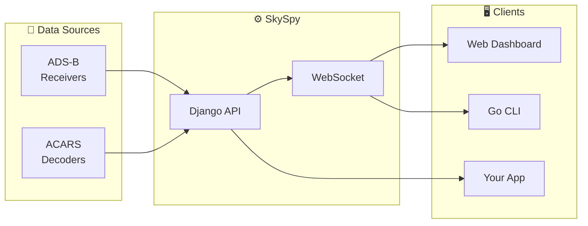

<div align="center">

# ✈️ SkySpy Documentation


**Enterprise-grade ADS-B aircraft tracking and monitoring platform**

[Quick Start](./00-quick-start.md) · [API Reference](./05-rest-api.md) · [Deployment](./11-deployment.md)

</div>

---

## 🎯 What is SkySpy?

SkySpy is a comprehensive aircraft tracking platform that processes ADS-B, ACARS, and other aviation data sources. It provides real-time visualization, safety monitoring, custom alerts, and rich analytics.



---

## 📚 Documentation Index

### 🚀 Getting Started

> 📘 **New to SkySpy?** Start here!

| | Document | Description |
|:---:|:---------|:------------|
| 🏁 | [**Quick Start**](./00-quick-start.md) | Get running in 5 minutes with Docker |
| 🏗️ | [**Overview**](./01-overview.md) | Architecture, tech stack, core concepts |
| ⚙️ | [**Configuration**](./02-configuration.md) | Complete environment and settings reference |

---

### 🔐 Core Features

| | Document | Description |
|:---:|:---------|:------------|
| 🔑 | [**Authentication**](./03-authentication.md) | JWT, API keys, OIDC, permissions |
| 🗄️ | [**Database**](./04-database.md) | Models, schema, relationships, migrations |

---

### 🔌 API Reference

> 💡 **Building an integration?** These docs are for you.

| | Document | Description |
|:---:|:---------|:------------|
| 🌐 | [**REST API**](./05-rest-api.md) | Complete HTTP endpoint reference |
| ⚡ | [**WebSocket API**](./06-websocket-api.md) | Real-time streaming, channels, events |

---

### 🧩 Components

| | Document | Description |
|:---:|:---------|:------------|
| 🐹 | [**Go Services**](./07-go-services.md) | CLI application, radar display |
| ⚛️ | [**Frontend**](./08-frontend.md) | React web application architecture |
| ⏰ | [**Background Tasks**](./09-background-tasks.md) | Celery workers, scheduled jobs |

---

### ✨ Features

| | Document | Description |
|:---:|:---------|:------------|
| 🗺️ | [**Map & Aviation**](./10-map-aviation.md) | Map layers, weather, aviation data |
| 🚨 | [**Safety & Alerts**](./13-safety-alerts.md) | Safety monitoring, alert rules |
| 📡 | [**ACARS**](./14-acars.md) | ACARS/VDL2 message integration |
| 🎯 | [**Cannonball Mode**](./17-cannonball-mode.md) | Mobile proximity detection |
| 📊 | [**Statistics**](./18-statistics.md) | Analytics, gamification, exports |

---

### 🛠️ Operations

| | Document | Description |
|:---:|:---------|:------------|
| 🚀 | [**Deployment**](./11-deployment.md) | Docker, production, Raspberry Pi |
| 🧪 | [**Testing**](./12-testing.md) | Running and writing tests |

---

### 👨‍💻 Development

| | Document | Description |
|:---:|:---------|:------------|
| 🤝 | [**Contributing**](./15-contributing.md) | Dev setup, code style, PR process |
| 🔧 | [**Troubleshooting**](./16-troubleshooting.md) | Common issues, debugging, FAQ |

---

## 🏃 Quick Commands

```bash
# 🐳 Start with Docker
docker compose up -d

# 📊 View logs
docker compose logs -f api

# 🧪 Run tests
docker compose run --rm api pytest

# 🔄 Update
git pull && docker compose up -d --build
```

---

## 🔗 Quick Links

<div align="center">

| | Resource | Description |
|:---:|:---------|:------------|
| 📖 | [Swagger UI](/api/docs/) | Interactive API explorer |
| 📋 | [ReDoc](/api/redoc/) | API reference documentation |
| 🖥️ | [Admin](/admin/) | Django admin interface |
| ❤️ | [Health](/health) | System health check |

</div>

---

## 💬 Support

> ⚠️ **Having issues?** Check the [Troubleshooting Guide](./16-troubleshooting.md) first!

- 🐛 **Bugs**: [GitHub Issues](https://github.com/your-org/skyspy/issues)
- 💡 **Features**: [GitHub Discussions](https://github.com/your-org/skyspy/discussions)
- 📧 **Contact**: support@skyspy.io

---

<div align="center">

**SkySpy v0.2.0** · Built with ❤️ for the aviation community

*Documentation generated with comprehensive codebase analysis*

</div>
