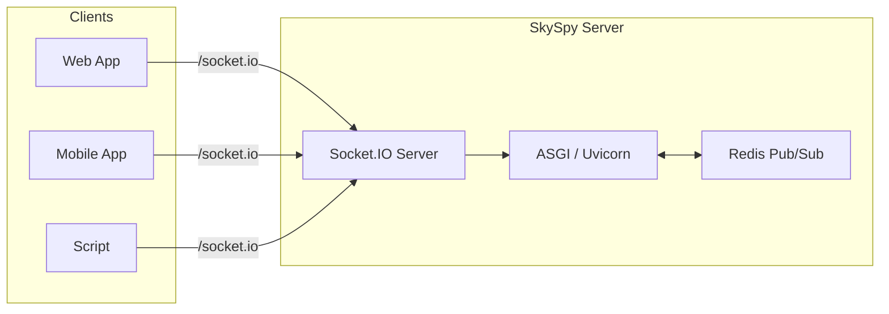

# Realtime API

> 📘 Real-time aviation data at your fingertips
>
> SkySpy provides live streaming through Socket.IO with namespaces, topic subscriptions, rate limiting, and optional Redis-backed scaling for production deployments.

## What is Socket.IO?

SkySpy's Socket.IO API delivers real-time bidirectional communication for tracking aircraft, monitoring safety events, and streaming aviation data. The server uses **python-socketio** (ASGI) with optional Redis for multi-process support and horizontal scaling.

## Architecture



> ✅ Production Ready
>
> Socket.IO provides automatic reconnection, message batching, and delta updates to optimize bandwidth while maintaining real-time responsiveness.

## What You Can Stream

| Topic / Namespace | Description | Use Case |
|-------------------|-------------|----------|
| **Aircraft** | Live ADS-B position updates from 1090MHz and 978MHz receivers | Real-time tracking map, flight following |
| **Safety** | TCAS alerts, emergency squawks, proximity conflicts | Safety monitoring, conflict detection |
| **Alerts** | Custom rule-based notifications (geo-fence, altitude, callsign) | Personalized alerts, push notifications |
| **ACARS** | Datalink messages (namespace or topic) | Message decoding, airline communications |
| **Stats** | Live analytics and metrics | Dashboard widgets, historical trends |
| **Airspace** | Advisories, NOTAMs, TFR boundaries | Airspace awareness, flight planning |
| **Audio** | Radio transcriptions, transmissions | Radio tab, ATC monitoring (/audio namespace) |
| **Cannonball** | Mobile threat detection and proximity alerts | Mobile app safety features (/cannonball namespace) |

## Key Features

| Feature | Description | Benefits |
|---------|-------------|----------|
| **Namespaces** | `/` (main), `/audio`, `/cannonball`; optional `/acars` for ACARS-only clients | Feature isolation, reduced bandwidth |
| **Topic Subscriptions** | Subscribe only to aircraft, safety, alerts, etc. on the main namespace | Granular control, efficient filtering |
| **Rate Limiting** | Per-topic rate limits to optimize bandwidth (e.g., 10 Hz for aircraft) | Prevent overwhelming slow clients |
| **Message Batching** | High-frequency updates batched (alert/safety/emergency bypass batching) | Reduced network overhead, lower latency |
| **Delta Updates** | Only changed fields sent for position updates | Minimize payload size, save bandwidth |
| **Built-in Heartbeat** | Engine.IO ping/pong; custom `ping` event supported | Connection health monitoring |
| **Auto-reconnect** | Socket.IO client exponential backoff with jitter | Resilient connections, automatic recovery |
| **Request/Response** | `request` event with `request_id` for on-demand queries | Pull model for historical data |

## Communication Patterns

### Pub/Sub Streaming

Subscribe to topics and receive real-time updates as they happen.

```javascript
socket.emit('subscribe', { topics: ['aircraft', 'safety'] });

socket.on('aircraft:update', (data) => {
  // Handle aircraft position updates
});
```

### Request/Response

Make on-demand queries for historical data or specific information.

```javascript
socket.emit('request', {
  type: 'aircraft-info',
  request_id: 'req_123',
  params: { icao: 'A1B2C3' }
});

socket.on('response', (data) => {
  if (data.request_id === 'req_123') {
    console.log(data.data); // Aircraft details
  }
});
```

> 📘 Hybrid Approach
>
> SkySpy uses both patterns: streaming for real-time updates and request/response for on-demand queries. This provides the best balance of performance and flexibility.

## Performance Characteristics

| Metric | Typical Value | Notes |
|--------|---------------|-------|
| **Latency** | Under 100ms | From receiver to client |
| **Update Frequency** | 10 Hz (aircraft) | Rate limited per topic |
| **Batch Window** | ~200ms | Max 50 messages or 1MB |
| **Reconnect Delay** | 1s-30s | Exponential backoff with jitter |
| **Concurrent Clients** | 1000+ | With Redis scaling |

## Next Steps

**Connection & Authentication**
[Learn how to connect, authenticate, and choose the right namespace](/docs/socketio-connection)

**Message Protocol**
[Understand events, payloads, and request/response patterns](/docs/socketio-message-protocol)

**Quick Start**
[JavaScript and Python code examples to get started](/docs/socketio-client-implementation)

> 📘 Need Help?
>
> See the [REST API documentation](/docs/rest-api) for additional context or visit the [troubleshooting guide](/docs/socketio-troubleshooting) if you encounter issues.
