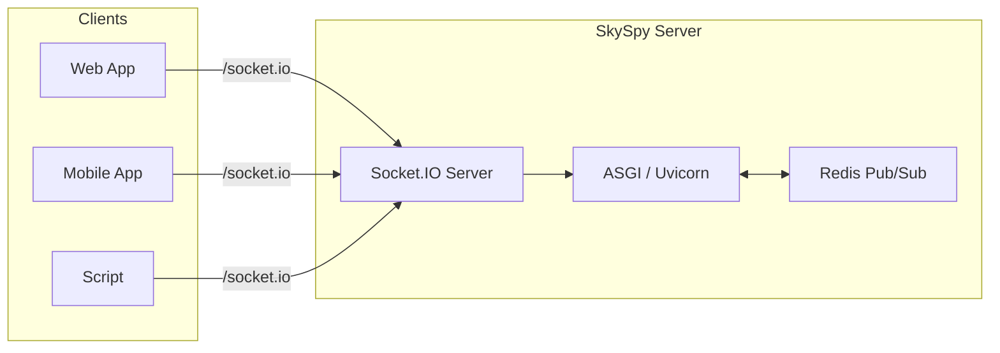

# Socket.IO Overview

> 📘 Real-time aviation data at your fingertips
>
> SkySpy provides live streaming through Socket.IO with namespaces, topic subscriptions, rate limiting, and optional Redis-backed scaling for production deployments.

## What is Socket.IO?

SkySpy's Socket.IO API delivers real-time bidirectional communication for tracking aircraft, monitoring safety events, and streaming aviation data. The server uses **python-socketio** (ASGI) with optional Redis for multi-process support and horizontal scaling.

## Architecture



> ✅ Production Ready
>
> Socket.IO provides automatic reconnection, message batching, and delta updates to optimize bandwidth while maintaining real-time responsiveness.

## What You Can Stream

[block:parameters]
{
  "data": {
    "h-0": "Topic / Namespace",
    "h-1": "Description",
    "h-2": "Use Case",
    "0-0": "**Aircraft**",
    "0-1": "Live ADS-B position updates from 1090MHz and 978MHz receivers",
    "0-2": "Real-time tracking map, flight following",
    "1-0": "**Safety**",
    "1-1": "TCAS alerts, emergency squawks, proximity conflicts",
    "1-2": "Safety monitoring, conflict detection",
    "2-0": "**Alerts**",
    "2-1": "Custom rule-based notifications (geo-fence, altitude, callsign)",
    "2-2": "Personalized alerts, push notifications",
    "3-0": "**ACARS**",
    "3-1": "Datalink messages (namespace or topic)",
    "3-2": "Message decoding, airline communications",
    "4-0": "**Stats**",
    "4-1": "Live analytics and metrics",
    "4-2": "Dashboard widgets, historical trends",
    "5-0": "**Airspace**",
    "5-1": "Advisories, NOTAMs, TFR boundaries",
    "5-2": "Airspace awareness, flight planning",
    "6-0": "**Audio**",
    "6-1": "Radio transcriptions, transmissions",
    "6-2": "Radio tab, ATC monitoring (/audio namespace)",
    "7-0": "**Cannonball**",
    "7-1": "Mobile threat detection and proximity alerts",
    "7-2": "Mobile app safety features (/cannonball namespace)"
  },
  "cols": 3,
  "rows": 8
}
[/block]

## Key Features

[block:parameters]
{
  "data": {
    "h-0": "Feature",
    "h-1": "Description",
    "h-2": "Benefits",
    "0-0": "**Namespaces**",
    "0-1": "`/` (main), `/audio`, `/cannonball`; optional `/acars` for ACARS-only clients",
    "0-2": "Feature isolation, reduced bandwidth",
    "1-0": "**Topic Subscriptions**",
    "1-1": "Subscribe only to aircraft, safety, alerts, etc. on the main namespace",
    "1-2": "Granular control, efficient filtering",
    "2-0": "**Rate Limiting**",
    "2-1": "Per-topic rate limits to optimize bandwidth (e.g., 10 Hz for aircraft)",
    "2-2": "Prevent overwhelming slow clients",
    "3-0": "**Message Batching**",
    "3-1": "High-frequency updates batched (alert/safety/emergency bypass batching)",
    "3-2": "Reduced network overhead, lower latency",
    "4-0": "**Delta Updates**",
    "4-1": "Only changed fields sent for position updates",
    "4-2": "Minimize payload size, save bandwidth",
    "5-0": "**Built-in Heartbeat**",
    "5-1": "Engine.IO ping/pong; custom `ping` event supported",
    "5-2": "Connection health monitoring",
    "6-0": "**Auto-reconnect**",
    "6-1": "Socket.IO client exponential backoff with jitter",
    "6-2": "Resilient connections, automatic recovery",
    "7-0": "**Request/Response**",
    "7-1": "`request` event with `request_id` for on-demand queries",
    "7-2": "Pull model for historical data"
  },
  "cols": 3,
  "rows": 8
}
[/block]

## Communication Patterns

### Pub/Sub Streaming

Subscribe to topics and receive real-time updates as they happen.

```javascript
socket.emit('subscribe', { topics: ['aircraft', 'safety'] });

socket.on('aircraft:update', (data) => {
  // Handle aircraft position updates
});
```

### Request/Response

Make on-demand queries for historical data or specific information.

```javascript
socket.emit('request', {
  type: 'aircraft-info',
  request_id: 'req_123',
  params: { icao: 'A1B2C3' }
});

socket.on('response', (data) => {
  if (data.request_id === 'req_123') {
    console.log(data.data); // Aircraft details
  }
});
```

> 📘 Hybrid Approach
>
> SkySpy uses both patterns: streaming for real-time updates and request/response for on-demand queries. This provides the best balance of performance and flexibility.

## Performance Characteristics

[block:parameters]
{
  "data": {
    "h-0": "Metric",
    "h-1": "Typical Value",
    "h-2": "Notes",
    "0-0": "**Latency**",
    "0-1": "<100ms",
    "0-2": "From receiver to client",
    "1-0": "**Update Frequency**",
    "1-1": "10 Hz (aircraft)",
    "1-2": "Rate limited per topic",
    "2-0": "**Batch Window**",
    "2-1": "~200ms",
    "2-2": "Max 50 messages or 1MB",
    "3-0": "**Reconnect Delay**",
    "3-1": "1s-30s",
    "3-2": "Exponential backoff with jitter",
    "4-0": "**Concurrent Clients**",
    "4-1": "1000+",
    "4-2": "With Redis scaling"
  },
  "cols": 3,
  "rows": 5
}
[/block]

## Next Steps

[block:html]
{
  "html": "<div style=\"display: grid; grid-template-columns: repeat(auto-fit, minmax(250px, 1fr)); gap: 1rem; margin: 2rem 0;\">\n  <a href=\"/docs/socketio-connection\" style=\"display: block; padding: 1.5rem; border: 1px solid #e1e4e8; border-radius: 8px; text-decoration: none; color: inherit;\">\n    <div style=\"font-size: 1.5rem; margin-bottom: 0.5rem;\">🔌</div>\n    <h3 style=\"margin: 0 0 0.5rem 0;\">Connection</h3>\n    <p style=\"margin: 0; color: #586069;\">Learn how to connect, authenticate, and choose the right namespace</p>\n  </a>\n  \n  <a href=\"/docs/socketio-message-protocol\" style=\"display: block; padding: 1.5rem; border: 1px solid #e1e4e8; border-radius: 8px; text-decoration: none; color: inherit;\">\n    <div style=\"font-size: 1.5rem; margin-bottom: 0.5rem;\">💬</div>\n    <h3 style=\"margin: 0 0 0.5rem 0;\">Message Protocol</h3>\n    <p style=\"margin: 0; color: #586069;\">Understand events, payloads, and request/response patterns</p>\n  </a>\n  \n  <a href=\"/docs/socketio-client-implementation\" style=\"display: block; padding: 1.5rem; border: 1px solid #e1e4e8; border-radius: 8px; text-decoration: none; color: inherit;\">\n    <div style=\"font-size: 1.5rem; margin-bottom: 0.5rem;\">⚡</div>\n    <h3 style=\"margin: 0 0 0.5rem 0;\">Quick Start</h3>\n    <p style=\"margin: 0; color: #586069;\">JavaScript and Python code examples to get started</p>\n  </a>\n</div>"
}
[/block]

> 📘 Need Help?
>
> See the [REST API documentation](/docs/rest-api) for additional context or visit the [troubleshooting guide](/docs/socketio-troubleshooting) if you encounter issues.
