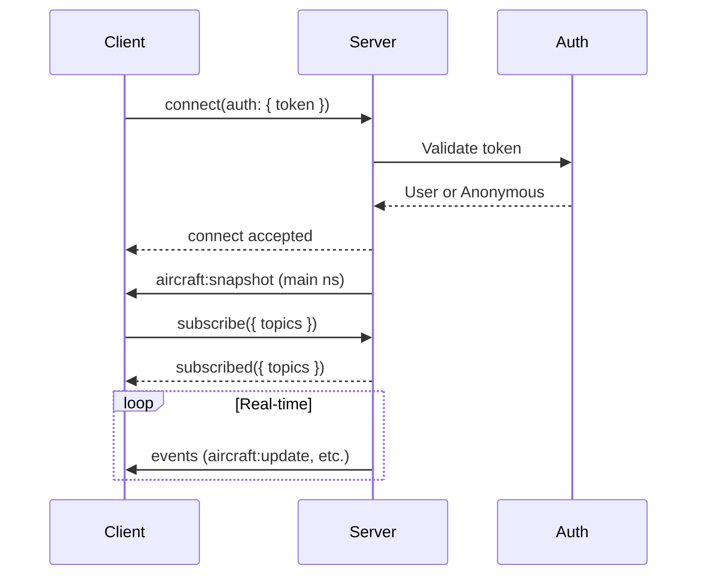

# Connection & Authentication

Learn how to establish a Socket.IO connection to SkySpy, authenticate your client, and select the appropriate namespace for your use case.

## Base URL and Path

Socket.IO is served on the same host as the HTTP API. The default path is `/socket.io`.

[block:parameters]
{
  "data": {
    "h-0": "Component",
    "h-1": "Value",
    "h-2": "Notes",
    "0-0": "**Base URL**",
    "0-1": "`https://{host}` or `http://{host}`",
    "0-2": "Same as your API base URL",
    "1-0": "**Path**",
    "1-1": "`/socket.io`",
    "1-2": "Default; configurable on server",
    "2-0": "**Transport**",
    "2-1": "`websocket` (recommended)",
    "2-2": "Falls back to polling if needed"
  },
  "cols": 3,
  "rows": 3
}
[/block]

> 📘 Single Connection Design
>
> There are **no separate URLs per stream** (e.g., no `/ws/aircraft/`). Use a single connection to the default namespace and subscribe to topics, or connect to a dedicated namespace for audio or cannonball.

## Namespaces

SkySpy uses Socket.IO namespaces to organize different types of real-time data streams.

[block:parameters]
{
  "data": {
    "h-0": "Namespace",
    "h-1": "Path",
    "h-2": "Description",
    "h-3": "Auto-emit on Connect",
    "0-0": "**Main**",
    "0-1": "`/`",
    "0-2": "Aircraft, safety, alerts, ACARS, airspace, NOTAMs, stats. Subscribe via `subscribe` event.",
    "0-3": "`aircraft:snapshot`",
    "1-0": "**Audio**",
    "1-1": "`/audio`",
    "1-2": "Radio transmissions and transcription events. Requires audio permission.",
    "1-3": "`audio:snapshot`",
    "2-0": "**Cannonball**",
    "2-1": "`/cannonball`",
    "2-2": "Mobile threat detection; position updates and threat list for mobile apps.",
    "2-3": "`session_started`",
    "3-0": "**ACARS** (optional)",
    "3-1": "`/acars`",
    "3-2": "ACARS-only stream for clients that only want datalink messages.",
    "3-3": "None"
  },
  "cols": 4,
  "rows": 4
}
[/block]

> 💡 Recommendation
>
> For most applications, connect to the **main namespace** (`/`) and subscribe to `aircraft`, `safety`, `alerts`, etc. Use `/audio` or `/cannonball` only when you need those specific features.

## Authentication

### Connection Handshake

### Authentication Modes

[block:parameters]
{
  "data": {
    "h-0": "Mode",
    "h-1": "Behavior",
    "h-2": "Use Case",
    "0-0": "`public`",
    "0-1": "All connections allowed without authentication",
    "0-2": "Public demos, testing",
    "1-0": "`hybrid`",
    "1-1": "Anonymous allowed; auth required for some features; invalid token can be rejected if `WS_REJECT_INVALID_TOKENS` is True",
    "1-2": "Freemium model, public + premium",
    "2-0": "`private`",
    "2-1": "All connections require valid authentication",
    "2-2": "Production, sensitive data"
  },
  "cols": 3,
  "rows": 3
}
[/block]

> 🚧 Security Best Practice
>
> Send credentials in the **auth** object when connecting. Do not put tokens in query strings as they are often logged by proxies and load balancers.

### Passing the Token

[block:code]
{
  "codes": [
    {
      "code": "const io = require('socket.io-client');\n\nconst socket = io('https://skyspy.example.com', {\n  path: '/socket.io',\n  auth: {\n    token: 'eyJhbGciOiJIUzI1NiIs...'  // JWT or API key\n  },\n  transports: ['websocket']\n});\n\nsocket.on('connect', () => {\n  console.log('Connected:', socket.id);\n});",
      "language": "javascript",
      "name": "JavaScript"
    },
    {
      "code": "import socketio\n\nsio = socketio.Client()\n\n@sio.event\ndef connect():\n    print('Connected:', sio.sid)\n\nsio.connect(\n    'https://skyspy.example.com',\n    socketio_path='/socket.io',\n    auth={'token': 'eyJhbGciOiJIUzI1NiIs...'},\n    transports=['websocket']\n)",
      "language": "python",
      "name": "Python"
    }
  ]
}
[/block]

### Supported Token Types

[block:parameters]
{
  "data": {
    "h-0": "Token Type",
    "h-1": "Format",
    "h-2": "Example",
    "h-3": "How to Obtain",
    "0-0": "JWT Access Token",
    "0-1": "`eyJ...`",
    "0-2": "From `/api/auth/token/`",
    "0-3": "POST credentials to REST API",
    "1-0": "API Key (Live)",
    "1-1": "`sk_live_...`",
    "1-2": "Production API key",
    "1-3": "Generate in dashboard settings",
    "2-0": "API Key (Test)",
    "2-1": "`sk_test_...`",
    "2-2": "Development API key",
    "2-3": "Generate in dashboard settings"
  },
  "cols": 4,
  "rows": 3
}
[/block]

> ✅ Token Validation
>
> Tokens are validated on connection. If authentication fails in `private` mode or with `WS_REJECT_INVALID_TOKENS=True`, the connection will be rejected with a `connect_error` event.

## Connection Lifecycle

### Connection States

[block:parameters]
{
  "data": {
    "h-0": "State",
    "h-1": "Description",
    "h-2": "Client Action",
    "0-0": "Connecting",
    "0-1": "Initial connection or reconnecting",
    "0-2": "Show loading indicator",
    "1-0": "Connected",
    "1-1": "Connected and ready to emit/subscribe",
    "1-2": "Subscribe to topics, show connected state",
    "2-0": "Disconnected",
    "2-1": "Disconnected (check reason)",
    "2-2": "Show offline indicator, check disconnect reason",
    "3-0": "Connect error",
    "3-1": "Authentication or network error",
    "3-2": "Show error message, retry with valid credentials"
  },
  "cols": 3,
  "rows": 4
}
[/block]

### Handling Connection Events

[block:code]
{
  "codes": [
    {
      "code": "const socket = io('https://skyspy.example.com', {\n  auth: { token: getToken() },\n  transports: ['websocket']\n});\n\nsocket.on('connect', () => {\n  console.log('Connected:', socket.id);\n  socket.emit('subscribe', { topics: ['aircraft', 'safety'] });\n});\n\nsocket.on('connect_error', (error) => {\n  console.error('Connection error:', error.message);\n  // Handle auth failure, network error, etc.\n});\n\nsocket.on('disconnect', (reason) => {\n  console.log('Disconnected:', reason);\n  if (reason === 'io server disconnect') {\n    // Server disconnected (e.g., auth failure)\n    // Manual reconnection required\n    socket.connect();\n  }\n  // Otherwise, Socket.IO will auto-reconnect\n});",
      "language": "javascript",
      "name": "JavaScript"
    },
    {
      "code": "import socketio\n\nsio = socketio.Client()\n\n@sio.event\ndef connect():\n    print('Connected:', sio.sid)\n    sio.emit('subscribe', {'topics': ['aircraft', 'safety']})\n\n@sio.event\ndef connect_error(data):\n    print('Connection error:', data)\n\n@sio.event\ndef disconnect():\n    print('Disconnected')\n\ntry:\n    sio.connect(\n        'https://skyspy.example.com',\n        auth={'token': get_token()},\n        transports=['websocket']\n    )\nexcept socketio.exceptions.ConnectionError as e:\n    print('Failed to connect:', e)",
      "language": "python",
      "name": "Python"
    }
  ]
}
[/block]

### Reconnection Strategy

Socket.IO client includes automatic reconnection with exponential backoff and jitter.

[block:parameters]
{
  "data": {
    "h-0": "Parameter",
    "h-1": "Default Value",
    "h-2": "Description",
    "0-0": "`reconnection`",
    "0-1": "`true`",
    "0-2": "Enable automatic reconnection",
    "1-0": "`reconnectionDelay`",
    "1-1": "`1000` ms",
    "1-2": "Initial delay before reconnect",
    "2-0": "`reconnectionDelayMax`",
    "2-1": "`30000` ms",
    "2-2": "Maximum delay between reconnects",
    "3-0": "`reconnectionAttempts`",
    "3-1": "`Infinity`",
    "3-2": "Number of attempts before giving up",
    "4-0": "`randomizationFactor`",
    "4-1": "`0.3`",
    "4-2": "Jitter to prevent thundering herd"
  },
  "cols": 3,
  "rows": 5
}
[/block]

> 📘 Disconnect Reasons
>
> Disconnect reasons (e.g., `io server disconnect`, `io client disconnect`, `transport close`) indicate whether to reconnect automatically. The client will **not** auto-reconnect if the server explicitly disconnects (e.g., auth failure).

## Complete Connection Example

[block:code]
{
  "codes": [
    {
      "code": "import { io } from 'socket.io-client';\n\nclass SkySpy {\n  constructor(url, token) {\n    this.socket = io(url, {\n      path: '/socket.io',\n      auth: { token },\n      transports: ['websocket'],\n      reconnection: true,\n      reconnectionDelay: 1000,\n      reconnectionDelayMax: 30000,\n      reconnectionAttempts: Infinity,\n      randomizationFactor: 0.3\n    });\n\n    this.setupListeners();\n  }\n\n  setupListeners() {\n    this.socket.on('connect', () => {\n      console.log('✓ Connected:', this.socket.id);\n      this.subscribe(['aircraft', 'safety', 'alerts']);\n    });\n\n    this.socket.on('connect_error', (error) => {\n      console.error('✗ Connection error:', error.message);\n    });\n\n    this.socket.on('disconnect', (reason) => {\n      console.warn('⚠ Disconnected:', reason);\n    });\n\n    this.socket.on('subscribed', (data) => {\n      console.log('✓ Subscribed:', data.topics);\n    });\n  }\n\n  subscribe(topics) {\n    this.socket.emit('subscribe', { topics });\n  }\n\n  disconnect() {\n    this.socket.disconnect();\n  }\n}\n\n// Usage\nconst client = new SkySpy('https://skyspy.example.com', 'your_token');",
      "language": "javascript",
      "name": "JavaScript"
    },
    {
      "code": "import socketio\nimport logging\n\nlogging.basicConfig(level=logging.INFO)\nlogger = logging.getLogger(__name__)\n\nclass SkySpy:\n    def __init__(self, url: str, token: str):\n        self.sio = socketio.Client(\n            reconnection=True,\n            reconnection_delay=1,\n            reconnection_delay_max=30\n        )\n        self.url = url\n        self.token = token\n        self.setup_listeners()\n\n    def setup_listeners(self):\n        @self.sio.event\n        def connect():\n            logger.info(f'✓ Connected: {self.sio.sid}')\n            self.subscribe(['aircraft', 'safety', 'alerts'])\n\n        @self.sio.event\n        def connect_error(data):\n            logger.error(f'✗ Connection error: {data}')\n\n        @self.sio.event\n        def disconnect():\n            logger.warning('⚠ Disconnected')\n\n        @self.sio.event\n        def subscribed(data):\n            logger.info(f\"✓ Subscribed: {data.get('topics')}\")\n\n    def connect(self):\n        self.sio.connect(\n            self.url,\n            socketio_path='/socket.io',\n            auth={'token': self.token},\n            transports=['websocket']\n        )\n\n    def subscribe(self, topics: list):\n        self.sio.emit('subscribe', {'topics': topics})\n\n    def disconnect(self):\n        self.sio.disconnect()\n\n    def wait(self):\n        self.sio.wait()\n\n# Usage\nclient = SkySpy('https://skyspy.example.com', 'your_token')\nclient.connect()\nclient.wait()",
      "language": "python",
      "name": "Python"
    }
  ]
}
[/block]

## Next Steps

> 📘 Ready to stream data?
>
> Now that you're connected, learn about the [message protocol](/docs/socketio-message-protocol) to understand events and payloads, or jump to the [main namespace](/docs/socketio-main-namespace) to start streaming aircraft data.
