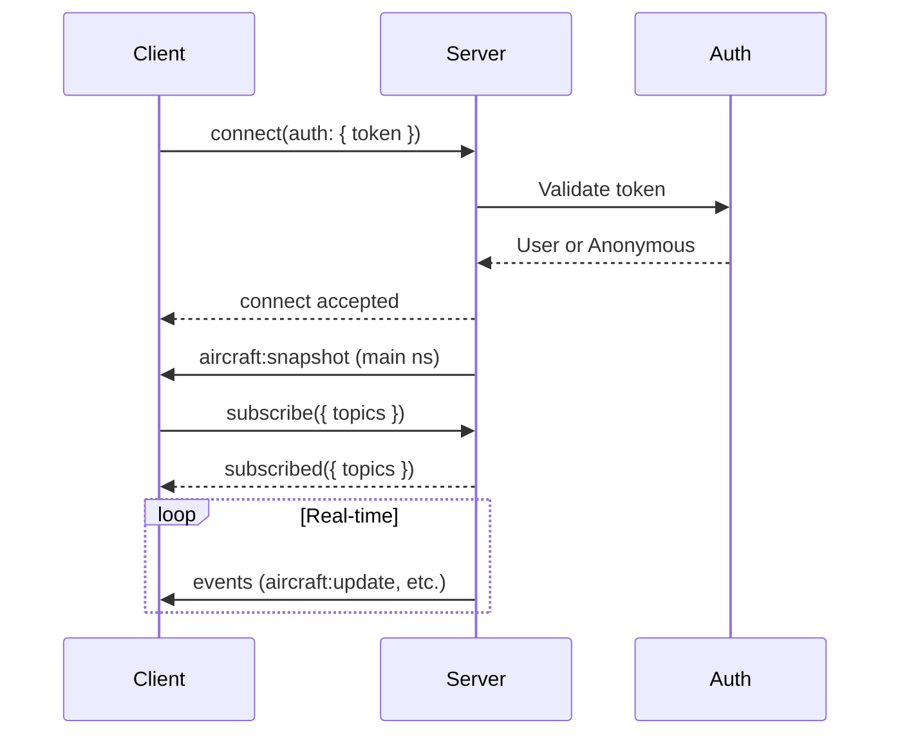

# Connection & Authentication

Learn how to establish a Socket.IO connection to SkySpy, authenticate your client, and select the appropriate namespace for your use case.

## Base URL and Path

Socket.IO is served on the same host as the HTTP API. The default path is `/socket.io`.

| Component | Value | Notes |
|-----------|-------|-------|
| **Base URL** | `https://{host}` or `http://{host}` | Same as your API base URL |
| **Path** | `/socket.io` | Default; configurable on server |
| **Transport** | `websocket` (recommended) | Falls back to polling if needed |

> 📘 Single Connection Design
>
> There are **no separate URLs per stream** (e.g., no `/ws/aircraft/`). Use a single connection to the default namespace and subscribe to topics, or connect to a dedicated namespace for audio or cannonball.

## Namespaces

SkySpy uses Socket.IO namespaces to organize different types of real-time data streams.

| Namespace | Path | Description | Auto-emit on Connect |
|-----------|------|-------------|----------------------|
| **Main** | `/` | Aircraft, safety, alerts, ACARS, airspace, NOTAMs, stats. Subscribe via `subscribe` event. | `aircraft:snapshot` |
| **Audio** | `/audio` | Radio transmissions and transcription events. Requires audio permission. | `audio:snapshot` |
| **Cannonball** | `/cannonball` | Mobile threat detection; position updates and threat list for mobile apps. | `session_started` |
| **ACARS** (optional) | `/acars` | ACARS-only stream for clients that only want datalink messages. | None |

> 📘 Recommendation
>
> For most applications, connect to the **main namespace** (`/`) and subscribe to `aircraft`, `safety`, `alerts`, etc. Use `/audio` or `/cannonball` only when you need those specific features.

## Authentication

### Connection Handshake



### Authentication Modes

| Mode | Behavior | Use Case |
|------|----------|----------|
| `public` | All connections allowed without authentication | Public demos, testing |
| `hybrid` | Anonymous allowed; auth required for some features; invalid token can be rejected if `WS_REJECT_INVALID_TOKENS` is True | Freemium model, public + premium |
| `private` | All connections require valid authentication | Production, sensitive data |

> ⚠️ Security Best Practice
>
> Send credentials in the **auth** object when connecting. Do not put tokens in query strings as they are often logged by proxies and load balancers.

### Passing the Token

```javascript JavaScript
const io = require('socket.io-client');

const socket = io('https://skyspy.example.com', {
  path: '/socket.io',
  auth: {
    token: 'eyJhbGciOiJIUzI1NiIs...'  // JWT or API key
  },
  transports: ['websocket']
});

socket.on('connect', () => {
  console.log('Connected:', socket.id);
});
```

```python Python
import socketio

sio = socketio.Client()

@sio.event
def connect():
    print('Connected:', sio.sid)

sio.connect(
    'https://skyspy.example.com',
    socketio_path='/socket.io',
    auth={'token': 'eyJhbGciOiJIUzI1NiIs...'},
    transports=['websocket']
)
```

### Supported Token Types

| Token Type | Format | Example | How to Obtain |
|------------|--------|---------|---------------|
| JWT Access Token | `eyJ...` | From `/api/auth/token/` | POST credentials to REST API |
| API Key (Live) | `sk_live_...` | Production API key | Generate in dashboard settings |
| API Key (Test) | `sk_test_...` | Development API key | Generate in dashboard settings |

> ✅ Token Validation
>
> Tokens are validated on connection. If authentication fails in `private` mode or with `WS_REJECT_INVALID_TOKENS=True`, the connection will be rejected with a `connect_error` event.

## Connection Lifecycle

### Connection States

| State | Description | Client Action |
|-------|-------------|---------------|
| Connecting | Initial connection or reconnecting | Show loading indicator |
| Connected | Connected and ready to emit/subscribe | Subscribe to topics, show connected state |
| Disconnected | Disconnected (check reason) | Show offline indicator, check disconnect reason |
| Connect error | Authentication or network error | Show error message, retry with valid credentials |

### Handling Connection Events

```javascript JavaScript
const socket = io('https://skyspy.example.com', {
  auth: { token: getToken() },
  transports: ['websocket']
});

socket.on('connect', () => {
  console.log('Connected:', socket.id);
  socket.emit('subscribe', { topics: ['aircraft', 'safety'] });
});

socket.on('connect_error', (error) => {
  console.error('Connection error:', error.message);
  // Handle auth failure, network error, etc.
});

socket.on('disconnect', (reason) => {
  console.log('Disconnected:', reason);
  if (reason === 'io server disconnect') {
    // Server disconnected (e.g., auth failure)
    // Manual reconnection required
    socket.connect();
  }
  // Otherwise, Socket.IO will auto-reconnect
});
```

```python Python
import socketio

sio = socketio.Client()

@sio.event
def connect():
    print('Connected:', sio.sid)
    sio.emit('subscribe', {'topics': ['aircraft', 'safety']})

@sio.event
def connect_error(data):
    print('Connection error:', data)

@sio.event
def disconnect():
    print('Disconnected')

try:
    sio.connect(
        'https://skyspy.example.com',
        auth={'token': get_token()},
        transports=['websocket']
    )
except socketio.exceptions.ConnectionError as e:
    print('Failed to connect:', e)
```

### Reconnection Strategy

Socket.IO client includes automatic reconnection with exponential backoff and jitter.

| Parameter | Default Value | Description |
|-----------|---------------|-------------|
| `reconnection` | `true` | Enable automatic reconnection |
| `reconnectionDelay` | `1000` ms | Initial delay before reconnect |
| `reconnectionDelayMax` | `30000` ms | Maximum delay between reconnects |
| `reconnectionAttempts` | `Infinity` | Number of attempts before giving up |
| `randomizationFactor` | `0.3` | Jitter to prevent thundering herd |

> 📘 Disconnect Reasons
>
> Disconnect reasons (e.g., `io server disconnect`, `io client disconnect`, `transport close`) indicate whether to reconnect automatically. The client will **not** auto-reconnect if the server explicitly disconnects (e.g., auth failure).

## Complete Connection Example

```javascript JavaScript
import { io } from 'socket.io-client';

class SkySpy {
  constructor(url, token) {
    this.socket = io(url, {
      path: '/socket.io',
      auth: { token },
      transports: ['websocket'],
      reconnection: true,
      reconnectionDelay: 1000,
      reconnectionDelayMax: 30000,
      reconnectionAttempts: Infinity,
      randomizationFactor: 0.3
    });

    this.setupListeners();
  }

  setupListeners() {
    this.socket.on('connect', () => {
      console.log('✓ Connected:', this.socket.id);
      this.subscribe(['aircraft', 'safety', 'alerts']);
    });

    this.socket.on('connect_error', (error) => {
      console.error('✗ Connection error:', error.message);
    });

    this.socket.on('disconnect', (reason) => {
      console.warn('⚠ Disconnected:', reason);
    });

    this.socket.on('subscribed', (data) => {
      console.log('✓ Subscribed:', data.topics);
    });
  }

  subscribe(topics) {
    this.socket.emit('subscribe', { topics });
  }

  disconnect() {
    this.socket.disconnect();
  }
}

// Usage
const client = new SkySpy('https://skyspy.example.com', 'your_token');
```

```python Python
import socketio
import logging

logging.basicConfig(level=logging.INFO)
logger = logging.getLogger(__name__)

class SkySpy:
    def __init__(self, url: str, token: str):
        self.sio = socketio.Client(
            reconnection=True,
            reconnection_delay=1,
            reconnection_delay_max=30
        )
        self.url = url
        self.token = token
        self.setup_listeners()

    def setup_listeners(self):
        @self.sio.event
        def connect():
            logger.info(f'✓ Connected: {self.sio.sid}')
            self.subscribe(['aircraft', 'safety', 'alerts'])

        @self.sio.event
        def connect_error(data):
            logger.error(f'✗ Connection error: {data}')

        @self.sio.event
        def disconnect():
            logger.warning('⚠ Disconnected')

        @self.sio.event
        def subscribed(data):
            logger.info(f"✓ Subscribed: {data.get('topics')}")

    def connect(self):
        self.sio.connect(
            self.url,
            socketio_path='/socket.io',
            auth={'token': self.token},
            transports=['websocket']
        )

    def subscribe(self, topics: list):
        self.sio.emit('subscribe', {'topics': topics})

    def disconnect(self):
        self.sio.disconnect()

    def wait(self):
        self.sio.wait()

# Usage
client = SkySpy('https://skyspy.example.com', 'your_token')
client.connect()
client.wait()
```

## Next Steps

> 📘 Ready to stream data?
>
> Now that you're connected, learn about the [message protocol](/docs/socketio-message-protocol) to understand events and payloads, or jump to the [main namespace](/docs/socketio-main-namespace) to start streaming aircraft data.
