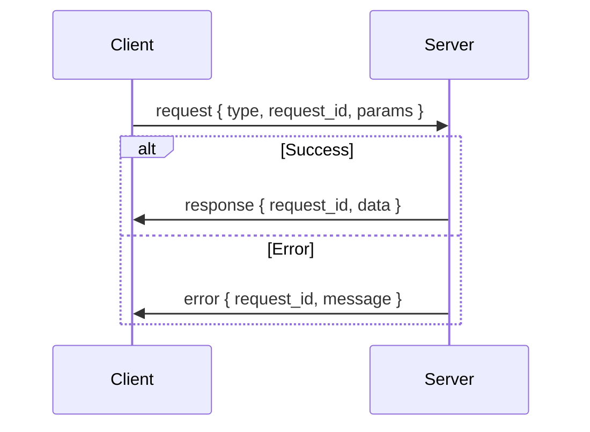

# Message Protocol

SkySpy uses Socket.IO's event-based protocol for bidirectional communication. Learn about events, payloads, batching, and the request/response pattern.

## Event-Based API

Socket.IO uses **events** instead of raw messages. Each event has:
- **Name** (string): The event type (e.g., `subscribe`, `aircraft:update`)
- **Payload** (usually an object): The data associated with the event

> 📘 Convention
>
> SkySpy uses colon-separated namespacing for events (e.g., `aircraft:update`, `safety:event`). This makes it easy to identify the domain and action.

## Client → Server Events

These are the events your client can emit to the server.

[block:parameters]
{
  "data": {
    "h-0": "Event",
    "h-1": "Payload",
    "h-2": "Description",
    "h-3": "Example",
    "0-0": "`subscribe`",
    "0-1": "`{ topics: string[] }`",
    "0-2": "Subscribe to topics (e.g., `['aircraft','safety']`; use `'all'` for all topics)",
    "0-3": "`{ topics: ['aircraft'] }`",
    "1-0": "`unsubscribe`",
    "1-1": "`{ topics: string[] }`",
    "1-2": "Unsubscribe from topics",
    "1-3": "`{ topics: ['stats'] }`",
    "2-0": "`request`",
    "2-1": "`{ type, request_id, params? }`",
    "2-2": "On-demand query; server replies with `response` or `error`",
    "2-3": "See request/response section",
    "3-0": "`ping`",
    "3-1": "optional data",
    "3-2": "Custom keepalive; server replies with `pong`",
    "3-3": "`null` or `{ timestamp }`"
  },
  "cols": 4,
  "rows": 4
}
[/block]

### Example: Subscribe

[block:code]
{
  "codes": [
    {
      "code": "// Subscribe to multiple topics\nsocket.emit('subscribe', { \n  topics: ['aircraft', 'safety', 'alerts'] \n});\n\n// Subscribe to all topics\nsocket.emit('subscribe', { \n  topics: ['all'] \n});",
      "language": "javascript",
      "name": "JavaScript"
    },
    {
      "code": "# Subscribe to multiple topics\nsio.emit('subscribe', {\n    'topics': ['aircraft', 'safety', 'alerts']\n})\n\n# Subscribe to all topics\nsio.emit('subscribe', {\n    'topics': ['all']\n})",
      "language": "python",
      "name": "Python"
    }
  ]
}
[/block]

## Server → Client Events

These are the events the server emits to your client.

### Control Events

[block:parameters]
{
  "data": {
    "h-0": "Event",
    "h-1": "When",
    "h-2": "Payload",
    "h-3": "Description",
    "0-0": "`subscribed`",
    "0-1": "After subscribe",
    "0-2": "`{ topics, joined?, denied? }`",
    "0-3": "Confirms subscription; lists joined and denied topics",
    "1-0": "`unsubscribed`",
    "1-1": "After unsubscribe",
    "1-2": "`{ topics, remaining }`",
    "1-3": "Confirms unsubscription; lists remaining subscriptions",
    "2-0": "`response`",
    "2-1": "Reply to request",
    "2-2": "`{ type, request_id, request_type, data }`",
    "2-3": "Successful response to a request event",
    "3-0": "`error`",
    "3-1": "Request failed or generic error",
    "3-2": "`{ type?, request_id?, message }`",
    "3-3": "Error message with optional request context",
    "4-0": "`pong`",
    "4-1": "Reply to ping",
    "4-2": "`{ timestamp }`",
    "4-3": "Keepalive response"
  },
  "cols": 4,
  "rows": 5
}
[/block]

### Data Events

[block:parameters]
{
  "data": {
    "h-0": "Event",
    "h-1": "Topic",
    "h-2": "Payload",
    "h-3": "Description",
    "0-0": "`aircraft:snapshot`",
    "0-1": "`aircraft`",
    "0-2": "`{ aircraft[], count, timestamp }`",
    "0-3": "Initial snapshot on connect or request",
    "1-0": "`aircraft:update`",
    "1-1": "`aircraft`",
    "1-2": "aircraft list or delta",
    "1-3": "Periodic position updates (rate-limited)",
    "2-0": "`aircraft:new`",
    "2-1": "`aircraft`",
    "2-2": "single aircraft object",
    "2-3": "New aircraft detected in range",
    "3-0": "`aircraft:remove`",
    "3-1": "`aircraft`",
    "3-2": "`{ hex, reason? }`",
    "3-3": "Aircraft left range or timeout",
    "4-0": "`aircraft:delta`",
    "4-1": "`aircraft`",
    "4-2": "delta object",
    "4-3": "Only changed fields (bandwidth optimization)",
    "5-0": "`aircraft:heartbeat`",
    "5-1": "`aircraft`",
    "5-2": "`{ count, timestamp }`",
    "5-3": "Periodic keepalive with aircraft count",
    "6-0": "`safety:snapshot`",
    "6-1": "`safety`",
    "6-2": "`{ events[], count, timestamp }`",
    "6-3": "Initial safety event snapshot",
    "7-0": "`safety:event`",
    "7-1": "`safety`",
    "7-2": "event object",
    "7-3": "New safety event (TCAS, emergency, etc.)",
    "8-0": "`alert:triggered`",
    "8-1": "`alerts`",
    "8-2": "alert payload",
    "8-3": "Custom alert rule fired",
    "9-0": "`acars:message`",
    "9-1": "`acars`",
    "9-2": "message object",
    "9-3": "New ACARS datalink message",
    "10-0": "`stats:update`",
    "10-1": "`stats`",
    "10-2": "stats object",
    "10-3": "Live statistics update",
    "11-0": "`batch`",
    "11-1": "all",
    "11-2": "`{ messages[], count?, timestamp? }`",
    "11-3": "Batched messages (high-frequency optimization)"
  },
  "cols": 4,
  "rows": 12
}
[/block]

> 📘 Payload Compatibility
>
> Payloads match the formats described in the REST API documentation. Only the transport mechanism is different (Socket.IO events vs. HTTP responses).

## Batch Messages

To optimize bandwidth, high-frequency updates may be batched into a single `batch` event.

[block:code]
{
  "codes": [
    {
      "code": "{\n  \"messages\": [\n    {\n      \"type\": \"aircraft:update\",\n      \"data\": {\n        \"hex\": \"A1B2C3\",\n        \"lat\": 37.7749,\n        \"lon\": -122.4194,\n        \"alt_baro\": 35000\n      }\n    },\n    {\n      \"type\": \"aircraft:update\",\n      \"data\": {\n        \"hex\": \"D4E5F6\",\n        \"lat\": 37.8044,\n        \"lon\": -122.2712,\n        \"alt_baro\": 28000\n      }\n    }\n  ],\n  \"count\": 2,\n  \"timestamp\": \"2024-01-15T10:30:00.000Z\"\n}",
      "language": "json",
      "name": "Batch Event"
    }
  ]
}
[/block]

### Handling Batch Events

[block:code]
{
  "codes": [
    {
      "code": "socket.on('batch', (data) => {\n  data.messages.forEach(msg => {\n    // Dispatch to individual handlers\n    switch (msg.type) {\n      case 'aircraft:update':\n        handleAircraftUpdate(msg.data);\n        break;\n      case 'safety:event':\n        handleSafetyEvent(msg.data);\n        break;\n      default:\n        console.log('Unknown message type:', msg.type);\n    }\n  });\n});",
      "language": "javascript",
      "name": "JavaScript"
    },
    {
      "code": "@sio.event\ndef batch(data):\n    for msg in data.get('messages', []):\n        msg_type = msg.get('type', '')\n        msg_data = msg.get('data', msg)\n        \n        if msg_type == 'aircraft:update':\n            handle_aircraft_update(msg_data)\n        elif msg_type == 'safety:event':\n            handle_safety_event(msg_data)\n        else:\n            print(f'Unknown message type: {msg_type}')",
      "language": "python",
      "name": "Python"
    }
  ]
}
[/block]

> ✅ Critical Events Bypass Batching
>
> Critical event types (alert, safety, emergency) bypass batching and are emitted immediately to ensure low latency for important events.

### Batch Configuration

[block:parameters]
{
  "data": {
    "h-0": "Parameter",
    "h-1": "Default Value",
    "h-2": "Description",
    "0-0": "**Batch Window**",
    "0-1": "~200 ms",
    "0-2": "Time to collect messages before sending batch",
    "1-0": "**Max Batch Size**",
    "1-1": "~50 messages",
    "1-2": "Maximum messages per batch",
    "2-0": "**Max Batch Bytes**",
    "2-1": "~1 MB",
    "2-2": "Maximum payload size per batch",
    "3-0": "**Bypass Types**",
    "3-1": "alert, safety, emergency",
    "3-2": "Event types that skip batching"
  },
  "cols": 3,
  "rows": 4
}
[/block]

## Request/Response Pattern

For on-demand queries (historical data, aircraft info, etc.), use the `request` event with a unique `request_id`.

### Request Flow

### Request Format

[block:code]
{
  "codes": [
    {
      "code": "{\n  \"type\": \"aircraft-info\",\n  \"request_id\": \"req_abc123\",\n  \"params\": {\n    \"icao\": \"A1B2C3\"\n  }\n}",
      "language": "json",
      "name": "Request"
    }
  ]
}
[/block]

[block:parameters]
{
  "data": {
    "h-0": "Field",
    "h-1": "Required",
    "h-2": "Description",
    "0-0": "`type`",
    "0-1": "Yes",
    "0-2": "Request type (e.g., `aircraft-info`, `sightings`, `safety-events`)",
    "1-0": "`request_id`",
    "1-1": "Yes",
    "1-2": "Unique identifier to match response (client-generated)",
    "2-0": "`params`",
    "2-1": "No",
    "2-2": "Parameters specific to the request type"
  },
  "cols": 3,
  "rows": 3
}
[/block]

### Response Format

**Success:**

[block:code]
{
  "codes": [
    {
      "code": "{\n  \"type\": \"response\",\n  \"request_id\": \"req_abc123\",\n  \"request_type\": \"aircraft-info\",\n  \"data\": {\n    \"icao_hex\": \"A1B2C3\",\n    \"registration\": \"N12345\",\n    \"type_code\": \"B738\",\n    \"operator\": \"Southwest Airlines\",\n    \"manufactured\": \"2015\",\n    \"model\": \"Boeing 737-800\"\n  }\n}",
      "language": "json",
      "name": "Success Response"
    }
  ]
}
[/block]

**Error:**

[block:code]
{
  "codes": [
    {
      "code": "{\n  \"type\": \"error\",\n  \"request_id\": \"req_abc123\",\n  \"message\": \"Aircraft not found\"\n}",
      "language": "json",
      "name": "Error Response"
    }
  ]
}
[/block]

### Request/Response Helper

Here's a helper function to handle request/response with timeouts.

[block:code]
{
  "codes": [
    {
      "code": "function request(socket, type, params = {}, timeoutMs = 10000) {\n  return new Promise((resolve, reject) => {\n    const requestId = `req_${Date.now()}_${Math.random().toString(36).slice(2)}`;\n    \n    const timeout = setTimeout(() => {\n      cleanup();\n      reject(new Error(`Request timeout: ${type}`));\n    }, timeoutMs);\n\n    const onResponse = (data) => {\n      if (data.request_id !== requestId) return;\n      cleanup();\n      resolve(data.data ?? data);\n    };\n    \n    const onError = (data) => {\n      if (data.request_id !== requestId) return;\n      cleanup();\n      reject(new Error(data.message || 'Request failed'));\n    };\n    \n    const cleanup = () => {\n      clearTimeout(timeout);\n      socket.off('response', onResponse);\n      socket.off('error', onError);\n    };\n\n    socket.on('response', onResponse);\n    socket.on('error', onError);\n    socket.emit('request', { type, request_id: requestId, params });\n  });\n}\n\n// Usage\ntry {\n  const info = await request(socket, 'aircraft-info', { icao: 'A1B2C3' });\n  console.log('Aircraft:', info);\n} catch (error) {\n  console.error('Request failed:', error.message);\n}",
      "language": "javascript",
      "name": "JavaScript"
    },
    {
      "code": "import uuid\nimport asyncio\nfrom typing import Any, Dict, Optional\n\nclass RequestHelper:\n    def __init__(self, sio):\n        self.sio = sio\n        self.pending = {}\n        \n        @sio.event\n        def response(data):\n            request_id = data.get('request_id')\n            if request_id in self.pending:\n                future = self.pending.pop(request_id)\n                future.set_result(data.get('data', data))\n        \n        @sio.event\n        def error(data):\n            request_id = data.get('request_id')\n            if request_id in self.pending:\n                future = self.pending.pop(request_id)\n                future.set_exception(Exception(data.get('message', 'Request failed')))\n    \n    async def request(self, req_type: str, params: Optional[Dict] = None, timeout: float = 10.0) -> Any:\n        request_id = f\"req_{uuid.uuid4().hex}\"\n        future = asyncio.Future()\n        self.pending[request_id] = future\n        \n        self.sio.emit('request', {\n            'type': req_type,\n            'request_id': request_id,\n            'params': params or {}\n        })\n        \n        try:\n            return await asyncio.wait_for(future, timeout=timeout)\n        except asyncio.TimeoutError:\n            self.pending.pop(request_id, None)\n            raise TimeoutError(f'Request timeout: {req_type}')\n\n# Usage\nhelper = RequestHelper(sio)\ntry:\n    info = await helper.request('aircraft-info', {'icao': 'A1B2C3'})\n    print('Aircraft:', info)\nexcept Exception as e:\n    print('Request failed:', e)",
      "language": "python",
      "name": "Python (async)"
    }
  ]
}
[/block]

## Rate Limits

Different topics have different rate limits to optimize bandwidth and prevent overwhelming clients.

[block:parameters]
{
  "data": {
    "h-0": "Topic / Event",
    "h-1": "Max Rate",
    "h-2": "Min Interval",
    "h-3": "Notes",
    "0-0": "`aircraft:update`",
    "0-1": "~10 Hz",
    "0-2": "100 ms",
    "0-3": "Full position updates",
    "1-0": "`aircraft:delta`",
    "1-1": "~10 Hz",
    "1-2": "100 ms",
    "1-3": "Delta updates (changed fields only)",
    "2-0": "`stats:update`",
    "2-1": "~0.5 Hz",
    "2-2": "2 s",
    "2-3": "Live statistics",
    "3-0": "**Default**",
    "3-1": "~5 Hz",
    "3-2": "200 ms",
    "3-3": "Other event types"
  },
  "cols": 4,
  "rows": 4
}
[/block]

> 📘 Client-Side Throttling
>
> If your application can't keep up with the update rate, implement client-side throttling or request lower-frequency updates. Critical events (alerts, safety) are never rate-limited.

## Next Steps

> 📘 Ready to stream data?
>
> Learn about the [main namespace](/docs/socketio-main-namespace) to start receiving aircraft positions, safety events, and alerts. Or explore [specialized namespaces](/docs/socketio-specialized-namespaces) for audio and mobile features.
