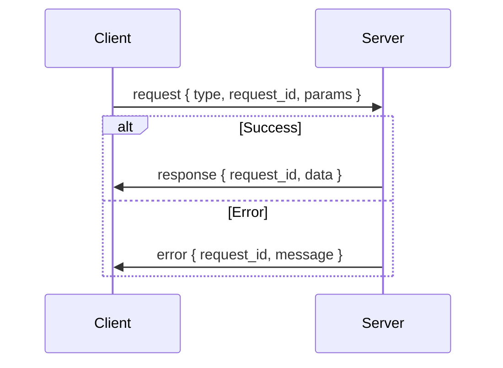

# Message Protocol

SkySpy uses Socket.IO's event-based protocol for bidirectional communication. Learn about events, payloads, batching, and the request/response pattern.

## Event-Based API

Socket.IO uses **events** instead of raw messages. Each event has:
- **Name** (string): The event type (e.g., `subscribe`, `aircraft:update`)
- **Payload** (usually an object): The data associated with the event

> 📘 Convention
>
> SkySpy uses colon-separated namespacing for events (e.g., `aircraft:update`, `safety:event`). This makes it easy to identify the domain and action.

## Client → Server Events

These are the events your client can emit to the server.

| Event | Payload | Description | Example |
|----------|----------|----------|----------|
| `subscribe` | `{ topics: string[] }` | Subscribe to topics (e.g., `['aircraft','safety']`; use `'all'` for all topics) | `{ topics: ['aircraft'] }` |
| `unsubscribe` | `{ topics: string[] }` | Unsubscribe from topics | `{ topics: ['stats'] }` |
| `request` | `{ type, request_id, params? }` | On-demand query; server replies with `response` or `error` | See request/response section |
| `ping` | optional data | Custom keepalive; server replies with `pong` | `null` or `{ timestamp }` |

### Example: Subscribe

```javascript JavaScript
// Subscribe to multiple topics
socket.emit('subscribe', { 
  topics: ['aircraft', 'safety', 'alerts'] 
});

// Subscribe to all topics
socket.emit('subscribe', { 
  topics: ['all'] 
});
```

```python Python
# Subscribe to multiple topics
sio.emit('subscribe', {
    'topics': ['aircraft', 'safety', 'alerts']
})

# Subscribe to all topics
sio.emit('subscribe', {
    'topics': ['all']
})
```

## Server → Client Events

These are the events the server emits to your client.

### Control Events

| Event | When | Payload | Description |
|----------|----------|----------|----------|
| `subscribed` | After subscribe | `{ topics, joined?, denied? }` | Confirms subscription; lists joined and denied topics |
| `unsubscribed` | After unsubscribe | `{ topics, remaining }` | Confirms unsubscription; lists remaining subscriptions |
| `response` | Reply to request | `{ type, request_id, request_type, data }` | Successful response to a request event |
| `error` | Request failed or generic error | `{ type?, request_id?, message }` | Error message with optional request context |
| `pong` | Reply to ping | `{ timestamp }` | Keepalive response |

### Data Events

| Event | Topic | Payload | Description |
|----------|----------|----------|----------|
| `aircraft:snapshot` | `aircraft` | `{ aircraft[], count, timestamp }` | Initial snapshot on connect or request |
| `aircraft:update` | `aircraft` | aircraft list or delta | Periodic position updates (rate-limited) |
| `aircraft:new` | `aircraft` | single aircraft object | New aircraft detected in range |
| `aircraft:remove` | `aircraft` | `{ hex, reason? }` | Aircraft left range or timeout |
| `aircraft:delta` | `aircraft` | delta object | Only changed fields (bandwidth optimization) |
| `aircraft:heartbeat` | `aircraft` | `{ count, timestamp }` | Periodic keepalive with aircraft count |
| `safety:snapshot` | `safety` | `{ events[], count, timestamp }` | Initial safety event snapshot |
| `safety:event` | `safety` | event object | New safety event (TCAS, emergency, etc.) |
| `alert:triggered` | `alerts` | alert payload | Custom alert rule fired |
| `acars:message` | `acars` | message object | New ACARS datalink message |
| `stats:update` | `stats` | stats object | Live statistics update |
| `batch` | all | `{ messages[], count?, timestamp? }` | Batched messages (high-frequency optimization) |

> 📘 Payload Compatibility
>
> Payloads match the formats described in the REST API documentation. Only the transport mechanism is different (Socket.IO events vs. HTTP responses).

## Batch Messages

To optimize bandwidth, high-frequency updates may be batched into a single `batch` event.

```json Batch Event
{
  "messages": [
    {
      "type": "aircraft:update",
      "data": {
        "hex": "A1B2C3",
        "lat": 37.7749,
        "lon": -122.4194,
        "alt_baro": 35000
      }
    },
    {
      "type": "aircraft:update",
      "data": {
        "hex": "D4E5F6",
        "lat": 37.8044,
        "lon": -122.2712,
        "alt_baro": 28000
      }
    }
  ],
  "count": 2,
  "timestamp": "2024-01-15T10:30:00.000Z"
}
```

### Handling Batch Events

```javascript JavaScript
socket.on('batch', (data) => {
  data.messages.forEach(msg => {
    // Dispatch to individual handlers
    switch (msg.type) {
      case 'aircraft:update':
        handleAircraftUpdate(msg.data);
        break;
      case 'safety:event':
        handleSafetyEvent(msg.data);
        break;
      default:
        console.log('Unknown message type:', msg.type);
    }
  });
});
```

```python Python
@sio.event
def batch(data):
    for msg in data.get('messages', []):
        msg_type = msg.get('type', '')
        msg_data = msg.get('data', msg)
        
        if msg_type == 'aircraft:update':
            handle_aircraft_update(msg_data)
        elif msg_type == 'safety:event':
            handle_safety_event(msg_data)
        else:
            print(f'Unknown message type: {msg_type}')
```

> ✅ Critical Events Bypass Batching
>
> Critical event types (alert, safety, emergency) bypass batching and are emitted immediately to ensure low latency for important events.

### Batch Configuration

| Parameter | Default Value | Description |
|----------|----------|----------|
| **Batch Window** | ~200 ms | Time to collect messages before sending batch |
| **Max Batch Size** | ~50 messages | Maximum messages per batch |
| **Max Batch Bytes** | ~1 MB | Maximum payload size per batch |
| **Bypass Types** | alert, safety, emergency | Event types that skip batching |

## Request/Response Pattern

For on-demand queries (historical data, aircraft info, etc.), use the `request` event with a unique `request_id`.

### Request Flow



### Request Format

```json Request
{
  "type": "aircraft-info",
  "request_id": "req_abc123",
  "params": {
    "icao": "A1B2C3"
  }
}
```

| Field | Required | Description |
|----------|----------|----------|
| `type` | Yes | Request type (e.g., `aircraft-info`, `sightings`, `safety-events`) |
| `request_id` | Yes | Unique identifier to match response (client-generated) |
| `params` | No | Parameters specific to the request type |

### Response Format

**Success:**

```json Success Response
{
  "type": "response",
  "request_id": "req_abc123",
  "request_type": "aircraft-info",
  "data": {
    "icao_hex": "A1B2C3",
    "registration": "N12345",
    "type_code": "B738",
    "operator": "Southwest Airlines",
    "manufactured": "2015",
    "model": "Boeing 737-800"
  }
}
```

**Error:**

```json Error Response
{
  "type": "error",
  "request_id": "req_abc123",
  "message": "Aircraft not found"
}
```

### Request/Response Helper

Here's a helper function to handle request/response with timeouts.

```javascript JavaScript
function request(socket, type, params = {}, timeoutMs = 10000) {
  return new Promise((resolve, reject) => {
    const requestId = `req_${Date.now()}_${Math.random().toString(36).slice(2)}`;
    
    const timeout = setTimeout(() => {
      cleanup();
      reject(new Error(`Request timeout: ${type}`));
    }, timeoutMs);

    const onResponse = (data) => {
      if (data.request_id !== requestId) return;
      cleanup();
      resolve(data.data ?? data);
    };
    
    const onError = (data) => {
      if (data.request_id !== requestId) return;
      cleanup();
      reject(new Error(data.message || 'Request failed'));
    };
    
    const cleanup = () => {
      clearTimeout(timeout);
      socket.off('response', onResponse);
      socket.off('error', onError);
    };

    socket.on('response', onResponse);
    socket.on('error', onError);
    socket.emit('request', { type, request_id: requestId, params });
  });
}

// Usage
try {
  const info = await request(socket, 'aircraft-info', { icao: 'A1B2C3' });
  console.log('Aircraft:', info);
} catch (error) {
  console.error('Request failed:', error.message);
}
```

```python Python (async)
import uuid
import asyncio
from typing import Any, Dict, Optional

class RequestHelper:
    def __init__(self, sio):
        self.sio = sio
        self.pending = {}
        
        @sio.event
        def response(data):
            request_id = data.get('request_id')
            if request_id in self.pending:
                future = self.pending.pop(request_id)
                future.set_result(data.get('data', data))
        
        @sio.event
        def error(data):
            request_id = data.get('request_id')
            if request_id in self.pending:
                future = self.pending.pop(request_id)
                future.set_exception(Exception(data.get('message', 'Request failed')))
    
    async def request(self, req_type: str, params: Optional[Dict] = None, timeout: float = 10.0) -> Any:
        request_id = f"req_{uuid.uuid4().hex}"
        future = asyncio.Future()
        self.pending[request_id] = future
        
        self.sio.emit('request', {
            'type': req_type,
            'request_id': request_id,
            'params': params or {}
        })
        
        try:
            return await asyncio.wait_for(future, timeout=timeout)
        except asyncio.TimeoutError:
            self.pending.pop(request_id, None)
            raise TimeoutError(f'Request timeout: {req_type}')

# Usage
helper = RequestHelper(sio)
try:
    info = await helper.request('aircraft-info', {'icao': 'A1B2C3'})
    print('Aircraft:', info)
except Exception as e:
    print('Request failed:', e)
```

## Rate Limits

Different topics have different rate limits to optimize bandwidth and prevent overwhelming clients.

| Topic / Event | Max Rate | Min Interval | Notes |
|----------|----------|----------|----------|
| `aircraft:update` | ~10 Hz | 100 ms | Full position updates |
| `aircraft:delta` | ~10 Hz | 100 ms | Delta updates (changed fields only) |
| `stats:update` | ~0.5 Hz | 2 s | Live statistics |
| **Default** | ~5 Hz | 200 ms | Other event types |

> 📘 Client-Side Throttling
>
> If your application can't keep up with the update rate, implement client-side throttling or request lower-frequency updates. Critical events (alerts, safety) are never rate-limited.

## Next Steps

> 📘 Ready to stream data?
>
> Learn about the [main namespace](/docs/socketio-main-namespace) to start receiving aircraft positions, safety events, and alerts. Or explore [specialized namespaces](/docs/socketio-specialized-namespaces) for audio and mobile features.
