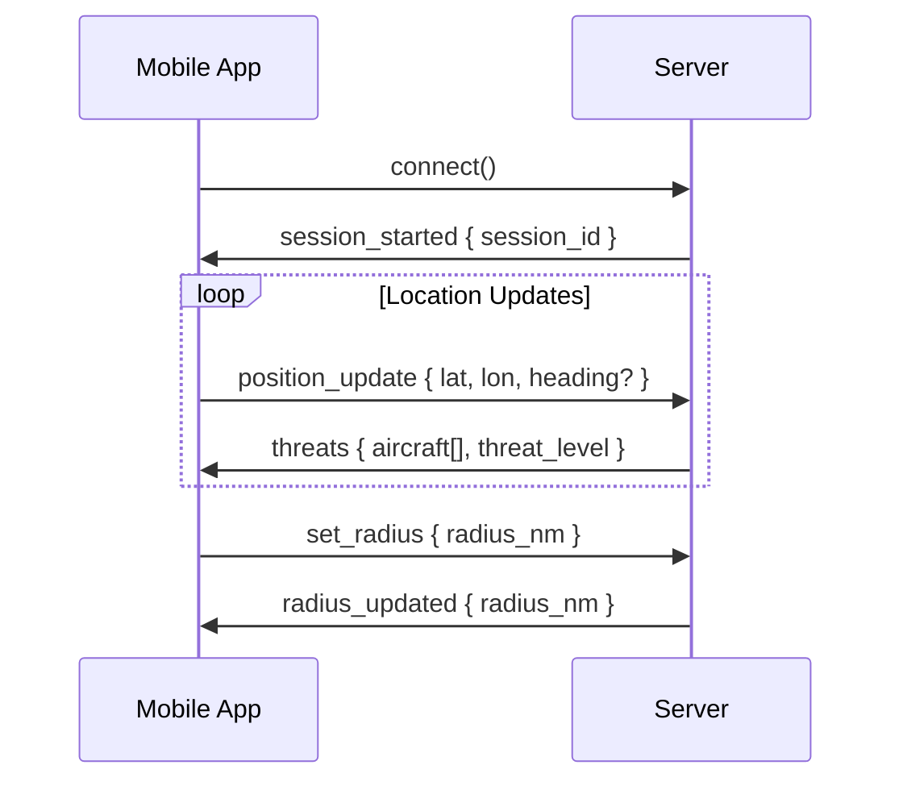

# Specialized Namespaces

SkySpy provides dedicated namespaces for specialized features: audio/radio monitoring and mobile threat detection (Cannonball).

## Overview

[block:parameters]
{
  "data": {
    "h-0": "Namespace",
    "h-1": "Path",
    "h-2": "Purpose",
    "h-3": "Permission",
    "0-0": "**Audio**",
    "0-1": "`/audio`",
    "0-2": "Radio transmissions and transcriptions",
    "0-3": "Requires `audio` permission",
    "1-0": "**Cannonball**",
    "1-1": "`/cannonball`",
    "1-2": "Mobile threat detection and proximity alerts",
    "1-3": "Public or authenticated",
    "2-0": "**ACARS** (optional)",
    "2-1": "`/acars`",
    "2-2": "ACARS-only stream for specialized clients",
    "2-3": "Public or authenticated"
  },
  "cols": 4,
  "rows": 3
}
[/block]

[block:callout]
{
  "type": "info",
  "title": "When to Use Specialized Namespaces",
  "body": "Use specialized namespaces when you only need a specific feature (e.g., audio monitoring) without aircraft tracking. This reduces bandwidth and simplifies client logic."
}
[/block]

## Audio Namespace (`/audio`)

Monitor radio transmissions and receive real-time transcriptions from ATC feeds.

### Connection

[block:code]
{
  "codes": [
    {
      "code": "const audioSocket = io('https://skyspy.example.com/audio', {\n  path: '/socket.io',\n  auth: { token: 'your_token' },\n  transports: ['websocket']\n});\n\naudioSocket.on('connect', () => {\n  console.log('Connected to audio namespace');\n});",
      "language": "javascript",
      "name": "JavaScript"
    },
    {
      "code": "import socketio\n\nsio = socketio.Client()\n\n@sio.event\ndef connect():\n    print('Connected to audio namespace')\n\nsio.connect(\n    'https://skyspy.example.com/audio',\n    socketio_path='/socket.io',\n    auth={'token': 'your_token'},\n    transports=['websocket']\n)",
      "language": "python",
      "name": "Python"
    }
  ]
}
[/block]

> 🚧 Permission Required
>
> The audio namespace requires the `audio` topic/feature permission. Ensure your user or API key has this permission enabled.

### Audio Events

[block:parameters]
{
  "data": {
    "h-0": "Event",
    "h-1": "Trigger",
    "h-2": "Payload",
    "h-3": "Description",
    "0-0": "`audio:snapshot`",
    "0-1": "On connect",
    "0-2": "`{ transmissions[], count, timestamp }`",
    "0-3": "Recent transmissions snapshot",
    "1-0": "`audio:transmission`",
    "1-1": "New radio transmission",
    "1-2": "Transmission object",
    "1-3": "Raw audio metadata and URL",
    "2-0": "`audio:transcription_started`",
    "2-1": "Transcription begins",
    "2-2": "`{ transmission_id, status }`",
    "2-3": "Transcription job started",
    "3-0": "`audio:transcription_completed`",
    "3-1": "Transcription finished",
    "3-2": "`{ transmission_id, text, confidence }`",
    "3-3": "Transcribed text with confidence score",
    "4-0": "`audio:transcription_failed`",
    "4-1": "Transcription error",
    "4-2": "`{ transmission_id, error }`",
    "4-3": "Transcription failed with error message"
  },
  "cols": 4,
  "rows": 5
}
[/block]

### Transmission Payload

[block:parameters]
{
  "data": {
    "h-0": "Field",
    "h-1": "Type",
    "h-2": "Description",
    "h-3": "Example",
    "0-0": "`id`",
    "0-1": "string",
    "0-2": "Unique transmission ID",
    "0-3": "`\"tx_abc123\"`",
    "1-0": "`frequency`",
    "1-1": "number",
    "1-2": "Frequency in MHz",
    "1-3": "`118.5`",
    "2-0": "`duration`",
    "2-1": "number",
    "2-2": "Duration in seconds",
    "2-3": "`4.2`",
    "3-0": "`timestamp`",
    "3-1": "string",
    "3-2": "ISO 8601 timestamp",
    "3-3": "`\"2024-01-15T10:30:00Z\"`",
    "4-0": "`audio_url`",
    "4-1": "string",
    "4-2": "URL to audio file (WAV or MP3)",
    "4-3": "`\"https://cdn.../tx_abc123.mp3\"`",
    "5-0": "`icao_hex`",
    "5-1": "string",
    "5-2": "Associated aircraft (if known)",
    "5-3": "`\"A1B2C3\"`",
    "6-0": "`callsign`",
    "6-1": "string",
    "6-2": "Associated callsign (if known)",
    "6-3": "`\"UAL123\"`",
    "7-0": "`transcription`",
    "7-1": "object",
    "7-2": "Transcription data (if available)",
    "7-3": "See transcription fields"
  },
  "cols": 4,
  "rows": 8
}
[/block]

### Audio Example

[block:code]
{
  "codes": [
    {
      "code": "audioSocket.on('audio:snapshot', (data) => {\n  console.log(`Recent transmissions: ${data.count}`);\n  data.transmissions.forEach(tx => {\n    displayTransmission(tx);\n  });\n});\n\naudioSocket.on('audio:transmission', (tx) => {\n  console.log(`New transmission on ${tx.frequency} MHz`);\n  \n  // Play audio if autoplay enabled\n  if (autoplayEnabled) {\n    playAudio(tx.audio_url);\n  }\n  \n  // Add to transmission list\n  addToTransmissionList(tx);\n});\n\naudioSocket.on('audio:transcription_completed', (data) => {\n  console.log(`Transcription: ${data.text}`);\n  \n  // Update UI with transcription\n  updateTranscription(data.transmission_id, {\n    text: data.text,\n    confidence: data.confidence\n  });\n  \n  // Highlight keywords\n  if (containsKeywords(data.text, ['emergency', 'mayday', 'pan pan'])) {\n    highlightTransmission(data.transmission_id, 'emergency');\n  }\n});\n\naudioSocket.on('audio:transcription_failed', (data) => {\n  console.warn(`Transcription failed: ${data.error}`);\n  updateTranscription(data.transmission_id, {\n    error: data.error\n  });\n});",
      "language": "javascript",
      "name": "JavaScript"
    },
    {
      "code": "@sio.event\ndef audio_snapshot(data):\n    print(f\"Recent transmissions: {data.get('count')}\")\n    for tx in data.get('transmissions', []):\n        display_transmission(tx)\n\n@sio.event\ndef audio_transmission(tx):\n    print(f\"New transmission on {tx.get('frequency')} MHz\")\n    \n    # Play audio if autoplay enabled\n    if autoplay_enabled:\n        play_audio(tx.get('audio_url'))\n    \n    # Add to transmission list\n    add_to_transmission_list(tx)\n\n@sio.event\ndef audio_transcription_completed(data):\n    print(f\"Transcription: {data.get('text')}\")\n    \n    # Update UI with transcription\n    update_transcription(data.get('transmission_id'), {\n        'text': data.get('text'),\n        'confidence': data.get('confidence')\n    })\n    \n    # Highlight keywords\n    text = data.get('text', '').lower()\n    if any(kw in text for kw in ['emergency', 'mayday', 'pan pan']):\n        highlight_transmission(data.get('transmission_id'), 'emergency')\n\n@sio.event\ndef audio_transcription_failed(data):\n    print(f\"Transcription failed: {data.get('error')}\")\n    update_transcription(data.get('transmission_id'), {\n        'error': data.get('error')\n    })",
      "language": "python",
      "name": "Python"
    }
  ]
}
[/block]

### Audio Request Types

Use the `request` event to query historical transmissions and statistics.

[block:parameters]
{
  "data": {
    "h-0": "Request Type",
    "h-1": "Parameters",
    "h-2": "Description",
    "0-0": "`transmissions`",
    "0-1": "`hours`, `limit`, `offset`, `frequency`, `icao_hex`",
    "0-2": "Query historical transmissions with filtering",
    "1-0": "`transmission`",
    "1-1": "`id`",
    "1-2": "Get single transmission by ID",
    "2-0": "`stats`",
    "2-1": "`hours`",
    "2-2": "Audio statistics (transmissions per frequency, duration, etc.)"
  },
  "cols": 3,
  "rows": 3
}
[/block]

## Cannonball Namespace (`/cannonball`)

Mobile threat detection for real-time proximity alerts. Designed for mobile apps that need low-latency threat detection based on the user's location.

### Connection

[block:code]
{
  "codes": [
    {
      "code": "const cannonballSocket = io('https://skyspy.example.com/cannonball', {\n  path: '/socket.io',\n  auth: { token: 'your_token' },\n  transports: ['websocket']\n});\n\ncannonballSocket.on('connect', () => {\n  console.log('Connected to cannonball namespace');\n});",
      "language": "javascript",
      "name": "JavaScript"
    },
    {
      "code": "import socketio\n\nsio = socketio.Client()\n\n@sio.event\ndef connect():\n    print('Connected to cannonball namespace')\n\nsio.connect(\n    'https://skyspy.example.com/cannonball',\n    socketio_path='/socket.io',\n    auth={'token': 'your_token'},\n    transports=['websocket']\n)",
      "language": "python",
      "name": "Python"
    }
  ]
}
[/block]

### Cannonball Flow

### Client → Server Events

[block:parameters]
{
  "data": {
    "h-0": "Event",
    "h-1": "Payload",
    "h-2": "Description",
    "h-3": "Example",
    "0-0": "`position_update`",
    "0-1": "`{ lat, lon, heading?, altitude? }`",
    "0-2": "Update mobile device position",
    "0-3": "`{ lat: 37.7749, lon: -122.4194 }`",
    "1-0": "`set_radius`",
    "1-1": "`{ radius_nm }`",
    "1-2": "Set threat detection radius in nautical miles",
    "1-3": "`{ radius_nm: 10 }`",
    "2-0": "`get_threats`",
    "2-1": "—",
    "2-2": "Request immediate threat update",
    "2-3": "`null`"
  },
  "cols": 4,
  "rows": 3
}
[/block]

### Server → Client Events

[block:parameters]
{
  "data": {
    "h-0": "Event",
    "h-1": "Trigger",
    "h-2": "Payload",
    "h-3": "Description",
    "0-0": "`session_started`",
    "0-1": "On connect",
    "0-2": "`{ session_id, default_radius_nm }`",
    "0-3": "Session initialization",
    "1-0": "`threats`",
    "1-1": "After position_update or periodic",
    "1-2": "`{ aircraft[], threat_level, timestamp }`",
    "1-3": "Filtered threats within radius",
    "2-0": "`radius_updated`",
    "2-1": "After set_radius",
    "2-2": "`{ radius_nm }`",
    "2-3": "Confirms radius change",
    "3-0": "`error`",
    "3-1": "Invalid request",
    "3-2": "`{ message }`",
    "3-3": "Error message"
  },
  "cols": 4,
  "rows": 4
}
[/block]

### Threat Payload

[block:parameters]
{
  "data": {
    "h-0": "Field",
    "h-1": "Type",
    "h-2": "Description",
    "h-3": "Example",
    "0-0": "`hex`",
    "0-1": "string",
    "0-2": "ICAO hex code",
    "0-3": "`\"A1B2C3\"`",
    "1-0": "`callsign`",
    "1-1": "string",
    "1-2": "Aircraft callsign",
    "1-3": "`\"N12345\"`",
    "2-0": "`distance_nm`",
    "2-1": "number",
    "2-2": "Distance from user in nautical miles",
    "2-3": "`5.2`",
    "3-0": "`bearing`",
    "3-1": "number",
    "3-2": "Bearing from user in degrees",
    "3-3": "`270.5`",
    "4-0": "`threat_level`",
    "4-1": "string",
    "4-2": "Threat level: `critical`, `high`, `medium`, `low`",
    "4-3": "`\"high\"`",
    "5-0": "`trend`",
    "5-1": "string",
    "5-2": "Distance trend: `approaching`, `receding`, `stable`",
    "5-3": "`\"approaching\"`",
    "6-0": "`altitude`",
    "6-1": "number",
    "6-2": "Altitude in feet",
    "6-3": "`2500`",
    "7-0": "`altitude_agl`",
    "7-1": "number",
    "7-2": "Altitude above ground level in feet",
    "7-3": "`1200`",
    "8-0": "`gs`",
    "8-1": "number",
    "8-2": "Ground speed in knots",
    "8-3": "`120.5`",
    "9-0": "`track`",
    "9-1": "number",
    "9-2": "Track angle in degrees",
    "9-3": "`180.0`"
  },
  "cols": 4,
  "rows": 10
}
[/block]

### Cannonball Example

[block:code]
{
  "codes": [
    {
      "code": "let sessionId = null;\n\ncannonballSocket.on('session_started', (data) => {\n  sessionId = data.session_id;\n  console.log(`Session started: ${sessionId}`);\n  console.log(`Default radius: ${data.default_radius_nm} nm`);\n});\n\ncannonballSocket.on('threats', (data) => {\n  console.log(`Threat level: ${data.threat_level}`);\n  console.log(`Threats: ${data.aircraft.length}`);\n  \n  data.aircraft.forEach(threat => {\n    console.log(\n      `${threat.callsign || threat.hex}: ` +\n      `${threat.distance_nm.toFixed(1)} nm @ ${threat.bearing}° ` +\n      `(${threat.trend})`\n    );\n    \n    // Show alert for critical threats\n    if (threat.threat_level === 'critical') {\n      showCriticalThreatAlert(threat);\n    }\n  });\n  \n  // Update UI\n  updateThreatMap(data.aircraft);\n});\n\ncannonballSocket.on('radius_updated', (data) => {\n  console.log(`Radius updated: ${data.radius_nm} nm`);\n});\n\n// Send position updates from GPS\nnavigator.geolocation.watchPosition(\n  (position) => {\n    cannonballSocket.emit('position_update', {\n      lat: position.coords.latitude,\n      lon: position.coords.longitude,\n      heading: position.coords.heading,\n      altitude: position.coords.altitude\n    });\n  },\n  (error) => {\n    console.error('GPS error:', error);\n  },\n  {\n    enableHighAccuracy: true,\n    maximumAge: 1000,\n    timeout: 5000\n  }\n);\n\n// Change detection radius\nfunction setThreatRadius(radiusNm) {\n  cannonballSocket.emit('set_radius', { radius_nm: radiusNm });\n}",
      "language": "javascript",
      "name": "JavaScript"
    },
    {
      "code": "session_id = None\n\n@sio.event\ndef session_started(data):\n    global session_id\n    session_id = data.get('session_id')\n    print(f\"Session started: {session_id}\")\n    print(f\"Default radius: {data.get('default_radius_nm')} nm\")\n\n@sio.event\ndef threats(data):\n    print(f\"Threat level: {data.get('threat_level')}\")\n    aircraft = data.get('aircraft', [])\n    print(f\"Threats: {len(aircraft)}\")\n    \n    for threat in aircraft:\n        callsign = threat.get('callsign') or threat.get('hex')\n        distance = threat.get('distance_nm', 0)\n        bearing = threat.get('bearing', 0)\n        trend = threat.get('trend', 'unknown')\n        \n        print(f\"{callsign}: {distance:.1f} nm @ {bearing}° ({trend})\")\n        \n        # Show alert for critical threats\n        if threat.get('threat_level') == 'critical':\n            show_critical_threat_alert(threat)\n    \n    # Update UI\n    update_threat_map(aircraft)\n\n@sio.event\ndef radius_updated(data):\n    print(f\"Radius updated: {data.get('radius_nm')} nm\")\n\n# Send position updates\ndef send_position(lat, lon, heading=None, altitude=None):\n    payload = {'lat': lat, 'lon': lon}\n    if heading is not None:\n        payload['heading'] = heading\n    if altitude is not None:\n        payload['altitude'] = altitude\n    sio.emit('position_update', payload)\n\n# Change detection radius\ndef set_threat_radius(radius_nm):\n    sio.emit('set_radius', {'radius_nm': radius_nm})",
      "language": "python",
      "name": "Python"
    }
  ]
}
[/block]

### Threat Detection Logic

[block:parameters]
{
  "data": {
    "h-0": "Threat Level",
    "h-1": "Distance",
    "h-2": "Criteria",
    "h-3": "Action",
    "0-0": "`critical`",
    "0-1": "< 1 nm",
    "0-2": "Very close, approaching",
    "0-3": "Immediate visual alert, sound",
    "1-0": "`high`",
    "1-1": "1-3 nm",
    "1-2": "Close proximity, approaching",
    "1-3": "Alert notification",
    "2-0": "`medium`",
    "2-1": "3-5 nm",
    "2-2": "Moderate distance, approaching",
    "2-3": "Display on map",
    "3-0": "`low`",
    "3-1": "5+ nm",
    "3-2": "Within radius, any trend",
    "3-3": "Show in list"
  },
  "cols": 4,
  "rows": 4
}
[/block]

## ACARS Namespace (`/acars`)

Optional dedicated namespace for ACARS-only clients. Use this if you only need datalink messages without aircraft tracking.

### Connection

[block:code]
{
  "codes": [
    {
      "code": "const acarsSocket = io('https://skyspy.example.com/acars', {\n  path: '/socket.io',\n  transports: ['websocket']\n});\n\nacarsSocket.on('acars:message', (message) => {\n  console.log(\n    `ACARS from ${message.callsign}: ` +\n    `Label ${message.label} - ${message.text}`\n  );\n});",
      "language": "javascript",
      "name": "JavaScript"
    },
    {
      "code": "import socketio\n\nsio = socketio.Client()\n\n@sio.event\ndef acars_message(message):\n    callsign = message.get('callsign', 'Unknown')\n    label = message.get('label', '')\n    text = message.get('text', '')\n    print(f\"ACARS from {callsign}: Label {label} - {text}\")\n\nsio.connect(\n    'https://skyspy.example.com/acars',\n    socketio_path='/socket.io',\n    transports=['websocket']\n)",
      "language": "python",
      "name": "Python"
    }
  ]
}
[/block]

> 💡 Main Namespace Alternative
>
> You can also receive ACARS messages on the main namespace by subscribing to the `acars` topic. The dedicated `/acars` namespace is for clients that **only** need ACARS without other features.

## Next Steps

> 📘 Build Your Client
>
> - [Client Implementation](/docs/socketio-client-implementation) - Complete examples for JavaScript and Python
> - [Troubleshooting](/docs/socketio-troubleshooting) - Common issues and debugging tips
> - [Main Namespace](/docs/socketio-main-namespace) - Aircraft tracking and safety monitoring
