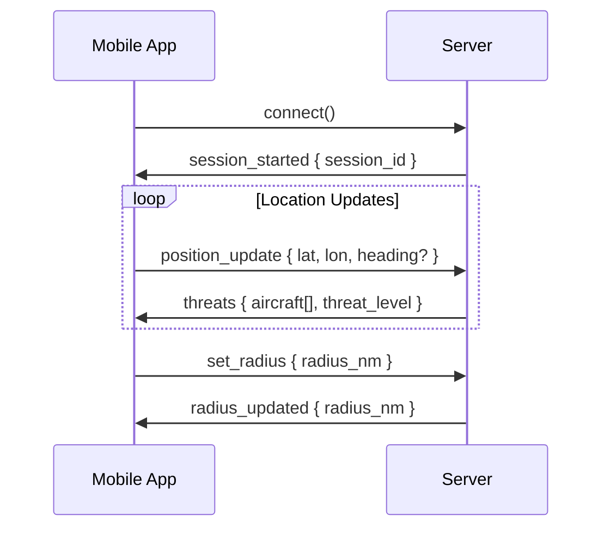

# Specialized Namespaces

SkySpy provides dedicated namespaces for specialized features: audio/radio monitoring and mobile threat detection (Cannonball).

## Overview

| Namespace | Path | Purpose | Permission |
|----------|----------|----------|----------|
| **Audio** | `/audio` | Radio transmissions and transcriptions | Requires `audio` permission |
| **Cannonball** | `/cannonball` | Mobile threat detection and proximity alerts | Public or authenticated |
| **ACARS** (optional) | `/acars` | ACARS-only stream for specialized clients | Public or authenticated |

> 📘 When to Use Specialized Namespaces
>
> Use specialized namespaces when you only need a specific feature (e.g., audio monitoring) without aircraft tracking. This reduces bandwidth and simplifies client logic.

## Audio Namespace (`/audio`)

Monitor radio transmissions and receive real-time transcriptions from ATC feeds.

### Connection

```javascript JavaScript
const audioSocket = io('https://skyspy.example.com/audio', {
  path: '/socket.io',
  auth: { token: 'your_token' },
  transports: ['websocket']
});

audioSocket.on('connect', () => {
  console.log('Connected to audio namespace');
});
```

```python Python
import socketio

sio = socketio.Client()

@sio.event
def connect():
    print('Connected to audio namespace')

sio.connect(
    'https://skyspy.example.com/audio',
    socketio_path='/socket.io',
    auth={'token': 'your_token'},
    transports=['websocket']
)
```

> ⚠️ Permission Required
>
> The audio namespace requires the `audio` topic/feature permission. Ensure your user or API key has this permission enabled.

### Audio Events

| Event | Trigger | Payload | Description |
|----------|----------|----------|----------|
| `audio:snapshot` | On connect | `{ transmissions[], count, timestamp }` | Recent transmissions snapshot |
| `audio:transmission` | New radio transmission | Transmission object | Raw audio metadata and URL |
| `audio:transcription_started` | Transcription begins | `{ transmission_id, status }` | Transcription job started |
| `audio:transcription_completed` | Transcription finished | `{ transmission_id, text, confidence }` | Transcribed text with confidence score |
| `audio:transcription_failed` | Transcription error | `{ transmission_id, error }` | Transcription failed with error message |

### Transmission Payload

| Field | Type | Description | Example |
|----------|----------|----------|----------|
| `id` | string | Unique transmission ID | `"tx_abc123"` |
| `frequency` | number | Frequency in MHz | `118.5` |
| `duration` | number | Duration in seconds | `4.2` |
| `timestamp` | string | ISO 8601 timestamp | `"2024-01-15T10:30:00Z"` |
| `audio_url` | string | URL to audio file (WAV or MP3) | `"https://cdn.../tx_abc123.mp3"` |
| `icao_hex` | string | Associated aircraft (if known) | `"A1B2C3"` |
| `callsign` | string | Associated callsign (if known) | `"UAL123"` |
| `transcription` | object | Transcription data (if available) | See transcription fields |

### Audio Example

```javascript JavaScript
audioSocket.on('audio:snapshot', (data) => {
  console.log(`Recent transmissions: ${data.count}`);
  data.transmissions.forEach(tx => {
    displayTransmission(tx);
  });
});

audioSocket.on('audio:transmission', (tx) => {
  console.log(`New transmission on ${tx.frequency} MHz`);
  
  // Play audio if autoplay enabled
  if (autoplayEnabled) {
    playAudio(tx.audio_url);
  }
  
  // Add to transmission list
  addToTransmissionList(tx);
});

audioSocket.on('audio:transcription_completed', (data) => {
  console.log(`Transcription: ${data.text}`);
  
  // Update UI with transcription
  updateTranscription(data.transmission_id, {
    text: data.text,
    confidence: data.confidence
  });
  
  // Highlight keywords
  if (containsKeywords(data.text, ['emergency', 'mayday', 'pan pan'])) {
    highlightTransmission(data.transmission_id, 'emergency');
  }
});

audioSocket.on('audio:transcription_failed', (data) => {
  console.warn(`Transcription failed: ${data.error}`);
  updateTranscription(data.transmission_id, {
    error: data.error
  });
});
```

```python Python
@sio.event
def audio_snapshot(data):
    print(f"Recent transmissions: {data.get('count')}")
    for tx in data.get('transmissions', []):
        display_transmission(tx)

@sio.event
def audio_transmission(tx):
    print(f"New transmission on {tx.get('frequency')} MHz")
    
    # Play audio if autoplay enabled
    if autoplay_enabled:
        play_audio(tx.get('audio_url'))
    
    # Add to transmission list
    add_to_transmission_list(tx)

@sio.event
def audio_transcription_completed(data):
    print(f"Transcription: {data.get('text')}")
    
    # Update UI with transcription
    update_transcription(data.get('transmission_id'), {
        'text': data.get('text'),
        'confidence': data.get('confidence')
    })
    
    # Highlight keywords
    text = data.get('text', '').lower()
    if any(kw in text for kw in ['emergency', 'mayday', 'pan pan']):
        highlight_transmission(data.get('transmission_id'), 'emergency')

@sio.event
def audio_transcription_failed(data):
    print(f"Transcription failed: {data.get('error')}")
    update_transcription(data.get('transmission_id'), {
        'error': data.get('error')
    })
```

### Audio Request Types

Use the `request` event to query historical transmissions and statistics.

| Request Type | Parameters | Description |
|----------|----------|----------|
| `transmissions` | `hours`, `limit`, `offset`, `frequency`, `icao_hex` | Query historical transmissions with filtering |
| `transmission` | `id` | Get single transmission by ID |
| `stats` | `hours` | Audio statistics (transmissions per frequency, duration, etc.) |

## Cannonball Namespace (`/cannonball`)

Mobile threat detection for real-time proximity alerts. Designed for mobile apps that need low-latency threat detection based on the user's location.

### Connection

```javascript JavaScript
const cannonballSocket = io('https://skyspy.example.com/cannonball', {
  path: '/socket.io',
  auth: { token: 'your_token' },
  transports: ['websocket']
});

cannonballSocket.on('connect', () => {
  console.log('Connected to cannonball namespace');
});
```

```python Python
import socketio

sio = socketio.Client()

@sio.event
def connect():
    print('Connected to cannonball namespace')

sio.connect(
    'https://skyspy.example.com/cannonball',
    socketio_path='/socket.io',
    auth={'token': 'your_token'},
    transports=['websocket']
)
```

### Cannonball Flow



### Client → Server Events

| Event | Payload | Description | Example |
|----------|----------|----------|----------|
| `position_update` | `{ lat, lon, heading?, altitude? }` | Update mobile device position | `{ lat: 37.7749, lon: -122.4194 }` |
| `set_radius` | `{ radius_nm }` | Set threat detection radius in nautical miles | `{ radius_nm: 10 }` |
| `get_threats` | — | Request immediate threat update | `null` |

### Server → Client Events

| Event | Trigger | Payload | Description |
|----------|----------|----------|----------|
| `session_started` | On connect | `{ session_id, default_radius_nm }` | Session initialization |
| `threats` | After position_update or periodic | `{ aircraft[], threat_level, timestamp }` | Filtered threats within radius |
| `radius_updated` | After set_radius | `{ radius_nm }` | Confirms radius change |
| `error` | Invalid request | `{ message }` | Error message |

### Threat Payload

| Field | Type | Description | Example |
|----------|----------|----------|----------|
| `hex` | string | ICAO hex code | `"A1B2C3"` |
| `callsign` | string | Aircraft callsign | `"N12345"` |
| `distance_nm` | number | Distance from user in nautical miles | `5.2` |
| `bearing` | number | Bearing from user in degrees | `270.5` |
| `threat_level` | string | Threat level: `critical`, `high`, `medium`, `low` | `"high"` |
| `trend` | string | Distance trend: `approaching`, `receding`, `stable` | `"approaching"` |
| `altitude` | number | Altitude in feet | `2500` |
| `altitude_agl` | number | Altitude above ground level in feet | `1200` |
| `gs` | number | Ground speed in knots | `120.5` |
| `track` | number | Track angle in degrees | `180.0` |

### Cannonball Example

```javascript JavaScript
let sessionId = null;

cannonballSocket.on('session_started', (data) => {
  sessionId = data.session_id;
  console.log(`Session started: ${sessionId}`);
  console.log(`Default radius: ${data.default_radius_nm} nm`);
});

cannonballSocket.on('threats', (data) => {
  console.log(`Threat level: ${data.threat_level}`);
  console.log(`Threats: ${data.aircraft.length}`);
  
  data.aircraft.forEach(threat => {
    console.log(
      `${threat.callsign || threat.hex}: ` +
      `${threat.distance_nm.toFixed(1)} nm @ ${threat.bearing}° ` +
      `(${threat.trend})`
    );
    
    // Show alert for critical threats
    if (threat.threat_level === 'critical') {
      showCriticalThreatAlert(threat);
    }
  });
  
  // Update UI
  updateThreatMap(data.aircraft);
});

cannonballSocket.on('radius_updated', (data) => {
  console.log(`Radius updated: ${data.radius_nm} nm`);
});

// Send position updates from GPS
navigator.geolocation.watchPosition(
  (position) => {
    cannonballSocket.emit('position_update', {
      lat: position.coords.latitude,
      lon: position.coords.longitude,
      heading: position.coords.heading,
      altitude: position.coords.altitude
    });
  },
  (error) => {
    console.error('GPS error:', error);
  },
  {
    enableHighAccuracy: true,
    maximumAge: 1000,
    timeout: 5000
  }
);

// Change detection radius
function setThreatRadius(radiusNm) {
  cannonballSocket.emit('set_radius', { radius_nm: radiusNm });
}
```

```python Python
session_id = None

@sio.event
def session_started(data):
    global session_id
    session_id = data.get('session_id')
    print(f"Session started: {session_id}")
    print(f"Default radius: {data.get('default_radius_nm')} nm")

@sio.event
def threats(data):
    print(f"Threat level: {data.get('threat_level')}")
    aircraft = data.get('aircraft', [])
    print(f"Threats: {len(aircraft)}")
    
    for threat in aircraft:
        callsign = threat.get('callsign') or threat.get('hex')
        distance = threat.get('distance_nm', 0)
        bearing = threat.get('bearing', 0)
        trend = threat.get('trend', 'unknown')
        
        print(f"{callsign}: {distance:.1f} nm @ {bearing}° ({trend})")
        
        # Show alert for critical threats
        if threat.get('threat_level') == 'critical':
            show_critical_threat_alert(threat)
    
    # Update UI
    update_threat_map(aircraft)

@sio.event
def radius_updated(data):
    print(f"Radius updated: {data.get('radius_nm')} nm")

# Send position updates
def send_position(lat, lon, heading=None, altitude=None):
    payload = {'lat': lat, 'lon': lon}
    if heading is not None:
        payload['heading'] = heading
    if altitude is not None:
        payload['altitude'] = altitude
    sio.emit('position_update', payload)

# Change detection radius
def set_threat_radius(radius_nm):
    sio.emit('set_radius', {'radius_nm': radius_nm})
```

### Threat Detection Logic

| Threat Level | Distance | Criteria | Action |
|----------|----------|----------|----------|
| `critical` | < 1 nm | Very close, approaching | Immediate visual alert, sound |
| `high` | 1-3 nm | Close proximity, approaching | Alert notification |
| `medium` | 3-5 nm | Moderate distance, approaching | Display on map |
| `low` | 5+ nm | Within radius, any trend | Show in list |

## ACARS Namespace (`/acars`)

Optional dedicated namespace for ACARS-only clients. Use this if you only need datalink messages without aircraft tracking.

### Connection

```javascript JavaScript
const acarsSocket = io('https://skyspy.example.com/acars', {
  path: '/socket.io',
  transports: ['websocket']
});

acarsSocket.on('acars:message', (message) => {
  console.log(
    `ACARS from ${message.callsign}: ` +
    `Label ${message.label} - ${message.text}`
  );
});
```

```python Python
import socketio

sio = socketio.Client()

@sio.event
def acars_message(message):
    callsign = message.get('callsign', 'Unknown')
    label = message.get('label', '')
    text = message.get('text', '')
    print(f"ACARS from {callsign}: Label {label} - {text}")

sio.connect(
    'https://skyspy.example.com/acars',
    socketio_path='/socket.io',
    transports=['websocket']
)
```

> 📘 Main Namespace Alternative
>
> You can also receive ACARS messages on the main namespace by subscribing to the `acars` topic. The dedicated `/acars` namespace is for clients that **only** need ACARS without other features.

## Next Steps

> 📘 Build Your Client
>
> - [Client Implementation](/docs/socketio-client-implementation) - Complete examples for JavaScript and Python\n- [Troubleshooting](/docs/socketio-troubleshooting) - Common issues and debugging tips\n- [Main Namespace](/docs/socketio-main-namespace) - Aircraft tracking and safety monitoring
